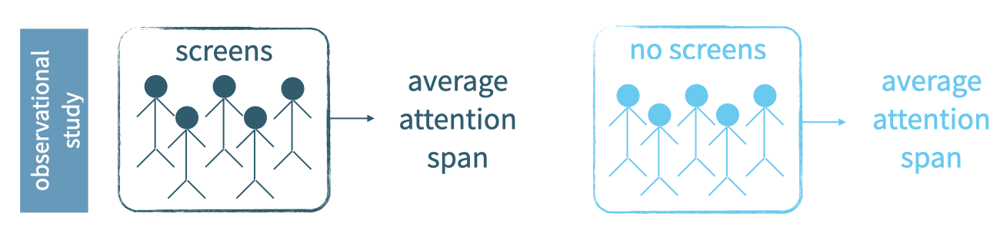
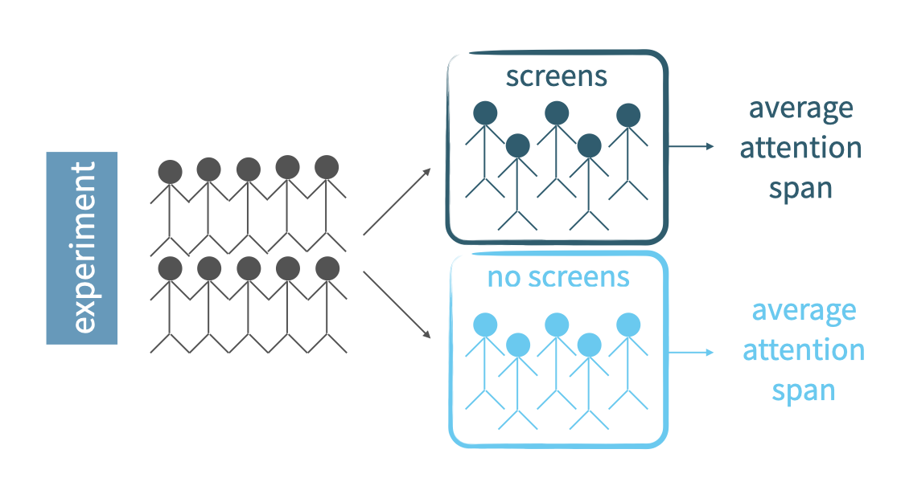
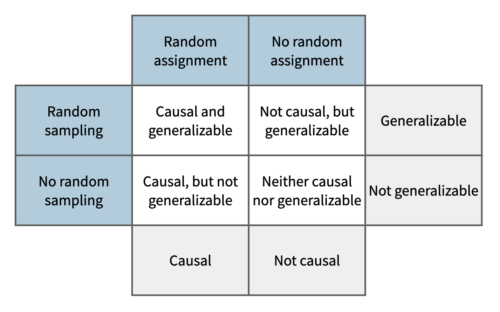
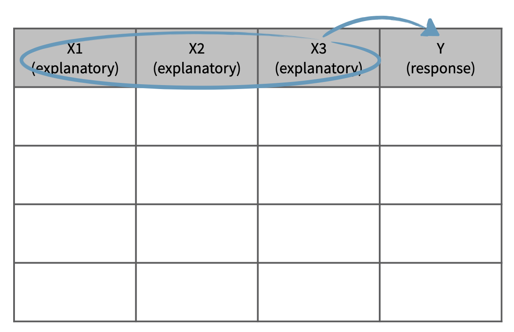
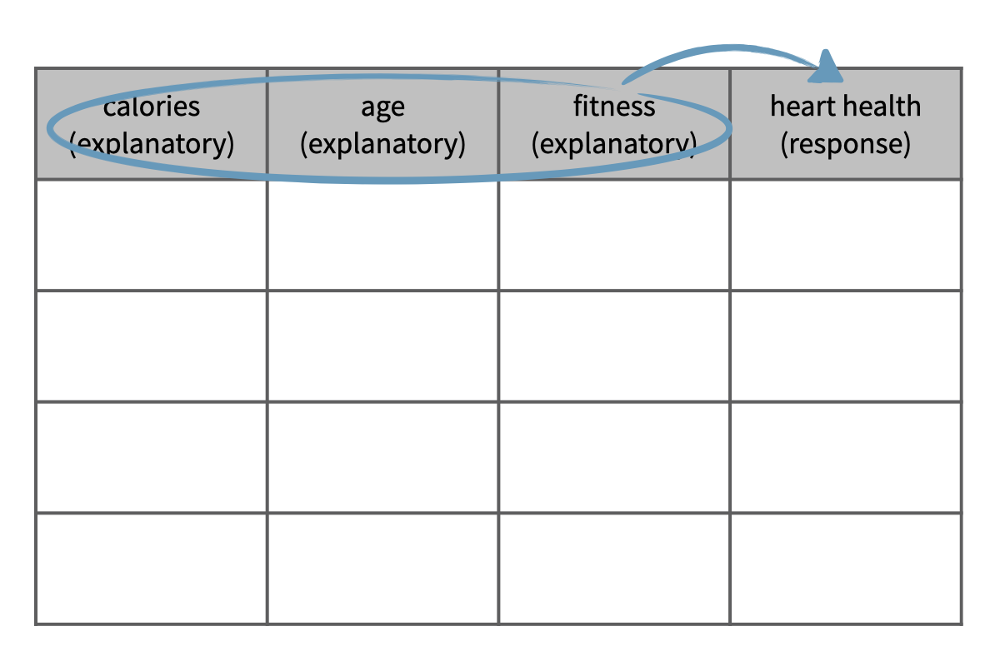
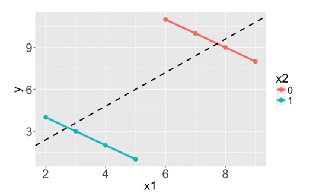

```{r setup, include=FALSE}
library(learnr)
library(gapminder)
library(tidyverse)
library(emo)

knitr::opts_chunk$set(echo = FALSE, message = FALSE, warning = FALSE)

# Used in some exercises
load("data/ucb_admit.RData")

ucb_admission_counts <- ucb_admit |>
  count(Gender, Admit)
```

## Observational studies and experiments

In this lesson, we discuss two types of studies commonly used in scientific research: observational studies and experiments. In particular, we will outline how to identify them and what the type of study says about the scope of the inference we can make based on that study's results.

In an *observational study*, researchers collect data in a way that does not directly interfere with how the data arise, in other words, they merely "observe". And based on an observational study we can only establish an association between the *explanatory* and *response* variables.

In an *experiment*, on the other hand, researchers randomly assign subjects to various treatments and can therefore establish causal connections between the *explanatory* and *response* variables.

Suppose we want to evaluate the relationship between using screens at bedtime such as a computer, tablet, or phone and attention span during the day. We can design this study as an observational study or as an experiment.

In an observational study, we sample two types of people from the population: those who choose to use screens at bedtime and those who don't.

Then, we find the average attention span for the two groups of people and compare.

{width="70%"}

On the other hand, in an experiment, we sample a group of people from the population and then we randomly assign these people into two groups: those who are asked to use screens at bedtime and those who asked not to use them. The difference is that the decision of whether to use screens or not is not left up to the subjects, as it was in the observational study, but is instead imposed by the researcher.

At the end, we compare the attention spans of the two groups.

{width="70%"}

Based on the observational study, even if we find a difference between the average attention span of these two groups of people, we can't attribute this difference solely to using screens because there may be other variables that we didn't control for in this study that contribute to the observed difference. For example, people who use screens at night might also be using screens for longer time periods during the day and their attention span might be affected by the daytime usage as well.


However, in the experiment, such variables that might also contribute to the outcome, called confounding variables, are most likely represented equally in the two groups due to random assignment. Therefore, if we find a difference between the two averages, we can indeed make a causal statement attributing this difference to bedtime screen usage.

Let's put these ideas into practice.

### Identify type of study: Reading speed and font

A study is designed to evaluate whether people read text faster in Arial or Helvetica font. A group of volunteers who agreed to be a part of the study are randomly assigned to two groups: one where they read some text in Arial, and another where they read the same text in Helvetica. At the end, average reading speeds from the two groups are compared. 

```{r quiz-identify-type-study}
quiz(
  question("What type of study is this?", correct = "Awesome! Even though participants are volunteers, this is still an experiment!", allow_retry = TRUE,
    answer("Observational study", message = "Not quite, this is not an observational study."),
    answer("Experiment", correct = TRUE),
    answer("Neither, since the sample consists of volunteers", message = "Try again!")
), caption = "")
```

Next, let's take a look at data from a different study on country characteristics. First, load the data and view it, then identify the type of study. Remember, an experiment requires random assignment.

### Recap: Types of studies

Let's take a look at data from a different study on country characteristics. The data come from the **gapminder** package. 

To view the top 10 rows of the data, simply type `gapminder`. You are welcome to view the data using functions from the **tidyverse** package you have learned previously to inspect it.

```{r gapminder-final, exercise=TRUE}
library(gapminder)
gapminder
```

Then, identify the type of study this data come from.

```{r quiz-gapminder-final}
quiz(
  question("What type of study is this?", correct = "Awesome!", allow_retry = TRUE,
    answer("Observational study", correct = TRUE),
    answer("Experiment", message = "Not quite, this is not an experiment since it's not possible to randomly assign countries to attributes in the dataset."),
    answer("Neither, since we don't have data on all countries.", message = "Try again!")
), caption = "")
```

## Random sampling assignment

In this section, we'll clarify the difference between *random sampling* and *random assignment*, and more importantly, why we care about this difference.

**Random sampling** occurs when _subjects are being selected for a study_. If subjects are selected randomly from the population of interest, then the resulting sample is likely representative of that population and therefore the study's results can be generalizable to that population.

**Random assignment** occurs only _in experimental settings where subjects are being assigned to various treatments_. Random assignment _allows for causal conclusions_ about the relationship between the treatment and the response. 

Here is a quick summary of how random sampling and random assignment affect the scope of inference of a study's results.

#### Scope of inference

{width="70%"}

A study that employs random sampling and random assignment can be used to make causal conclusions and these conclusions can be generalized to the whole population. This would be an ideal experiment, but such studies are usually difficult to carry out, especially if the experimental units are humans, since it may be difficult to randomly sample people from the population and then impose treatments on them. This is why most experiments recruit volunteer subjects. You may have seen ads for these on a university campus or in a newspaper.

Such human experiments that rely on volunteers employ random assignment, but not random sampling. These studies can be used to make causal conclusions, but the conclusions only apply to the sample and the results cannot be generalized to the population.

A study that uses no random assignment, but does use random sampling is your typical observational study. Results can only be used to make association statements, but they can be generalized to the whole population.

A final type of study, one that doesn't use random assignment or random sampling, can only be used to make non causal association statements. This is an unideal observational study.

You'll get some more practice with these concepts now.

### Random sampling and random assignment?

One of the early studies linking smoking and lung cancer compared patients who are already hospitalized with lung cancer to similar patients without lung cancer (hospitalized for other reasons), and recorded whether each patient smoked. Then, proportions of smokers for patients with and without lung cancer were compared.

```{r quiz-random-sampling}
quiz(
  question("Does this study employ random sampling and/or random assignment?", correct = "Right! Random assignment is not employed because the conditions are not imposed on the patients by the people conducting the study; random sampling is not employed because the study records the patients who are already hospitalized, so it wouldn't be appropriate to apply the findings back to the population as a whole.", allow_retry = TRUE,
    answer("Random sampling, but not random assignment", message = "Hm, not quite!"),
    answer("Random assignment, but not random sampling", message = "Try again!"),
    answer("Neither random sampling nor random assignment", correct = TRUE),
    answer("Both random sampling and random assignment")
), caption = "")
```

### Identify the scope of inference of study

Volunteers were recruited to participate in a study where they were asked to type 40 bits of trivia—for example, "an ostrich’s eye is bigger than its brain"—into a computer. A randomly selected half of these subjects were told the information would be saved in the computer; the other half were told the items they typed would be erased.

Then, the subjects were asked to remember these bits of trivia, and the number of bits of trivia each subject could correctly recall were recorded. It was found that the subjects were significantly more likely to remember information if they thought they would not be able to find it later.

```{r quiz-identify-scope}
quiz(
  question("The results of the study ______ be generalized to all people and a causal link between believing information is stored and memory ______ be inferred based on these results.", correct = "Correct! There is no random sampling since the subjects of the study were volunteers, so the results cannot be generalized to all people. However, due to random assignment, we are able to infer a causal link between the belief information is stored and the ability to recall that same information.", allow_retry = TRUE,
    answer("cannot, cannot", message = "Nope, try again!"),
    answer("cannot, can", correct = TRUE),
    answer("can, cannot", message = "Not quite!"),
    answer("can, can")
), caption = "")
```

## Simpson's paradox

Often when one mentions "a relationship between variables" we think of a relationship between just two variables, say a so called explanatory variable, x, and response variable, y. However, truly understanding the relationship between two variables might require considering other potentially related variables as well. If we don't, we might find ourselves in a *Simpson's paradox*. So, what is Simpson's paradox?

First, let's clarify what we mean when we say explanatory and response variables. Labeling variables as explanatory and response does not guarantee the relationship between the two is actually causal, even if there is an association identified. We use these labels only to keep track of which variable we suspect affects the other.

### Explanatory and response

{width="30%"}

And these definitions can be expanded to more than just two variables. For example, we could study the relationship between three explanatory variables and a single response variable.

### Multivariate relationships

{width="50%"}

This is often a more realistic scenario since most real world relationships are multivariable. For example, if we're interested in the relationship between calories consumed daily and heart health, we would probably also want to consider information on variables like age and fitness level of the person as well.

{width="50%"}

Not considering an important variable when studying a relationship can result in what we call a **Simpson's paradox**. This paradox illustrates the effect the omission of an explanatory variable can have on the measure of association between another explanatory variable and the response variable. In other words, the inclusion of a third variable in the analysis can change the apparent relationship between the other two variables. 

Consider the eight dots in the scatter plot below (the points happen to fall on the orange and blue lines). The trend describing the points when only considering `x1` and `y`, illustrated by the black dashed line, is reversed when `x2`, the grouping variable, is also considered. If we don't consider `x2`, the relationship between `x1` and `y` is positive. If we do consider `x2`, we see that within each group the relationship between `x1` and `y` is actually negative.

{width="50%"}

We'll explore Simpson's paradox further with another dataset, which comes from a study carried out by the graduate Division of the University of California, Berkeley in the early 70’s to evaluate whether there was a sex bias in graduate admissions. The data come from six departments. For confidentiality we'll call them A through F. The dataset contains information on whether the applicant identified as male or female, recorded as `Gender`, and whether they were admitted or rejected, recorded as `Admit`. First, we will evaluate whether the percentage of males admitted is indeed higher than females, overall. Next, we will calculate the same percentage for each individual department.

### Berkeley admission data

   .   | Admitted | Rejected  
-------| ---------|---------
Male   | 1198     | 1493
Female | 557      | 1278

> Note: At the time of this study, gender and sexual identities were not given distinct names. Instead, it
> was common for a survey to ask for your "gender" and then provide you with the options of "male" and 
> "female." Today, we better understand how an individual's gender and sexual identities are different 
> pieces of who they are. To learn more about inclusive language surrounding gender and sexual identities 
> see the [gender unicorn](https://transstudent.org/gender/). 

Let's get started.

### Number of males and females admitted

The goal of this exercise is to determine the number of male and female applicants who got admitted and rejected. Specifically, we want to find out how many males are admitted and how many are rejected. And similarly we want to find how many females are admitted and how many are rejected.

To do so we will use the `count()` function. In one step, `count()` groups the data and then tallies the number of observations in each level of the grouping variable. These counts are available under a new variable called `n`.

Pass the `Gender` and `Admit` columns from the `ucb_admit` dataset (which is already pre-loaded) into the `count()` function, to count how many students of each gender are admitted and how many are rejected.

```{r count-male, exercise=TRUE}
# Count number of male and female applicants admitted
___ |>
  count(___, ___)
```

```{r count-male-solution}
# Count number of male and female applicants admitted
ucb_admit |>
  count(Gender, Admit)
```

### Proportion of males admitted overall

Next we'll calculate the proportion of males and proportion of females admitted, by creating a new variable, called `prop` (short for proportion) based on the counts calculated in the previous exercise and using the `mutate()` function.

Proportions for each row of the data frame we created in the previous exercise can be calculated as `n / sum(n)`. However, it is important to note that since we are interested in the proportion of students admitted within each gender, we need for the data to be grouped by gender, so that `sum(n)` will be calculated for males and females separately. Luckily, the `group_by()` function can do this grouping for us! 

The `group_by()` function takes as arguments the column names of the **categorical** variables for which you want to perform grouped operations. We add this grouping into our data wrangling pipeline, by inserting a `group_by()` statement before we perform our subsequent tasks. For example, we could have found the same admission table as before, if we first grouped the data based on `Gender`, and then counted how many students were admitted and rejected. This process would look like this:  

```{r grouped-count-male, exercise = TRUE}
ucb_admit |> 
  group_by(Gender) |> 
  count(Admit)
```

Now, use this new function and your knowledge of creating new variables and filtering observations to calculate the proportion of males and proportion of females admitted. Note, the table of counts of gender and admission status you found earlier is available as `ucb_admission_counts`. 

To accomplish this task you will need to take the following steps: 

1. Use `group_by()` to group the data by gender.
2. Use `mutate()` to create a new variable named`prop`, calculated as the proportion of males and females admitted. Remember, proportions for each row of the data frame we create can be calculated as `n / sum(n)`! 
3. Use `filter()` to keep the data only for those who were admitted so that the resulting data frame only contains the proportions of males and females who were admitted.

Then answer the following question: *Which gender had a higher admission rate, male or female?*

```{r gender-male, exercise=TRUE}
ucb_admission_counts |>
  # Group by gender
  ___(___) |>
  # Create new variable
  mutate(prop = ___ / ___) |>
  # Filter for admitted
  ___(___ == "___")
```

```{r gender-male-hint-1}
ucb_admission_counts |>
  # Group by gender
  group_by(Gender) |>
  # Create new variable
  mutate(prop = ___ / ___) |>
  # Filter for admitted
  ___(___ == "___")
```

```{r gender-male-hint-2}
ucb_admission_counts |>
  # Group by gender
  group_by(Gender) |>
  # Create new variable
  mutate(prop = n / sum(n)) |>
  # Filter for admitted
  ___(___ == "___")
```

```{r gender-male-hint-3}
ucb_admission_counts |>
  # Group by gender
  group_by(Gender) |>
  # Create new variable
  mutate(prop = n / sum(n)) |>
  # Filter for admitted
  filter(Admit == "Admitted")
```

```{r gender-male-solution}
ucb_admission_counts |>
  # Group by gender
  group_by(Gender) |>
  # Create new variable
  mutate(prop = n / sum(n)) |>
  # Filter for admitted
  filter(Admit == "Admitted")
```

### Proportion of males admitted for each department

Finally we'll make a table similar to the one we constructed earlier, except we'll first group the data by department. The goal is to compare the proportions of male students admitted across departments.

Proportions for each row of the data frame we create can be calculated as `n / sum(n)`. Note that since the data are grouped by department **and**  gender, `sum(n)` will be calculated for males and females separately **for each department**.

```{r prepare-gender2}
ucb_admission_counts <- ucb_admit |>
  # Counts by department, then gender, then admission status
  count(Dept, Gender, Admit)
```

First, let's make a new object named `ucb_admission_counts` to store the `count()`s of `ucb_admit` by department, gender, and admission status. In this case, it doesn't matter what order you place `Dept`, `Gender`, or `Admit` inside of `count()`! 

```{r gender-male2, exercise=TRUE, exercise.setup="prepare-gender2"}
ucb_admission_counts <- ucb_admit |>
  # Counts by department, gender, and admission status
  ___(___, ___, ___)

# See the result
ucb_admission_counts
```

```{r gender-male2-solution}
ucb_admission_counts <- ucb_admit |>
  # Counts by department, then gender, then admission status
  count(Dept, Gender, Admit)

# See the result
ucb_admission_counts
```

Next, create a table with the proportions of male students admitted across departments, using the following steps: 

1. Use `group_by()` to group the `ucb_admission_counts` first by department then by gender.
2. Use `mutate()` to add a new column named `prop`, which is the ratio of those admitted or rejected by department and gender. Remember the calculation you used previously for row proportions! 
3. Use `filter()` to filter the rows for those who are males **and** those who were admitted. To "join" our filters we insert a comma between the filters we are interested (e.g. `filter(grade == "middle school", class == "Music"))`). 

```{r gender-male3, exercise=TRUE, exercise.setup="prepare-gender2"}
 ucb_admission_counts  |>
  # Group by department, then gender
  ___(___, ___) |>
  # Create new variable
  ___(prop = ___) |>
  # Filter for male and admitted
  ___(___, ___)
```

```{r gender-male3-hint-1}
 ucb_admission_counts  |>
  # Group by department, then gender
  group_by(Dept, Gender) |>
  # Create new variable
  ___(prop = ___) |>
  # Filter for male and admitted
  ___(___, ___)
```

```{r gender-male3-hint-2}
 ucb_admission_counts  |>
  # Group by department, then gender
  group_by(Dept, Gender) |>
  # Create new variable
  mutate(prop = n / sum(n)) |>
  # Filter for male and admitted
  ___(___, ___)
```

```{r gender-male3-hint-3}
 ucb_admission_counts  |>
  # Group by department, then gender
  group_by(Dept, Gender) |>
  # Create new variable
  mutate(prop = n / sum(n)) |>
  # Filter for male and admitted
  filter(Gender == "Male", ___)
```

```{r gender-male3-hint-4}
 ucb_admission_counts  |>
  # Group by department, then gender
  group_by(Dept, Gender) |>
  # Create new variable
  mutate(prop = n / sum(n)) |>
  # Filter for male and admitted
  filter(Gender == "Male", Admit == "Admitted")
```

```{r gender-male3-solution}
ucb_admission_counts  |>
  # Group by department, then gender
  group_by(Dept, Gender) |>
  # Create new variable
  mutate(prop = n / sum(n)) |>
  # Filter for male and admitted
  filter(Gender == "Male", Admit == "Admitted")
```

### Admission rates for males across departments

```{r prepare-gender3}
perc_admit_by_dept <- ucb_admit |>
  # Group by department, then gender
  group_by(Dept, Gender) |>
  # Table of counts of admission status and gender and department
  count(Admit) |>
  # Create new variable
  mutate(prop = n / sum(n)) |>
  # Filter for male and admitted
  filter(Admit == "Admitted")
```

```{r quiz-gender}
quiz(
  question("Which of the following best describes the relationship between admission status and gender?", correct = "Correct! Let's recap what we've learned in the next section.", allow_retry = TRUE,
    answer("Within most departments, female applicants are more likely to be admitted.", correct = TRUE),
    answer("Within most departments, male applicants are more likely to be admitted.", message = "That doesn't seem right."),
    answer("Within most departments, male and female applicants are equally likely to be admitted.", message = "Try again!")
), caption = "")
```

The question above can be answered by rerunning the the above code without the filter ‘Gender == "Male" ‘. The result of this updated analysis is available in your workspace as perc_admit_by_dept. Please inspect this table to answer the question 

```{r gender-male4, exercise=TRUE, exercise.setup="prepare-gender3"}


```

### Recap: Simpson's paradox


We'll wrap up the lesson with a recap of our findings.

Overall: males were more likely to be admitted

* Within most departments: females were more likely
* When controlling for department, relationship between gender and admission status was reversed
* Potential reason:
  + Women tended to apply to competitive departments with lower admission rates
  + Men tended to apply to less competitive departments with higher admission rates

We saw that overall males were more likely to be admitted.

But when we consider the department information, within most departments actually females are more likely to be admitted.

So when we control for department, the relationship between gender and admission status was reversed, which is what we call Simpson's paradox.

One potential reason for this paradox is that women tended to apply to competitive departments with lower rates of admission even among qualified applicants, such as in the English Department. Whereas, men tended to apply to less competitive departments with higher rates of admission among the qualified applicants, such as in engineering and chemistry.

Note that we were only able to discover the contradictory finding once we incorporated information about the department of the application. Examples like this highlight the importance of a good study design that considers and collects information on extraneous, but potentially confounding variables in a study.


## Congratulations!

You have successfully completed Lesson 2 in Tutorial 1: Introduction to data. If you need to generate a hash for submission, click "Next Topic".


What's next?

`r emo::ji("ledger")` [Full list of tutorials supporting OpenIntro::Introduction to Modern Statistics](https://openintrostat.github.io/ims-tutorials/)

`r emo::ji("spiral_notepad")` [Tutorial 1: Introduction to data](https://openintrostat.github.io/ims-tutorials/01-data/)

`r emo::ji("one")` [Tutorial 1 - Lesson 1: Language of data](https://openintro.shinyapps.io/ims-01-data-01/)

`r emo::ji("two")` [Tutorial 1 - Lesson 2: Types of studies](https://openintro.shinyapps.io/ims-01-data-02/)

`r emo::ji("three")` [Tutorial 1 - Lesson 3: Sampling strategies and Experimental design](https://openintro.shinyapps.io/ims-01-data-03/)

`r emo::ji("four")` [Tutorial 1 - Lesson 4: Case study](https://openintro.shinyapps.io/ims-01-data-04/)

`r emo::ji("open_book")` [Learn more at Introduction to Modern Statistics](http://openintro-ims.netlify.app/)


## Submit

```{r, echo=FALSE, context="server"}
source(here::here("R/encoder_logic.R"))
encoder_logic()
```

```{r encode, echo=FALSE}
source(here::here("R/encoder_ui.R"))
learnrhash::encoder_ui(ui_before = hash_encoder_ui)
```
