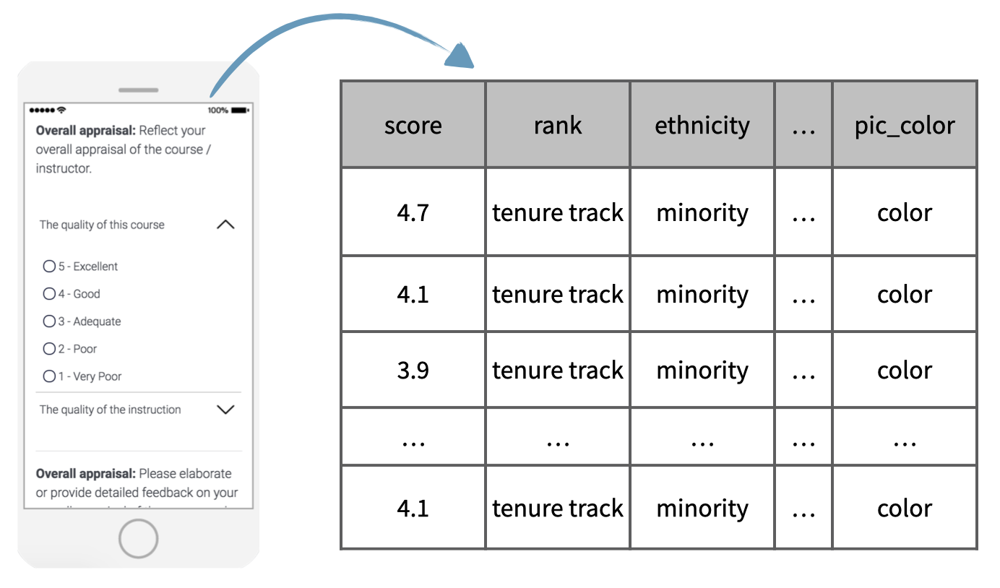

```{r setup, include=FALSE}
library(learnr)
library(openintro)
library(tidyverse)
library(emo)

knitr::opts_chunk$set(echo = FALSE)

# Used in some exercises
# Recode cls_students as cls_type
evals <- evals %>%
  mutate(cls_type = case_when(
    cls_students <= 18                      ~ "small",
    cls_students >= 19 & cls_students <= 59 ~ "midsize",
    cls_students >= 60                      ~ "large"
    )
  )
```


## Case study

In this last lesson of the tutorial, we will work on a case study, based on data from a study titled "Beauty in the Classroom".

As you might know, many college courses conclude by giving students the opportunity to anonymously evaluate both the course and the instructor. However, the use of these student evaluations as an indicator of course quality and teaching effectiveness is often criticized because the measures may reflect the influence of non teaching related characteristics, such as the physical appearance of the instructor.

{width="70%"}

The data that we will be working with, which includes information on course evaluations as well as students' scoring of professors' physical attractiveness, was collected as part of a study conducted at University of Texas, Austin.

In the following exercises, you will be asked to analyze these data with the eventual goal of investigating whether instructors who are viewed to be better looking receive higher instructional ratings. These exercises are designed to help you review the concepts and R syntax that you've learned in previous lessons of this tutorial.

## Exercise: Beauty in the classroom

### Inspect the data

The purpose of this lesson is to give you an opportunity to apply and practice what you've learned on a real world dataset. For this reason, we'll provide a little less guidance than usual.

Inspect the `evals` data frame using techniques you learned in previous lessons. Use an approach that shows you how many observations and variables are included in the dataset. This data is in the **openintro** package and we will use functions from the **tidyverse** for our analysis. You can read more about the data [here](http://openintrostat.github.io/openintro/reference/evals.html). 

Note that for the purposes of this analysis we have added an additional variable to the dataset, `cls_type`. This variable classifies classes as small, midsize, or large, depending on the number of students in the class. This was done using the following.

```{r echo = TRUE}
evals <- evals %>%
  mutate(cls_type = case_when(
    cls_students <= 18                      ~ "small",
    cls_students >= 19 & cls_students <= 59 ~ "midsize",
    cls_students >= 60                      ~ "large"
    )
  )
```


```{r inspect-data, exercise=TRUE, exercise.lines=5}
# Inspect evals
```

```{r inspect-data-solution}
# Inspect evals
glimpse(evals)

# Alternative solution
dim(evals)
```

### Identify type of study

```{r quiz-identify-type-study}
quiz(
  question("What type of study is this?", correct = "How observant! It was an observational study.", allow_retry = TRUE,
    answer("Observational study", correct = TRUE),
    answer("Experiment", message = "Try again!")
    ), caption = "")
```

### Sampling / experimental attributes

```{r quiz-sampling-experimental-atributes}
quiz(
  question("The data from this study were gathered by ___.", correct = "Good!", allow_retry = TRUE,
    answer("randomly sampling classes", correct = TRUE),
    answer("randomly sampling students", message = "Try again!"),
    answer("randomly assigning students to classes", message = "Nope!"),
    answer("randomly assigning professors to students", message = "Incorrect!")
    ), caption = "")
```

## Variables in the data

Let's take a closer look at each of the variables in the course evaluations dataset.

Remember that using the `glimpse()` function we can obtain a list of the variables and take a peek at the first few observations from each.

```{r glimpse-evals, echo=TRUE}
# Glimpse the data
glimpse(evals)
```

The first variable is the average evaluation score of the professor for a given course. Scores range between 1 and 5 with 1 being a poor evaluation and 5 being an excellent evaluation.

We are also given the following additional information:

* Whether the professor is a teaching faculty, tenure track faculty, or tenured faculty,
* Whether they are from a minority group or not.
* Whether they are male or female.
* Whether the language of instruction at the university where they received their education was English or not.
* The age of the professor.

Additionally, we also have a series of variables on the attributes of the class the evaluations came from, such as, percent of students who completed the evaluations, number of students who completed the evaluations, and the total number of students in the class, as well as the level of the course, whether a single professor or multiple professors taught it, and whether the course was a single credit or multi-credit course

The attractiveness score of the professors in the sample were determined by six students who were provided photos of the professors to rate. These students were comprised of 1 female student who is lower level, that is first year or sophomore, indicated with f1lower, two female students who are upper level, that is junior or senior, 1 male student who is lower level, and two male students who are upper level. In their scoring 1 indicates a low attractiveness score and 10 a high attractiveness score.

The average of these scores for each professor is also given.

These last two variables in the dataset are about the professors' photos: whether the professor was wearing a formal outfit and whether the picture was black and white or in color.

Now that you are more familiar with the variables in the dataset, you will be asked to determine their types.

### Identify variable types

It's always useful to start your exploration of a dataset by identifying variable types. The results from this exercise will help you design appropriate visualizations and calculate useful summary statistics later in your analysis.

#### Instruction

- Explore the `evals` data once again with the following goals in mind: (1) Identify each variable as numerical or categorical. (2) If numerical, determine if it is discrete or continuous. (3) If categorical, determine if it is ordinal or not.

- We've created a vector of variable names in the editor called `cat_vars`. To test your understanding of the data, remove the names of any variables that are *not* categorical.

```{r inspect-variable-types, exercise=TRUE}
# Inspect variable types


# Remove non-factor variables from the vector below
cat_vars <- c("score", "rank", "ethnicity", "gender", "language", "age",
              "cls_students", "cls_level", "cls_profs", "cls_credits",
              "bty_avg", "pic_outfit", "pic_color")
```

```{r inspect-variable-types-solution}
# Inspect variable types
glimpse(evals)

# Remove non-factor variables from the vector below
cat_vars <- c("rank", "ethnicity", "gender", "language",
              "cls_level", "cls_profs", "cls_credits",
              "pic_outfit", "pic_color")
```

### Recode a variable

The `cls_students` variable in `evals` tells you the number of students in the class. Suppose instead of the exact number of students, you're interested in whether the class is 

* `"small"` (18 students or fewer), 
* `"midsize"` (19 - 59 students), or 
* `"large"` (60 students or more).

- Recode the `cls_students` variable into a new variable, `cls_type`, using `case_when()`. This new variable should have three levels  as  described above. Save the resulting data frame (with the new variable) as `evals`. 

- *What type of variable is `cls_type`?*

```{r type-of-variable, exercise=TRUE}
# Recode cls_students as cls_type
evals <- evals %>%
  mutate(
    ___ = case_when(
      ___ ~ "small",
      ___ ~ "midsize",
      ___ ~ "large"
    )
  )
```

```{r type-of-variable-solution}
# Recode cls_students as cls_type
evals <- evals %>%
  mutate(
    cls_type = case_when(
      cls_students <= 18                      ~ "small",
      cls_students >= 19 & cls_students <= 59 ~ "midsize",
      cls_students >= 60                      ~ "large"
    )
  )
```

### Create a scatterplot

The `bty_avg` variable shows the average beauty rating of the professor by the six students who were asked to rate the attractiveness of these faculty. The `score` variable shows the average professor evaluation score, with 1 being *very unsatisfactory* and 5 being *excellent*.

- Use `ggplot()` to create a scatterplot displaying the relationship between these two variables. 

- *How would you describe the relationship apparent in this visualization?*

```{r create-scatterplot, exercise=TRUE}
# Scatterplot of score vs. bty_avg
___(evals, ___) +
  ___
```

```{r create-scatterplot-solution}
# Scatterplot of score vs. bty_avg
ggplot(evals, aes(x = bty_avg, y = score)) +
  geom_point()
```

### Create a scatterplot, with an added layer

Suppose you are interested in evaluating how the relationship between a professor's attractiveness and their evaluation score varies across different class types (small, midsize, and large).

- Recreate your visualization from the previous exercise, but this time color the points by class type.

- *How would you describe the relationship apparent in this visualization?*

```{r scatterplot-added-layer, exercise=TRUE}
# Scatterplot of score vs. bty_avg colored by cls_type
___(evals, ___) +
  ___
```

```{r scatterplot-added-layer-solution}
# Scatterplot of score vs. bty_avg colored by cls_type
ggplot(evals, aes(x = bty_avg, y = score, color = cls_type)) +
  geom_point()
```

## Congratulations!

You have successfully completed all of the lessons in Tutorial 1: Introduction to data.

You now know how to get started with data analysis! In this tutorial you have learned concepts and terminology related to study design and the first steps of working with a dataset. We have also laid the foundation for using certain R packages, like dplyr for data wrangling and ggplot2 for data visualization.

We hope you enjoyed the tutorial and that the topics we discussed in this tutorial motivated you to learn more data analysis and statistics. What we covered in this tutorial is just the tip of the iceberg, so we hope you decide to dive deeper to learn more.

What's next?

`r emo::ji("ledger")` [Full list of tutorials supporting OpenIntro::Introduction to Modern Statistics](https://openintrostat.github.io/ims-tutorials/)

`r emo::ji("spiral_notepad")` [Tutorial 1: Introduction to data](https://openintrostat.github.io/ims-tutorials/01-data/)

`r emo::ji("one")` [Tutorial 1 - Lesson 1: Language of data](https://openintro.shinyapps.io/ims-01-data-01/)

`r emo::ji("two")` [Tutorial 1 - Lesson 2: Types of studies](https://openintro.shinyapps.io/ims-01-data-02/)

`r emo::ji("three")` [Tutorial 1 - Lesson 3: Sampling strategies and Experimental design](https://openintro.shinyapps.io/ims-01-data-03/)

`r emo::ji("four")` [Tutorial 1 - Lesson 4: Case study](https://openintro.shinyapps.io/ims-01-data-04/)

`r emo::ji("open_book")` [Learn more at Introduction to Modern Statistics](http://openintro-ims.netlify.app/)
