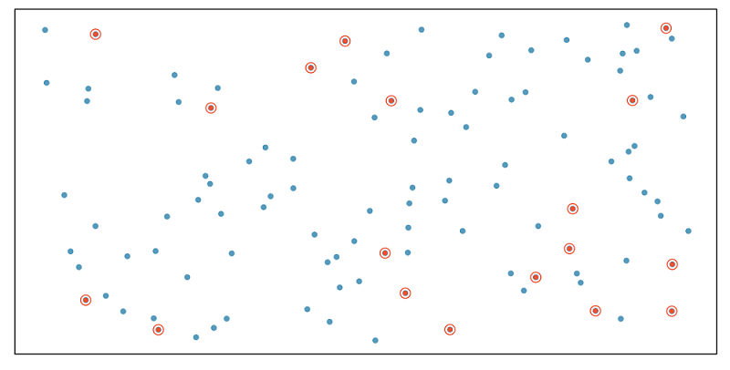
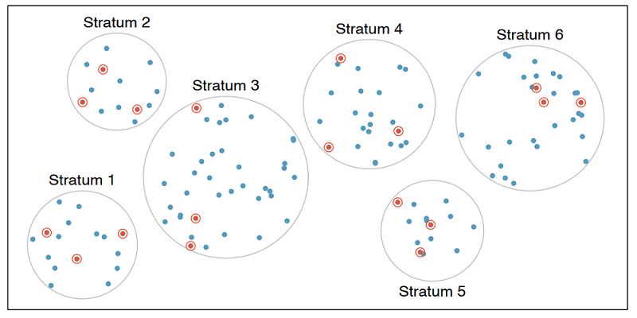

```{r setup, include=FALSE}
library(learnr)
library(usdata)
library(tidyverse)
library(emo)

knitr::opts_chunk$set(echo = FALSE, message = FALSE, warning = FALSE)

# Used in some exercises
load("data/us_regions.RData")

county_noDC <- county %>%
  filter(state != "District of Columbia") %>%
  droplevels()

county_srs <- county_noDC %>%
  slice_sample(n = 150)
```


## Sampling strategies

In this section, we discuss why and how to sample data.

In the previous lesson, when we defined observational studies and experiments, we mentioned working with samples from the population. But why do we sample in the first place? Why not try to collect data from the entire population of interest? Well, you could try, that is, try to take a census, but it isn't easy.

### Why not take a census?

First, taking a census requires a lot more resources than collecting data from a sample of the population.

Second, certain individuals in your population might be hard to locate or collect data from. If these individuals that are missed in the census are different from those in the rest of the population, the census data will be biased. For example, in the US census, undocumented immigrants are often not recorded properly since they tend to be reluctant to fill out census forms with the concern that this information could be shared with immigration. However, these individuals might have characteristics different than the rest of the population and hence, not getting information from them might result in unreliable data from geographical regions with high concentrations of undocumented immigrants.

Lastly, populations are constantly changing. Even if you do have the required resources and manage to collect data from everyone in the population, tomorrow your population will be different and so the hard work required to collect such data may not pay off.

If you think about it, sampling is actually quite natural.

### Sampling is natural

Think about something you are cooking we taste or in other words examine a small part of what we're cooking to get an idea about the dish as a whole. After all, we would never eat a whole pot of soup just to check its taste.

When you taste a spoonful of soup and decide the spoonful you tasted isn't salty enough, what you're doing is simply exploratory analysis for the sample at hand.

If you then generalize and conclude that your entire soup needs salt, that's making an inference.

For your inference to be valid, the spoonful you tasted, your sample, needs to be representative of the entire pot, your population.

If your spoonful comes only from the surface and the salt is collected at the bottom of the pot, what you tasted is probably not going to be representative of the whole pot.

On the other hand, if you first stir the soup thoroughly before you taste, your spoonful will more likely be representative of the whole pot.

Sampling data is a bit different than sampling soup though. So next, we'll introduce a few commonly used sampling methods: simple random sampling, stratified sampling, cluster sampling, and multistage sampling.

### Simple random sample

In simple random sampling, we randomly select cases from the population, such that each case is equally likely to be selected. This is similar to randomly drawing names from a hat.

{width="70%"}

### Stratified sample

In stratified sampling, we first divide the population into homogeneous groups, called strata, and then we randomly sample from within each stratum. For example, if we wanted to make sure that people from low, medium, and high socioeconomic status are equally represented in a study, we would first divide our population into three groups as such and then sample from within each group.

{width="70%"}


### Cluster sample

In cluster sampling, we divide the population into clusters, randomly sample a few clusters, and then sample all observations within these clusters. The clusters, unlike strata in stratified sampling, are heterogeneous within themselves and each cluster is similar to the others, such that we can get away with sampling from just a few of the clusters.

{width="70%"}


### Multistage sample

Multistage sampling adds another step to cluster sampling. Just like in cluster sampling, we divide the population into clusters, randomly sample a few clusters, and then we randomly sample observations from within those clusters.

{width="70%"}

Cluster and multistage sampling are often used for economical reasons. For example, one might divide a city into geographic regions that are on average similar to each other and then sample randomly from a few randomly picked regions in order to avoid traveling to all regions.

Time to put these concepts into practice!

### Sampling strategies, determine which

A consulting company is planning a pilot study on marketing in Boston. They identify the zip codes that make up the greater Boston area, then sample 50 randomly selected addresses from each zip code and mail a coupon to these addresses. They then track whether the coupon was used in the following month.

```{r quiz-sampling-strategies-determine-wich}
quiz(
  question("What sampling strategy has this company used?", correct = "Nice! Let's continue to the next exercise.", allow_retry = TRUE,
    answer("Simple random sample", message = "Try again. The company is dividing the Boston area by zip code."),
    answer("Stratified sample", correct = TRUE),
    answer("Cluster sample", message = "Hmm, not quite. The company isn't sampling all the houses in each zip code."), 
    answer("Multistage sample", message = "Not quite! The company is sampling 50 addresses from each zip code.") ), 
  caption = "")
```

### Sampling strategies, choose worst

A school district has requested a survey be conducted on the socioeconomic status of their students. Their budget only allows them to conduct the survey in some of the schools, hence they need to first sample a few schools. 

Students living in this district generally attend a school in their neighbourhood. The district is broken into many distinct and unique neighbourhoods, some including large single-family homes and others with only low-income housing. 

```{r quiz-sampling-strategies-choose-worst}
quiz(
  question("Which approach would likely be the **least effective** for selecting the schools where the survey will be conducted?", correct = "Nice job! This sampling strategy would be a bad idea because each neighborhood has a unique socioeconomic status. A good study would collect information about every neighborhood.", allow_retry = TRUE,
    answer("Simple random sample", message = "Incorrect!"),
    answer("Stratified sampling, where each stratum is a neighborhood", message = "Try again. Remember, the socioeconomic status of each neighborhood is unique."), 
    answer("Cluster sampling, where each cluster is a neighborhood", correct = TRUE) ), 
  caption = "")
```

## Sampling in R

In this section, we'll practice sampling in R.

Suppose we want to collect data from counties in the United States, but we do not have the resources to obtain these data from all counties. Conveniently, however, we do have a list of all counties. This is publicly available information and is contained in the `county` dataset in the **usdata** package. You can read more about the data [here](https://openintrostat.github.io/usdata/reference/county.html). 

### Setup

So, let's start by loading the necessary packages with the `library()` function. We need the **usdata** package for the relevant data frame and the **tidyverse** package for the sampling and grouping functions we'll introduce shortly.

```{r load-packages, exercise=TRUE}
library(usdata)
library(tidyverse)
```

Next we'll work with the `county` data from the usdata package.

This data frame contains data from counties in all 50 states plus the District of Columbia, or DC, as it's commonly referred to. Since DC is not a state by definition, we'll first remove it from the dataset. We can do this with the `filter()` function that you learned about earlier in these tutorials.

That is, we will create a new data frame, called `county_noDC` that `filter()`s out the observation where state is DC. Notice that to filter DC out of the data frame we are using `!=`. You can think of the `!` as negating what comes after it. Here, the `!` negates the `=` sign, meaning we want the `state` to **not** be equal to the District of Columbia. 

We'll also `droplevels()` for good measure, so that the level District of Columbia is removed completely from the data frame.

```{r remove-dc, exercise=TRUE}
county_noDC <- county %>%
  filter(state != "District of Columbia") %>%
  droplevels()
```

### Simple random sample

Suppose our limited resources require that we collect data from only _150_ of the over _3000_ counties in the United States.

One option is to take a simple random sample. We will use the `slice_sample()` function in dplyr (a package included in the tidyverse) to do this.

We start with the `county_noDC` data frame and pipe it into the `slice_sample()` function, setting the size (`n`) argument to 150. We will call the data frame containing this simple random sample *`county_srs`*.

```{r random-sample, exercise=TRUE}
# Simple random sample of 150 counties
county_srs <- county_noDC %>%
  slice_sample(n = 150)

# Glimpse
glimpse(county_srs)
```

A quick `glimpse()` shows that there are indeed _150_ observations in this data frame. Note that your sample will look different than someone else's sample, even though you're running the exact same code. We are taking a random sample here, so your sample will be different than mine, just by random chance. However, the sample size should be the same since that is something we specified in the `slice_sample()` function.

### SRS state distribution

If our goal was to take a sample of any 150 counties, we have accomplished this goal. However, if we wanted to obtain equal numbers of counties from each state (that is, three counties per state) a simple random sample won't ensure that.

We can confirm this by counting the number of counties per state. 

To do so we will start with the `county_srs` data frame: first group these data by state, then count the number of observations per state.

```{r random-sample3, exercise=TRUE}
# State distribution of SRS counties
county_srs %>%
  group_by(state) %>%
  count()
```

The resulting output shows that this sampling approach yielded data from less than _50_ states and the number of counties sampled varies from state to state.

If we instead want to sample three counties per state to make up our sample of 150 counties, we should use stratified sampling.

### Stratified sample

The code looks very similar to how we selected the simple random sample, except that *before* sampling we __first__ group by state and __then sample__ three observations per group.

A quick glimpse at the resulting data frame confirms that we indeed have _150_ observations in this sample.

```{r stratified-sample, exercise=TRUE}
# Stratified sample of 150 counties, each state is a stratum
county_str <- county_noDC %>%
  group_by(state) %>%
  slice_sample(n = 3)

# Glimpse
glimpse(county_str)
```

Now it's your turn to take a sample!

### Exercise: Simple random sample in R

Suppose we want to collect some data from a sample of eight states. A list of all states and the region they belong to (Northeast, Midwest, South, West) are given in the `us_regions` data frame.

The dplyr package and `us_regions` data frame have been loaded.

- Use simple random sampling to select eight states from `us_regions`. Save this sample in a data frame called `states_srs`.

- Count the number of states from each region in your sample.

```{r simple-random-sample, exercise=TRUE}
# Simple random sample: states_srs
states_srs <- ___ %>%
  ___

# Count states by region
states_srs %>%
  ___(___)
```

```{r simple-random-sample-solution}
# Simple random sample
states_srs <- us_regions %>%
  slice_sample(n = 8)

# Count states by region
states_srs %>%
  count(region)
```

### Exercise: Stratified sample in R

In the previous exercise, we took a simple random sample of eight states. However, we did not have any control over how many states from each region got sampled. The goal of stratified sampling in this context is to have control over the number of states sampled from each region. Our goal for this exercise is to sample an equal number of states from each region.

The dplyr package has been loaded and `us_regions` is still available in your workspace.

For this exercise you should use stratified sampling to select a total of eight states, two from each stratum, where each stratum is a region of the country. We can break this down into three steps: 

1. group the dataset by region (using `group_by()`) 
2. sample two states from each region (using `slice_sample()`)
3. save the sample in a new data frame called `states_str` (using `<-` -- the assignment arrow).


Once you've collected your sample, count the number of states from each region 
in your sample to confirm that each region is represented equally in your sample.

```{r stratified-sample4, exercise=TRUE}
# Stratified sample
states_str <- ___ %>%
  group_by(___) %>%
  slice_sample(___)

# Use the states_str data to count states by region
___ %>%
  ___ %>%
```

```{r stratified-sample4-solution}
# Stratified sample
states_str <- us_regions %>%
  group_by(region) %>%
  slice_sample(n = 2)

# Count states by region
states_str %>%
  count(region)
```

### Exercise: Compare SRS vs. stratified sample


```{r quiz-compare-SRS-stratified-sample}
quiz(
  question("Which method you implemented, simple random sampling or stratified sampling, ensured an equal number of states from each region?", correct = "Super! Simple random sampling would result in different amounts of data being sampled from each state.", allow_retry = TRUE,
    answer("Simple random sampling", message = "Try again!"),
    answer("Stratified sampling", correct = TRUE)), caption = "")
```

## Principles of experimental design

In this section, we discuss principles of experimental design: _control, randomize, replicate, and block_.

To **control** means to compare the treatment of interest to a control group.

To **randomize** means to randomly assign subjects to treatments.

To **replicate** means to collect a sufficiently large sample within a study or to replicate the entire study.

And the last principle of experimental design is **blocking**. The goal of blocking is to account for the potential effect of known or suspected confounding variables. We do this by first grouping subjects into blocks based on these variables and then randomizing them within each block to treatment groups.

Let's discuss blocking a bit more.

### Design a study, with blocking


We would like to design an experiment to investigate whether students learn the R language better in a traditional lecture based course or using an interactive online learning platform. Two courses that teach the exact same material are designed and the only difference between these courses is the method of delivery: traditional lecture or interactive online.

We sample a group of students for our study that we will randomly assign to these two courses.

But before we do so, we need to consider any potential confounding variables. It is suspected that previous programming experience might have an effect on how students learn in these two settings and we know that some of the students in our study have previous programming experience and some don't. Therefore we decide to block for having previous programming experience.

To do so, we divide our sample into two, those with programming experience and those without.

Then, we randomly assign individuals from each block into the two courses, ensuring that those with and without programming experience are equally represented in the two treatment groups.

{width="50%"}

In this experiment the _explanatory_ variable is the _course type_ lecture versus interactive online and the variable that we're _blocking_ for is _previous programming experience_.

This way, if we find a difference in mastery of the R language between students in the two courses, we will be able to attribute it to the course type and can be assured that the difference isn't due to previous programming experience since both those with and without such experience were equally represented in the two treatment groups.

Now it's time to practice these experimental design concepts.

### Identifying components of a study

A researcher designs a study to test the effect of light and noise levels on exam performance of students. The researcher also believes that light and noise levels might have different effects on males and females, so she wants to make sure both sexes are represented equally under different conditions.

```{r quiz-identify-study-components}
quiz(
  question("Which of the below is correct?", correct = "Nice job!", allow_retry = TRUE,
    answer("There are 3 explanatory variables (light, noise, sex) and 1 response variable (exam performance).", message = "Close, but sex is thought to be a confounding variable, not an explanatory one!"),
    answer("There is 1 explanatory variable (sex) and 3 response variables (light, noise, exam performance).", message = "Not quite!"),
    answer("There are 2 blocking variables (light and noise), 1 explanatory variable (sex), and 1 response variable (exam performance).", message = "Incorrect!"),
    answer("There are 2 explanatory variables (light and noise), 1 blocking variable (sex), and 1 response variable (exam performance).", correct = TRUE)), caption = "")
```

### Experimental design terminology

___ variables are conditions you can impose on the experimental units, while ___ variables are characteristics that the experimental units come with that you would like to control for.

```{r quiz-experimental-desing-terminology}
quiz(
  question("", correct = "Nice job!", allow_retry = TRUE,
    answer("Blocking, explanatory", message = "Not quite!"),
    answer("Explanatory, blocking", correct = TRUE),
    answer("Control, treatment", message = "Nope, try again!"),
    answer("Treatment, control", message = "Try again!")), caption = "")
```

### Connect blocking and stratifying

In random sampling, we use ___ to control for a variable. In random assignment, we use ___ to achieve the same goal.

```{r quiz-blocking-and-stratifying}
quiz(
  question("", correct = "Correct!", allow_retry = TRUE,
    answer("stratifying, blocking", correct = TRUE),
    answer("blocking, stratifying", message = "Incorrect!"),
    answer("confounding, stratifying", message = "Not quite!"),
    answer("confounding, blocking", message = "Try again!")), caption = "")
```


## Congratulations!

You have successfully completed Lesson 3 in Tutorial 1: Getting Started with Data.

What's next?

`r emo::ji("ledger")` [Full list of tutorials supporting OpenIntro::Introduction to Modern Statistics](https://openintrostat.github.io/ims-tutorials/)

`r emo::ji("spiral_notepad")` [Tutorial 1: Getting Started with Data](https://openintrostat.github.io/ims-tutorials/01-getting-started-with-data/)

`r emo::ji("one")` [Tutorial 1 - Lesson 1: Language of data](https://openintro.shinyapps.io/ims-01-getting-started-with-data-01/)

`r emo::ji("two")` [Tutorial 1 - Lesson 2: Types of studies](https://openintro.shinyapps.io/ims-01-getting-started-with-data-02/)

`r emo::ji("three")` [Tutorial 1 - Lesson 3: Sampling strategies and Experimental design](https://openintro.shinyapps.io/ims-01-getting-started-with-data-03/)

`r emo::ji("four")` [Tutorial 1 - Lesson 4: Case study](https://openintro.shinyapps.io/ims-01-getting-started-with-data-04/)

`r emo::ji("open_book")` [Learn more at Introduction to Modern Statistics](http://openintro-ims.netlify.app/)
