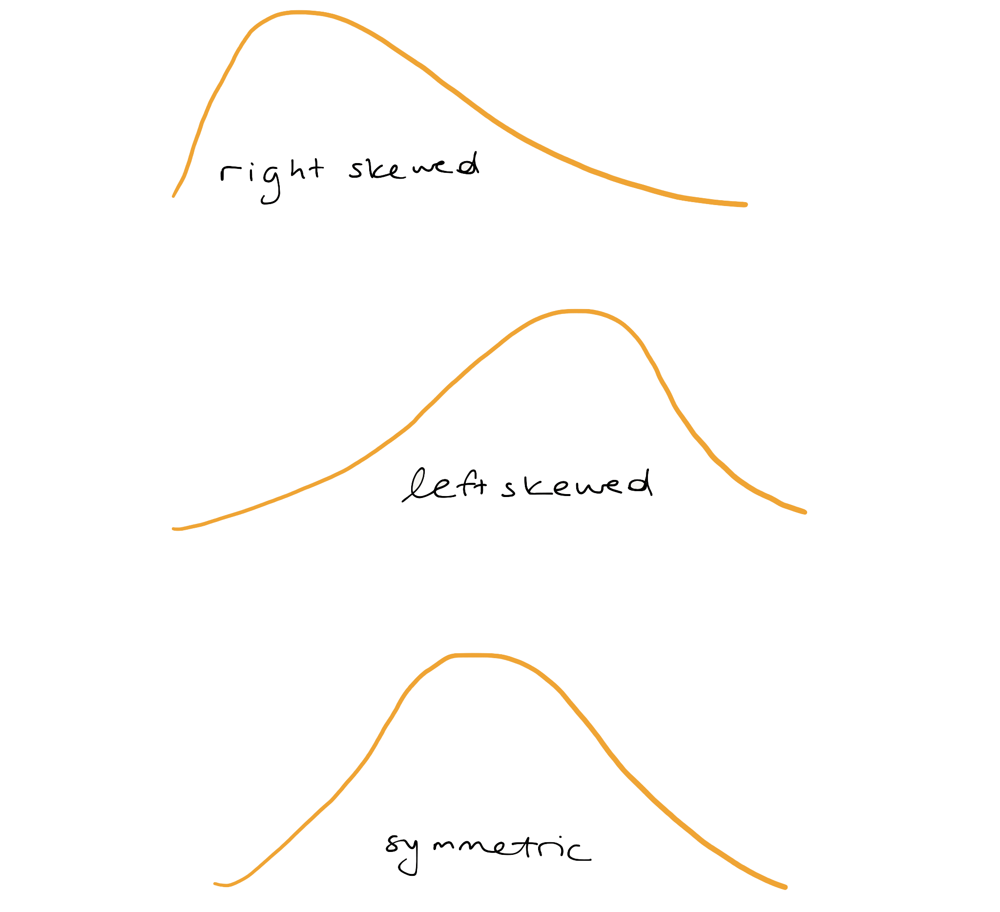

```{r setup, message = FALSE, warning = FALSE,	include = FALSE}

library(learnr)
library(tidyverse)
library(openintro)
library(gapminder)
library(gt)
library(patchwork)
library(emo)

knitr::opts_chunk$set(warning = FALSE,
                      message = FALSE,
                      echo = FALSE, 
                      fig.height = 3,
                      fig.width = 5,
                      fig.align = "center")

life <- read_csv("data/life_exp.csv") |> 
  mutate(
    state = str_to_title(state),
    county = str_to_title(county)
    )
```

## Measures of center

What do we mean by a typical observation? For example, it sounds perfectly fine to state a statistic like: the typical life expectancy in the US is 77.6 years, but where does that number come from? Before we answer that question, let's make this more concrete by introducing a dataset that we'll be working with throughout the lesson.

### County demographics

Researchers in public health have compiled data on the demographics of every county in the US. We see here that we have 4 variables: the state name, the county name, then the average life expectancy, and the median income. 

```{r life}
life
```

### Massachusetts

We're going to focus on the state of Massachusetts, which happens to have 14 counties. Let's filter the data for counties from that state, and name the resulting data frame `life_ma`. To make the rest of the conversation simpler we'll also round the life expectancy values to whole numbers for this state.

```{r life-ma-filter, echo = TRUE}
life_ma <- life |>
  filter(state == "Massachusetts") |>
  mutate(expectancy = round(expectancy)) |>
  select(county, expectancy)
```

Here is a look at those counties.

```{r life-ma-view}
life_ma
```

```{r life-exp-mean}
life_ma_summary <- life_ma |>
  summarise(
    mean = round(mean(expectancy), 1),
    med = round(median(expectancy), 1),
    mode = 80,
    var = round(var(expectancy), 2),
    sd = round(sd(expectancy), 2),
    iqr = round(IQR(expectancy), 2)
  )
```

### Mean

Let's take a closer look at the life expectancies for counties in Massachusetts. We'll arrange them in ascending order to make it a bit easier to to answer the question "What is a typical value for life expectancies in Massachusetts counties?"

```{r life-ma-view2}
life_ma |>
  arrange(expectancy) |>
  print(n = 14)
```

Here is another look at these values, as a dot plot.

```{r life-ma-plot}
ggplot(data = life_ma, aes(x = expectancy)) +
  geom_dotplot() +
  theme(axis.text.y = element_blank(),
        axis.title.y = element_blank())
```

To answer this question, we need to think about what "typical" means. One statistic we commonly use to describe a typical observation is the **mean**, or in other words, the arithmetic average. The average life expectancy for counties in Massachusetts is `r life_ma_summary$mean` years.

```{r mean, echo = TRUE}
life_ma |>
  summarise(mean = mean(expectancy))
```

Let's add that value as a red, dashed line to our dot plot.

```{r life-ma-plot-mean}
ggplot(data = life_ma, aes(x = expectancy)) +
  geom_dotplot() +
  theme(axis.text.y = element_blank(),
        axis.title.y = element_blank()) +
  geom_vline(xintercept = life_ma_summary$mean, color = COL[4,1], linetype = "longdash", size = 1)
```

### Median

Another measure of "typical" or "center" is the **median**. 
The median is the 50th percentile, i.e. the middle value in the sorted data. Let's take another look at the sorted life expectancies.

```{r}
life_ma |>
  arrange(expectancy) |>
  pull(expectancy)
```

The value that cuts the data in half is `r life_ma_summary$med`. We can also calculate this using the `median()` function.

```{r median, echo = TRUE}
life_ma |>
  summarise(median = median(expectancy))
```

Let's add that value as a blue, solid line to our dot plot.

```{r life-ma-plot-mean-med}
ggplot(data = life_ma, aes(x = expectancy)) +
  geom_dotplot() +
  theme(axis.text.y = element_blank(),
        axis.title.y = element_blank()) +
  geom_vline(xintercept = life_ma_summary$mean, color = COL[4,1], linetype = "longdash", size = 1) +
  geom_vline(xintercept = life_ma_summary$med, color = COL[1,1], size = 1)
```

The mean can be thought of as the balance point of the data and it tends to be drawn towards the longer tail of a distribution. This highlights an important feature of the mean: its sensitivity to extreme values. For this reason, when working with skewed distributions, the median is often a more appropriate measure of center.

### Mode

The **mode** is yet another measure of center. The mode is the number that occurs the most frequently in the dataset. To find the mode, we can `count()` the life expectancy values, and identify the most frequent one.

```{r mode}
life_ma |>
  count(expectancy, sort = TRUE)
```

In this case, the median and the mode are the same (both `r life_ma_summary$mode`), but that is often not the case.

Let's plot the mode right on top of the median as a yellow, dotted line.

```{r life-ma-plot-mean-med-mod}
ggplot(data = life_ma, aes(x = expectancy)) +
  geom_dotplot() +
  theme(axis.text.y = element_blank(),
        axis.title.y = element_blank()) +
  geom_vline(xintercept = life_ma_summary$mean, color = COL[4,1], linetype = "longdash", size = 1) +
  geom_vline(xintercept = life_ma_summary$med, color = COL[1,1], size = 1) +
  geom_vline(xintercept = life_ma_summary$mode, color = COL[3,1], linetype = "dashed")
```

Now that we have some sensible measures of center, we can answer questions like: Is the typical county life expectancy in Massachusets similar to the typical life expectancy in the rest of the country?

## Group means

To answer this question we start by using `mutate()` to create a new variable that will be TRUE if the state value is either "California", "Oregon", or "Washington", and FALSE otherwise. This process uses some of the tools we've seen before, namely the `if_else()` function and the `%in%` operator, and puts them together. 

In the code below, we make a new variable named `west_coast` and specify how that variable is calculated. The condition we use inside of the `if_else()` function states that if the state associated with an observation is included in "California, Oregon, or Washington, the `west_coast` variable should have a value of `"yes"`. If the state of an observation is not included in this list, then the `west_coast` variable should have a value of `"no"`. 

Notice the `life <- life |>` line in the code below. This line is telling R that we are updating the original `life` dataset with a new dataset that contains the `west_coast` variable. 

```{r life-mutate, echo = TRUE}
life <- life |>
  mutate(west_coast = if_else(state %in% c("California", "Oregon", "Washington"), 
    "yes",
    "no"
  ))
```

To compute means for the two groups (west coast and the rest of the country), we pipe this updated dataset into the `group_by()` function, and indicate how we would like to make the groups. Then we can `summarize()` those groups, West Coast counties and non-West Coast counties, by taking the `mean()` and `median()` of their life expectancies. 

```{r life-groupby, echo = TRUE}
life |>
  group_by(west_coast) |>
  summarize(mean(expectancy),
            median(expectancy))
```

We learn that looking at both mean and median, the typical West Coast county has a slightly higher average life expectancy than counties not on the West Coast.

### Without `group_by()`

`group_by()` and `summarize()` form a powerful pair of functions, so let's look into how they work. Let's look at a slice of 8 rows in the middle of the dataset.

```{r life-slice, eval = FALSE}
life |>
  slice(240:247)
```

```{r life-slice-styled}
life |>
  slice(240:247) |>
  gt() |>
  tab_style(
    style = list(
      cell_fill(color = COL[2,4]),
      cell_text(weight = "bold")
      ),
    locations = cells_body(
      columns = vars(expectancy))
  )
```

</br> 

We can `summarize()` the expectancy of these 8 rows by finding the `mean()` expectancy.

```{r life-summarize}
life |>
  slice(240:247) |>
  summarize(mean(expectancy))
```

### With `group_by()`

If we add a line to `group_by()` `west_coast`, it's effectively breaking the dataset into two groups and calculating the `mean()` of the expectancy variable for each one separately.

```{r life-gr-sum-gt}
life |>
  slice(240:247) |>
  gt() |>
  tab_style(
    style = list(
      cell_fill(color = "lightyellow"),
      cell_text(weight = "bold")
      ),
    locations = cells_body(
      columns = vars(expectancy),
      rows = west_coast == TRUE)
  ) |>
    tab_style(
    style = list(
      cell_fill(color = "lightcyan"),
      cell_text(weight = "bold")
      ),
    locations = cells_body(
      columns = vars(expectancy),
      rows = west_coast == FALSE)
  )
```

```{r life-gr-sum}
life |>
  slice(240:247) |>
  group_by(west_coast) |>
  summarize(mean(expectancy))
```

As seen in the example above, `group_by()` and `summarize()` open up lots of possibilities for analysis, so let's get started.

## Your turn! 

In the exercises for this lesson, you'll be working with similar data, but on a global scale, in the Gapminder data.

### Choice of center

The choice of measure for center can have a dramatic impact on what we consider to be a typical observation, so it is important that you consider the shape of the distribution before deciding on the measure.

```{r mc1-pre}
set.seed(38)
rskew <- rexp(1000, 1)
symm <- rnorm(1000)
d <- data.frame(x = c(rskew, symm),
                distribution = rep(c("A", "B"), c(1000, 1000)))

ggplot(d, aes(x = x, fill = distribution)) +
  geom_density(alpha = 0.3)
```

```{r mc1}
question("Which set of measures of central tendency would be *worst* for describing the two distributions shown here?",
  answer("A: mode, B: median", message = "Not quite, try again."),
  answer("A: mean, B: mode", correct = TRUE, message = "Nice! Let's continue to the next exercise."),
  answer("A: median, B: mean", message = "Incorrect, the median and mean look like they'd be good measures of central tendency."),
  answer("A: median, B: median", message = "Hmm, I think there's a worse choice."),
  allow_retry = TRUE
)
```

### Calculate centers

Throughout this lesson, you will use data from `gapminder`, which tracks demographic data in countries of the world over time. To learn more about it, you can bring up the help file with `?gapminder`.

For this exercise, focus on how the life expectancy differs from continent to continent. This requires that you conduct your analysis not at the country level, but aggregated up to the continent level. This is made possible by the one-two punch of `group_by()` and `summarize()`, a very powerful syntax for carrying out the same analysis on different subsets of the full dataset.

- Create a dataset called `gap2007` that contains only data from the year 2007.
- Using `gap2007`, calculate the mean and median life expectancy for each continent. Don't worry about naming the new columns produced by `summarize()`.
- Confirm the trends that you see in the medians by generating side-by-side boxplots of life expectancy for each continent.

```{r ex1, exercise = TRUE}
# Create dataset of 2007 data
gap2007 <- filter(___, ___)

# Compute groupwise mean and median lifeExp
gap2007 |>
  group_by(___) |>
  summarize(___,
            ___)

# Generate boxplots of lifeExp for each continent
gap2007 |>
  ggplot(aes(x = ___, y = ___)) +
  ___
```

```{r ex1-hint-1} 
## The first step is to filter the gapminder to only have the year 2007
gap2007 <- filter(gapminder, 
                  year == 2007)
```

```{r ex1-hint-2} 
## Next we need to:
## 1. Use the gap2007 data 
## 2. Make groups based on the continent of the country
## 3. Find the mean and median life expectancy of each continent 
gap2007 |>
  group_by(continent) |>
  summarize(mean(lifeExp),
            median(lifeExp))
```

```{r ex1-hint-3} 
## Finally we need to:
## 1. Use the gap2007 data 
## 2. Declare our x and y variables 
## 3. Add boxplots to the plot
gap2007 |>
  ggplot(aes(x = continent, y = lifeExp)) +
  geom_boxplot()
```


```{r ex1-solution}
# Create dataset of 2007 data
gap2007 <- filter(gapminder, year == 2007)

# Compute groupwise mean and median lifeExp
gap2007 |>
  group_by(continent) |>
  summarize(mean(lifeExp),
            median(lifeExp))

# Generate boxplots of lifeExp for each continent
gap2007 |>
  ggplot(aes(x = continent, y = lifeExp)) +
  geom_boxplot()
```


## Measures of variability

How do you summarize the variability that you see in a set of numbers?

Let's consider the life expectancies in Massachusetts again. We think about variability in a dataset as the spread of the data around its center. 

```{r ref.label = "life-ma-plot"}
```

### Variance and standard deviation

We'll first define the center as the mean and quantify the distance from the mean by taking the difference between each observation and that mean. 

```{r ref.label = "life-ma-plot-mean"}
```

That results in `r nrow(life_ma)` differences, some positive, some negative. 

```{r ma-deviation}
life_ma |>
  mutate(deviation = expectancy - life_ma_summary$mean)
```

We'd like to reduce all of these differences to a single measure of variability, and one option is to add them up. But if we do that the positives and negatives will cancel each other. To avoid that (and also to give higher weight to deviations from the mean that are larger), we square each difference.

```{r ma-deviation-sq}
life_ma |>
  mutate(
    deviation = expectancy - life_ma_summary$mean,
    deviation_sq = deviation^2
    )
```

And then we sum them up.

```{r ma-deviation-sq-sum}
life_ma |>
  mutate(
    deviation = expectancy - life_ma_summary$mean,
    deviation_sq = deviation^2
    ) |>
  summarise(sum_sq_deviation = sum(deviation_sq))
```

### 

This new measure is better, but it has an undesirable property: it will just keep getting bigger the more data that you add. You can fix this unconstrained growth by dividing this measure by the number of observations, `r nrow(life_ma)`. Now, the quantity is a useful measure found by the following steps: 

1. Find the center (mean) of the data
2. Then find the squared distance between each observation and the mean
3. Divide the total squared distance by the number of observations ($n$) in the dataset

```{r ma-deviation-sq-mean-pop}
life_ma |>
  mutate(
    deviation = expectancy - mean(life_ma$expectancy),
    deviation_sq = deviation^2
    ) |>
  summarise(mean_sq_deviation = sum(deviation_sq) / nrow(life_ma))
```

If you change the $n$ to an $n - 1$, you get what's called the *sample variance*, one of the most useful measures of the spread of a distribution. 

```{r ma-deviation-sq-mean-samp, echo = TRUE}
life_ma |>
  mutate(
    deviation = expectancy - mean(life_ma$expectancy),
    deviation_sq = deviation^2
    ) |>
  summarise(mean_sq_deviation = sum(deviation_sq) / (nrow(life_ma) - 1))
```

### 

In R, you can use the built-in `var()` function to calculate the sample variance.

```{r var, echo = TRUE}
life_ma |>
  summarise(var = var(expectancy))
```

Another useful measure is the square root of the *sample variance*, which is called the *sample standard deviation* or just `sd()` in R. The convenient thing about the sample standard deviation is that, once computed, it is in the same units as the original data. In this case we can say that the standard deviation of the `r nrow(life_ma)` counties' life expectancies is `r life_ma_summary$sd` years. 

```{r sd, echo = TRUE}
life_ma |>
  summarise(sd = sd(expectancy))
```

By comparison, the variance of this sample is `r life_ma_summary$var` years squared, which is a unit that we have no real intuition about.

### Innerquartile range

There are two more measures of spread that are good to know about. The **interquartile range**, or **IQR**, is the distance between the two numbers that cut-off the middle 50% of your data. This should sound familiar from the discussion of boxplots: the height of the box is exactly the IQR. We can either calculate the first and third quartiles using the `quantile()` function and take their difference...

```{r quartile, echo = TRUE}
life_ma |>
  summarise(
    q1 = quantile(expectancy, 0.25),
    q3 = quantile(expectancy, 0.75),
    iqr = q3 - q1
  )
```

... or we can use the built-in `IQR()` function.

```{r iqr, echo = TRUE}
life_ma |>
  summarise(iqr = IQR(expectancy))
```

### Range 

The final measure is simply the **range** of the data: the distance between the maximum and the minimum.

```{r range, echo = TRUE}
life_ma |>
  summarise(
    min = min(expectancy),
    max = max(expectancy),
    range = max - min
  )
```

### Choosing a measure of spread 

For any dataset, you can compute all four of these statistics, but which ones are the most meaningful? The most commonly used in practice is the standard deviation, so that's often a good place to start. But what happens if the dataset has some extreme observations?

Let's say that Hampden County, Massachusetts, the county with a life expectancy around 78, instead had a life expectancy of 97. We'll create a new dataset with that value and call it `life_ma_extreme`.

```{r life-ma-extreme, echo = TRUE}
life_ma_extreme <- life_ma |>
  mutate(expectancy = if_else(county == "Hampden County", 97, expectancy))
```

Below is a look at the data with such a made up extreme value.

```{r life-ma-extreme-view}
life_ma_extreme
```

And the following is a dot plot of the data with the made up extreme value.

```{r life-ma-extreme-plot}
ggplot(data = life_ma_extreme, aes(x = expectancy)) +
  geom_dotplot() +
  theme(axis.text.y = element_blank(),
        axis.title.y = element_blank())
```

### 

If you recompute the variance and the standard deviation, you see that they've both gone through the roof. These measures are sensitive to extreme values, because they both rely on the mean as their measure of center! 

```{r sd-var-extreme, echo = TRUE}
life_ma_extreme |>
  summarise(
    var = var(expectancy),
    sd  = sd(expectancy)
  )
```

### 

If you recompute the range, it will certainly increase because it is completely determined by the extreme values. For this reason, the range is not often used.

```{r range-extreme, echo = TRUE}
life_ma_extreme |>
  summarise(
    min = min(expectancy),
    max = max(expectancy),
    range = max - min
  )
```

### 

However, if you recompute the IQR, you would see that it hasn't budged. Because that observation is still the highest life expectancy in the set, the quartiles didn't move. This reveals a good situation for using the IQR: when your dataset is heavily skewed or has extreme observations.

```{r iqr-extreme, echo = TRUE}
life_ma_extreme |>
  summarise(iqr = IQR(expectancy))
```

## Your turn! 

The choice of measure for spread can dramatically impact how variable we consider our data to be, so it is important that you consider the shape of the distribution before deciding on the measure.

```{r mc2-pre}
rskew <- rexp(1000, 1)
symm <- rnorm(1000)
d <- data.frame(x = c(rskew, symm),
                distribution = rep(c("A", "B"), c(1000, 1000)))

ggplot(d, aes(x = x, fill = distribution)) +
  geom_density(alpha = 0.3)
```


```{r mc2}
question("Which set of measures of spread would be *worst* for describing the two distributions shown here?",
  answer("A: IQR, B: IQR", message = "Given the two distributions, the IQR seems like it'd be okay."),
  answer("A: SD, B: IQR", message = "Hm, not quite. Try again!"),
  answer("A: Variance, B: Range", correct = TRUE, message = "Good job!" ), 
  incorrect = "A has a high peak and its width is large. What does that tell you about its variance?",
  allow_retry = TRUE
)
```

### Calculate spread measures

Let's extend the powerful `group_by()` and `summarize()` syntax to measures of spread. If you're unsure whether you're working with symmetric or skewed distributions, it's a good idea to consider a robust measure like IQR in addition to the usual measures of variance or standard deviation.

The `gap2007` dataset that you created in an earlier exercise is available in your workspace.

- For each continent in `gap2007`, summarize life expectancies using the `sd()`, the `IQR()`, and the count of countries, `n()`. No need to name the new columns produced here. Keep in mind the `n()` function does not take any arguments!
- Graphically compare the spread of these distributions by constructing overlaid density plots of life expectancy broken down by continent.

```{r ex2-setup}
gap2007 <- filter(gapminder, year == 2007)
```

```{r ex2, exercise = TRUE}
# Compute groupwise measures of spread
gap2007 |>
  group_by(___) |>
  summarize(___,
            ___,
            ___)

# Generate overlaid density plots
gap2007 |>
  ggplot(aes(x = ___, fill = ___)) +
  geom_density(alpha = 0.3)
```

```{r ex2-hint-1}
## First group the data based on the continent of the observation
gap2007 |>
  group_by(continent) |>
  summarize(__,
            ___,
            ___)
```

```{r ex2-hint-2}
# Next, specify the statistics that should be calculated
gap2007 |>
  group_by(continent) |>
  summarize(sd(___),
            IQR(___),
            n())
```

```{r ex2-hint-3}
# Finally, specify what variable should be used in the calculations
gap2007 |>
  group_by(continent) |>
  summarize(sd(lifeExp),
            IQR(lifeExp),
            n())
```

```{r ex2-hint-4}
## Last step -- create density plots with the different continents overlaid 
## To differentiate between the continents, we fill each one with a different color
## We use an alpha of 0.3 to allow for us to see the shape of every density plot
gap2007 |>
  ggplot(aes(x = lifeExp, fill = continent)) +
  geom_density(alpha = 0.3)
```

```{r ex2-solution}
# Compute groupwise measures of spread
gap2007 |>
  group_by(continent) |>
  summarize(sd(lifeExp),
            IQR(lifeExp),
            n())

# Generate overlaid density plots
gap2007 |>
  ggplot(aes(x = lifeExp, fill = continent)) +
  geom_density(alpha = 0.3)
```

Consider the density plots shown here. What are the most appropriate measures to describe their centers and spreads? In this exercise, you'll select the measures and then calculate them.

Using the shapes of the density plots you created above, calculate the most appropriate measures of center and spread for the distribution of life expectancy in the countries of the Americas. Note you'll need to apply a filter here!

```{r ex3, exercise = TRUE, exercise.setup="ex2-setup"}
# Compute stats for lifeExp in Americas
gap2007 |>
  filter(___) |>
  summarize(___,
            ___)
```

```{r ex3-hint-1}
# First filter the data to only include the Americas
gap2007 |>
  filter(continent == "Americas") |>
  summarize(mean(___),
            sd(___))
```

```{r ex3-hint-2}
# Next define the summary measures that will be used
gap2007 |>
  filter(continent == "Americas") |>
  summarize(mean(___),
            sd(___))
```

```{r ex3-hint-3}
# Finally, specify what variables will be summarized
gap2007 |>
  filter(continent == "Americas") |>
  summarize(mean(lifeExp),
            sd(lifeExp))
```

```{r ex3-solution}
gap2007 |>
  filter(continent == "Americas") |>
  summarize(mean(lifeExp),
            sd(lifeExp))
```

## Shape and transformations

There are generally four characteristics of distributions that are of interest. The first two we've covered already: the center and the spread or variability of the distribution. The third is the shape of the distribution, which can be described in terms of the modality and the skew.

### Modality

The modality of a distribution is the number of prominent humps that show up in the distribution. If there is a single mode, as in a bell-curve, it's called "unimodal." If there are two prominent modes, it's called "bimodal." If it has three modes or more, the convention is to refer to it as "multimodal." There is one last case: when there is no distinct mode. Because the distribution is flat across all values, it is referred to as "uniform."

The other aspect to the shape of the distribution concerns its skew.

```{r modalities, out.width=600}
knitr::include_graphics("images/modalities.png")
```

### Skew

If a distribution has a long tail that stretches out to the right, it's referred to as "right-skewed."

If that long tail stretches out to the left, its referred to as "left-skewed." If you have trouble remembering which is which, just remember that the name of the skew is in the direction the long tail is.

If neither tail is longer than the other, the distribution is called "symmetric."

```{r skewness, out.width=600}

```

### Shape of income

Let's compare the distributions of median personal income at the county level on the West Coast and in the rest of the country to see what shape these distributions take. There are several plot types that we could use here. Let's use an overlaid density plot by putting income along the x-axis, `fill`ing the two curves with color according to whether or not they're on the West Coast, then adding a density later and specifying an `alpha` level of 0.3. This allows the colors to be somewhat transparent so that we can see where they overlap.

The plot that results shows two curves, the blue representing the West Coast distribution and the pink representing counties not on the West Coast. Each distribution has a single prominent mode, so we can say that each distribution is unimodal. You might argue that the little bump around 100,000 dollars is a second mode, but we're generally looking for larger-scale structure than that.

It's difficult to compare these distributions because they are both heavily right-skewed, that is, there are a few counties in each group that have very high incomes. One way to remedy this is to construct a plot of a transformed version of this variable.


```{r inc, echo = TRUE}
ggplot(life, aes(x = income, fill = west_coast)) +
  geom_density(alpha = 0.3)
```

### Variable Transformations 

Since income has a heavy right skew, either the square-root or log-transform will do a good job of drawing in the right tail and spreading out the lower values so that we can see what's going on. We can perform the transformation by wrapping income in the `log()` function, which will take the natural log (ln). 

```{r inc2, echo = TRUE}
ggplot(life, aes(x = log(income), fill = west_coast)) +
  geom_density(alpha = 0.3)
```

The result is a picture that's a bit easier to interpret: the typical income in West Coast counties is indeed greater than that in the rest of the country and the second very small mode of high income counties in the West Coast is not present in the other distribution.

## Your turn! 

Let's turn to some exercises to explore the shape of the Gapminder data.

### Describe the shape

To build some familiarity with distributions of different shapes, consider the four that are plotted here. 

```{r mr3-pre}
set.seed(12)
x1 <- density(rnorm(30, 0.6, 0.2))
x2 <- density(rnorm(30, 0.6, 0.2))
x3 <- density(rexp(30, 1))
x4 <- density(c(rnorm(15, 1, 0.1), rnorm(15, 1.7, 0.1)))
y <- c(x1$y, x2$y, x3$y, x4$y)
x <- c(x1$x, x2$x, x3$x, x4$x)

d <- data.frame(x = x,
                y = y,
                group = rep(LETTERS[1:4], each = 512))
ggplot(d, aes(x = x, y = y)) +
  geom_line() +
  facet_wrap(~group, scales = "free") +
  theme(axis.title.x = element_blank(),
        axis.text.x = element_blank(),
        axis.ticks.x = element_blank(),
        axis.title.y = element_blank(),
        axis.text.y = element_blank(),
        axis.ticks.y = element_blank())
```


```{r mc3}
question("Which of the following options does the best job of describing their shape in terms of modality and skew/symmetry?",
  answer("A: bimodal symmetric; B: unimodal symmetric; C: unimodal left-skewed, D: bimodal right-skewed."),
  answer("A: unimodal symmetric; B: unimodal right-skewed; C: unimodal right-skewed, D: bimodal symmetric.", correct = TRUE),
  answer("A: unimodal right-skewed; B: unimodal left-skewed; C: unimodal left-skewed; D: bimodal symmetric."),
  answer("A: unimodal left-skewed; B: bimodal symmetric; C: unimodal right-skewed, D: unimodal symmetric."),
  allow_retry = TRUE,
  incorrect = "A useful mnemonic is the ' skew is where there is few'. That is, a left-skewed distribution has fewer values in its left tail."
)
```

Highly skewed distributions can make it very difficult to learn anything from a visualization. Transformations can be helpful in revealing the more subtle structure. 

Here you'll focus on the population variable, which exhibits strong right skew, and transform it with the natural logarithm function (`log()` in R).

Using the `gap2007` data:

- Create a density plot of the population variable (`pop`).
- Use `mutate()` to create a new variable called `log_pop` that is the natural log of the population, and
save this new variable back into `gap2007`.
- Create the same density plot as before with your transformed variable.

```{r ex4-setup}
gap2007 <- filter(gapminder, year == 2007)
```

```{r ex4, exercise = TRUE}
# Create density plot of population variable
gap2007 |>
  ggplot(aes(x = ___)) +
  ___

# Transform the skewed pop variable
gap2007 <- gap2007 |>
  mutate(___)

# Create density plot of transformed population variable
gap2007 |>
  ggplot(aes(x = ___)) +
  ___
```

```{r ex4-hint-1}
# First, create a density plot of population variable
gap2007 |>
  ggplot(aes(x = pop)) +
  geom_density()
```

```{r ex4-hint-2}
# Next, create a new variable that transforms the skewed pop variable
gap2007 <- gap2007 |>
  mutate(log_pop = log(pop))
```

```{r ex4-hint-3}
# Finally, create density plot of the transformed population variable
gap2007 |>
  ggplot(aes(x = log_pop)) +
  geom_density()
```

```{r ex4-solution}
# Create density plot of old variable
gap2007 |>
  ggplot(aes(x = pop)) +
  geom_density()

# Transform the skewed pop variable
gap2007 <- gap2007 |>
  mutate(log_pop = log(pop))

# Create density plot of new variable
gap2007 |>
  ggplot(aes(x = log_pop)) +
  geom_density()
```


## Outliers

We've discussed three different aspects of a distribution that are important to note

### Characteristics of a distribution

- Center

- Variability

- Shape

- Outliers


When conducting an exploratory data analysis: center, variability, and shape. A fourth and final thing to look for are outliers. These are observations that have extreme values far from the bulk of the distribution. They're often very interesting cases, but they're also good to know about before proceeding with more formal analysis.

We saw some extreme values when we plotted the distribution of income for counties on the West Coast. What are we to make of this blip of counties? One thing we can do is display the data using a boxplot. To make the boxplot a bit easier to compare with a density plot, you can specify the categorical variable (`west_coast`) as the y-variable. This option creates vertically stacked boxplots rather than horizontally stacked boxplots. 

```{r, echo = TRUE, eval = FALSE}
ggplot(life, aes(x = income, fill = west_coast)) +
  geom_density(alpha = 0.5)

ggplot(life, aes(x = income, y = west_coast, color = west_coast)) +
  geom_boxplot(alpha = 0.5) + 
  theme(legend.position = "hide")
```


```{r coast-income, fig.width = 7}
p1 <- ggplot(life, aes(x = income, fill = west_coast)) +
  geom_density(alpha = 0.5)

p2 <- ggplot(life, aes(x = income, y = west_coast, color = west_coast)) +
  geom_boxplot(alpha = 0.5) + 
  theme(legend.position = "hide")

p1 + p2
```

What we see is interesting: the boxplot flags many counties as outliers, both along the West Coast but also in the rest of the country as well. So why was the blip more apparent on the West Coast? It has to do with sample size. There are far fewer counties in the West Coast group, so these few outliers have an oversized effect on the density plot. In the case of the non-West Coast group, there are many more counties that ended up washing out the effect of the outliers in the density plot.

## Indicating outliers

It is often useful to consider outliers separately from the rest of the data, so lets create a new column to store whether or not a given county is an outlier. This requires that we `mutate()` a new column called `is_outlier` that is TRUE if the income is greater than some threshold and FALSE otherwise. In this case, we've picked a threshold for outliers as counties with incomes greater than $75,000.

```{r io, echo = TRUE}
life <- life |>
  mutate(is_outlier = income > 75000)
```

A useful tool when inspecting outliers is to filtering the dataset to only include outliers, and then arranging them in decreasing order. Let's do that next.

```{r, echo = TRUE}
life |>
  filter(is_outlier) |>
  arrange(desc(income))
```

Based on the output, we learn that the top income county is actually Teton County, in the Grand Tetons of Wyoming, and that three of the other top ten counties are in Texas and two are in Nebraska. Note that we didn't save this result to a new object, we're only viewing the output to investigate the outliers, but we're not removing them from the dataset (at least not yet).

### Plotting without outliers

We can also try rebuilding the density plots without the outliers.

To do this, we form a pipeline where the first step is to filter on those counties that are not outliers. Recall that `is_outlier` is a vector of `TRUE`s and `FALSE`s. We can simply state that we are not interested in any of the values that are `TRUE` by adding an exclamation point (`!`) before the name of the variable. We can then pipe this filtered dataset into the same `ggplot()` code we used for the original overlaid density plots.

```{r, echo = TRUE, eval = FALSE}
life |>
  filter(!is_outlier) |>  
  ggplot(aes(x = income, fill = west_coast)) +
  geom_density(alpha = 0.3)

ggplot(life, aes(x = income, fill = west_coast)) +
  geom_density(alpha = 0.3)
```

```{r, fig.width = 8}
p1 <- life |>
  filter(!is_outlier) |>  
  ggplot(aes(x = income, fill = west_coast)) +
  geom_density(alpha = 0.3)

p2 <- ggplot(life, aes(x = income, fill = west_coast)) +
  geom_density(alpha = 0.3)

p1 + p2
```

The result is a plot that focuses much more on the body of the distribution. You can contrast that with the original plot, which was dominated by the strong right skew caused by the extreme values. Note that neither of these plots is right or wrong, but they tell different stories of the structure in this data, both of which are valuable.


## Your turn! 

Consider the distribution, shown here, of the life expectancies of the countries in Asia. The boxplot identifies one clear outlier: a country with a notably low life expectancy. 

```{r}
gap2007 <- filter(gapminder, year == 2007)

gap2007 |>
  filter(continent == "Asia") |>
  ggplot(aes(x = lifeExp)) +
  geom_boxplot()

```

Next, we'll build a plot with that country removed. The `gap2007` is still available in your workspace. To carry out this process we need to use the following steps: 

1. Use `filter()` to retain only observations from Asia
2. Use `mutate()` to create a new variable called `is_outlier`
3. Use `if_else()` to specify how the `is_outlier` variable should be made, where countries with a life expectancy less than 50 should get a value of `TRUE` and everyone else should get a value of `FALSE`
4. Create a boxplot of the life expectancies of the non-outlier countries

```{r ex5-setup}
gap2007 <- filter(gapminder, year == 2007)
```

```{r ex5, exercise = TRUE}
# Create a boxplot of the distribution of life expectancy with the outlier removed 
gap2007 |> 
  filter(___) |>
  mutate(is_outlier = ___) |> 
  filter(___) |>
  ggplot(aes(x = ___)) +
  geom_boxplot()
```

```{r ex5-hint-1}
## First filter out observations from countries other than Asia
gap2007 |> 
  filter(continent == "Asia") |>
  mutate(is_outlier = ___) |> 
  filter(___) |>
  ggplot(aes(x = ___)) +
  geom_boxplot()
```

```{r ex5-hint-2}
## Next, create a new variable named is_outlier using the if_else function
gap2007 |> 
  filter(continent == "Asia") |>
  mutate(is_outlier = if_else(lifeExp < 50, TRUE, FALSE)) |> 
  filter(___) |>
  ggplot(aes(x = ___)) +
  geom_boxplot()
```

```{r ex5-hint-3}
## Next, use the is_outlier variable to filter out the observations flagged as outliers
gap2007 |> 
  filter(continent == "Asia") |>
  mutate(is_outlier = if_else(lifeExp < 50, TRUE, FALSE)) |> 
  filter(!is_outlier) |>
  ggplot(aes(x = ___)) +
  geom_boxplot()
```

```{r ex5-solution}
# Create a boxplot of the distribution of life expectancy with the outlier removed 
gap2007 |>
  filter(continent == "Asia") |>
  mutate(is_outlier = if_else(lifeExp < 50, TRUE, FALSE)) |> 
  filter(!is_outlier) |>
  ggplot(aes(x = lifeExp)) +
  geom_boxplot()
```


## Congratulations!

You have successfully completed Lesson 3 in Tutorial 2: Summarizing and visualizing data.
If you need to generate a hash for submission, click "Next Topic".

What's next?

`r emo::ji("ledger")` [Full list of tutorials supporting OpenIntro::Introduction to Modern Statistics](https://openintrostat.github.io/ims-tutorials/)

`r emo::ji("spiral_notepad")` [Tutorial 2: Exploratory data analysis](https://openintrostat.github.io/ims-tutorials/02-explore/)

`r emo::ji("one")` [Tutorial 2 - Lesson 1: Visualizing categorical data](https://openintro.shinyapps.io/ims-02-explore-01/)

`r emo::ji("two")` [Tutorial 2 - Lesson 2: Visualizing numerical data](https://openintro.shinyapps.io/ims-02-explore-02/)

`r emo::ji("three")` [Tutorial 2 - Lesson 3: Summarizing with statistics](https://openintro.shinyapps.io/ims-02-explore-03/)

`r emo::ji("four")` [Tutorial 2 - Lesson 4: Case study](https://openintro.shinyapps.io/ims-02-explore-04/)

`r emo::ji("open_book")` [Learn more at Introduction to Modern Statistics](http://openintro-ims.netlify.app/)


## Submit

```{r, echo=FALSE, context="server"}
source(here::here("R/encoder_logic.R"))
encoder_logic()
```

```{r encode, echo=FALSE}
source(here::here("R/encoder_ui.R"))
learnrhash::encoder_ui(ui_before = hash_encoder_ui)
```
