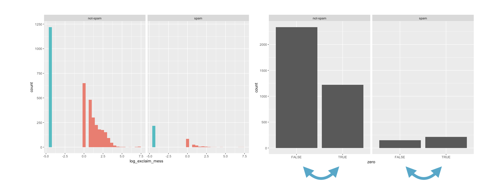

```{r setup, message = FALSE,warning = FALSE,	include = FALSE}
library(learnr)
library(tidyverse)
library(openintro)
library(grid)
library(gapminder)
library(emo)
library(patchwork)

knitr::opts_chunk$set(
  echo = FALSE,
  fig.width = 6,
  fig.asp = 0.618,
  fig.retina = 3,
  dpi = 300,
  out.width = "80%",
  fig.align = "center"
  )

options(max.print = 4000)

email <- email |>
  mutate(spam = if_else(spam == 0, "not spam", "spam"))

comics <- read_csv("data/comics.csv") |>
  filter(!is.na(appearances))
```

## Emails

### 

In this lesson, you'll get a chance to put to use what you know about exploratory data analysis in exploring a new dataset. 

The `email` dataset contains information on all of the emails received by a single email account in a single month. Each email is a case, so we see that this email account received 3,921 emails. Twenty-one different variables were recorded on each email, some of which are numerical, others are categorical. Of primary interest is the first column, a categorical variable indicating whether or not the email is `spam`. This was created by actually reading through each email individually and deciding if it looked like spam or not. The subsequent columns were easier to create. `to_multiple` is TRUE if the email was addressed to more than one recipient and FALSE otherwise. `image` is the number of images attached in the email. It's important that you have a full sense of what each of the variables mean, so you'll want to start your exercises by reading about them in the [data set description](https://www.openintro.org/data/index.php?data=email).

```{r email}
email
```

One of your guiding questions throughout this lesson is: what characteristics of an email are associated with it being spam? Numerical and graphical summaries are a great way of starting to answer that question.

### Spam and num_char

Is there an association between spam and the length of an email? You could imagine a story either way: 

* *Spam is more likely to be a short message tempting me to click on a link*, or
* *My normal email is likely shorter since I exchange brief emails with my friends all the time*.

Here, you'll use the `email` dataset to settle that question.

As you explore the association between spam and the length of an email, we'll use the **tidyverse** package for building data pipelines and visualisations and the **openintro** package that contains the `email`. These are loaded for you below.

```{r load-pkg, eval = FALSE, echo = TRUE}
library(tidyverse)
library(openintro)
```

Using the `email` dataset:

- Compute appropriate measures of the center and spread of `num_char` for both spam and not spam using `group_by()` and `summarize()`. No need to name the new columns created by `summarize()`.
- Construct side-by-side box plots to visualize the association between the same two variables. It will be useful to `mutate()` a new column containing a log-transformed version of `num_char`.
  
```{r ex1, exercise = TRUE}
# Compute summary statistics
email |>
  ___ |>
  ___

# Create plot
email |>
  mutate(log_num_char = ___) |>
  ggplot(aes(x = ___, y = log_num_char)) +
  ___
```

```{r ex1-hint-1}
# Compute summary statistics
email |>
  group_by(spam) |>
  ___

# Create plot
email |>
  mutate(log_num_char = ___) |>
  ggplot(aes(x = ___, y = log_num_char)) +
  ___
```

```{r ex1-hint-2}
# Compute summary statistics
email |>
  group_by(spam) |>
  summarize(median(num_char),
            IQR(num_char))

# Create plot
email |>
  mutate(log_num_char = ___) |>
  ggplot(aes(x = ___, y = log_num_char)) +
  ___
```

```{r ex1-hint-3}
# Compute summary statistics
email |>
  group_by(spam) |>
  summarize(median(num_char),
            IQR(num_char))

# Create plot
email |>
  mutate(log_num_char = log(___)) |>
  ggplot(aes(x = ___, y = log_num_char)) +
  ___
```

```{r ex1-solution}
# Compute summary statistics
email |>
  group_by(spam) |>
  summarize(median(num_char),
            IQR(num_char))

# Create plot
email |>
  mutate(log_num_char = log(num_char)) |>
  ggplot(aes(x = spam, y = log_num_char)) +
  geom_boxplot()
```

### Spam and num_char interpretation

```{r mc1-pre}
email |>
  mutate(log_num_char = log(num_char)) |>
  ggplot(aes(x = spam, y = log_num_char)) +
  geom_boxplot()
```

```{r mc1}
question("Which of the following interpretations of the plot is valid?",
  answer("The shortest email in this dataset was not spam.", message = "Nope, try again."),
  answer("The median length of not spam emails is greater than that of spam emails.", correct = TRUE, message = "Awesome!"),
  answer("The IQR of email length of spam is greater than that of not spam.", message =),
  allow_retry = TRUE,
  incorrect = "The greater the log-transformed `num_char` value is, the longer the email."
)
```

### Spam and !!!

Let's look at a more obvious indicator of spam: exclamation marks. `exclaim_mess` contains the number of exclamation marks in each message. Using summary statistics and visualization, see if there is a relationship between this variable and whether or not a message is spam.

Experiment with different types of plots until you find one that is the most informative. Recall that you've seen:

- Side-by-side box plots
- Faceted histograms
- Overlaid density plots

The `email` dataset is still available in your workspace.

- Calculate appropriate measures of the center and spread of `exclaim_mess` for both spam and not spam using `group_by()` and `summarize()`.
- Construct an appropriate plot to visualize the association between the same two variables, adding in a log-transformation step if necessary.
- If you decide to use a log transformation, remember that `log(0)` is `-Inf` in R, which isn't a very useful value! You can get around this by adding a small number (like `0.01`) to the quantity inside the `log()` function. This way, your value is never zero. This small shift to the right won't affect your results.

**Hint:** Take a look at how we calculated the summary statistics for `num_char` with the `median()` and `IQR()` functions in the `summarize()` call earlier.

```{r ex2, exercise = TRUE}
# Compute center and spread for exclaim_mess by spam


# Create plot for spam and exclaim_mess


```


```{r ex2-solution}
# Compute center and spread for exclaim_mess by spam
email |>
  group_by(spam) |>
  summarize(median(exclaim_mess),
            IQR(exclaim_mess))

# Create plot for spam and exclaim_mess
email |>
  mutate(log_exclaim_mess = log(exclaim_mess + 0.01)) |>
  ggplot(aes(x = log_exclaim_mess)) +
  geom_histogram() +
  facet_wrap(~ spam)

# Alternative plot: side-by-side box plots
email |>
  mutate(log_exclaim_mess = log(exclaim_mess + 0.01)) |>
  ggplot(aes(x = 1, y = log_exclaim_mess)) +
  geom_boxplot() +
  facet_wrap(~ spam)

# Alternative plot: Overlaid density plots
email |>
  mutate(log_exclaim_mess = log(exclaim_mess + .01)) |>
  ggplot(aes(x = log_exclaim_mess, fill = spam)) +
  geom_density(alpha = 0.3)
```

### Spam and !!! interpretation

```{r mc2-pre}
email |>
  mutate(log_exclaim_mess = log(exclaim_mess + .01)) |>
  ggplot(aes(x = log_exclaim_mess)) +
  geom_histogram(binwidth = 0.5) +
  facet_wrap(~spam)
```

```{r mc2}
question(
  "Which interpretation of these faceted histograms **is not** correct?
",
  answer("The most common value of `exclaim_mess` in both classes of email is zero (a `log(exclaim_mess)` of -4.6 after adding .01)."),
  answer("There are more cases of spam in this dataset than not spam.", correct = TRUE, message = "Well done!"),
  answer("Even after a transformation, the distribution of `exclaim_mess` in both classes of email is right-skewed."),
  answer("The typical number of exclamations in the not spam group appears to be slightly higher than in the spam group."),
  allow_retry = TRUE,
  incorrect = "There are fewer cases of spam in this dataset than not spam."
)
```

## Check-in 1

Let's review what you learned in the last several exercises. 

The box plots show the association between whether or not an email is spam and the length of the email, as measured by the log number of characters. In this dataset, the typical spam message is considerably shorter than the non-spam message, but there is still a reasonable amount of overlap in the two distributions of length.

When you looked at the distribution of spam and the number of exclamation marks used, you found that both distributions are heavily right skewed: there only a few instances of many exclamation marks being using and many many more of 0 or 1 being used. It also bucks the expectation that spam messages will be filled with emphatic exclamation marks to entice you to click on their links. If anything, here it's actually not spam that typically has more exclamation marks.

The dominant feature of the exclaim mess variable, though, is the large proportion of cases that report zero or on this log scale, -4.6 exclamation marks. This is a common occurrence in data analysis that is often termed "zero-inflation", and there are several common ways to think about those zeros.

```{r}
p1 <- email |> 
  mutate(log_num_char = log(num_char)) |> 
  ggplot(aes(y = spam , x = log_num_char)) +
  geom_boxplot()

p2 <- email |> 
  mutate(log_exclaim_mess = log(exclaim_mess+0.01)) |> 
  ggplot(aes(x = log_exclaim_mess)) +
  geom_histogram(binwidth = 0.5)+
  facet_wrap(~spam)

p1 / p2
```

### Zero inflation strategies

One approach says that there are two mechanisms going on: one generating the zeros and the other generating the non-zeros, so we will analyze these two groups separately. A simpler approach is to think of the variable as two level categorical variable (zero or not zero) and to treat it like a categorical variable.

```{r 9, fig.asp = 0.5, warning=FALSE}
email2 <- email |>
  mutate(zero = exclaim_mess == 1, log_exclaim_mess = log(exclaim_mess))

email2 |> 
  ggplot(aes(x = log_exclaim_mess, fill = zero)) +
  geom_histogram(binwidth = 0.5)+
  facet_wrap(~spam)+
  theme(legend.position = "none") 
```

### 

To do so we create a new variable, we'll call it `zero` and use it to color in our bar chart.

```{r facet, fig.asp = 0.5, echo=TRUE}
email |>
  mutate(zero = exclaim_mess == 0) |>
  ggplot(aes(x = zero, fill = zero)) +
  geom_bar() +
  facet_wrap(~spam)
```

In the resulting plot, yes, we've lost a lot of information. But it's become very clear that spam is more likely to contain no exclamation marks, while in regular mail (not spam mail), the opposite is true.

### Bar plot options

Another way that we've seen is using a stacked bar chart. For that plot, you move the second variable from the facet layer to the fill argument inside the aesthetics function. 

```{r, echo=TRUE}
email |>
  mutate(zero = exclaim_mess == 0) |>
  ggplot(aes(x = zero, fill = spam)) +
  geom_bar()
```

The other consideration you have to make is if you're more interested in counts or proportions. If the latter, you'll want to normalize the plot, which you can do by adding the position equals fill argument to `geom_bar()`. The result is a series of conditional proportions, where you're conditioning on whichever variable you're in.

```{r, echo=TRUE}
email |>
  mutate(zero = exclaim_mess == 0) |>
  ggplot(aes(x = zero, fill = spam)) +
  geom_bar(position = "fill")
```

### Collapsing levels

If it was difficult to work with the heavy skew of `exclaim_mess`, the number of images attached to each email (`image`) poses even more of a challenge. Run the following code to get a sense of its distribution: 

```{r count-images, exercise = TRUE}
email |>
  count(image)
```

Recall that this tabulates the number of cases in each category (so there were 3811 emails with 0 images, for example). Given the very low counts at the higher number of images, let's collapse `image` into a categorical variable that indicates whether or not the email had at least one image. In this exercise, you'll create this new variable and explore its association with spam.

Starting with `email`, form a continuous chain that links together the following tasks:

- Create a new variable called `has_image` that is `TRUE` where the number of images is greater than zero and `FALSE` otherwise.
- Create an appropriate plot with `email` to visualize the relationship between `has_image` and `spam`.

```{r ex3, exercise = TRUE}
# Create plot of proportion of spam by image
email |>
  mutate(has_image = ___) |>
  ggplot(aes(x = ___, fill = ___)) +
  geom_bar(position = ___)
```

```{r ex3-hint-1}
email |>
  mutate(has_image = image > 0) |>
  ggplot(aes(x = ___, fill = ___)) +
  geom_bar(position = ___)
```

```{r ex3-hint-2}
email |>
  mutate(has_image = image > 0) |>
  ggplot(aes(x = ___, fill = ___)) +
  geom_bar(position = "fill")
```

```{r ex3-solution}
# Create plot of proportion of spam by image
email |>
  mutate(has_image = image > 0) |>
  ggplot(aes(x = has_image, fill = spam)) +
  geom_bar(position = "fill")
```

### Image and spam interpretation

```{r mc3-pre}
email |>
  mutate(has_image = image > 0) |>
  ggplot(aes(x = has_image, fill = spam)) +
  geom_bar(position = "fill")
```

```{r mc3}
question(
  "Which of the following interpretations of the plot **is** valid?",
  answer("There are more emails with images than without images."),
  answer("Emails without images have a higher proportion that are spam than do emails with images.", correct = TRUE),
  answer("An email without an image is more likely to be not spam than spam.", correct = TRUE),
  allow_retry = TRUE,
  message = "Pay close attention to the legend and the axes of the plot."
)
```

### Data Integrity

In the process of exploring a dataset, you'll sometimes come across something that will lead you to question how the data were compiled. For example, the variable `num_char` contains the number of characters in the email, in thousands, so it could take decimal values, but it certainly shouldn't take negative values.

You can formulate a test to ensure this variable is behaving as we expect:

```{r logical, echo=TRUE}
email |>
  mutate(num_char_check = num_char < 0) |>
  select(num_char_check)
```

If the entire dataset was printed out, you'd see a long vector of 3921 logical values indicating for each case in the dataset whether that condition is `TRUE`. Here, the first 10 values all appear to be `FALSE`. To verify that *all* of the cases indeed have non-negative values for `num_char`, we can take the *sum* of this vector:

```{r num-logical, echo=TRUE}
email |>
  mutate(num_char_check = num_char < 0) |>
  summarize(sum(num_char_check))
```

This is a handy shortcut. When you do arithmetic on logical values, R treats `TRUE` as `1` and `FALSE` as `0`. Since the sum over the whole vector is zero, you learn that every case in the dataset took a value of `FALSE` in the test. That is, the `num_char` column is behaving as we expect and taking only non-negative values.

Consider the variables `image` and `attach`. You can read about them with `?email`, but the help file is ambiguous: do attached images count as attached files in this dataset?

Design a simple test to determine if images count as attached files. This involves creating a logical condition to compare the values of the two variables, then using `sum()` to assess every case in the dataset. Recall that the logical operators are `<` for *less than*, `<=` for *less than or equal to*, `>` for *greater than*, `>=` for *greater than or equal to*, and `==` for *equal to*.

```{r ex4, exercise = TRUE}
# Test if images count as attachments
email |>
  mutate(image_gt_attach = ___) |>
  summarize(___)
```

```{r ex4-hint-1}
# Test if images count as attachments
email |>
  mutate(image_gt_attach = (___ > ___)) |>
  summarize(___)
```

```{r ex4-hint-2}
# Test if images count as attachments
email |>
  mutate(image_gt_attach = (image > attach)) |>
  summarize(___)
```

```{r ex4-hint-3}
# Test if images count as attachments
email |>
  mutate(image_gt_attach = (image > attach)) |>
  summarize(sum(image_gt_attach))
```

```{r ex4-solution}
# Test if images count as attachments
email |>
  mutate(image_gt_attach = (image > attach)) |>
  summarize(sum(image_gt_attach))
```

### Answering questions with chains

When you have a specific question about a dataset, you can find your way to an answer by carefully constructing the appropriate chain of R code. For example, consider the following question: 

> "Within non-spam emails, is the typical length of emails shorter for those that were sent to multiple people?"

This can be answered with the following chain:

```{r chain, echo=TRUE}
email |>
   filter(spam == "not spam") |>
   group_by(to_multiple) |>
   summarize(median(num_char))
```
   
The code makes it clear that you are using `num_char` to measure the length of an email and `median()` as the measure of what is typical. If you run this code, you'll learn that the answer to the question is "yes": the typical length of non-spam sent to multiple people is a bit lower than those sent to only one person.

This chain concluded with summary statistics, but others might end in a plot; it all depends on the question that you're trying to answer.

Build a chain to answer each of the following questions, both about the variable `dollar`. 
- For emails containing the word "dollar", does the typical spam email contain a greater number of occurrences of the word than the typical non-spam email? Create a summary statistic that answers this question.
- If you encounter an email with greater than 10 occurrences of the word "dollar", is it more likely to be spam or not spam? Create a bar plot that answers this question.

```{r ex5, exercise = TRUE}
# Question 1
email |>
  filter(___) |>
  group_by(___) |>
  summarize(___)

# Question 2
email |>
  filter(___) |>
  ggplot(aes(x = ___)) +
  geom_bar()
```

```{r ex5-hint-1}
# Question 1
email |>
  filter(dollar > 0) |>
  group_by(___) |>
  summarize(___)

# Question 2
email |>
  filter(___) |>
  ggplot(aes(x = ___)) +
  geom_bar()
```

```{r ex5-hint-2}
# Question 1
email |>
  filter(dollar > 0) |>
  group_by(spam) |>
  summarize(___)

# Question 2
email |>
  filter(___) |>
  ggplot(aes(x = ___)) +
  geom_bar()
```

```{r ex5-hint-3}
# Question 1
email |>
  filter(dollar > 0) |>
  group_by(spam) |>
  summarize(median(dollar))

# Question 2
email |>
  filter(___) |>
  ggplot(aes(x = ___)) +
  geom_bar()
```

```{r ex5-hint-4}
# Question 1
email |>
  filter(dollar > 0) |>
  group_by(spam) |>
  summarize(median(dollar))

# Question 2
email |>
  filter(dollar > 10) |>
  ggplot(aes(x = ___)) +
  geom_bar()
```

```{r ex5-solution}
# Question 1
email |>
  filter(dollar > 0) |>
  group_by(spam) |>
  summarize(median(dollar))

# Question 2
email |>
  filter(dollar > 10) |>
  ggplot(aes(x = spam)) +
  geom_bar()
```

## Check-in 2

Let's revisit the exercise where you explored the association between whether an email has an image and whether or not its spam. 

### Spam and images

The plot you created was this bar chart of proportions. We want to emphasize an important, but subtle distinction when discussing proportions like this. This plot shows the proportions of spam or not spam within the subsets of emails that either have an image or do not. Said another way, they are conditioned on the has image variable. We get a slightly different story if we exchange the variables so that we condition on spam. Among emails that are spam, almost none of them have an image, while the proportion within non-spam is larger, but still less than 5%. If you're building a spam filter, a situation where you don't actually get to see the value of spam, it'd make more sense to think about conditioning on the has image variable.

```{r echo=TRUE}
email |>
  mutate(has_image = image == 1) |>
  ggplot(aes(x = has_image, fill = spam)) +
  geom_bar(position = "fill")
```

In this case, we can tell that this variable would be an awful spam filter by itself.

```{r echo=TRUE}
email |>
  mutate(has_image = image == 1) |>
  ggplot(aes(x = spam, fill = has_image)) +
  geom_bar(position = "fill")
```

### Ordering bars

When we're working with bar charts, you can often make them more readily interpretable if you give them a sensible ordering. Earlier, we collapsed all emails with at least one exclamation mark into a single level of a new two-level categorical variable.

That led to this bar chart, which was informative, but you might caused you to do a double-take when you first saw it. The plot on the left gets us used to seeing the bar for the zeroes on the left, while in the plot on the right, that bar is on the right side.

Let's go through how we would flip the ordering of those bars so that they agree with the plot on the left.

```{r switch-bars, out.width = "100%"}

```

The first step is to save the mutated categorical variable back into the dataset. The ordering of the bars isn't determined within the code for the plot, but in the way that R represents that variable. If we call levels on the new variable, it returns NULL. 

```{r echo=TRUE}
email <- email |>
  mutate(zero = exclaim_mess == 0)

levels(email$zero)
```

This is because this variable is actually a logical variable, not a factor. To set the ordering of the levels, let's make it a character variable and then change the order of its levels with the `fct_relevel()` function from the **forcats** package.

```{r echo=TRUE}
email <- email |>
  mutate(
    zero = if_else(exclaim_mess == 0, "TRUE", "FALSE"),
    zero = fct_relevel(zero, "TRUE", "FALSE")
    )
```

Now, when we go to make the plot with the same code, the order of the bars are as we wan them.

```{r echo=TRUE, fig.asp = 0.5}
email |>
  ggplot(aes(x = zero)) +
  geom_bar() +
  facet_wrap(~spam)
```

Here, we decided to order the bars so that it lined up with the structure of another plot. In other circumstances, you might use other criteria to choose the order including a natural ordering of the levels, arranging the bars in increasing or decreasing order of the height of the bars or alphabetical order, which is the default. In making this decision, you're thinking about emphasizing a particular interpretation of the plot and transitioning from purely exploratory graphics to expository graphics, where you seek to communicate a particular idea. This is a natural development as you continue along the process of your data analysis.

###  

OK, let's return back to the case study.

### What's in a number?

Turn your attention to the variable called `number`. Read more about it by pulling up the help file with `?email`.

To explore the association between this variable and `spam`, select and construct an informative plot. For illustrating relationships between categorical variables, you've seen

- Faceted bar plots
- Side-by-side bar plots
- Stacked and normalized bar plots.

Let's practice constructing a faceted bar plot.

- Construct a faceted bar plot of the association between `number` and `spam`.
- You should facet by `number`

```{r ex6, exercise = TRUE}
# Construct plot of
___(email, ___
  ___
  ___
```

```{r ex6-solution}
# Construct plot of number_reordered
ggplot(email, aes(x = spam)) +
  geom_bar() +
  facet_wrap(~ number)
```

### What's in a number interpretation

Below are two plots showing the relationship between `number` and `spam`.

```{r mc4-pre1, fig.asp = 0.5}
ggplot(email, aes(x = spam)) +
  geom_bar() +
  facet_wrap(~number)
```

```{r mc4-pre2, fig.asp = 0.5}
ggplot(email, aes(x = number)) +
  geom_bar() +
  facet_wrap(~spam)
```

```{r mc4}
question("Which of the following interpretations of the above plots is *not* valid?",
  answer("Given that an email contains a small number, it is more likely to be not spam"),
  answer("Given that an email contains no number, it is more likely to be spam.", correct = TRUE),
  answer("Given that an email contains a big number, it is more likely to be not spam."),
  answer("Within both spam and not spam, the most common number is a small one.", message = "Wrong!"),
  incorrect = "Given the kind of number an email contains, we can't say whether it'll be more or less likely to be spam.",
  allow_retry = TRUE
)
```

## Conclusion

In this tutorial on summarizing and visualizing data, our goal was to get you comfortable wading into a new dataset and provide a sense of the considerations and techniques needed to find the most important structure in your data.

### Pie chart vs. bar chart

We started with categorical data, often the domain of the pie chart, and hopefully convinced you that bar charts are a useful tool in finding associations between variables and comparing levels to one another. 

Let's take a look at a comparison of pie vs. bar charts for data on identities of superheroes from comics. We will be visualizing the following distribution. 

```{r}
comics |>
  count(id)
```

On the pie chart, it's quite difficult to tell how the `NA` group compares to the `Public` group, but this comparison is much easier in the bar plot. Also `Unknown` is barely visible in the bar plot and almost not there in the pie chart.

```{r out.width = "100%"}
p1 <- comics |>
  count(id) |>
  ggplot(aes(x = "", y = n, fill = id))+
  geom_bar(stat="identity", width = 1)+
  coord_polar("y", start = 0) +
  theme(axis.text = element_blank(),
        axis.ticks = element_blank(),
        panel.grid  = element_blank())

p2 <- ggplot(comics, aes(y = id, fill = id)) +
  geom_bar(show.legend = FALSE)

p1 + p2
```


### Faceting vs. stacking

We saw how the story can change, depending on if we're visualizing counts or proportions.

```{r out.width = "100%"}
p1 <- ggplot(comics, aes(y = id))+
  geom_bar() +
  facet_wrap(~align, nrow = 1, 
             labeller = labeller(align = label_wrap_gen(10))) +
  scale_x_continuous(guide = guide_axis(check.overlap = TRUE))

p2 <- ggplot(comics, aes(y = align, fill = id)) +
  geom_bar() 

p1 / p2
```

### Histogram

From there, we moved on to numerical data and a collection of graphical techniques that are important: the histogram, the density plot, and the box plot. Each has its strengths and weaknesses. This density plot smooths out some of the trends but is not overly susceptible to binwidth. The box plot provides information about outlying values. Both the density and the histogram (and not the boxplot) communicate whether the data are unimodal, bimodal, flat, or some other shape. 

Let's take a look at a distribution of the number of appearances of the super heroes.

```{r comics-appearances-hist, exercise = TRUE}
ggplot(comics, aes(x = appearances)) +
    geom_histogram(binwidth = 100)
```

Super skewed!

### Density plot

We can see this in the density plot as well.

```{r comics-appearances-density, exercise = TRUE}
ggplot(comics, aes(x = appearances)) +
    geom_density()
```

### Side-by-side box plots

Or make side-by-side box plots for comparison across levels of a categorical variable.

```{r comics-appearances-boxplot, exercise = TRUE}
ggplot(comics, aes(x = appearances, y = id)) +
  geom_boxplot()
```
    
### Center: mean, median, mode

In the third lesson, we discussed the common numerical measures of a distribution: measures of center, variability, shape, plus the presence of outliers. Our life was made much easier by using the combination of `group_by()` and `summarize()` to compute statistics on different groups within our data.

```{r, echo=TRUE}
comics |>
  group_by(id) |>
  summarise(
    mean = mean(appearances),
    median = median(appearances)
  )
```


## Submit


```{r encoder_ui, echo=FALSE}
hash_encoder_ui = {
    shiny::div("If you have completed this tutorial and are happy with all of your", 
        "solutions, please enter your identifying information, then click the button below to generate your hash",  
        textInput("name", "What's your name?"),
        textInput("studentID", "What is your student ID?"),
        renderText({ input$caption }), 
        )
}
```

```{r encoder_logic, echo=FALSE, context="server"}
is_server_context = function(.envir) {
  # We are in the server context if there are the follow:
  # * input - input reactive values
  # * output - shiny output
  # * session - shiny session
  #
  # Check context by examining the class of each of these.
  # If any is missing then it will be a NULL which will fail.

  inherits(.envir$input,   "reactivevalues") &
  inherits(.envir$output,  "shinyoutput")    &
  inherits(.envir$session, "ShinySession")
}

check_server_context = function(.envir) {
  if (!is_server_context(.envir)) {
    calling_func = deparse(sys.calls()[[sys.nframe()-1]])

    err = paste0(
      "Function `", calling_func,"`",
      " must be called from an Rmd chunk where `context = \"server\"`"
    )

    stop(err, call. = FALSE)
  }
}

encoder_logic = function(strip_output = FALSE) {
  p = parent.frame()
  check_server_context(p)

  # Make this var available within the local context below
  assign("strip_output", strip_output, envir = p)


  # Evaluate in parent frame to get input, output, and session
  local({
    encoded_txt = shiny::eventReactive(
      input$hash_generate,
      {
        # shiny::getDefaultReactiveDomain()$userData$tutorial_state
        state = learnr:::get_tutorial_state()
        shiny::validate(shiny::need(length(state) > 0, "No progress yet."))
        shiny::validate(shiny::need(nchar(input$name) > 0, "No name entered."))
        shiny::validate(shiny::need(nchar(input$studentID) > 0, "Please enter your student ID"))

        user_state = purrr::map_dfr(state, identity, .id = "label")
        user_state = dplyr::group_by(user_state, label, type, correct)
        user_state = dplyr::summarize(
          user_state,
          answer = list(answer),
          timestamp = dplyr::first(timestamp),
          .groups = "drop"
        )
        user_state = dplyr::relocate(user_state, correct, .before = timestamp)
        user_info = tibble(label = c("student_name", "student_id"), type="identifier", answer= as.list(c(input$name, input$studentID)), timestamp=format(Sys.time(), "%Y-%m-%d %H:%M:%S %Z", tz="UTC"))
          
        learnrhash::encode_obj(bind_rows(user_info, user_state))
      }
    )

    output$hash_output = shiny::renderText(encoded_txt())

  }, envir = p)
}
encoder_logic()
```

```{r encode, echo=FALSE}

learnrhash::encoder_ui(ui_before = hash_encoder_ui)
```

## Congratulations!

You have successfully completed Lesson 4 in Tutorial 2: Summarizing and visualizing data.

What's next?

`r emo::ji("ledger")` [Full list of tutorials supporting OpenIntro::Introduction to Modern Statistics](https://openintrostat.github.io/ims-tutorials/)

`r emo::ji("spiral_notepad")` [Tutorial 2: Exploratory data analysis](https://openintrostat.github.io/ims-tutorials/02-explore/)

`r emo::ji("one")` [Tutorial 2 - Lesson 1: Visualizing categorical data](https://openintro.shinyapps.io/ims-02-explore-01/)

`r emo::ji("two")` [Tutorial 2 - Lesson 2: Visualizing numerical data](https://openintro.shinyapps.io/ims-02-explore-02/)

`r emo::ji("three")` [Tutorial 2 - Lesson 3: Summarizing with statistics](https://openintro.shinyapps.io/ims-02-explore-03/)

`r emo::ji("four")` [Tutorial 2 - Lesson 4: Case study](https://openintro.shinyapps.io/ims-02-explore-04/)

`r emo::ji("open_book")` [Learn more at Introduction to Modern Statistics](http://openintro-ims.netlify.app/)
