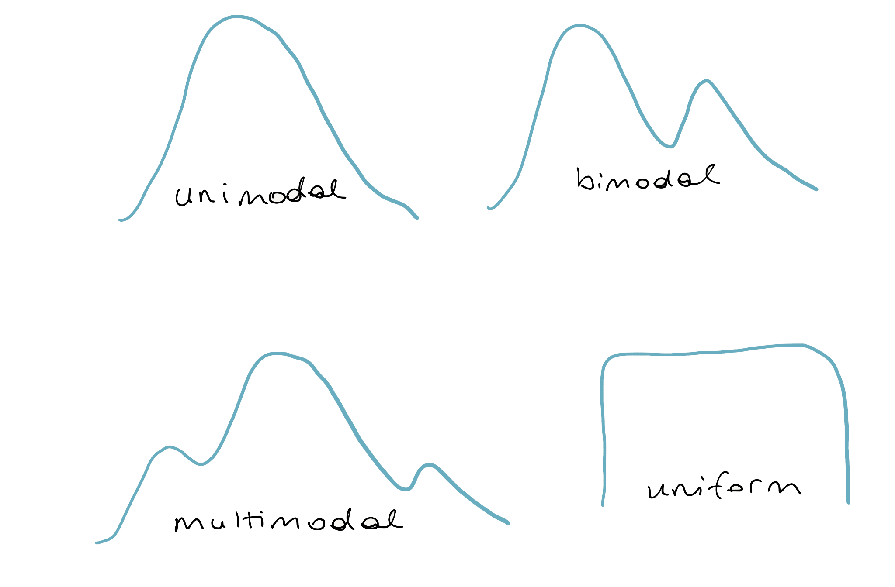

```{r setup, message = FALSE, warning = FALSE,	include = FALSE}
library(tidyverse)
library(openintro)
library(grid)
library(gapminder)
library(learnr)
library(gt)
library(stringr)
library(patchwork)
library(emo)

knitr::opts_chunk$set(warning = FALSE,
                      message = FALSE,
                      echo = FALSE, 
                      fig.height = 3,
                      fig.width = 5,
                      fig.align = "center")

life <- read_csv("data/life_exp.csv") %>% 
  mutate(
    state = str_to_title(state),
    county = str_to_title(county)
    )
```

## Measures of center

What do we mean by a typical observation? For example, it sounds perfectly fine to state a statistic like: the typical life expectancy in the US is 77.6 years, but where does that number come from? Before we answer that question, let's make this more concrete by introducing a dataset that we'll be working with throughout the lesson.

### County demographics

Researchers in public health have compiled data on the demographics of every county in the US. We see here that we have 4 variables: the state name, the county name, then the average life expectancy, and the median income. Let's focus on the life expectancy in the first 11 counties in this dataset, all in the state of Alabama.


```{r life}
life
```

### Center: mean

We're going to simplify and extract those 11 numbers by rounding the values of expectancy, when looking at the first 11 cases. The result, x, is 11 integers, all in the mid 70s.

OK, so let's ask the question again: what is a typical value for this set of 11 numbers?

```{r xlife}
x <- head(round(life$expectancy), 11)
x
```

```{r baseplot}

x <- head(round(life$expectancy), 11)
x <-  data.frame(x)

# base plot
ggplot(data = x, aes(x = x)) +
  geom_dotplot(binwidth = 0.75) +
  theme(legend.position = "none",
        axis.text.y = element_blank(),
        axis.title.y = element_blank())

x <- x$x
```

The most common answer is the mean, which is the sum of all of the observations divided by the number of observations. We learn that the mean life expectancy in these 11 counties is around 74.5 years. We can also use the built-in function mean.

```{r sum}
sum(x)/11
```

```{r mean}
mean(x)
```

If we visualize "x" as a dot plot, we can represent the mean as a vertical red line.
Another measure of "typical" or "center" is the median.

```{r plot1}

x <- head(round(life$expectancy), 11)
x <-  data.frame(x)
# base plot
ggplot(data = x, aes(x = x)) +
  geom_dotplot(binwidth = 0.75) +
  theme(legend.position = "none",
        axis.text.y = element_blank(),
        axis.title.y = element_blank())+
  geom_vline(xintercept = mean(x$x), color = "red", lwd = 1)

x <- x$x
```

### Center: mean, median

The median is the middle value in the sorted dataset. So if we sort x, the middle value is 74. We can also use the built-in function median. Let's draw that line in blue.

```{r sort, echo = TRUE}
sort(x)
```

```{r median}
median(x)
```

```{r plot2}

x <- head(round(life$expectancy), 11)
x <-  data.frame(x)
# base plot
ggplot(data = x, aes(x = x)) +
  geom_dotplot(binwidth = 0.75) +
  theme(legend.position = "none",
        axis.text.y = element_blank(),
        axis.title.y = element_blank())+
  geom_vline(xintercept = mean(x$x), color = "red", lwd = 1)+
  geom_vline(xintercept = median(x$x), color = "blue", lwd = 1)

```

### Center: mean, median, mode

The mode is the highest point on a plot of the distribution, while the median divides the dataset into a lower half and an upper half. In this case, those values are the same, but that is often not the case. The mean can be thought of as the balance point of the data and it tends to be drawn towards the longer tail of a distribution. This highlights an important feature of the mean: its sensitivity to extreme values. For this reason, when working with skewed distributions, the median is often a more appropriate measure of center.

A third measure of center is the mode.

The mode is simply the most common observation in the set. We can look at the dot plot and see that it is 74.

```{r plot3}

x <- head(round(life$expectancy), 11)
x <-  data.frame(x)
# base plot
ggplot(data = x, aes(x = x)) +
  geom_dotplot(binwidth = 0.75) +
  theme(legend.position = "none",
        axis.text.y = element_blank(),
        axis.title.y = element_blank())+
  geom_vline(xintercept = mean(x$x), color = "red", lwd = 1)+
  geom_vline(xintercept = median(x$x), color = "blue", lwd = 1)+
  geom_vline(xintercept = 74.1, color = "yellow", lwd = 1)

x <- x$x
```

 We can also run the table function to see that the greatest count was 3 at 74. Let's plot the mode right next to the median in gold.

```{r table}
table(x)
x
```

Now that we have some sensible measures of center, we can answer questions like: is the typical county life expectancy on the West Coast similar to the typical life expectancy in the rest of the country?

### Groupwise means

To answer this, we start by creating a new variable that will be TRUE if the state value is one of "California", "Oregon", or "Washington", and FALSE otherwise, and save it back to the original dataset.

```{r life-mutate}
life <- life %>%
  mutate(west_coast = state %in% c("California", "Oregon", "Washington"))
```

To compute groupwise means, we pipe the dataset into the `group_by()` function indicating that we'd like to establish groups based on our new variable. Then we can `summarize()` those groups, West Coast counties and non-West Coast counties, by taking the `mean()` and `median()` of their life expectancies. 

```{r life-groupby}
life %>%
  group_by(west_coast) %>%
  summarize(mean(expectancy),
            median(expectancy))
```

We learn that looking at both mean and median, the typical West Coast county has a slightly higher average life expectancy than counties not on the West Coast.

### Without `group_by()`

`group_by()` and `summarize()` form a powerful pair of functions, so let's look into how they work. Let's look at a slice of 8 rows in the middle of the dataset and remove the `group_by()` line.

```{r life-slice, eval = FALSE}
life %>%
  slice(240:247)
```

```{r life-slice-styled}
life %>%
  slice(240:247) %>%
  gt() %>%
  tab_style(
    style = list(
      cell_fill(color = COL[2,4]),
      cell_text(weight = "bold")
      ),
    locations = cells_body(
      columns = vars(expectancy))
  )
```

We can `summarize()` the expectancy variable by taking its `mean()` across all 8 rows.

```{r life-summarize}
life %>%
  slice(240:247) %>%
  summarize(mean(expectancy))
```

### With `group_by()`

If we add a line to `group_by()` `west_coast`, it's effectively breaking the dataset into two groups and calculating the `mean()` of the expectancy variable for each one separately.

```{r life-gr-sum-gt,}
life %>%
  slice(240:247) %>%
  gt() %>%
  tab_style(
    style = list(
      cell_fill(color = "lightyellow"),
      cell_text(weight = "bold")
      ),
    locations = cells_body(
      columns = vars(expectancy),
      rows = west_coast == TRUE)
  ) %>%
    tab_style(
    style = list(
      cell_fill(color = "lightcyan"),
      cell_text(weight = "bold")
      ),
    locations = cells_body(
      columns = vars(expectancy),
      rows = west_coast == FALSE)
  )
```

```{r life-gr-sum}
life %>%
  slice(240:247) %>%
  group_by(west_coast) %>%
  summarize(mean(expectancy))
```

As seen in the example above, `group_by()` and `summarize()` open up lots of possibilities for analysis, so let's get started.

###  

In the exercises for this lesson, you'll be working with similar data, but on a global scale, in the Gapminder data.

### Choice of center measure

The choice of measure for center can have a dramatic impact on what we consider to be a typical observation, so it is important that you consider the shape of the distribution before deciding on the measure.

```{r mc1-pre}
set.seed(38)
rskew <- rexp(1000, 1)
symm <- rnorm(1000)
d <- data.frame(x = c(rskew, symm),
                distribution = rep(c("A", "B"), c(1000, 1000)))

ggplot(d, aes(x = x, fill = distribution)) +
  geom_density(alpha = 0.3)
```

```{r mc1}
question("Which set of measures of central tendency would be *worst* for describing the two distributions shown here?",
  answer("A: mode, B: median", message = "Not quite, try again."),
  answer("A: mean, B: mode", correct = TRUE, message = "Nice! Let's continue to the next exercise."),
  answer("A: median, B: mean", message = "Incorrect, the median and mean look like they'd be good measures of central tendency."),
  answer("A: median, B: median", message = "Hmm, I think there's a worse choice."),
  allow_retry = TRUE
)
```

### Calculate center measures

Throughout this lesson, you will use data from `gapminder`, which tracks demographic data in countries of the world over time. To learn more about it, you can bring up the help file with `?gapminder`.

For this exercise, focus on how the life expectancy differs from continent to continent. This requires that you conduct your analysis not at the country level, but aggregated up to the continent level. This is made possible by the one-two punch of `group_by()` and `summarize()`, a very powerful syntax for carrying out the same analysis on different subsets of the full dataset.


- Create a dataset called `gap2007` that contains only data from the year 2007.
- Using `gap2007`, calculate the mean and median life expectancy for each continent. Don't worry about naming the new columns produced by `summarize()`.
- Confirm the trends that you see in the medians by generating side-by-side box plots of life expectancy for each continent.

```{r ex1, exercise = TRUE}
# Create dataset of 2007 data
gap2007 <- filter(___, ___)

# Compute groupwise mean and median lifeExp
gap2007 %>%
  group_by(___) %>%
  summarize(___,
            ___)

# Generate box plots of lifeExp for each continent
gap2007 %>%
  ggplot(aes(x = ___, y = ___)) +
  ___
```

<div id="ex1-hint">
**Hint:** In order to calculate the average life expectancy for each continent we need to first group the data by `continent` and then use the `summarize()` function to calculate the `mean()`.
</div>

```{r ex1-solution}
# Create dataset of 2007 data
gap2007 <- filter(gapminder, year == 2007)

# Compute groupwise mean and median lifeExp
gap2007 %>%
  group_by(continent) %>%
  summarize(mean(lifeExp),
            median(lifeExp))

# Generate box plots of lifeExp for each continent
gap2007 %>%
  ggplot(aes(x = continent, y = lifeExp)) +
  geom_boxplot()
```


## Measures of variability

How do you summarize the variability that you see in a set of numbers?

Let's consider the life expectancies in those first 11 counties in the US county-level dataset, which we saved to the object x. Most methods have us thinking about variability along the lines of how much the data is spread out from the center.

```{r x, echo = TRUE}
x
```

```{r plotdots}
x <- head(round(life$expectancy), 11)
x <- data.frame(x)
# base plot
ggplot(data = x, aes(x = x)) +
  geom_dotplot(binwidth = 0.75) +
  theme(legend.position = "none",
        axis.text.y = element_blank(),
        axis.title.y = element_blank())

x <- x$x
```


Let's choose to define the center by the mean and then, quantify the distance from the mean by taking the difference between each observation and that mean. 

```{r plotdots1}

x <- head(round(life$expectancy), 11)
x <-  data.frame(x)
# base plot
ggplot(data = x, aes(x = x)) +
  geom_dotplot(binwidth = 0.75) +
  theme(legend.position = "none",
        axis.text.y = element_blank(),
        axis.title.y = element_blank())+
  geom_vline(xintercept = mean(x$x), color = "red", lwd = 1)

x <- x$x
```

That results in 11 differences, some positive, some negative. 

```{r x1, echo = TRUE}
x - mean(x)
```

We'd like to reduce all of these differences to a single measure of variability, so let's add them up. This is R's scientific notation, saying the sum is -1.42 times 10 to the -14. That number is essentially zero.

```{r x2, echo = TRUE}
sum(x - mean(x))
```

Clearly something has gone wrong because we can tell that there is variability in this dataset, but our measure hasn't detected it. The problem is that the positives and negatives have canceled each other out. This is easy to fix: you can square each difference to get rid of the negatives.


```{r x3, echo = TRUE}
sum((x - mean(x))^2)
```


The new measure is better, but it has an undesirable property: it will just keep getting bigger the more data that you add. You can fix the unconstrained growth by dividing the new measure by the number of observations, 11. Now, the quantity is a useful measure found by the following steps: find the center of the data, then find the squared distance between the observations, and averaged across whole dataset.


```{r x4, echo = TRUE}
n <- 11
sum((x - mean(x))^2)/n
```


If you change the n to an n-1, you are left with what's called the *sample variance*, one of the most useful measures of the spread of a distribution. 

```{r x5, echo = TRUE}
sum((x - mean(x))^2)/(n - 1)
```

In R, this statistic is wrapped up into the function `var()` for *variance*.


```{r x6, echo = TRUE}
var(x)
```


Another useful measure is the square root of the *sample variance*, which is called the *sample standard deviation* or just `sd()` in R. The convenient thing about the sample standard deviation is that, once computed, it is in the same units as the original data. In this case we can say that the standard deviation of the 11 counties' life expectancies is 1.69 years. 


```{r sd, echo = TRUE}
sd(x) # Standard deviation
```

By comparison, the variance of this sample is 2.87 years squared, which is a unit that we have no real intuition about.

```{r var, echo = TRUE}
var(x) # Variance
```

There are two more measures of spread that are good to know about. The interquartile range, or IQR, is the distance between the two numbers that cut-off the middle 50% of your data. This should sound familiar from the discussion of box plots: the height of the box is exactly the IQR. We can either get the first and third quartiles from the summary function and take their difference or we can use the built-in IQR function.

```{r summary, echo = TRUE}
summary(x)
```


```{r iqr, echo = TRUE}
IQR(x) # Interquartile range
```

The final measure is simply the range of the data: the distance between the maximum and the minimum. max and min are indeed functions in R, but you can also use the nested diffrangex.

```{r difran, echo = TRUE}
diff(range(x)) # Range
```

For any dataset, you can compute all four of these statistics, but which ones are the most meaningful? The most commonly used in practice is the standard deviation, so that's often a good place to start. But what happens if the dataset has some extreme observations?

```{r img14}
x[2] <- 97
x_new <- x
```

Let's say that Baldwin County, Alabama, the county with a life expectancy around 78, instead had a life expectancy of 97. 

```{r x-new,}
x_new <- data.frame(x_new)

# base plot
ggplot(data = x_new, aes(x = x)) +
  geom_dotplot(binwidth = 0.75) +
  theme(legend.position = "none",
        axis.text.y = element_blank(),
        axis.title.y = element_blank())

x_new <- x_new$x_new
```

```{r out}
x_new
```

If you recompute the variance and the standard deviation, you see that they've both gone through the roof. These measures are sensitive to extreme values in the same way that the mean is as a measure of center. 


```{r new2}
sd(x_new) 
```

```{r new3}
var(x_new) 
```

If you recompute the range, it will certainly increase because it is completely determined by the extreme values. For this reason, the range is not often used.

```{r new4, eval=FALSE, include=TRUE}
diff(range(x_new))
```


If you recompute the IQR, however, you see that it hasn't budged. Because that observation is still the highest, the quartiles didn't move. This reveals a good reason for using the IQR: in situations where your dataset is heavily skewed or has extreme observations.

```{r new5}
IQR(x_new) 
```

### Choice of spread measure

The choice of measure for spread can dramatically impact how variable we consider our data to be, so it is important that you consider the shape of the distribution before deciding on the measure.

```{r mc2-pre}
rskew <- rexp(1000, 1)
symm <- rnorm(1000)
d <- data.frame(x = c(rskew, symm),
                distribution = rep(c("A", "B"), c(1000, 1000)))

ggplot(d, aes(x = x, fill = distribution)) +
  geom_density(alpha = 0.3)
```


```{r mc2}
question("Which set of measures of spread would be *worst* for describing the two distributions shown here?",
  answer("A: IQR, B: IQR", message = "Given the two distributions, the IQR seems like it'd be okay."),
  answer("A: SD, B: IQR", message = "Hm, not quite. Try again!"),
  answer("A: Variance, B: Range", correct = TRUE, message = "Good job!" ), 
  incorrect = "A has a high peak and its width is large. What does that tell you about its variance?",
  allow_retry = TRUE
)
```

### Calculate spread measures

Let's extend the powerful `group_by()` and `summarize()` syntax to measures of spread. If you're unsure whether you're working with symmetric or skewed distributions, it's a good idea to consider a robust measure like IQR in addition to the usual measures of variance or standard deviation.


The `gap2007` dataset that you created in an earlier exercise is available in your workspace.

- For each continent in `gap2007`, summarize life expectancies using the `sd()`, the `IQR()`, and the count of countries, `n()`. No need to name the new columns produced here. The `n()` function within your `summarize()` call does not take any arguments.
- Graphically compare the spread of these distributions by constructing overlaid density plots of life expectancy broken down by continent.

```{r ex2-setup}
gap2007 <- filter(gapminder, year == 2007)
```

```{r ex2, exercise = TRUE}
# Compute groupwise measures of spread
gap2007 %>%
  group_by(___) %>%
  summarize(___,
            ___,
            ___)

# Generate overlaid density plots
gap2007 %>%
  ggplot(aes(x = ___, fill = ___)) +
  geom_density(alpha = 0.3)
```

```{r ex2-hint-1}
# Compute groupwise measures of spread
gap2007 %>%
  group_by(continent) %>%
  summarize(___,
            ___,
            ___)

# Generate overlaid density plots
gap2007 %>%
  ggplot(aes(x = ___, fill = ___)) +
  geom_density(alpha = 0.3)
```

```{r ex2-hint-2}
# Compute groupwise measures of spread
gap2007 %>%
  group_by(continent) %>%
  summarize(sd(___),
            IQR(___),
            n())

# Generate overlaid density plots
gap2007 %>%
  ggplot(aes(x = ___, fill = ___)) +
  geom_density(alpha = 0.3)
```

```{r ex2-hint-3}
# Compute groupwise measures of spread
gap2007 %>%
  group_by(continent) %>%
  summarize(sd(lifeExp),
            IQR(lifeExp),
            n())

# Generate overlaid density plots
gap2007 %>%
  ggplot(aes(x = lifeExp, fill = ___)) +
  geom_density(alpha = 0.3)
```

```{r ex2-solution}
# Compute groupwise measures of spread
gap2007 %>%
  group_by(continent) %>%
  summarize(sd(lifeExp),
            IQR(lifeExp),
            n())

# Generate overlaid density plots
gap2007 %>%
  ggplot(aes(x = lifeExp, fill = continent)) +
  geom_density(alpha = 0.3)
```

### Choose measures for center and spread

Consider the density plots shown here. What are the most appropriate measures to describe their centers and spreads? In this exercise, you'll select the measures and then calculate them.


Using the shapes of the density plots, calculate the most appropriate measures of center and spread for the following:

- The distribution of life expectancy in the countries of the Americas. Note you'll need to apply a filter here.
- The distribution of country *populations* across the entire `gap2007` dataset.

```{r ex3-setup}
gap2007 <- filter(gapminder, year == 2007)

p1 <- gap2007 %>%
  filter(continent == "Americas") %>%
  ggplot(aes(x = lifeExp)) +
  geom_density() +
  ggtitle("Life Expectancy in the Americas")

# skewed
p2 <- gap2007 %>%
  ggplot(aes(x = pop)) +
  geom_density() +
  ggtitle("Country-Level Population")

p1 + p2
```

```{r ex3, exercise = TRUE}
# Compute stats for lifeExp in Americas
gap2007 %>%
  filter(___) %>%
  summarize(___,
            ___)

# Compute stats for population
gap2007 %>%
  summarize(___,
            ___)
```

```{r ex3-hint-1}
# Compute stats for lifeExp in Americas
gap2007 %>%
  filter(continent == "___") %>%
  summarize(mean(___),
            sd(___))

# Compute stats for population
gap2007 %>%
  summarize(median(___),
            IQR(___))
```

```{r ex3-hint-2}
# Compute stats for lifeExp in Americas
gap2007 %>%
  filter(continent == "Americas") %>%
  summarize(mean(___),
            sd(___))

# Compute stats for population
gap2007 %>%
  summarize(median(___),
            IQR(___))
```

```{r ex3-hint-3}
# Compute stats for lifeExp in Americas
gap2007 %>%
  filter(continent == "Americas") %>%
  summarize(mean(lifeExp),
            sd(lifeExp))

# Compute stats for population
gap2007 %>%
  summarize(median(___),
            IQR(___))
```

```{r ex3-solution}
# Compute stats for lifeExp in Americas
gap2007 %>%
  filter(continent == "Americas") %>%
  summarize(mean(lifeExp),
            sd(lifeExp))

# Compute stats for population
gap2007 %>%
  summarize(median(pop),
            IQR(pop))
```

## Shape and transformations

There are generally four characteristics of distributions that are of interest. The first two we've covered already: the center and the spread or variability of the distribution. The third is the shape of the distribution, which can be described in terms of the modality and the skew.

### Modality

The modality of a distribution is the number of prominent humps that show up in the distribution. If there is a single mode, as in a bell-curve, it's called unimodal. If there are two prominent modes, it's called bimodal. If it has three modes or more, the convention is to refer to it as multimodal. There is one last case: when there is no distinct mode. Because the distribution is flat across all values, it is referred to as uniform.

The other aspect to the shape of the distribution concerns its skew.

```{r modalities, out.width=600}

```

### Skew

If a distribution has a long tail that stretches out to the right, it's referred to as "right-skewed".

If that long tail stretches out to the left, its referred to as "left-skewed".If you have trouble remembering which is which, just remember that the skew is where the long tail is.

If neither tail is longer than the other, the distribution is called "symmetric".

```{r skewness, out.width=600}
knitr::include_graphics("images/skewness.png")
```

### Shape of income

Let's compare the distributions of median personal income at the county level on the West Coast and in the rest of the country to see what shape these distributions take. There are several plot types that we could use here. Let's use an overlaid density plot by putting income along the x axis, filling the two curves with color according to whether or not they're on the West Coast, then adding a density later and specifying an alpha level of.3. This allows the colors to be somewhat transparent so that we can see where they overlap.

The plot that results shows two curves, the blue representing the West Coast distribution and the pink representing counties not on the West Coast. Each distribution has a single prominent mode, so we can say that each distribution is unimodal. You might argue that the little bump around 100,000 dollars is a second mode, but we're generally looking for larger-scale structure than that.

It's difficult to compare these distributions because they are both heavily right-skewed, that is, there are a few counties in each group that have very high incomes. One way to remedy this is to construct a plot of a transformed version of this variable.


```{r inc}
ggplot(life, aes(x = income, fill = west_coast)) +
  geom_density(alpha = 0.3)
```


Since income has a heavy right skew, either the square-root or log-transform will do a good job of drawing in the right tail and spreading out the lower values so that we can see what's going on. We can perform the transformation by wrapping income in the log function, which will take the natural log. The result is a picture that's a bit easier to interpret: the typical income in West Coast counties is indeed greater than that in the rest of the country and the second very small mode of high income counties in the West Coast is not present in the other distribution.

```{r inc2}
ggplot(life, aes(x = income, fill = west_coast)) +
  geom_density(alpha = 0.3)
```

###  

Let's turn to some exercises to explore the shape of the Gapminder data.

### Describe the shape

To build some familiarity with distributions of different shapes, consider the four that are plotted here. 

```{r mr3-pre}
set.seed(32)
x1 <- density(rnorm(30, 0.6, 0.2))
x2 <- density(rnorm(30, 0.6, 0.2))
x3 <- density(rexp(30, 1))    #rgamma(30, 1, 2))
x4 <- density(c(rnorm(15, 1, 0.1), rnorm(15, 1.7, 0.1)))
y <- c(x1$y, x2$y, x3$y, x4$y)
x <- c(x1$x, x2$x, x3$x, x4$x)

d <- data.frame(x = x,
                y = y,
                group = rep(LETTERS[1:4], each = 512))
ggplot(d, aes(x = x, y = y)) +
  geom_line() +
  facet_wrap(~group, scales = "free") +
  theme(axis.title.x = element_blank(),
        axis.text.x = element_blank(),
        axis.ticks.x = element_blank(),
        axis.title.y = element_blank(),
        axis.text.y = element_blank(),
        axis.ticks.y = element_blank())
```


```{r mc3}
question("Which of the following options does the best job of describing their shape in terms of modality and skew/symmetry?",
  answer("A: bimodal symmetric; B: unimodal symmetric; C: unimodal left-skewed, D: bimodal right-skewed."),
  answer("A: unimodal left-skewed; B: unimodal symmetric; C: unimodal right-skewed, D: bimodal symmetric.", correct = TRUE),
  answer("A: unimodal right-skewed; B: unimodal left-skewed; C: unimodal left-skewed; D: bimodal symmetric."),
  answer("A: unimodal left-skewed; B: bimodal symmetric; C: unimodal right-skewed, D: unimodal symmetric."),
  allow_retry = TRUE,
  incorrect = "A useful mnemonic is the ' skew is where there is few'. That is, a left-skewed distribution has fewer values in its left tail."
)
```

### Transformations

Highly skewed distributions can make it very difficult to learn anything from a visualization. Transformations can be helpful in revealing the more subtle structure. 

Here you'll focus on the population variable, which exhibits strong right skew, and transform it with the natural logarithm function (`log()` in R).

Using the `gap2007` data:

- Create a density plot of the population variable.
- Mutate a new column called `log_pop` that is the natural log of the population and
save it back into `gap2007`.
- Create a density plot of your transformed variable.

```{r ex4-setup}
gap2007 <- filter(gapminder, year == 2007)
```

```{r ex4, exercise = TRUE}
# Create density plot of old variable
gap2007 %>%
  ggplot(aes(x = ___)) +
  ___

# Transform the skewed pop variable
gap2007 <- gap2007 %>%
  mutate(___)

# Create density plot of new variable
gap2007 %>%
  ggplot(aes(x = ___)) +
  ___
```

```{r ex4-hint-1}
# Create density plot of old variable
gap2007 %>%
  ggplot(aes(x = ___)) +
  geom_density()

# Transform the skewed pop variable
gap2007 <- gap2007 %>%
  mutate(___)

# Create density plot of new variable
gap2007 %>%
  ggplot(aes(x = ___)) +
  ___
```

```{r ex4-hint-2}
# Create density plot of old variable
gap2007 %>%
  ggplot(aes(x = pop)) +
  geom_density()

# Transform the skewed pop variable
gap2007 <- gap2007 %>%
  mutate(___ = log(___))

# Create density plot of new variable
gap2007 %>%
  ggplot(aes(x = ___)) +
  ___
```

```{r ex4-hint-3}
# Create density plot of old variable
gap2007 %>%
  ggplot(aes(x = pop)) +
  geom_density()

# Transform the skewed pop variable
gap2007 <- gap2007 %>%
  mutate(log_pop = log(pop))

# Create density plot of new variable
gap2007 %>%
  ggplot(aes(x = log_pop)) +
  ___
```

```{r ex4-solution}
# Create density plot of old variable
gap2007 %>%
  ggplot(aes(x = pop)) +
  geom_density()

# Transform the skewed pop variable
gap2007 <- gap2007 %>%
  mutate(log_pop = log(pop))

# Create density plot of new variable
gap2007 %>%
  ggplot(aes(x = log_pop)) +
  geom_density()
```


## Outliers

We've discussed three different aspects of a distribution that are important to note

### Characteristics of a distribution

- Center

- Variability

- Shape

- Outliers


When conducting an exploratory data analysis: center, variability, and shape. A fourth and final thing to look for are outliers. These are observations that have extreme values far from the bulk of the distribution. They're often very interesting cases, but they're also good to know about before proceeding with more formal analysis.

We saw some extreme values when we plotted the distribution of income for counties on the West Coast. What are we to make of this blip of counties? One thing we can do is display the data using a box plot.   In the graph below there is an additional layer that flips the coordinates so that the boxes are stretched out horizontally to make the comparison with the density plot more direct.  

What we see is interesting: the box plot flags many counties as outliers, both along the West Coast but in the rest of the country as well. So why was the blip more apparent on the West Coast? It has to do with sample size. There are far fewer counties in the West Coast group, so these few outliers had an outsized effect on the density plot. In the case of the non-West Coast group, there are many many more counties that ended up washing out the effect of the outliers in the density plot.

```{r coast-income, fig.width = 7}
p1 <- ggplot(life, aes(x = income, fill = west_coast)) +
  geom_density(alpha = 0.5)

p2 <- ggplot(life, aes(x = income, y = west_coast, color = west_coast)) +
  geom_boxplot(alpha = 0.5)

p1 + p2
```

### Indicating outliers

It is often useful to consider outliers separately from the rest of the data, so lets create a new column to store whether or not a given case is an outlier. This requires that we mutate a new column called is outlier that is TRUE if the income is greater than some threshold and FALSE otherwise. In this case, we've picked a threshold for outliers as counties with incomes greater than $75,000.

We can actually inspect the outliers by filtering the dataset to only include outliers, then arrange them in decreasing order of income. Because we didn't save this dplyr chain back to an object, it just prints the sorted outliers to the console. We learn that the top income county is actually Teton County, in Wyoming, and that three of the top ten counties are in Texas and two are in Nebraska.

We can also try rebuilding the density plots without the outliers.

```{r io, echo = TRUE}
life <- life %>%
  mutate(is_outlier = income > 75000)
life %>%
  filter(is_outlier) %>%
  arrange(desc(income))
```


### Plotting without outliers

To do this, we form a dplyr chain where the first step is to filter on those counties that are not outliers. Recall that is outlier is a vector of TRUEs and FALSEs. Those values can be reversed using an exclamation point, forming a variable that indicates the counties that are not outliers. We then pipe this into the same code we used for the overlaid density plots.

The result is a plot that focuses much more on the body of the distribution. You can contrast that with the original plot, which was dominated by the strong right skew caused by the extreme values. Note that neither of these plots is right or wrong, but they tell different stories of the structure in this data, both of which are valuable.

```{r life3}
life %>%
  filter(!is_outlier) %>%  
  ggplot(aes(x = income, fill = west_coast)) +
  geom_density(alpha = 0.3)
```

```{r img20}
ggplot(life, aes(x = income, fill = west_coast)) +
  geom_density(alpha = 0.3)
```

###  

OK, now it's your turn to practice exploring outliers in the Gapminder data.

### Identify outliers

Consider the distribution, shown here, of the life expectancies of the countries in Asia. The box plot identifies one clear outlier: a country with a notably low life expectancy. Do you have a guess as to which country this might be? Test your guess in the console using either `min()` or `filter()`, then proceed to building a plot with that country removed.


`gap2007` is still available in your workspace.

- Apply a filter so that it only contains observations from Asia, then create a new variable called `is_outlier` that is `TRUE` for countries with life expectancy less than 50. Assign the result to `gap_asia`.
- Filter `gap_asia` to remove all outliers, then create another box plot of the remaining life expectancies.

```{r ex5-setup}
gap2007 <- filter(gapminder, year == 2007)

gap2007 %>%
  filter(continent == "Asia") %>%
  ggplot(aes(x = 1, y = lifeExp)) +
  geom_boxplot()
```

```{r ex5, exercise = TRUE}
# Filter for Asia, add column indicating outliers
gap_asia <- ___ %>%
  filter(___) %>%
  mutate(___ = ___)

# Remove outliers, create box plot of lifeExp
gap_asia %>%
  filter(___) %>%
  ggplot(aes(x = ___, y = ___)) +
  ___
```

```{r ex5-hint-1}
# Filter for Asia, add column indicating outliers
gap_asia <- gap2007 %>%
  filter(continent == "Asia") %>%
  mutate(___ = lifeExp < 50)

# Remove outliers, create box plot of lifeExp
gap_asia %>% 
  filter(___) %>%
  ggplot(aes(x = ___, y = ___)) +
  ___
```

```{r ex5-hint-2}
# Filter for Asia, add column indicating outliers
gap_asia <- gap2007 %>%
  filter(continent == "Asia") %>%
  mutate(is_outlier = lifeExp < 50)

# Remove outliers, create box plot of lifeExp
gap_asia %>% 
  filter(!is_outlier) %>%
  ggplot(aes(x = ___, y = ___)) +
  ___
```

```{r ex5-solution}
# Filter for Asia, add column indicating outliers
gap_asia <- gap2007 %>%
  filter(continent == "Asia") %>%
  mutate(is_outlier = lifeExp < 50)

# Remove outliers, create box plot of lifeExp
gap_asia %>% 
  filter(!is_outlier) %>%
  ggplot(aes(x = 1, y = lifeExp)) +
  geom_boxplot()
```

## Congratulations!

You have successfully completed Lesson 3 in Tutorial 2: Summarizing and visualizing data.

What's next?

`r emo::ji("ledger")` [Full list of tutorials supporting OpenIntro::Introduction to Modern Statistics](https://openintrostat.github.io/ims-tutorials/)

`r emo::ji("spiral_notepad")` [Tutorial 2: Getting Started with Data](https://openintrostat.github.io/ims-tutorials/02-summarizing-and-visualizing-data/)

`r emo::ji("one")` [Tutorial 2 - Lesson 1: Visualizing categorical data](https://openintro.shinyapps.io/ims-02-summarizing-and-visualizing-data-01/)

`r emo::ji("one")` [Tutorial 2 - Lesson 2: Visualizing numerical data](https://openintro.shinyapps.io/ims-02-summarizing-and-visualizing-data-02/)

`r emo::ji("one")` [Tutorial 2 - Lesson 3: Summarizing with statistics](https://openintro.shinyapps.io/ims-02-summarizing-and-visualizing-data-03/)

`r emo::ji("one")` [Tutorial 2 - Lesson 4: Case study](https://openintro.shinyapps.io/ims-02-summarizing-and-visualizing-data-04/)

`r emo::ji("open_book")` [Learn more at Introduction to Modern Statistics](http://openintro-ims.netlify.app/)
