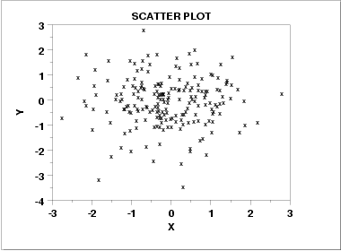
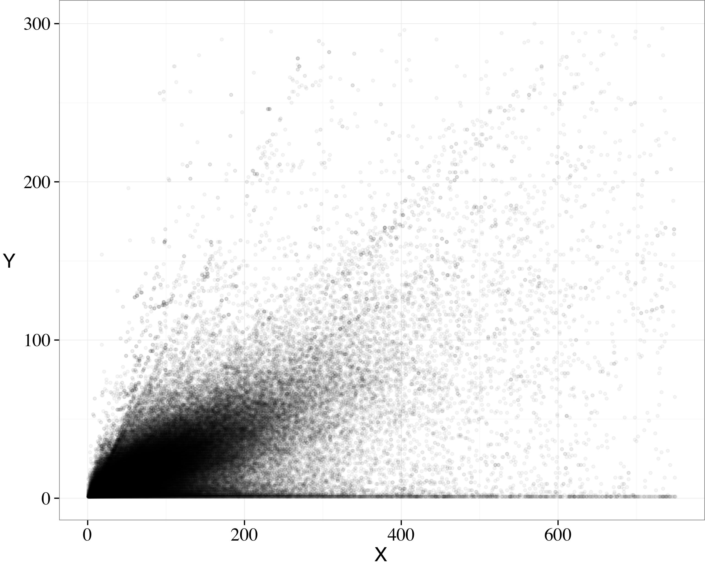

```{r setup, message=FALSE, warning=FALSE, include=FALSE}
library(learnr)
library(tidyverse)
library(openintro)
library(grid)
library(png)
library(emo)

knitr::opts_chunk$set(echo = FALSE,
                      fig.align = "center",
                      fig.height = 3,
                      fig.width = 5,
                      message = FALSE,
                      warning = FALSE)

tutorial_options(exercise.eval = FALSE)
```


## Welcome

In the previous tutorials, you've learned how to describe the distribution of a single variable. This is useful, but in many cases, what we are more interested in is understanding the relationship between two variables.

## Visualizing two variables

In particular, in these tutorials you will learn techniques for characterizing and quantifying the relationship between two numeric variables.

In a statistical model, we generally have one variable that is the output and one or more variables that are the inputs. We will refer to the output variable as the response and we will denote it with the letter $y$. In other disciplines or contexts, you may hear this quantity called the dependent variable. More generally, the response variable is a quantity that we think might be related to the input or explanatory variable in some way. In other fields, these can be called "independent" or "predictor" variables. We typically denote any explanatory variables with the letter $x$. In these tutorials, we will focus on the case of a single explanatory variable. In the next tutorials, however, we will allow for several explanatory variables.

- *Response* variable
    - a.k.a. $y$, dependent
    - A variable you wish to understand
- *Explanatory* variable
    - a.k.a. $x$, independent, predictor
    - A variable you think might be related to the response
- Both variables are (continuous) *numerical*

### Graphical representations

Just as you learned to visualize the distribution of one variable with a histogram or density plot, statisticians have developed a commonly used framework for visualizing the relationship between two numeric variables: the scatterplot. The scatterplot has been called the most "[generally useful invention in the history of statistical graphics](http://onlinelibrary.wiley.com/doi/10.1002/jhbs.20078/abstract)." It is a simple two-dimensional plot in which the two coordinates of each dot represent the values of two variables measured on a single observation.

- Put the response variable on vertical axis
- Put the explanatory variable on horizontal axis

```{r 2, echo=FALSE}
ggplot(data = bdims, aes(y = wgt, x = hgt)) +
  scale_x_continuous("Explanatory Variable", labels = NULL) +
  scale_y_continuous("Response Variable", labels = NULL)
```

<!--
> TODO: do you want geom_point() here? Also, are you intentionally using a different dataset than you do below?  Can we connect to the next plot?
-->

By convention, we always put the response variable on the vertical, or $y$-axis, and the explanatory variable on the horizontal, or $x$-axis.

### Scatterplot

In `ggplot`, we bind the `x` and `y` aesthetics to our explanatory and response variables, and then use the `geom_point()` function to actually draw the points. Here we can see a scatterplot of the total length of a possum's body as a function of the length of its tail.

```{r 3, echo = TRUE}
ggplot(data = possum, aes(y = total_l, x = tail_l)) +
  geom_point()
```

Note that the axes have been labeled with the names of the variables automatically, based on the names of the variables in the dataset.

### Labeling Axes

For clarity, it is important to give your axes human-readable labels. We can do that with the `labs()` function. It is a good data visualization practice to include any necessary units in axis labels!

```{r 4, message=FALSE, echo = TRUE}
ggplot(data = possum, aes(y = total_l, x = tail_l)) +
  geom_point() +
  labs(x = "Length of Possum Tail (cm)",
       y = "Length of Possum Body (cm)")
```

Note that the names of the axis labels must include quotations (`""`), indicating to `ggplot()` that these are names **not** variables.

## Connection to boxplots

Since you already know how a boxplot can illustrate the relationship between a numerical response variable and a **categorical** explanatory variable, it may be helpful to think of a scatterplot as a continuous generalization of side-by-side boxplots.

- Can think of boxplots as scatterplots...
    - ...but with discretized explanatory variable

- The `cut()` function allows for us to discretize a continuous variable
    - Choose appropriate number of "boxes"

### Discretized scatterplot

We can connect these ideas by discretizing our explanatory variable. This can be achieved in R using the `cut()` function, which takes a numeric variable and chops it into a specified number of discrete chunks. The `breaks` argument specifies the number of chunks.

Here, we are creating a new variable named `tail_cut` from using the `cut()` function on the original `tail_l` variable. We are then saving this new variable back into the original `possum` dataset.

```{r cut, echo = TRUE}
possum <- possum %>%
  mutate(tail_cut = cut(tail_l, breaks = 5))
```

We can then plot the relationship between total length and the new `tail_cut` variable. What we've done is gathered up all of the data points in these bins and plotted them in a vertical line, rather than at their original tail length value.

```{r 5, message=FALSE, echo = TRUE}
ggplot(data = possum, aes(y = total_l, x = tail_cut)) +
  geom_point()
```

### Boxplot

This type of dotplot is not standard. What is more common is to create side-by-side boxplots of the distribution of these points. If we change from `geom_point()` to `geom_boxplot()`, we will get this more "standard" visualization.

```{r 6, message=FALSE, echo = TRUE}
ggplot(data = possum, aes(y = total_l, x = tail_cut)) +
  geom_boxplot()
```

A notable attribute of a scatterplot is its connection to the raw data. A boxplot, however, is wholly disconnected from the raw data, only plotting summaries of the data. To re-forge this connection, we can overlay the original data points on top of the boxplots, by simply adding another layer to our `ggplot()`!

Let's walk through a few parts of the code below. First, we have added `alpha = 0` to the boxplots, so that the "outlier" points are not plotted (we don't want to plot them twice). The `geom_jitter()` function instead of the `geom_point()` function, since the points are being plotted on top of each other. You can think of jittering as taking the overplotted graph (where the points are overlapping) and giving it a tiny shake. Jittering will move the points a little bit side-to-side and up-and-down, but their position from the original plot won't dramatically change.

```{r boxdot, echo = TRUE}
ggplot(data = possum, aes(y = total_l, x = tail_cut)) +
  geom_boxplot(outlier.alpha = 0) +
  geom_jitter(color = "sky blue", width = 0.2)
```

Now we can see the original data points, and the boxplots of the different tail length groups. We can see that overall, as the median tail length increases the body length also increases.

Now it's time for you to get some practice making scatterplots.

## Your turn!

Scatterplots are the most common and effective tools for visualizing the relationship between two numeric variables.

The `ncbirths` dataset is a random sample of 1,000 cases taken from a larger dataset collected in 2004. Each case describes the birth of a single child born in North Carolina, along with various characteristics of the child (e.g. birth weight, length of gestation, etc.), the child's mother (e.g. age, weight gained during pregnancy, smoking habits, etc.) and the child's father (e.g. age). You can view the help file for these data by running `?ncbirths` in the console.

Using the `ncbirths` dataset, use `ggplot()` to make a scatterplot visualizing the relationship between birth weight and length of gestation of these babies.

```{r ex1, exercise = TRUE}
# Scatterplot of weight vs. weeks

```

<div id="ex1-hint">
**Hint:** In the `ggplot()` map `weeks` to the `x` aesthetic and `weight` to the `y` aesthetic. Remember to use the `ncbirths` dataset!
</div>

```{r ex1-solution}
# Scatterplot of weight vs. weeks
ggplot(data = ncbirths, aes(x = weeks, y = weight)) +
  geom_point()
```

### Boxplots as discretized/conditioned scatterplots

If it is helpful, you can think of boxplots as scatterplots for which the variable on the x-axis has been discretized.

The `cut()` function takes two arguments: the continuous variable you want to discretize and the number of `breaks` that you want to make in that continuous variable in order to discretize it.

First, we will make a new variable, named `weeks_cut`, which discretizes the original `weeks` variable. We will use the `cut()` function, specifying four breaks.

```{r cut-ex, exercise = TRUE}
ncbirths <- ncbirths %>%
  mutate(weeks_cut = cut(___, breaks = ___))
```

<div id="cut-ex-hint">
**Hint:** The `cut()` function should cut the `weeks` variable into 4 different categories.
</div>

Next, using the new `weeks_cut` variable, make side-by-side boxplots illustrating how the birth weight of these babies varies according to the number of weeks of gestation.

```{r ex2-setup}
ncbirths <- ncbirths %>%
  mutate(weeks_cut = cut(weeks, breaks = 4))
```

```{r ex2, exercise = TRUE}
ggplot(data = ___,
       aes(x = ___, y = ___)) +
  ___
```

<div id="ex2-hint">
**Hint:** In the plot `x` is `weeks_cut` and `y` is `weight` from the `ncbirths` dataset.
</div>

```{r ex2-solution}
ggplot(data = ncbirths,
       aes(x = , y = weight)) +
  geom_boxplot()
```

## Characterizing bivariate relationships

Scatterplots can reveal characteristics of the relationship between two variables. Any patterns--and deviations from those--we see in these plots could give us some insight into the nature of the underlying phenomenon. Specifically, we look for four things: form, direction, strength, and unusual observations.

- Form (e.g. linear, quadratic, non-linear)

- Direction (e.g. positive, negative)

- Strength (how much scatter/noise? sometimes characterized as weak or strong relationship.)

- Unusual observations

Form is the overall shape made by the points. Since we are learning about linear regression, our primary concern is whether the form is linear or non-linear.

Direction is either positive or negative. Here, the question is whether the two variables tend to move in the same direction--that is, when one goes up, the other tends to go up--or in the opposite direction. We'll see examples of both in just a minute.

The strength of the relationship is governed by how much scatter is present. Do the points seem to be clustered together in a way that suggests a close relationship? Or are they very loosely organized?

Finally, any points that don't fit the overall pattern, or simply lie far away, are important to investigate. These unusual observations, often called "outliers," may be erroneous measurements, or they can be exceptions that help clarify the general trend. Either way, these observations can be revealing, and we'll learn more about them later in these tutorials.

### Examples of scatterplots

We're going to look at a bunch of scatterplots that we found "in the wild" and talk about what we see, so that you can start to build some experience in interpreting them.

You can continue this exercise on your own by doing a Google image search for "scatterplot."

As we work through these, please keep in mind that much of what we are doing at this stage involves making judgment calls. This is part of the nature of statistics, and while it can be frustrating--especially as a beginner. However, it is an inescapable part of doing statistics. For better or for worse, statistics is not a field where there is one right answer. There are of course an infinite number of indefensible claims, but many judgments are open to interpretation.

### Sign Legibility

Here we see a negative, slightly non-linear relationship between sign legibility and driver age. This makes sense to me, since people's eyesight tends to get worse as they age. We would characterize the strength of this relationship as moderately strong, since the pattern seems to be pervasive. There doesn't seem to be any outliers here.

This relationship may be a good candidate for fitting a regression model, but the curvature in the relationship deserves attention. Indeed, very few relationships will be truly "linear," but it is our responsibility to assess if it is reasonable to assume if a relationship is linear "enough."

```{r img1, echo=FALSE, out.width=300}
knitr::include_graphics("http://bolt.mph.ufl.edu/files/2012/07/images-mod2-scatterplot4.gif
")
```

### NIST

Conversely, in this next scatterplot we see little evidence of any relationship at all. The direction is neither positive nor negative, nor is there any clearly identifiable form. Any perceived relationship would be exceptionally weak.

```{r img2, echo=FALSE, out.width=300}
# http://www.itl.nist.gov/div898/handbook/eda/section3/gif/scatplo1.gif

```

### Non-linear

In this "Example Scatter Plot" we see another clear, non-linear relationship. In this case, the direction is negative for negative values of $x$, but positive for positive values of $x$. The points are clustered fairly close together, so the relationship is fairly strong. The point in the upper-left-hand corner might be considered an outlier - since it is far from the other points - but it doesn't represent a break from the overall pattern of the points.

```{r img4, echo=FALSE, out.width=300}
# http://www.reynwar.net/ben/docs/matplotlib/scatterplot.png
knitr::include_graphics("images/scatterplot.png")
```

### Fan shape

In this scatterplot, we see what is known as a "fan shape." The direction is certainly positive, but the spread of the points increases dramatically as we get further from the origin. We will discuss this type of pattern more later, but it is an indicator of "non-constant" variance, as the variability (spread) in the y-values increases for larger values of x. Generally, log-transformations do a great job of "taming" these fan shapes, allowing for us to use a linear regression model on the transformed data.

```{r img5, echo=FALSE, out.width=300}
# http://i.stack.imgur.com/c4afj.jpg

```

In these next exercises, you'll get more practice creating scatterplots and characterizing what you see in them.

## Your turn!

Creating scatterplots is simple and they are so useful that it is worthwhile to expose yourself to many examples. Over time, you will gain familiarity with the types of patterns that you see. You will begin to recognize how scatterplots can reveal the nature of the relationship between two variables.

In this exercise, and throughout this lesson, we will be using several datasets listed below. These data are available through the **openintro** package.

- The `mammals` dataset contains information about 39 different species of mammals, including their body weight, brain weight, gestation time, and a few other variables.
- The `mlbbat10` dataset contains batting statistics for 1,199 Major League Baseball players during the 2010 season.
- The `bdims` dataset contains body girth and skeletal diameter measurements for 507 physically active individuals.
- The `smoking` dataset contains information on the smoking habits of 1,691 citizens of the United Kingdom.

To see more thorough documentation on any of these datasets, use the `?` or `help()` functions.

First, using the `mammals` dataset, create a scatterplot illustrating how the brain weight (`brain_wt`) of a mammal varies as a function of its body weight (`body_wt`).

```{r ex3, exercise = TRUE}
# Mammals scatterplot

```

```{r ex3-hint-1}
ggplot(data = mammals, aes(x = ___, y = ___)) +
  geom_point()
```

```{r ex3-hint-2}
ggplot(data = mammals, aes(x = body_wt, y = ___)) +
  geom_point()
```

```{r ex3-solution}
ggplot(data = mammals, aes(x = body_wt, y = brain_wt)) +
  geom_point()
```

###

Next, using the `mlbbat10` dataset, create a scatterplot illustrating how the slugging percentage (`slg`) of a player varies as a function of his on-base percentage (`obp`).


```{r ex4, exercise = TRUE}

```

```{r ex4-hint-1}
ggplot(data = mlbbat10, aes(x = ___, y = ___)) +
  geom_point()
```

```{r ex4-hint-2}
ggplot(data = mlbbat10, aes(x = obp, y = ___)) +
  geom_point()
```


```{r ex4-solution}
ggplot(data = mlbbat10, aes(x = obp, y = slg)) +
  geom_point()
```

###

Next, using the `bdims` dataset, create a scatterplot illustrating how a person's weight (`wgt`) varies as a function of their height (`hgt`). Once you've accomplished this, use color to separate individuals by `sex`.

*Hint*: You'll need to coerce `sex` into a factor using the `as.factor()` function.

```{r ex5, exercise = TRUE}

```

```{r ex5-hint-1}
ggplot(data = bdims, aes(x = ___, y = ___, color = ___)_ +
  geom_point()
```

```{r ex5-hint-2}
ggplot(data = bdims, aes(x = hgt, y = ___, color = ___)_ +
  geom_point()
```

```{r ex5-hint}
ggplot(data = bdims, aes(x = hgt, y = wgt, color = ___)_ +
  geom_point()
```

```{r ex5-solution}
ggplot(data = bdims, aes(x = hgt, y = wgt, color = as.factor(sex))) +
  geom_point()
```

###

Finally, using the `smoking` dataset, create a scatterplot illustrating how the amount that a person smokes on weekdays (`amt_weekdays`) varies as a function of their age (`age`).

```{r ex6, exercise = TRUE}

```

```{r ex6-hint-1}
ggplot(data = smoking, aes(x = ___, y = ___)) +
  geom_point()
```

```{r ex6-hint-2}
ggplot(data = smoking, aes(x = age, y = ___)) +
  geom_point()
```

```{r ex6-solution}
ggplot(data = smoking, aes(x = age, y = amt_weekdays)) +
  geom_point()
```

### Characterizing scatterplots

This scatterplot shows the relationship between the poverty rates and high school graduation rates of counties in the United States.

```{r plotmc1}
ggplot(data = county_complete, aes(x = hs_grad_2010, y = poverty_2010)) +
  geom_point()
```

```{r mc1}
question("Describe the form, direction, and strength of this relationship",
  answer("Linear, positive, strong", message = "Is it positive?"),
  answer("Linear, negative, weak", message = "Is it weak? Looks moderately strong to me."),
  answer("Linear, negative, moderately strong", correct = TRUE, message = "The scatterplot shows a linear and negative relationship!"),
  answer("Non-linear, negative, strong", message = "Is it non-linear?"),
  allow_retry = TRUE
)
```


## Transformations

The relationship between two variables may not be linear. In these cases we can sometimes see strange and even inscrutable patterns in a scatterplot of the data. Sometimes there really is no meaningful relationship between the two variables. Other times, a careful *transformation* of one or both of the variables can reveal a clear relationship.

Recall the bizarre pattern that you saw in the scatterplot between brain weight and body weight among mammals in a previous exercise. Can we use transformations to clarify this relationship?

**ggplot2** provides several different mechanisms for viewing transformed relationships. The `coord_trans()` function transforms the coordinates of the plot. Alternatively, the `scale_x_log10()` and `scale_y_log10()` functions perform a log (base-10) transformation of each axis. Note the differences in the appearance of the axes.

Let's practice using both methods to transform our previous scatterplot by taking the log (base-10) of both the body weight (`body_wt`) and brain weight (`brain_wt`) variables.

Fist, let's use the `coord_trans()` function to modify our original scatterplot, so that both the x- and y-axis is on a `"log10"` scale.

```{r ex7, exercise = TRUE}
 ggplot(data = mammals, aes(x = body_wt, y = brain_wt)) +
  geom_point() +
  ___(x = "log10", y = "log10")
```

<div id="ex7-hint">
**Hint:** The function you want to use is `coord_trans()`!
</div>

```{r ex7-solution}
ggplot(data = mammals, aes(x = body_wt, y = brain_wt)) +
  geom_point() +
  coord_trans(x = "log10", y = "log10")
```

###

Now, let's use the `scale_x_log10()` and `scale_y_log10()` functions to achieve the same effect but with different axis labels and grid lines.

```{r ex8, exercise = TRUE}
ggplot(data = mammals, aes(x = body_wt, y = brain_wt)) +
  geom_point() +
  ___ +
  ___
```

<div id="ex8-hint">
**Hint:** Add in the `scale_x_log10()` and `scale_y_log10()` to transform the x- and y-axis!
</div>

```{r ex8-solution}
ggplot(data = mammals, aes(x = body_wt, y = brain_wt)) +
  geom_point() +
  scale_x_log10() +
  scale_y_log10()
```

## Outliers

Observations that don't seem to fit with the rest of points may be considered "outliers." There isn't a universal, hard-and-fast definition of what constitutes an "outlier," but they are often easy to spot in a scatterplot.

In this scatterplot, we consider the relationship between the number of home runs hit by Major League baseball players in 2010 and the number of bases they stole. Home runs are a measure of batting power, while stolen bases are a measure of footspeed. It is not surprising that we see a negative relationship here, since power and speed are generally complementary skills.

```{r homerun}
ggplot(data = mlbbat10, aes(x = stolen_base, y = home_run)) +
  geom_point()
```

Since both variables here are integer-valued, several of the observations have the same coordinates, and thus the corresponding points are plotted on top of one another. This can misrepresent the data!

### Add transparency

To combat this, we can add transparency to the points, using the `alpha` argument. This allows for us to see that the overplotting occurs where the darker dots are.

```{r hr_alpha, echo = TRUE}
ggplot(data = mlbbat10, aes(x = stolen_base, y = home_run)) +
  geom_point(alpha = 0.5)
```

### Add some jitter

Another approach is add some jitter to the plot, just like what we did with the boxplots!

```{r hr_jitter}
ggplot(data = mlbbat10, aes(x = stolen_base, y = home_run)) +
  geom_jitter(alpha = 0.5)
```

### Identifying outliers

In this plot, there are two points that stand out as potential outliers: the one in the lower-right hand corner, and the one at the very top. We will discuss later in the course how to handle these outliers, but for now, it is enough to simply identify them and investigate them. In this case, we can use the `filter()` function to identify those players with **at least** 60 stolen bases or **at least** 50 home runs. As it turns out, the player in the lower-right hand corner is Juan Pierre, who is one of the speediest and least powerful hitters in recent memory. The player at the top is Jose Bautista, one of the game's most revered sluggers.

```{r}
mlbbat10 %>%
  filter(stolen_base > 60 | home_run > 50) %>%
  select(name, team, position, stolen_base, home_run)
```

See if you can find the outliers in the next exercise.

## Your turn!

In Chapter 5, we will discuss how outliers can affect the results of a linear regression model and how we can deal with them. For now, it is enough to simply identify them and note how the relationship between two variables may change as a result of removing outliers.

Recall that in the baseball example earlier in the lesson, most of the points were clustered in the lower left corner of the plot, making it difficult to see the general pattern of the majority of the data. This difficulty was caused by a few outlying players whose on-base percentages (OBPs) were exceptionally high. These values are present in our dataset only because these players had very few batting opportunities.

Both OBP and SLG are known as *rate* statistics, since they measure the frequency of certain events over time (as opposed to their *count*). In order to compare these rates sensibly, it makes sense to include only players with a reasonable number of opportunities, so that these observed rates have the chance to approach what we might expect from a player's long-run rate.

In Major League Baseball, batters qualify for the batting title only if they have 3.1 plate appearances per game. This translates into roughly 502 plate appearances in a 162-game season. The `mlbbat10` dataset does not include plate appearances as a variable, but we can use at-bats (`at_bat`)--which constitute a subset of plate appearances--as a proxy.

Let's make a scatterplot of the same relationship as before, but only for players with at least 200 at-bats. To do this, we'll need to carry out the following steps:

1. Create a new dataset named `ab_gt_200` which contains only the players who had at least 200 at-bats.
2. Using `ab_gt_200`, create a scatterplot for `slg` as a function of `obp`.

```{r ex9, exercise = TRUE}
# Filter for AB greater than or equal to 200
ab_gt_200 <- mlbbat10 %>%
  filter(___)

# Scatterplot of slg vs. obp
ggplot(ab_gt_200, aes(x = ___, y = ___)) +
  geom_point()
```

```{r ex9-hint-1}
mlbbat10 %>%
  filter(at_bat >= 200)
```

```{r ex9-hint-2}
ggplot(ab_gt_200, aes(x = obp, y = slg)) +
  geom_point()
```

```{r ex9-solution}
# Filter for AB greater than or equal to 200
ab_gt_200 <- mlbbat10 %>%
  filter(at_bat >= 200)

# Scatterplot of slg vs. obp
ggplot(ab_gt_200, aes(x = obp, y = slg)) +
  geom_point()
```

###

Notice, there is still one player who seems to be far from the rest of the data.

Use `filter()` to find the observation (row) that corresponds to the player from the `ab_gt_200` dataset with whose OBP was below 0.200.

```{r ex10-setup}
ab_gt_200 <- mlbbat10 %>%
  filter(at_bat >= 200)
```

```{r ex10, exercise = TRUE}
ab_gt_200 %>%
  filter(___)
```

```{r ex10-solution}
# Identify the outlying player
ab_gt_200 %>%
  filter(obp < 0.2)
```


## Congratulations!

You have successfully completed Lesson 1 in Tutorial 3: Introduction to Linear Models.

What's next?

`r emo::ji("ledger")` [Full list of tutorials supporting OpenIntro::Introduction to Modern Statistics](https://openintrostat.github.io/ims-tutorials/)

`r emo::ji("spiral_notepad")` [Tutorial 3: Introduction to Linear Models Data](https://openintrostat.github.io/ims-tutorials/03-introduction-to-linear-models/)

`r emo::ji("one")` [Tutorial 3 - Lesson 1: Visualizing two variables](https://openintro.shinyapps.io/ims-03-introduction-to-linear-models-01/)

`r emo::ji("two")` [Tutorial 3 - Lesson 2: Correlation](https://openintro.shinyapps.io/ims-03-introduction-to-linear-models-02/)

`r emo::ji("three")` [Tutorial 3 - Lesson 3: Simple linear regression](https://openintro.shinyapps.io/ims-03-introduction-to-linear-models-03/)

`r emo::ji("four")` [Tutorial 3 - Lesson 4: Interpreting regression models](https://openintro.shinyapps.io/ims-03-introduction-to-linear-models-04/)

`r emo::ji("five")` [Tutorial 3 - Lesson 5: Model fit](https://openintro.shinyapps.io/ims-03-introduction-to-linear-models-05/)

`r emo::ji("open_book")` [Learn more at Introduction to Modern Statistics](http://openintro-ims.netlify.app/)
