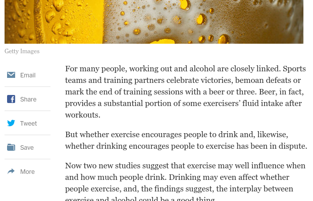
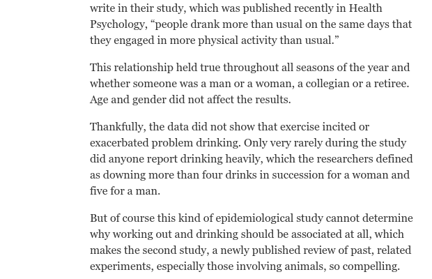
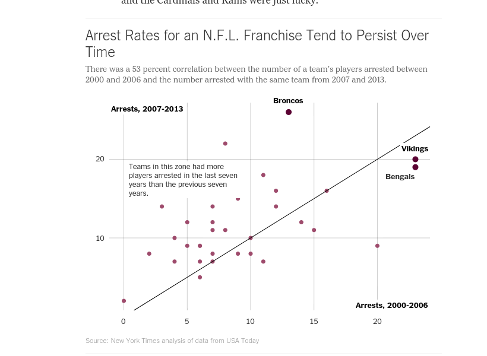
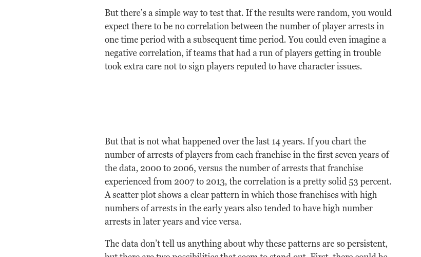
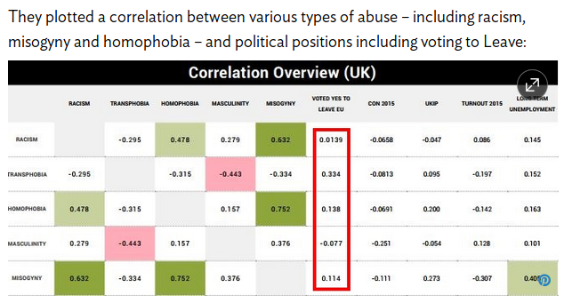

```{r setup, message=FALSE, warning=FALSE, include=FALSE}
library(learnr)
library(tidyverse)
library(openintro)
library(emo)

knitr::opts_chunk$set(echo = FALSE, 
                      fig.align = "center", 
                      fig.height = 3, 
                      fig.width = 5,
                      message = FALSE, 
                      warning = FALSE)

anscombe <- datasets::anscombe %>%
  mutate(id = 1:nrow(.)) %>%
  gather(key = "key", value = "val", -id) %>%
  separate(key, into = c("variable", "set"), sep = 1) %>%
  spread(key = variable, value = val)
```

## Strength of bivariate relationships

### Correlation

In the previous lesson, we learned how to visually assess the *strength* of the relationship between two variables by examining a scatterplot. Correlation is a way to quantify the strength of that linear relationship.  

The correlation coefficient is a number between -1 and 1 that indicates the strength of a linear relationship. The *sign* of the correlation coefficient corresponds to the direction---positive or negative. The *magnitude* of the correlation corresponds to the strength--values near 0 are weaker and values near 1 or -1 are stronger. 

### Near perfect correlation

A correlation coefficient of close to 1 indicates near-perfect positive correlation, as we see in this plot.

```{r plot}
n <- 100
# http://blog.revolutionanalytics.com/2016/08/simulating-form-the-bivariate-normal-distribution-in-r-1.html
# Target parameters for univariate normal distributions
mu1 <- 1
s1 <- 2
mu2 <- 1
s2 <- 8

# Parameters for bivariate normal distribution
mu <- c(mu1, mu2) # Mean 

cor_plot <- function(n, rho) {
  sigma <- matrix(c(s1^2, s1*s2*rho, s1*s2*rho, s2^2), 2) # Covariance matrix
  sim <- MASS::mvrnorm(n, mu = mu, Sigma = sigma) %>%
    as.data.frame() %>%
    rename(y = V1, x = V2)
  ggplot(sim, aes(x = x, y = y)) + 
    geom_point() + 
    geom_text(x = -20, y = 8, label = round(cor(sim$x, sim$y), 3), size = 10) + 
    ylim(c(-10, 10)) + xlim(c(-25, 25))
}

cor_plot(n, rho = 0.95)
```

### Strong

For scatterplots in which the points are more spread out, the value of the correlation coefficient is lower. Here we see a scatterplot with correlation that we might call "strong." 

```{r cor}
cor_plot(n, rho = 0.8)
```

### Moderate

Values of the correlation coefficient that are closer to 0.5 might be considered "moderate"...

```{r cor2}
cor_plot(n, rho = 0.5)
```

### Weak

...while values of the correlation coefficient closer to 0.2 might be considered "weak."

```{r cor3}
cor_plot(n, rho = 0.2)
```

### Zero

If there really is no linear relationship between the two variables, then the correlation coefficient will be close to zero. This scatterplot shows two variables that are relatively uncorrelated. Note how knowing one of the $x$ values gives you very little information about where the corresponding value of $y$ will be. 

```{r cor4}
cor_plot(n, rho = 0)
```

### Negative

Alternatively, when the direction of the relationship is negative, the value of the correlation coefficient is negative as well.

```{r cor5}
cor_plot(n, rho = -0.5)
```

## Non-linear relationships

It is crucial to remember that the correlation coefficient only captures the strength of the *linear* relationship between two variables. It is quite common to encounter variables that are strongly-related, but in a non-linear way. Blindly computing and reporting the correlation between such variables **does not** yield meaningful results. 

```{r plot2}
sim <- data.frame(x = rnorm(n)) %>%
  mutate(y = 5 * x^2 + rnorm(n, sd = 1))

ggplot(sim, aes(x = x, y = y)) + 
  geom_point() + 
  geom_text(x = 0, y = 20, 
            label = round(cor(sim$x, sim$y), 3), size = 10)
```

Here, this scatterplot shows a clear, quadratic relationship. To simply interpret the low correlation coefficient as evidence that $x$ and $y$ are unrelated would be plainly incorrect. Here, $x$ and $y$ are very closely related---just not in a linear fashion.

### Non-linear correlation

Here is an example of real data from a 10-mile run. The pace of the top 10 finishers in each age group are plotted against their age. Note how the relationship between the pace and age is non-linear: 25-year-olds tend to actually be faster than 20-year-olds, but as people age beyond their thirties, they tend to get slower. This pattern is present for both men and women. 

```{r code1}
run09 %>%
  filter(div_place <= 10) %>%
  ggplot(aes(x = age, y = pace, color = gender)) + 
  geom_point()
```

```{r}
cor <- run09 %>%
  filter(div_place <= 10) %>%
  summarize(cor(pace, age)) %>% 
  pull()
```

The value of the correlation coefficient here is about `r round(cor, 3)`, but we have some intuitive sense that pace and age are more closely-related than the figure indicates. 

## Calculating the Correlation 

There are several different ways that correlation can be defined in statistics, but by far the most common is the **Pearson Product-Moment correlation**. When we say "correlation" we are talking about this value, but you should be aware that there are other definitions that are preferred in other contexts. 

$$
  r(x,y) = \frac{Cov(x, y)}{\sqrt{S_{XX} \cdot S_{YY}}} 
$$


Correlation is most often denoted with the letter $r$, and it is a function of two variables, most commonly $x$ and $y$. The definition in terms of covariance and the sums of squares of $x$ and $y$, which we haven't defined.

### Pearson Product-Moment Correlation

This is an alternative definition using only $x$'s and $y$'s, and their means: $\bar{x}$ and $\bar{y}$. In the denominator, we see the sums of the squared deviations in both $x$ and $y$. In the numerator, we see a sum of terms involving both $x$ and $y$. In fact, each term in the sum is the area of the rectangle with corners at each data point $(x_i, y_i)$ and the means $(\bar{x}, \bar{y})$. So in some sense this is measuring the deviation from the mean in both $x$ and $y$.  


$$
  r(x,y) = \frac{\sum_{i=1}^n (x_i - \bar{x})(y_i - \bar{y})}{\sum_{i=1}^n (x_i - \bar{x})^2 \cdot \sum_{i=1}^n (y_i - \bar{y})^2}
$$

In practice, we always have R do these computations for us, so memorizing the formulas is not important. For some of you, the mathematics may help reinforce your intuition about what the correlation coefficient actually measures. For others, it may simply be a confusing blur of symbols that can be safely ignored. Having a solid conceptual understanding of correlation is the important thing.

You'll get some more practice computing correlation in the next set of exercises. 

### 

```{r mc1}
question("In a scientific paper, three correlations are reported with the following values:
         (1) -0.395
         (2) 1.827
         (3) 0.738",
  answer("(1) is invalid.", message = "(1) is valid"),
  answer("(2) is invalid.", correct = TRUE, message ="Right! Correlation coefficients are always between -1 and 1." ),
  answer("(3) is invalid.", message = "(3) is perfectly valid!"),
  answer("Both (1) and (2) are invalid.", message = "Wrong!"),
  answer("Both (2) and (3) are invalid.", message = "Incorrect!"),
  allow_retry = TRUE
)
```

### Understanding correlation sign

```{r mc2}
question("In a scientific paper, three correlations are reported: 0.582, 0.134, -0.795. Which of these values represents the strongest correlation?",
  answer("0.582"),
  answer("0.134", message = "This is the weakest correlation."),
  answer("-0.795", correct = TRUE, message = "Indeed, the closer to 1 or -1, the stronger the correlation."),
  answer("Can't tell!"),
  allow_retry = TRUE
)
```


### Using R to compute the correlation

The `cor()` function will compute the Pearson product-moment correlation between variables, `x` and `y`. Since this quantity is symmetric with respect to `x` and `y`, it doesn't matter which order you input the variables. 

At the same time, the `cor()` function is very conservative when it encounters missing data (e.g. `NA`s). If either variable (x or y) has missing values, the `cor()` function will output `NA`. 

The `use` argument allows you to override the default behavior of returning `NA` whenever any of the values encountered is `NA`. Setting the `use` argument to `"pairwise.complete.obs"` allows `cor()` to compute the correlation coefficient for those observations where the values of `x` and `y` are both not missing.

### 

In this exercise, you will use `cor()` to compute the correlation between the birthweight of babies (`weight`) in the `ncbirths` dataset and their mother's age (`mage`). There is no missing data in either variable, so you can use the plain `cor()` function to do this. 

Then, you will use `cor()` to compute the correlation between the birthweight (`weight`) and the number of weeks of gestation (`weeks`) for all non-missing pairs of observations

```{r ex1, exercise = TRUE}
# Compute correlation of birthweight and mother's age
ncbirths %>%
  summarize(N = n(), 
            r = cor(___, ___))

# Compute correlation of birthweight and gestation for all non-missing pairs
ncbirths %>%
  summarize(N = n(), 
            r = cor(___, ___, use = ___))
```

```{r ex1-hint-1}
ncbirths %>%
  summarize(N = n(), 
            r = cor(weight, mage))
```

```{r ex1-hint-2}
ncbirths %>%
  summarize(N = n(), 
            r = cor(___, ___, use = "pairwise.complete.obs"))
```

```{r ex1-solution}
# Compute correlation
ncbirths %>%
  summarize(N = n(), 
            r = cor(weight, mage))

# Compute correlation for all non-missing pairs
ncbirths %>%
  summarize(N = n(), 
            r = cor(weight, weeks, use = "pairwise.complete.obs"))

```

## The Anscombe dataset

### Anscombe

In 1973, statistician Francis Anscombe created a synthetic data set that has been used extensively to illustrate concepts related to correlation and regression.

```{r ans}
ggplot(data = anscombe, aes(x = x, y = y)) +
  geom_point() +
  facet_wrap(~set)
```

Here we see four datasets, each having a very different graphical presentation. However, these datasets have the same number of points, the same mean and standard deviation in both $x$ and $y$, the same correlation, and the same regression line. How is it possible that four datasets with such obvious visual differences could have so many identical important properties? 

The first set looks the most like "real data." Here we see a positive, linear, moderately strong relationship. As you gain experience working with real data, you will see lots of scatterplots that look similar to this one. Here, the correlation coefficient of 0.82 is giving us an accurate measurement of the strength of the linear relationship between $x$ and $y$. 

```{r ans2}
anscombe %>%
  filter(set == 1) %>%
  ggplot(aes(x = x, y = y)) +
  geom_point()
```

However, in the next set we see something quite different. The relationship here is clearly non-linear. But note also that while the value of the correlation coefficient is 0.82, the correlation---in an intuitive sense---is *perfect*. That is, knowing the value of $x$ tells you the value of $y$ exactly---there is no statistical noise. It's just that the relationship is not linear. 

```{r ans3}
anscombe %>%
  filter(set == 2) %>%
  ggplot(aes(x = x, y = y)) +
  geom_point()
```

In the third data set, we have an outlier. Here again, our eyes tell us that with the exception of the outlier, the correlation between $x$ and $y$ is perfect, and in this case, it is linear. However, the presence of the outlier has lowered the value of the correlation coefficient, and (as you will learn later) the slope of the regression line. 


```{r ans4}
anscombe %>%
  filter(set == 3) %>%
  ggplot(aes(x = x, y = y)) +
  geom_point()
```

Finally, in the fourth data set we see a pathological example with almost the opposite problem. In the previous plot, we saw that the presence of a single outlier had lowered the correlation from 1 to 0.82. In this plot, the presence of a single outlier raises the correlation from undefined to 0.82. Note that here, with the exception of the outlier, knowing $x$ doesn't tell you anything about $y$. It is only the outlier that gives you the appearance of a correlation, but that correlation is very spurious! 

```{r ans5}
anscombe %>%
  filter(set == 4) %>%
  ggplot(aes(x = x, y = y)) +
  geom_point()
```

The Anscombe datasets are fabricated, but they help to illustrate some properties of correlation. Above all else, these examples help to underscore the importance of visually inspecting your data! You never know what you are going to see.

Now it's your turn to explore the Anscombe data set. 

## Your turn! 

In 1973, Francis Anscombe famously created four datasets with remarkably similar numerical properties, but obviously different graphic relationships. The `anscombe` dataset contains the `x` and `y` coordinates for these four datasets, along with a grouping variable, `set`, that distinguishes which quartet the observations belong to (e.g. 1, 2, 3, or 4). 

It may be helpful to remind yourself of the graphic relationship by viewing the four scatterplots:

```{r explot}
ggplot(data = anscombe, aes(x = x, y = y)) +
  geom_point() +
  facet_wrap(~ set)
```


For each of the four `set`s of data points in the `anscombe` dataset, compute the following in the order specified. Names are provided in your call to `summarize()`.

- Number of observations, `N`
- Mean of `x`
- Standard deviation of `x`
- Mean of `y`
- Standard deviation of `y`
- Correlation coefficient between `x` and `y`

```{r ex2, exercise = TRUE}
# Compute properties of anscombe
 anscombe %>%
  group_by(___) %>%
  summarize(
    N = ___, 
    mean_of_x = ___, 
    std_dev_of_x = ___, 
    mean_of_y = ___, 
    std_dev_of_y = ___, 
    correlation_between_x_and_y = ___
  )
```

```{r ex2-hint-1}
 anscombe %>%
  group_by(set) %>%
  ...
```

```{r ex2-hint-2}
 anscombe %>%
  group_by(set) %>%
  summarize(
    N = n(), 
    ...
  )
```

```{r ex2-hint-3}
 anscombe %>%
  group_by(set) %>%
  summarize(
    N = n(), 
    mean_of_x = mean(x), 
    ...
  )
```

```{r ex2-solution}
# Compute properties of anscombe
anscombe %>%
  group_by(set) %>%
  summarize(
    N = n(), 
    mean_of_x = mean(x), 
    std_dev_of_x = sd(x), 
    mean_of_y = mean(y), 
    std_dev_of_y = sd(y), 
    correlation_between_x_and_y = cor(x, y)
  )
```

## Perception of correlation

Recall the scatterplot between the poverty rate of counties in the United States and the high school graduation rate in those counties from the <a href="https://openintro.shinyapps.io/ims-03-model-01/#section-your-turn-1" target="_blank">previous lesson</a>. 

```{r mr3-pre}
ggplot(data = county_complete, 
       aes(x = hs_grad_2010, y = poverty_2010)) + 
  geom_point()
```

```{r mc3}
question("Which of the following values is the correct correlation between poverty rate and high school graduation rate?",
  answer("-0.861", message = "Close, but a correlation of -0.861 seems a bit too strong for the relationship shown on the plot."),
  answer("-0.681", correct = TRUE, message = "The relationship is clearly negative, not too strong, and not too weak..."),
  answer("-0.186", message = "Not quite!"),
  answer("0.186", message = "Incorrect, the slope is not positive!"),
  answer("0.681", message = "Wrong, the relationship isn't positive!"),
  answer("0.861", message = "Try again!"),
  allow_retry = TRUE
)
```


Estimating the value of the correlation coefficient between two quantities from their scatterplot can be tricky. [Statisticians have shown that](https://statistics.stanford.edu/sites/default/files/EFS%20NSF%20206.pdf) people's perception of the strength of these relationships can be influenced by design choices like the x and y scales. Nevertheless, with some practice your perception of correlation will improve. 

We are going to recreate scatterplots from the previous tutorial, jot down your best estimate of the value of the correlation coefficient between each pair of variables, and compare these values to the actual values you compute. 

First, we will start with the relationship between `obp` and `slg` for all players in the `mlbbat10` dataset.

```{r ex3, exercise = TRUE}
# Run this and look at the plot
ggplot(data = mlbbat10, aes(x = obp, y = slg)) +
  geom_point()

# Find the correlation for all baseball players
___ %>%
  summarize(N = ___, r = cor(___, ___))
```

```{r ex3-hint-1}
mlbbat10 %>%
  summarize(N = ___, r = cor(___, ___))
```

```{r ex3-hint-2}
mlbbat10 %>%
  summarize(N = n(), r = cor(___, ___))
```

```{r ex3-solution}
mlbbat10 %>%
  summarize(N = n(), r = cor(obp, slg))
```

### 

Next, let's look at the plot of the filtered `mlbbat10` data, with only the players with at least 200 at-bats.

```{r ex4, exercise = TRUE}
# Run this and look at the plot
mlbbat10 %>% 
  filter(at_bat > 200) %>%
  ggplot(aes(x = obp, y = slg)) + 
  geom_point()

# Correlation for all players with at least 200 ABs
___ %>%
  filter(___) %>%
  summarize(N = ___, r = cor(___, ___))
```

```{r ex4-hint-1}
mlbbat10 %>%
  filter(___) %>%
  summarize(N = ___, r = cor(___, ___))
```

```{r ex4-hint-2}
mlbbat10 %>%
  filter(at_bat >= 200) %>%
  summarize(N = n(), r = cor(, ___))
```

```{r ex4-hint-3}
mlbbat10 %>%
  filter(at_bat >= 200) %>%
  summarize(N = n(), r = cor(obp, ___))
```

```{r ex4-solution}
mlbbat10 %>%
  filter(at_bat >= 200) %>%
  summarize(N = n(), r = cor(obp, slg))
```

### 

Next, using the `bdims` dataset, draw the plot then calculate the correlation between height (`hgt`) and weight (`wgt`) *separately for each sex*. 

```{r ex5, exercise = TRUE}
# Run this and look at the plot
ggplot(data = bdims, aes(x = hgt, y = wgt, color = as.factor(sex))) +
  geom_point() 

# Correlation of body dimensions
___ %>%
  group_by(___) %>%
  summarize(N = ___, 
            r = cor(___, ___))
```

```{r ex5-hint-1}
bdims %>%
  group_by(___) %>%
  summarize(N = ___, 
            r = cor(___, ___))
```

```{r ex5-hint-2}
bdims %>%
  group_by(sex) %>%
  summarize(N = ___, 
            r = cor(___, ___))
```

```{r ex5-hint-3}
bdims %>%
  group_by(sex) %>%
  summarize(N = n(), 
            r = cor(___, ___))
```

```{r ex5-solution}
bdims %>%
  group_by(sex) %>%
  summarize(N = n(), 
            r = cor(hgt, wgt))
```

### 

Finally, draw the plot then calculate the correlation between body weight (`body_wt`) and brain weight (`brain_wt`) for all species of `mammals`. Alongside this computation, compute the correlation between the same two quantities after taking their natural logarithms (using the `log()` function).

```{r ex6, exercise = TRUE}
# Run this and look at the plot
ggplot(data = mammals, aes(x = body_wt, y = brain_wt)) +
  geom_point() + 
  scale_x_log10() + 
  scale_y_log10()

# Correlation among mammals, with and without log
___ %>%
  summarize(N = ___, 
            r = cor(___, ___), 
            r_log = cor(log(___), log(___)))
```

```{r ex6-hint-1}
mammals %>%
  summarize(N = ___, 
            r = cor(___, ___), 
            r_log = cor(log(___), log(___)))
```

```{r ex6-hint-2}
mammals %>%
  summarize(N = n(), 
            r = cor(body_wt, brain_wt), 
            r_log = cor(log(___), log(___)))
```

```{r ex6-hint-3}
mammals %>%
  summarize(N = n(), 
            r = cor(body_wt, brain_wt), 
            r_log = cor(log(___), log(___)))
```

```{r ex6-solution}
mammals %>%
  summarize(N = n(), 
            r = cor(body_wt, brain_wt), 
            r_log = cor(log(body_wt), log(brain_wt)))
```

## Interpretation of Correlation

### Exercise and Beer

The word "correlation" has both a precise mathematical definition and a more general definition for typical usage in English. While these uses of the word are obviously related and generally in sync, there are times when these two uses can be conflated and/or misconstrued. This occurs frequently in the media when journalists write about scientific results---particularly in health-related studies. 

For example, consider the following article from the New York Times about the connection between exercise and drinking beer. 

```{r img1, out.width=600}

```

</br> 

After discussing some relatable scenarios, the lead-in raises the question of causation: "But whether exercise encourages people to drink and, likewise, whether drinking encourages people to exercise has been in dispute."

### Exercise and Beer (cont'd)

But causation is not really the goal here. Notice how in the next two paragraphs, verbs linking exercise and beer-drinking include: "influence", "affect", and "tend to". The "interplay between" the two activities is also mentioned. 

```{r img2, out.width=600}
knitr::include_graphics("images/nytimes_beer2.png")
```

</br> 

In the end, this article is worded fairly carefully. Although many different possible connections between exercising and drinking are explored, the author has taken steps not to imply that the research demonstrates that exercising causes one to drink, nor that drinking causes one to exercise. The best interpretation is quoted from the actual study: "people drank more than usual on the same days that they engaged in more physical activity than usual."

Note how this statement makes it clear that *an association was observed*, but does not try to imply causality. 

In observational studies--which are especially common in nutritional science, health, and epidemiology--one must always be careful not to erroneously suggest that correlation implies causation. 

```{r img3, out.width=600}

```

### NFL arrests

Here is another interesting use of correlation from the New York Times. The article examines the arrest records of National Football League players, and considers whether certain franchises tend to have more or fewer players arrested consistently over time. This use of correlation---often called *serial correlation* or *autocorrelation*---checks to see whether a single numeric variable is highly correlated with past measurements of itself. 

```{r, include=FALSE, eval=FALSE}
webshot(url = "https://www.nytimes.com/2014/09/13/upshot/what-the-numbers-show-about-nfl-player-arrests.html", 
  file = "images/nytimes_nfl.png", 
  cliprect = c(5550, 0, 820, 600))
```

```{r img4, out.width=600}

```

From the plot and the reported 0.53 correlation, we see some evidence that the number of players arrested from each team during the seven-year period from 2000 to 2006 was positively associated with the number of players arrested by that same team during the subsequent seven-year period from 2007 to 2013. 

### NFL arrests (cont'd)

The author interprets both the plot and reported "pretty solid" correlation as evidence of a team-specific effect. Without offering explanations or implying cause-and-effect, the author effectively communicates that player arrests in the NFL do not appear to be randomly distributed across teams, but rather that certain teams may have player-acquisition philosophies that result in them having consistently higher numbers of players arrested. 


```{r, include=FALSE, eval=FALSE}
webshot(url = "https://www.nytimes.com/2014/09/13/upshot/what-the-numbers-show-about-nfl-player-arrests.html", 
  file = "images/nytimes_nfl2.png", 
  cliprect = c(6150, 0, 820, 500))
```

```{r img5, out.width=600}

```

### Correlation vs. Regression

Sometimes journalists can leave statistical concepts lost in translation. The first sentence of this article reports that no correlation was found between economic growth and lower tax rates at the top of the income bracket. This is a politically-sensitive finding, and indeed much of the article discusses attempts by Senate Republicans to bury these findings, which run counter to their ideological position on macroeconomic issues. 

```{r, include=FALSE, eval=FALSE}
webshot(url = "http://www.nytimes.com/2012/11/02/business/questions-raised-on-withdrawal-of-congressional-research-services-report-on-tax-rates.html", 
  file = "images/nytimes_tax.png", 
  cliprect = c(400, 0, 820, 400))
```

```{r img6, out.width=600}

```

Of greater interest to us is that the word "correlation" here is not being used in its precise statistical sense. The link to the actual report reveals that the findings are based on a multiple regression model, not a simple correlation. Multiple regression models are the subject of the next tutorial, but for now, it is enough to know that multiple regression is a technique that extends regression such that more than one explanatory variable can be taken into account. Although you can extend regression to include more than one explanatory variable, this is impossible to do with correlation. 

### Can you plot a correlation?

Finally, it is not uncommon to encounter references to a "plot" of a correlation. This doesn't quite make sense. In this tutorial you've seen that a scatterplot is a graphical presentation of two variables, and the strength of a linear relationship shown in a scatterplot can be neatly summarized by a correlation. In this case, the article refers to a table of correlations between several variables--often called a *correlation matrix*--as a "plot" of a correlation. 

The authors reached the conclusion that there was no correlation between voting for Brexit and racism, based on the small correlation values. What other evidence would you want to see in order to have confidence in these findings?

```{r, include=FALSE, eval=FALSE}
webshot(url = "http://heatst.com/world/no-correlation-between-voting-for-brexit-and-racism-study-finds/", 
  file = "images/heatst_brexit.png", 
  cliprect = c(1200, 0, 820, 400))
```

```{r img7, out.width=600}

```

## Your turn! 

The next few exercises will test your ability to interpret correlation like a pro. 

Recall that you previously determined the value of the correlation coefficient between the poverty rate of counties in the United States and the high school graduation rate in those counties was `r cor(county_complete$hs_grad_2010, county_complete$poverty_2010)`. 

```{r mc4-pre}
ggplot(data = county_complete, 
       aes(x = hs_grad_2010, y = poverty_2010)) + 
  geom_point()
```

```{r mc4}
question("Choose the correct interpretation of this value.",
  answer("People who graduate from high school are less likely to be poor.", message = 'Beware the ecological fallacy!' ),
  answer("Counties with lower high school graduation rates are likely to have lower poverty rates.", message = 'Check the sign!'),
  answer("Counties with lower high school graduation rates are likely to have higher poverty rates.", correct = TRUE, message = "Correlation doesn't imply causation, which rules out a couple of the options!"),
  answer("Because the correlation is negative, there is no relationship between poverty rates and high school graduate rates. ", message = 'Negative correlation is still correlation!' ), 
  answer("Having a higher percentage of high school graduates in a county results in that county having lower poverty rates.", message = 'Correlation does not imply causation!'),
  allow_retry = TRUE
)
```


### Correlation and causation

In the San Francisco Bay Area from 1960-1967, the correlation between the birthweight of 1,236 babies and the length of their gestational period was  0.408. 

```{r mc5}
question("Which of the following conclusions **is not** a valid statistical interpretation of these results?",
  answer("We observed that babies with longer gestational periods tended to be heavier at birth.", message = "This statement **is** a valid interpretation of the results! It uses with 'tended' wording carefully to prevent a causal implication."),
  answer("It may be that a longer gestational period contributes to a heavier birth weight among babies, but a randomized, controlled experiment is needed to confirm this observation.", message = "This statement **is** a valid interpretation of the results! It uses a cautionary language and refers explicitly to a randomized experiment to avoid that correlation also implies causation."),
  answer("Staying in the womb longer causes babies to be heavier when they are born.", correct = TRUE, message =  "Correlation does not imply causation! This is the only **wrong interpretation**. All the other interpretations choose words carefully ('tend', 'experiment needed', 'beware of confounding factors', etc.) to prevent a causal implication."),
  answer("These data suggest that babies with longer gestational periods tend to be heavier at birth, but there are many potential confounding factors that were not taken into account.", message = "This statement **is** a valid interpretation of the results! It uses with 'tend to be' wording carefully and refers explicitly to confounding factors."),
  allow_retry = TRUE
)
```


## Spurious correlations

Above all else, we must always remember that correlation does not imply causation. That is, just because two variables appear to move together does not mean that changes in one are causing changes in the other. There are many potential confounders that can cloud our ability to determine cause-and-effect. 

Remarkable--but nonsensical--correlations are called "spurious." In fact, there is an <a href="https://tylervigen.com/" target="_blank">entire blog</a> devoted to them. Here is how the number of films Nicolas Cage has appeared in correlates with the number of people who drowned by falling into a pool.


```{r img8, out.width=600}
knitr::include_graphics("http://tylervigen.com/images/spurious-correlations-share.png")
```

Are these two variables related by any substantive means? Of course not.

### Spurious over time

Here is another example that traces U.S. oil production to the quality of rock music. We suppose one may need to burn the midnight oil to make a truly endearing rock classic! 

```{r img9, out.width=500}
knitr::include_graphics("http://strata.uga.edu/6370/lecturenotes/images/spuriousCorrelationOilMusic.jpg")
```

In each of these cases, the correlation was illustrated as two variables that seem to move together over time. In fact, time is an obvious confounder for many of these spurious correlations. Any time you see two variables linked over time, you should be skeptical of the role that time can play as a confounder. 

### Spurious over space

This webcomic from XKCD illustrates how space can also be present in spurious correlations. Colored maps--called choropleths--can be visually arresting ways of conveying information, but they can also reveal spurious correlations. Many things occur more often in places where there are more people, so failure to control for the confounding influence of population can lead to spurious correlations. 

```{r img10, out.width=500}
knitr::include_graphics("http://imgs.xkcd.com/comics/heatmap.png")
```

### Spurious for whatever reason

In other cases it may not be so obvious what confounding variables are driving the spurious correlation. This plot shows that as the number of lemons imported into the U.S. from Mexico has increased over time, the number of U.S. highway fatalities has decreased. The relationship appears to be strong, but there is no plausible causative mechanism that could explain the relationship. 

```{r img11, out.width=500}
knitr::include_graphics("http://www.tutor2u.net/_legacy/blog/files//blog-correlation-291209.gif")
```

Now it's time for you to get your hands dirty with some truly spurious correlations.

## Your turn! 

Statisticians must always be skeptical of potentially spurious correlations. Human beings are very good at seeing patterns in data, sometimes when the patterns themselves are actually just random noise. To illustrate how easy it can be to fall into this trap, we will look for patterns in truly random data.

The `noise` dataset contains 20 sets of `x` and `y` variables drawn at random from a standard normal distribution. Each set, denoted as `z`, has 50 `x`, `y` pairs. A preview of the `noise` dataset is shown below. 

```{r}
set.seed(1234)
n <- 1000
k <- 20
noise <- data.frame(y = rnorm(n), x = rnorm(n), z = rep(1:k))
```

```{r, echo = TRUE}
glimpse(noise)
```

We will use these simulated data to explore if any pairs of variables might be meaningfully correlated or if the correlation coefficients close to zero. To do this take the following steps: 

1. Create a scatterplot that shows the relationship between `x` and `y`, faceted by the set (`z`). 


```{r ex7, exercise = TRUE, fig.height=5, fig.width=7}
# Create faceted scatterplot
ggplot(data = noise, aes(x = x, y = y)) + 
  geom_point() + 
  ___
```

```{r ex7-solution, fig.height=5, fig.width=7}
ggplot(data = noise, aes(x = x, y = y)) +
  geom_point() + 
  facet_wrap(vars(z))
```

2. Compute the correlation between each set of `x` and `y`.  

```{r ex8, exercise = TRUE}
# Compute correlations for each dataset
noise_summary <- noise %>%
  group_by(___) %>%
  summarize(N = n(), 
            spurious_cor = cor(___, ___))

noise_summary
```

```{r ex8-hint-1}
noise_summary <- noise %>%
  group_by(z) %>%
  summarize(N = n(), 
            spurious_cor = cor(___, ___))
```

```{r ex8-hint-2}
noise_summary <- noise %>%
  group_by(z) %>%
  summarize(N = n(), 
            spurious_cor = cor(x, y))
```

3. Identify the datasets that show non-trivial correlation of greater than 0.2 in absolute value.

```{r ex9-setup}
noise_summary <- noise %>%
  group_by(z) %>%
  summarize(N = n(), 
            spurious_cor = cor(x, y))
```

```{r ex9, exercise = TRUE}
# Isolate sets with correlations above 0.2 in absolute strength
noise_summary %>%
  filter(abs(___) > ___)
```

```{r ex9-hint}
noise_summary %>%
  filter(abs(spurious_cor) > ___)
```

```{r ex9-solution}
noise_summary %>%
  filter(abs(spurious_cor) > 0.2)
```

## Congratulations!

You have successfully completed Lesson 2 in Tutorial 3: Introduction to Linear Models.  

What's next?

`r emo::ji("ledger")` [Full list of tutorials supporting OpenIntro::Introduction to Modern Statistics](https://openintrostat.github.io/ims-tutorials/)

`r emo::ji("spiral_notepad")` [Tutorial 3: Regression modeling](https://openintrostat.github.io/ims-tutorials/03-model/)

`r emo::ji("one")` [Tutorial 3 - Lesson 1: Visualizing two variables](https://openintro.shinyapps.io/ims-03-model-01/)

`r emo::ji("two")` [Tutorial 3 - Lesson 2: Correlation](https://openintro.shinyapps.io/ims-03-model-02/)

`r emo::ji("three")` [Tutorial 3 - Lesson 3: Simple linear regression](https://openintro.shinyapps.io/ims-03-model-03/)

`r emo::ji("four")` [Tutorial 3 - Lesson 4: Interpreting regression models](https://openintro.shinyapps.io/ims-03-model-04/)

`r emo::ji("five")` [Tutorial 3 - Lesson 5: Model fit](https://openintro.shinyapps.io/ims-03-model-05/)

`r emo::ji("six")` [Tutorial 3 - Lesson 6: Parallel slopes](https://openintro.shinyapps.io/ims-03-model-06/)

`r emo::ji("seven")` [Tutorial 3 - Lesson 7: Evaluating and extending parallel slopes model](https://openintro.shinyapps.io/ims-03-model-07/)

`r emo::ji("eight")` [Tutorial 3 - Lesson 8: Multiple regression](https://openintro.shinyapps.io/ims-03-model-08/)

`r emo::ji("nine")` [Tutorial 3 - Lesson 9: Logistic regression](https://openintro.shinyapps.io/ims-03-model-09/)

`r emo::ji("keycap_ten")` [Tutorial 3 - Lesson 10: Case study: Italian restaurants in NYC](https://openintro.shinyapps.io/ims-03-model-10/)

`r emo::ji("open_book")` [Learn more at Introduction to Modern Statistics](http://openintro-ims.netlify.app/)
