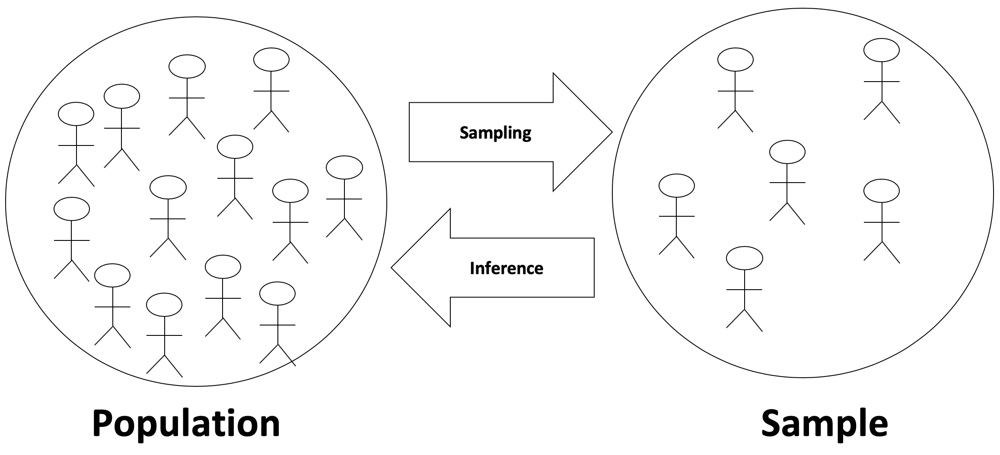

```{r setup, include=FALSE}
set.seed(470)

# load packages ----------------------------------------------------------------

library(learnr)
library(NHANES)
library(infer)
library(kableExtra)
library(grid)
library(tidyverse)
library(emo)

# knitr options ----------------------------------------------------------------

knitr::opts_chunk$set(fig.align = "center", 
                      fig.height = 3, 
                      fig.width = 5,
                      echo = FALSE, 
                      message = FALSE, 
                      warning = FALSE)

# data prep --------------------------------------------------------------------

soda <- data.frame(
  drink = c(rep("Cola", 47), rep("Orange", 13)),
  location = c(
    rep("East", 28), rep("West", 19),
    rep("East", 6), rep("West", 7)
  )
)

homeown_perm <- read_rds("data/homeown_perm.rds")
```


## Welcome to the tutorial!

Hi and welcome to inference!

We are assuming that you've already worked through the first few tutorials in this intro stats series. In this tutorial, you will be building on your previous work to now make inferential, instead of descriptive, claims based on the data at hand.

## Statistical Inference

### What is statistical inference?

Statistical inference is _the process of making claims about a population based on information from a sample_ of data. 

Typically, the data represent only a small portion of the larger group which you'd like to summarize. For example, you might be interested in how a drug treats diabetes. Your interest is in how the drug treats all people with diabetes, not just the few dozen people in your study.

At first glance, the logic of statistical inference seems to be backwards, but as you become more familiar with the steps in the process, the logic will make much more sense.

{ width=80% }

Consider a situation where you are trying to convince your marketing director that people on the East Coast prefer cola versus orange soda at a higher rate than people on the West Coast. 

To make the argument, the first step is to assume that the two populations, East Coast people and West Coast people, prefer cola to orange soda at the same rate. Here, about 60% of all people prefer cola and 40% prefer orange soda.

{ width=80% }

The second step in the process is to investigate the sample data and attempt to argue that the data at hand are nothing like that which would be collected had the populations really been identical with respect to soda preference. Here, soda preference is equal in the samples and the population.


{ width=80% }

Here, however, the sample from the East Coast prefers cola *at a rate which is twice as high as that from the West Coast*. With large samples, if the data are extremely different from the equal populations model, we can assume that the equal populations assumption is invalid.

{ width=80% }

### Vocabulary

At this point, it is important for you to know some new vocabulary to describe the previous setting.

The claim that is not interesting is called the *null hypothesis* and is denoted **$H_0$** (pronounced "H-naught"). For example, that soda preference is the same on the two coasts.

The claim that corresponds to the research hypothesis is called the *alternative hypothesis* and is denoted by **$H_A$** (pronounced "H-A"). For example, that people on the East Coast prefer soda at a higher rate than those on the West Coast.

Almost always, the *goal is to disprove the null hypothesis and claim that the alternative hypothesis is true.*

### Example: cheetah speed

Suppose you're conducting research to compare the average running speed of two different subspecies of cheetahs.

The *null hypothesis* is that Asian and African cheetahs run at the same speed, on average.

The *alternative hypothesis* is that African cheetahs are faster than Asian cheetahs, on average.

### Example: election

Or consider a dataset collected to measure whether, in an election, candidate X will win the popular vote. The number of interest is the true proportion of votes that candidate X will receive. That number is *a population measure.*

The *null hypothesis* is that candidate X will get half the votes in the population.

The *alternative hypothesis* is that candidate X will get more than half the votes in the population, that is, will win the election.


### Hypotheses (1)

Suppose a pharmaceutical company is trying to get FDA approval for a new diabetes treatment called drug A.  Currently, most doctors prescribe drug B to treat diabetes.


```{r mc1}
question("Which would be a good *null* hypothesis for the FDA statistician examining the drug company's data?", correct = "Right!", allow_retry = TRUE,
    answer("Drug A is better than drug B at treating diabetes.", message = "Remember, a null hypothesis is generally *not* what the researchers are looking for."),
    answer("Drug A is worse than drug B at treating diabetes.", message = "If the null hypothesis is true, nothing is going on."),
    answer("Drug A is different than drug B at treating diabetes (but you don't know if it is better or worse).", message = "If the null hypothesis is true, nothing is going on."),
    answer("Drug A is the same as drug B at treating diabetes.", correct = TRUE)
  )
```

### Hypotheses (2)

Consider the same situation as in the last exercise. A pharmaceutical company is trying to pass drug A for diabetes through the FDA, but most doctors currently prescribe drug B.


```{r mc2}
question("Which would be a good *alternative* hypothesis?",
  correct = "Correct! The alternative hypothesis corresponds to the research question of interest, in this case whether drug A is more -  at treating diabetes than drug B.",
  allow_retry = TRUE,
  answer("Drug A is better than drug B at treating diabetes.", correct = TRUE),
  answer("Drug A is worse than drug B at treating diabetes.", message = "Remember, the alternative should correspond to the research claim."),
  answer("Drug A is different than drug B at treating diabetes (but you don't know if it is better or worse).", message = "Remember, the alternative should correspond to the research claim."),
  answer("Drug A is the same as drug B at treating diabetes.", message = "Remember, the alternative should correspond to the research claim.")
)
```

## Randomized distributions

The idea behind statistical inference is to understand samples from a hypothetical population where the null hypothesis is true. For example, from East and West Coasts, where cola preference is the same. 

{ width=80% }

$$\hat{p}_W - \hat{p}_E = \frac{2}{3} - \frac{2}{3} = 0$$

{ width=80% }
$$\hat{p}_W - \hat{p}_E = \frac{1}{3} - \frac{2}{3} = -\frac{1}{3}$$

As a way of summarizing each of the null samples, we calculate one statistic from each sample. Here, the statistic is the difference in the proportion of West Coast people who prefer cola as compared with the proportion of East Coast people who prefer cola, where each of the sample proportions is denoted “$\hat{p}$”. The difference in $\hat{p}$s changes with each sample. First it is 0, then it is negative one third, and it will keep changing.

### Understanding the null distribution

We can build a distribution of differences in proportions assuming the null hypothesis, that there is no link between location and soda preference, is true. That is, the null samples consist of randomly shuffled soda variables so that the samples don't have any dependency between location and soda preference.

Generating a distribution of the statistic from the null population
gives information about whether the observed data are inconsistent with
the null hypothesis.


The original sample proportions are $\hat{p}_{East}$ of 0.82 and $\hat{p}_{West}$ of 0.73. A difference of -0.09. 

*Original data*

```{r}
dt <- tibble(Location = c('East','West'), Cola = c(28,19), Orange = c(6,7), Proportion = c('28/(28 + 6) = 0.82',' 19/(19 + 7) = 0.73')) %>%
  mutate(Proportion = cell_spec(Proportion, "html", color = '#144efa', bold = T))

kable(dt, format = "html", escape = F) %>%
  kable_styling("striped", full_width = F)
```

*First shuffle, same as original*

The first shuffle of the drink variable gives the exact same summaries as the observed data! 


```{r}
dt <- tibble(Location = c('East','West'), Cola = c(28,19), Orange = c(6,7)) 

kable(dt, format = "html", escape = F) %>%
  kable_styling("striped", full_width = F, position = "float_left")
```


```{r}
randdiff <- data.frame(diff = c(19/(19+7) - 28/(28+6)))
ggplot(randdiff) +
  geom_dotplot(aes(x=diff), binwidth = .03) + 
  geom_vline(xintercept = 19/(19+7) - 28/(28+6), color = "red", lwd=1.3) + 
  geom_vline(xintercept = -(19/(19+7) - 28/(28+6)), color = "red", lwd=1.3) + 
  xlab("Difference in Proportions") +
  theme(axis.title.y = element_blank(), axis.text.y.left = element_blank(),
        axis.ticks.y = element_blank(), panel.grid.major.y = element_blank(),
        panel.grid.minor = element_blank(), panel.grid.major.x = element_line()) +
  scale_x_continuous(breaks = seq(-0.5,0.5,0.1), limits = c(-0.5,0.5))
```

*Second shuffle*

The second shuffle, on the other hand, gives 27 people on the East Coast who prefer cola as compared with 20 on the West Coast who prefer cola. The difference in sample proportions for the second shuffle of the data is -0.02, which is less extreme than the original data. Note that both the original data, the red line, and the first two shuffled differences in proportions, black dots, can be plotted together. 


```{r}
dt <- tibble(Location = c('East','West'), Cola = c(27,20), Orange = c(7,6), ) 

kable(dt, format = "html", escape = F) %>%
  kable_styling("striped", full_width = F, position = "float_left")
```

```{r}
randdiff <- rbind(randdiff, 20/(20+6) - 27/(27+7))
ggplot(randdiff) +
  geom_dotplot(aes(x=diff), binwidth = .03) + 
  geom_vline(xintercept = 19/(19+7) - 28/(28+6), color = "red", lwd=1.3) + 
  geom_vline(xintercept = -(19/(19+7) - 28/(28+6)), color = "red", lwd=1.3) + 
  xlab("Difference in Proportions") +
  theme(axis.title.y = element_blank(), axis.text.y.left = element_blank(),
        axis.ticks.y = element_blank(), panel.grid.major.y = element_blank(),
        panel.grid.minor = element_blank(), panel.grid.major.x = element_line()) +
  scale_x_continuous(breaks = seq(-0.5,0.5,0.1), limits = c(-0.5,0.5))
```


*Third shuffle*

The next few shuffles give differences in proportions centered around zero. 

```{r}
dt <- tibble(Location = c('East','West'), Cola = c(28,21), Orange = c(8,5), ) 

kable(dt, format = "html", escape = F) %>%
  kable_styling("striped", full_width = F, position = "float_left")
  
```

```{r}
randdiff <- rbind(randdiff, 21/(21+5) - 28/(28+8))
ggplot(randdiff) +
  geom_dotplot(aes(x=diff), binwidth = .03) + 
  geom_vline(xintercept = 19/(19+7) - 28/(28+6), color = "red", lwd=1.3) + 
  geom_vline(xintercept = -(19/(19+7) - 28/(28+6)), color = "red", lwd=1.3) + 
  xlab("Difference in Proportions") +
  theme(axis.title.y = element_blank(), axis.text.y.left = element_blank(),
        axis.ticks.y = element_blank(), panel.grid.major.y = element_blank(),
        panel.grid.minor = element_blank(), panel.grid.major.x = element_line()) +
  scale_x_continuous(breaks = seq(-0.5,0.5,0.1), limits = c(-0.5,0.5))
```

*Fourth shuffle*

```{r}
dt <- tibble(Location = c('East','West'), Cola = c(27,20), Orange = c(7,6), ) 

kable(dt, format = "html", escape = F) %>%
  kable_styling("striped", full_width = F, position = "float_left")
  
```

```{r}
randdiff <- rbind(randdiff, 20/(20+6) - 27/(27+7))
ggplot(randdiff) +
  geom_dotplot(aes(x=diff), binwidth = .03) + 
  geom_vline(xintercept = 19/(19+7) - 28/(28+6), color = "red", lwd=1.3) + 
  geom_vline(xintercept = -(19/(19+7) - 28/(28+6)), color = "red", lwd=1.3) + 
  xlab("Difference in Proportions") +
  theme(axis.title.y = element_blank(), axis.text.y.left = element_blank(),
        axis.ticks.y = element_blank(), panel.grid.major.y = element_blank(),
        panel.grid.minor = element_blank(), panel.grid.major.x = element_line()) +
  scale_x_continuous(breaks = seq(-0.5,0.5,0.1), limits = c(-0.5,0.5))
```


*Fifth shuffle*

Note that the 5th difference is -0.16, which is farther from zero than the original data. That is, the fifth shuffle gives even more evidence of a difference in soda preference than the original data does. And we know that the fifth shuffle was created by randomly permuting the labels, so a difference of -0.16 is plausible under the null hypothesis! 


```{r}
dt <- tibble(Location = c('East','West'), Cola = c(29,18), Orange = c(5,8), ) 

kable(dt, format = "html", escape = F) %>%
  kable_styling("striped", full_width = F, position = "float_left")
```

```{r}
randdiff <- rbind(randdiff, 18/(18+8) - 29/(29+5))
ggplot(randdiff) +
  geom_dotplot(aes(x=diff), binwidth = .03) + 
  geom_vline(xintercept = 19/(19+7) - 28/(28+6), color = "red", lwd=1.3) + 
  geom_vline(xintercept = -(19/(19+7) - 28/(28+6)), color = "red", lwd=1.3) + 
  xlab("Difference in Proportions") +
  theme(axis.title.y = element_blank(), axis.text.y.left = element_blank(),
        axis.ticks.y = element_blank(), panel.grid.major.y = element_blank(),
        panel.grid.minor = element_blank(), panel.grid.major.x = element_line()) +
  scale_x_continuous(breaks = seq(-0.5,0.5,0.1), limits = c(-0.5,0.5)) 

grid.lines(x = unit(c(0.13, 0.33), "npc"),
          y = unit(c(0.27, 0.20), "npc"),
          gp = gpar(fill=openintro::COL[1,1], col = openintro::COL[1,1]),
          arrow = arrow(length = unit(0.15, "inches"), 
            ends="last", type="closed"))
```

Generally, the simulated null differences are between -0.2 and 0.2, and about one third of the differences are as or more extreme than the observed difference of -0.09.

```{r}
set.seed(470)

soda %>%
  rep_sample_n(size = nrow(soda), reps = 50) %>%
  mutate(drink_perm = sample(drink)) %>%
  group_by(replicate, location) %>%
  summarize(prop_cola_perm = mean(drink_perm == "Cola"),
            prop_cola = mean(drink == "Cola")) %>%
  summarize(diff_perm = diff(prop_cola_perm),
            diff_orig = diff(prop_cola)) %>% # West - East

ggplot() +
  geom_dotplot(aes(x=diff_perm), binwidth = .02) + 
  geom_vline(xintercept = 19/(19+7) - 28/(28+6), color = "red", lwd=1.3) + 
  geom_vline(xintercept = -(19/(19+7) - 28/(28+6)), color = "red", lwd=1.3) + 
  geom_vline(xintercept = -0.2, color = "darkgrey", lwd=1.3) + 
  geom_vline(xintercept = 0.2, color = "darkgrey", lwd=1.3) + 
  xlab("Difference in Proportions") +
  theme(axis.title.y = element_blank(), axis.text.y.left = element_blank(),
        axis.ticks.y = element_blank(), panel.grid.major.y = element_blank(),
        panel.grid.minor = element_blank(), panel.grid.major.x = element_line()) +
  scale_x_continuous(breaks = seq(-0.5,0.5,0.1), limits = c(-0.5,0.5)) 
```


Now that we have seen a visual representation of the null distribution, let's see how a null sample can be generated in R. 

## Random permutation

### One random permutation

Using the `mutate()` and `sample()` functions, the vector of soda preference is mixed up, or permuted, such that whether someone is on the East or West Coast can't possibly be causing any difference in proportions. However, due to inherent natural variability, there is also no expectation that the soda preferences are exactly the same for any sample. We use the `sample()` function to create the shuffled soda preferences, and then save that shuffled dataset into a new variable named `drink_perm`, using the `mutate()` function. 

```{r one_random_permutation, echo = TRUE}
soda %>%
  mutate(drink_perm = sample(drink)) %>%
  group_by(location) %>%
  summarize(prop_cola_perm = mean(drink_perm == "Cola"),
            prop_cola = mean(drink == "Cola")) %>%
  summarize(diff_perm = diff(prop_cola_perm), 
            diff_orig = diff(prop_cola))  # West - East
```

After grouping by the `location` variable, `summarize()` calculates the proportion of each coast that prefers cola. 

Note that `drink` equals “Cola” produces a vector of TRUEs and FALSEs, which R then coerces to ones (TRUE) and zeros (FALSE) when the `mean()` function is applied. Since a TRUE (one) represents an individual who prefers cola, the average of these ones and zeros represents the proportion of individuals who prefer cola.

`summarize()` is used a second time to find the difference in proportion of cola preference across the two coastal groups. The `diff()` function is applied across the two coastal groups because the data have been summarized by location (East and West). 

We should note that the `diff()` function takes the difference between two numbers by subtracting the first number from the second number. In this shuffle, -0.02488688 is the result from subtracting the West coast proportion _from_ the East coast proportion. It is important to make sure that your order of subtraction is consistent! 

Notice that the output gives a permuted difference of -0.02 as compared to the observed difference of -0.09. However, the permuted difference of -0.02 represents only one instance of the variability of soda preference under the null model. To get a sense of the degree of variability under the null model, it is necessary to permute the `drink` variable many times.

### Many random permutations

By repeating the permuting and difference calculations five times, the permuted differences are seen to be sometimes positive, sometimes negative, sometimes close to zero, sometimes far from zero. However, five times isn't quite enough to capture all of the variability in the null differences. 

The `rep_sample_n()` function performs repeated sampling of a dataset, where the `size` of the sample is specified in the first argument and the number of repetitions is specified in the `reps` argument. We notice that the sample `size` is the same size as the soda dataset, since it equals the number of rows in the original dataset. We are also specifying that the sampling of the datset should be done without replacement (`replace = FALSE`), since we want each row to only be selected once. You can think of this as creating five copies of the original `soda` dataset. 

```{r many_random_permutations, echo = TRUE}
soda %>%
  rep_sample_n(size = nrow(soda), reps = 5, replace = FALSE) %>%
  mutate(drink_perm = sample(drink)) %>%
  group_by(replicate, location) %>%
  summarize(prop_cola_perm = mean(drink_perm == "Cola"),
            prop_cola = mean(drink == "Cola")) %>%
  summarize(diff_perm = diff(prop_cola_perm),
            diff_orig = diff(prop_cola)) # West - East
```

Notice there is one additional variable we need to `group_by()` since we have more than one dataset we are calculating the permuted difference in proportions. This is why `replicate` appears in this `group_by()` statement. 

### Randomization distribution

By repeating the permutation process 100 times, the null differences are seen to range from approximately -0.3 to 0.3 although the majority of the differences are between -0.1 and 0.1. The observed data difference of -0.09 doesn't seem too extreme compared to this collection of null differences.

```{r}
set.seed(474740)

soda %>%
  rep_sample_n(size = nrow(soda), reps = 100) %>%
  mutate(drink_perm = sample(drink)) %>%
  group_by(replicate, location) %>%
  summarize(prop_cola_perm = mean(drink_perm == "Cola"),
            prop_cola = mean(drink == "Cola")) %>%
  summarize(diff_perm = diff(prop_cola_perm),
            diff_orig = diff(prop_cola)) %>% # West - East

ggplot() +
  geom_dotplot(aes(x=diff_perm), binwidth = .015) + 
  xlab("Difference in Proportions") +
  theme(axis.title.y = element_blank(), axis.text.y.left = element_blank(),
        axis.ticks.y = element_blank(), panel.grid.major.y = element_blank(),
        panel.grid.minor = element_blank(), panel.grid.major.x = element_line()) +
  scale_x_continuous(breaks = seq(-0.4,0.4,0.1), limits = c(-0.4,0.4)) 
```

### Working with the `NHANES` data

Throughout this lesson, you will use the [NHANES](https://CRAN.R-project.org/package=NHANES) dataset from the NHANES R package. The data are collected by the Center for Disease Control (CDC, the national public health institute in the United States) and can be thought of as a random sample of US residents.

Before moving on to investigate particular variables, you'll have an opportunity to briefly explore the data in this exercise.

 (1)

Use the `names()` function to list the variables included in the `NHANES` data frame from the [NHANES](https://CRAN.R-project.org/package=NHANES) package. (Click the link for more info.)


```{r hhanes-exercise, exercise=TRUE, exercise.eval=TRUE}
# What are the variables in the `NHANES` dataset?

```

```{r hhanes-exercise-solution}
# What are the variables in the `NHANES` dataset?
names(NHANES)
```

 (2)

- Using the `NHANES` data, create a bar plot of `HomeOwn` (fill color) broken down by `Gender` (x-axis).  
- Set `position = "fill"` in `geom_bar()` to allow for use to compare relative frequencies.

```{r nhanes-plot, exercise=TRUE}
# Create bar plot for Home Ownership by Gender
ggplot(___, aes(x = ___, fill = ___)) + 
  # Set the position to fill
  geom_bar(position = ___) +
  ylab("Relative frequencies")
```

```{r nhanes-plot-hint-1}
ggplot(NHANES, aes(x = ___, fill = ___)) + 
  geom_bar(position = ___) +
  ylab("Relative frequencies")
```

```{r nhanes-plot-hint-2}
ggplot(NHANES, aes(x = Gender, fill = ___)) + 
  geom_bar(position = ___) +
  ylab("Relative frequencies")
```

```{r nhanes-plot-hint-3}
ggplot(NHANES, aes(x = Gender, fill = HomeOwn)) + 
  geom_bar(position = ___) +
  ylab("Relative frequencies")
```

```{r nhanes-plot-solution}
# Create bar plot for Home Ownership by Gender
ggplot(NHANES, aes(x = Gender, fill = HomeOwn)) + 
  # Set the position to fill
  geom_bar(position = "fill") +
  ylab("Relative frequencies")
```

 (3)

- Create a density plot for `SleepHrsNight` `color`ed by `SleepTrouble` and faceted by `HealthGen`.
- Use `facet_wrap(~ HealthGen)` to visualize how the variables of interest vary by general health status.
- Since `SleepHrsNight` contains discrete values, the density should be smoothed a bit using `adjust = 2`.


```{r density_plot_nhanes, exercise=TRUE}
# Density plot of SleepHrsNight colored by SleepTrouble
ggplot(___, aes(x = ___, color = ___)) + 
  # Adjust by 2
  geom_density(adjust = ___) + 
  # Facet by HealthGen
  facet_wrap(~ ___)
```

```{r density_plot_nhanes-hint-1}
ggplot(NHANES, aes(x = ___, color = ___)) + 
  geom_density(adjust = ___) + 
  facet_wrap(~ ___)
```

```{r density_plot_nhanes-hint-2}
ggplot(NHANES, aes(x = SleepHrsNight, color = ___)) + 
  geom_density(adjust = ___) + 
  facet_wrap(~ ___)
```

```{r density_plot_nhanes-hint-3}
ggplot(NHANES, aes(x = SleepHrsNight, color = SleepTrouble)) + 
  geom_density(adjust = ___) + 
  facet_wrap(~ ___)
```

```{r density_plot_nhanes-hint-4}
ggplot(NHANES, aes(x = SleepHrsNight, color = SleepTrouble)) + 
  geom_density(adjust = ___) + 
  facet_wrap(~ HealthGen)
```

```{r density_plot_nhanes-solution}
# Density plot of SleepHrsNight colored by SleepTrouble
ggplot(NHANES, aes(x = SleepHrsNight, color = SleepTrouble)) + 
  # Adjust by 2
  geom_density(adjust = 2) + 
  # Facet by HealthGen
  facet_wrap(~ HealthGen)
```


Great work!  Notice that the warning message for the densities and the grey portions of the bars both indicate a large number of missing observations in the dataset.  If this were your dataset, it would be important to stop here and consider the cause of the missingness.  For the tutorial, we will now proceed without worrying about the missing observations.

### Calculating statistic of interest

Using the `NHANES` dataset, let's investigate the relationship between gender and home ownership. Remember, more information about the dataset can be found here: [NHANES](https://www.rdocumentation.org/packages/NHANES/topics/NHANES).

As seen in this lesson, natural variability can be modeled from shuffling observations around to remove any relationships that might exist in the population.  However, before you permute the data, you need to calculate the original observed statistic.  In this exercise, you will calculate the difference in proportion of home owners who are men versus women.

Recall that: 

- `%in%` returns a logical vector that is `TRUE` when values on the left hand side are listed on the right hand side.
- The mean of a logical vector is the proportion of cases where that vector is `TRUE`.

```{r fruits_vectors, echo = TRUE, eval = TRUE}
fruits <- c("apple", "banana", "cherry")
fruits %in% c("banana", "cherry")
mean(fruits %in% c("banana", "cherry"))
```

 (1)

The dplyr, ggplot2, infer, and NHANES packages have been loaded for you.

- From `NHANES`, select the `Gender` and `HomeOwn`ership columns, then filter the rows to keep individuals whose home ownership status is `"Own"` or `"Rent"`.  Save the result to the dataset named `homes`.


```{r statistic_of_interest, exercise=TRUE}
homes <- NHANES %>%
  # Select Gender and HomeOwn
  ___(___, ___) %>%
  # Filter for HomeOwn equal to "Own" or "Rent"
  ___(___ %in% c("___", "___"))
```

```{r statistic_of_interest-hint-1}
homes <- NHANES %>%
  select(Gender, HomeOwn) %>%
  ___(___ %in% c("___", "___"))
```

```{r statistic_of_interest-hint-2}
homes <- NHANES %>%
  select(Gender, HomeOwn) %>%
  filter(___ %in% c("___", "___"))
```

```{r statistic_of_interest-hint-3}
homes <- NHANES %>%
  select(Gender, HomeOwn) %>%
  filter(HomeOwn %in% c("___", "___"))
```

```{r statistic_of_interest-solution}
# Subset the data: homes
homes <- NHANES %>%
  # Select Gender and HomeOwn
  select(Gender, HomeOwn) %>%
  # Filter for HomeOwn equal to "Own" or "Rent"
  filter(HomeOwn %in% c("Own", "Rent"))
```

 (2)

- Find the observed difference in proportions of men who own and women who own, by carrying out the following steps: 
1. Using the `homes` dataset, group by `Gender`.
2. Summarize the proportion of individuals who own a home. *Note that this will calculate proportions for both genders since you've grouped by the `Gender` variable in the line before it.*  You can calculate the proportion by finding the `mean()` of the observations that equal `"Own"` in the `HomeOwn` variable.
3. Finally, summarize the observed difference in proportions using the `diff()` function to calculate the difference in male and female home ownership.


```{r statistic_of_interest2, exercise=TRUE}
# From previous step
homes <- NHANES %>%
  select(Gender, HomeOwn) %>%
  filter(HomeOwn %in% c("Own", "Rent"))

diff_orig <- homes %>%   
  # Group by gender
  ___(___) %>%
  # Summarize proportion of homeowners
  ___(prop_own = ___) %>%
  # Summarize difference in proportion of homeowners
  ___(obs_diff_prop = ___(prop_own)) # male - female
  
# See the result
diff_orig
```

```{r statistic_of_interest2-hint-1}
diff_orig <- homes %>%   
  group_by(Gender) %>%
  ___(prop_own = ___) %>%
  ___(obs_diff_prop = ___(prop_own)) # male - female
```

```{r statistic_of_interest2-hint-2}
diff_orig <- homes %>%   
  group_by(Gender) %>%
  summarize(prop_own = mean(HomeOwn == "Own")) %>%
  ___(obs_diff_prop = ___(prop_own)) # male - female
```

```{r statistic_of_interest2-hint-3}
diff_orig <- homes %>%   
  group_by(Gender) %>%
  summarize(prop_own = mean(HomeOwn == "Own")) %>%
  summarize(obs_diff_prop = diff(prop_own)) # male - female
```

```{r statistic_of_interest2-solution}
# From previous step
homes <- NHANES %>%
  select(Gender, HomeOwn) %>%
  filter(HomeOwn %in% c("Own", "Rent"))

diff_orig <- homes %>%   
  # Group by gender
  group_by(Gender) %>%
  # Summarize proportion of homeowners
  summarize(prop_own = mean(HomeOwn == "Own")) %>%
  # Summarize difference in proportion of homeowners
  summarize(obs_diff_prop = diff(prop_own)) # male - female
  
# See the result
diff_orig
```

### Randomized data under null model of independence

The **infer** package will allow you to model a particular null hypothesis and then randomize the data to calculate permuted statistics.  In this exercise, after specifying your null hypothesis you will permute the home ownership variable 10 times. By doing so, you will ensure that there is no relationship between home ownership and gender, so any difference in home ownership proportion for female versus male will be due only to natural variability.

This exercise will demonstrate the first three steps from the infer package:

- `specify()` -- to specify the response and explanatory variables
- `hypothesize()` -- to declare the null hypothesis
- `generate()` -- to generate resamples, permutations, or simulations

Using these steps in the context of creating a randomization distribution, looks
like the following: 

```{r, eval = FALSE}
dataset_name %>%
  specify(response_variable ~ explanatory_variable,
          success = "[what value of the explanatory variable is a success]") %>% 
  hypothesize(null = "independence") %>% 
  generate(reps = 10, type = "permute") 
```


The dplyr, ggplot2, NHANES, and infer packages have been loaded for you and the `homes` dataset you created in the last exercise is available in your workspace.

```{r null_model-setup, include=FALSE}
homes <- NHANES %>%
  select(Gender, HomeOwn) %>%
  filter(HomeOwn %in% c("Own", "Rent"))
```

 (1)

- Using the infer framework, step through specifying the null model and then performing 10 permutations to evaluate whether home ownership status (i.e. `HomeOwn`) differs between the `"female"` and `"male"` groups:
- `specify()` that the relationship of interest is `HomeOwn` vs. `Gender` and a success in this context is homeownership, set `success` to `"Own"`.


```{r null_model, exercise=TRUE}
# Specify variables
homeown_perm <- homes %>%
  ___(___ ~ ___, success = "___")

# Print results to console
homeown_perm
```

<div id="null_model-hint">
**Hint:** `specify()` takes a formula, `HomeOwn ~ Gender`, and `success` is `"Own"`.
</div>

```{r null_model-solution}
# Specify variables
homeown_perm <- homes %>%
  specify(HomeOwn ~ Gender, success = "Own") 
 
# Print results to console
homeown_perm
```

 (2)

- Using the infer framework:
    - `specify()` has been done for you.
    - `hypothesize()` that the null is true where `null = "independence"` (gender and homeownership are not related).


```{r null_model2, exercise=TRUE}
# Hypothesize independence
homeown_perm <- homes %>%
  specify(HomeOwn ~ Gender, success = "Own") %>%
  ___(null = "___")  

# Print results to console
homeown_perm
```

<div id="null_model2-hint">
**Hint:** `hypothesize(null = "independence")`
</div>

```{r null_model2-solution}
# Hypothesize independence
homeown_perm <- homes %>%
  specify(HomeOwn ~ Gender, success = "Own") %>%
  hypothesize(null = "independence") 

# Print results to console
homeown_perm
```

 (3)

- Using the infer framework:
    - `specify()` has been done for you.
    - `hypothesize()` has been done for you.
    - `generate()` ten permutations; set `reps` to 10.


```{r null_model3, exercise=TRUE}
# Perform 10 permutations
homeown_perm <- homes %>%
  specify(HomeOwn ~ Gender, success = "Own") %>%
  hypothesize(null = "independence") %>% 
  ___(reps = ___, type = "permute") 


# Print results to console
homeown_perm
```

<div id="null_model3-hint">
**Hint:** `generate(reps = 10, type = "permute")`
</div>

```{r null_model3-solution}
# Perform 10 permutations
homeown_perm <- homes %>%
  specify(HomeOwn ~ Gender, success = "Own") %>%
  hypothesize(null = "independence") %>% 
  generate(reps = 10, type = "permute") 
  
# Print results to console
homeown_perm
```


Great work! Notice that you went through three sequential steps:  
(1) the response and explanatory variables were defined by the `specify()` command, 
(2) the independence null hypothesis was set, and 
(3) you successfully shuffled the response variable, `HomeOwn`, ten times.


### Randomized statistics and dotplot

By permuting the home ownership variable multiple times, you generate differences in proportions that are consistent with the assumption that the variables are unrelated.  The statistic of interest is the difference in proportions given by `stat = "diff in props"`.  After calculating the randomized statistics, you will plot them in a dotplot.

This exercise shows all four steps from the infer package:

1. `specify()` will specify the response and explanatory variables.
2. `hypothesize()` will declare the null hypothesis.
3. `generate()` will generate resamples, permutations, or simulations.
4. `calculate()` will calculate summary statistics.

Each step will be covered throughout the tutorial; in this exercise you'll write code for `calculate()`.

The dplyr, ggplot2, NHANES, and infer packages have been loaded for you. Repeat the permuting and plotting with 100 differences in proportions generated by shuffling the `HomeOwn` variable.


```{r randomized_statistics-setup}
homes <- NHANES %>%
  select(Gender, HomeOwn) %>%
  filter(HomeOwn %in% c("Own", "Rent"))
```

 (1) 

- Using the infer framework, step through specifying the null model and then performing 100 permutations to evaluate whether home ownership status (i.e. `HomeOwn`) differs between the `"female"` and `"male"` groups:
    + `specify()`, `hypothesize()`, and  `generate()` have been done for you.
    + `calculate()` the `stat`istic `"diff in props"` with the order of `c("male", "female")`, telling `R` that the female proportion should be subtracted from the male proportion.

```{r randomized_statistics, exercise=TRUE}
# Perform 100 permutations
homeown_perm <- homes %>%
  specify(HomeOwn ~ Gender, success = "Own") %>%
  hypothesize(null = "independence") %>% 
  generate(reps = 100, type = "permute") %>% 
  ___(___, order = ___)
  
# Print results to console
homeown_perm
```

<div id="randomized_statistics-hint">
**Hint:** `calculate(stat = "diff in props", order = c("male", "female"))`
</div>

```{r randomized_statistics-solution}
# Perform 100 permutations
homeown_perm <- homes %>%
  specify(HomeOwn ~ Gender, success = "Own") %>%
  hypothesize(null = "independence") %>% 
  generate(reps = 100, type = "permute") %>% 
  calculate(stat = "diff in props", order = c("male", "female"))

# Print results to console
homeown_perm
```

 (2)

- Using `homeown_perm`, plot the 100 differences in proportions using `geom_dotplot`. Adjust the size of the dots by setting `binwidth` to `0.001` in your call to `geom_dotplot()`.


```{r randomized_statistics2, exercise=TRUE}
# Perform 100 permutations
homeown_perm <- homes %>%
  specify(HomeOwn ~ Gender, success = "Own") %>%
  hypothesize(null = "independence") %>% 
  generate(reps = 100, type = "permute") %>% 
  calculate(stat = "diff in props", order = c("male", "female"))
  
# Dotplot of 100 permuted differences in proportions
ggplot(___, aes(x = stat)) + 
  ___(___)
```

```{r randomized_statistics2-hint}
ggplot(___, aes(x = stat)) + 
  geom_dotplot(___)
```

```{r randomized_statistics2-solution}
# Perform 100 permutations
homeown_perm <- homes %>%
  specify(HomeOwn ~ Gender, success = "Own") %>%
  hypothesize(null = "independence") %>% 
  generate(reps = 100, type = "permute") %>% 
  calculate(stat = "diff in props", order = c("male", "female"))

# Dotplot of 100 permuted differences in proportions
ggplot(homeown_perm, aes(x = stat)) + 
  geom_dotplot(binwidth = 0.001)
```

Nice! It's much easier to get a feel for the distribution of randomized statistics now. In the next exercise, you'll see how 1000 randomized statistics are distributed.

### Randomization density

Using 100 repetitions allows you to understand the mechanism of permuting.  However, 100 is not enough to observe the full range of likely values for the null differences in proportions.  

Recall the four steps of inference.  These are the same four steps that will be used in all inference exercises in this tutorial and future statistical inference tutorials.  Use the names of the functions to help you recall the analysis process.

- `specify()` will specify the response and explanatory variables.
- `hypothesize()` will declare the null hypothesis.
- `generate()` will generate resamples, permutations, or simulations.
- `calculate()` will calculate summary statistics.

In this exercise, you'll repeat the process 1000 times to get a sense for the complete distribution of null differences in proportions.

 (1)

The dplyr, ggplot2, NHANES, and infer packages have been loaded for you. 

* Generate 1000 differences in proportions by shuffling the `HomeOwn` variable using the infer syntax.  Recall the infer syntax:  
    + `specify()` that the relationship of interest is `HomeOwn` vs. `Gender` and a success in this context is homeownership, `success = "Own"`.
    + `hypothesize()` that the null is true where `null = "independence"` (meaning gender and homeownership are not related).
    + `generate()` 1000 permutations; set `reps` to 1000.
    + `calculate()` the statistic `stat = "diff in props"` with the order of `c("male", "female")`.
* Run the density plot code to create a smoothed visual representation of the distribution of differences. **What shape does the curve have?**


```{r randomization_density-setup, include=FALSE}
homes <- NHANES %>%
  select(Gender, HomeOwn) %>%
  filter(HomeOwn %in% c("Own", "Rent")) %>%
  sample_n(2500)
```

```{r randomization_density, exercise=TRUE}
# Perform 1000 permutations
homeown_perm <- homes %>%
  # Specify HomeOwn vs. Gender, with `"Own" as success
  ___(___ ~ ___, success = "___") %>%
  # Use a null hypothesis of independence
  ___(___) %>% 
  # Generate 1000 repetitions (by permutation)
  ___(reps = ___, type = "permute") %>% 
  # Calculate the difference in proportions (male then female)
  ___(___, order = ___))

# Density plot of 1000 permuted differences in proportions
ggplot(homeown_perm, aes(x = stat)) + 
  geom_density()
```

```{r randomization_density-hint-1}
homes %>%
  specify(HomeOwn ~ Gender, success = "Own") %>%
  ___(___) %>% 
  ___(reps = ___, type = "permute") %>% 
  ___(___, order = ___))
```

```{r randomization_density-hint-2}
homes %>%
  specify(HomeOwn ~ Gender, success = "Own") %>%
  hypothesize(null = "independence") %>% 
  ___(reps = ___, type = "permute") %>% 
  ___(___, order = ___))
```

```{r randomization_density-hint-3}
homes %>%
  specify(HomeOwn ~ Gender, success = "Own") %>%
  hypothesize(null = "independence") %>% 
  generate(reps = 1000, type = "permute") %>% 
  ___(___, order = ___))
```

```{r randomization_density-hint-4}
homes %>%
  specify(HomeOwn ~ Gender, success = "Own") %>%
  hypothesize(null = "independence") %>% 
  generate(reps = 1000, type = "permute") %>% 
  calculate(stat = "diff in props", order = c("male", "female"))
```

```{r randomization_density-solution}
# Perform 1000 permutations
  # Specify HomeOwn vs. Gender, with `"Own" as success
homeown_perm <- homes %>%
  specify(HomeOwn ~ Gender, success = "Own") %>%
  # Use a null hypothesis of independence
  hypothesize(null = "independence") %>% 
  # Generate 1000 repetitions (by permutation)
  generate(reps = 1000, type = "permute") %>% 
  # Calculate the difference in proportions (male then female)
  calculate(stat = "diff in props", order = c("male", "female"))

# Density plot of 1000 permuted differences in proportions
ggplot(homeown_perm, aes(x = stat)) + 
  geom_density()
```

Great work! You can now see that the distribution is approximately normally distributed around -0.01, but what can we conclude from it? You'll learn how to use this distribution in the next lesson.

## Using the randomization distribution

Recall that the logic of statistical inference is to compare the observed statistic to the distribution of statistics that come from a null distribution. You've now seen how to create the distribution with your own R code. The next question to ask is, **how do we use the information in the null distribution?**

Remember that each dot that gets generated is from a different permutation of the data. We use the null differences, the dots, to define the setting that we are not interested in. The goal is to show that our observed data are not consistent with the differences generated. We want our observed data to be different from the null so that we can claim the alternative research hypothesis to be true.

```{r, eval = TRUE}
set.seed(47)
soda %>%
  rep_sample_n(size = nrow(soda), reps = 10) %>%
  mutate(drink_perm = sample(drink)) %>%
  group_by(replicate, location) %>%
  summarize(prop_cola_perm = mean(drink_perm == "Cola"),
            prop_cola = mean(drink == "Cola")) %>%
  summarize(diff_perm = diff(prop_cola_perm),
            diff_orig = diff(prop_cola)) %>% # West - East

  ggplot() +
  geom_dotplot(aes(x=diff_perm), binwidth = .03) + 
  geom_vline(xintercept = 19/(19+7) - 28/(28+6), color = "red", lwd=1.3) + 
  geom_vline(xintercept = -(19/(19+7) - 28/(28+6)), color = "red", lwd=1.3) + 
  xlab("Difference in Proportions") +
  theme(axis.title.y = element_blank(), axis.text.y.left = element_blank(),
        axis.ticks.y = element_blank(), panel.grid.major.y = element_blank(),
        panel.grid.minor = element_blank(), panel.grid.major.x = element_line()) +
  scale_x_continuous(breaks = seq(-0.5,0.5,0.1), limits = c(-0.5,0.5)) +
  geom_label(label= "observed difference", color = openintro::COL[1,1], x = -0.32, y = .65, cex=3) +
  geom_label(label = "each dot represents\n one permutation", color = openintro::COL[1,1], x = -0.33, y = .24, cex=3) 

grid.lines(x = unit(c(0.29, 0.40), "npc"),
          y = unit(c(0.26, 0.23), "npc"),
          gp = gpar(fill=openintro::COL[1,1], col = openintro::COL[1,1]),
          arrow = arrow(length = unit(0.15, "inches"), 
            ends="last", type="closed"))

grid.lines(x = unit(c(0.39, 0.51), "npc"),
          y = unit(c(0.325, 0.265), "npc"),
          gp = gpar(fill=openintro::COL[1,1], col = openintro::COL[1,1]),
          arrow = arrow(length = unit(0.15, "inches"), 
            ends="last", type="closed"))

grid.lines(x = unit(c(0.29, 0.41), "npc"),
          y = unit(c(0.7, 0.75), "npc"),
          gp = gpar(fill=openintro::COL[1,1], col = openintro::COL[1,1]),
          arrow = arrow(length = unit(0.15, "inches"), 
            ends="last", type="closed"))
```


### Data consistent with null?

Using R, recall that 9% more people on the East Coast prefer cola than those on the West Coast.

```{r data_consistent_with_null_code_in_slide, echo = TRUE}
soda %>%
 group_by(location) %>%
 summarize(prop_cola = mean(drink == "Cola"))
```

### Significance

On the dot plot, the null statistics, which are more extreme compared to the observed statistic, are colored red. We can see that about a third of the null statistics are as or more extreme than what we observed.

```{r}
set.seed(474740)

soda %>%
  rep_sample_n(size = nrow(soda), reps = 100) %>%
  mutate(drink_perm = sample(drink)) %>%
  group_by(replicate, location) %>%
  summarize(prop_cola_perm = mean(drink_perm == "Cola"),
            prop_cola = mean(drink == "Cola")) %>%
  summarize(diff_perm = diff(prop_cola_perm),
            diff_orig = diff(prop_cola)) %>% # West - East
  mutate(extreme = ifelse(diff_perm <= 19/(19+7) - 28/(28+6), "bigger", "smaller")) %>%

ggplot() +
  geom_dotplot(aes(x=diff_perm, fill = extreme), binwidth = .015) + 
  xlab("Difference in Proportions") +
  geom_vline(xintercept = 19/(19+7) - 28/(28+6), color = openintro::COL[4,1]) +
  theme(axis.title.y = element_blank(), axis.text.y.left = element_blank(),
        axis.ticks.y = element_blank(), panel.grid.major.y = element_blank(),
        panel.grid.minor = element_blank(), panel.grid.major.x = element_line(),
        legend.position = "none") +
  scale_x_continuous(breaks = seq(-0.4,0.4,0.1), limits = c(-0.4,0.4)) +
  scale_color_manual(values = c(openintro::COL[4,1], openintro::COL[1,1])) +
  scale_fill_manual(values = c(openintro::COL[4,1], openintro::COL[1,1]))
```


### How extreme are the observed data?

To be more precise, R can count the number of times the null data were more extreme than the observed data. Here, we identify that about 30% of the null statistics are more extreme than the difference which was observed. Thirty percent, in conjunction with the dot plot, give evidence that the data are consistent with the permuted distribution. We have no evidence that rates of cola preference differ by coast.


```{r extreme_observe_data, echo = TRUE}
soda_perm <- soda %>%
  rep_sample_n(size = nrow(soda), reps = 100) %>%
  mutate(drink_perm = sample(drink)) %>%
  group_by(replicate, location) %>%
  summarize(prop_cola_perm = mean(drink_perm == "Cola"),
            prop_cola = mean(drink == "Cola")) %>%
  summarize(diff_perm = diff(prop_cola_perm),
            diff_orig = diff(prop_cola)) # West - East

soda_perm %>%
  summarize(count = sum(diff_orig >= diff_perm),
            proportion = mean(diff_orig >= diff_perm))
```

### Do the data come from the population?

Recall that the observed difference (i.e. the difference in proportions in the `homes` dataset, shown as the red vertical line) was around -0.0078, which seems to fall below the bulk of the density of shuffled differences. It is important to know, however, whether any of the randomly permuted differences were as extreme as the observed difference.

In this exercise, you'll re-create this dotplot as a density plot and count the number of permuted differences that were to the left of the observed difference.

The `homeown_perm` dataset is available in your workspace.

- Using `geom_density()`, plot the permuted differences (`diff_perm`). 
- Add a vertical red line with `geom_vline()` where the observed difference falls. The `diff_orig` is provided in your workspace and represents the original value of the difference statistic. You should plot this value as the `xintercept` of `geom_vline()`. 
- Count the number of permuted differences that were less than or equal to the observed difference.


```{r homeown_perm-setup,}
# Density plot of 1000 permuted differences in proportions
diff_orig <- -0.00783
ggplot(homeown_perm, aes(x = diff_perm)) +
  geom_dotplot(binwidth = .0007) +
  ggtitle("Density plot of shuffled differences") +
  geom_vline(xintercept = diff_orig, color = "red")
```

```{r homeown_perm, exercise=TRUE}
# Plot permuted differences, diff_perm
ggplot(homeown_perm, aes(x = ___)) + 
  # Add a density layer
  ___() +
  # Add a vline layer with intercept diff_orig
  ___(aes(xintercept = ___), color = "red")

# Compare permuted differences to observed difference
homeown_perm %>%
  summarize(n_perm_le_obs = sum(___ <= ___))
```

```{r homeown_perm-hint-1}
ggplot(homeown_perm, aes(x = diff_perm)) +
  ___() +
  ___(aes(xintercept = ___), color = "red")
```

```{r homeown_perm-hint-2}
ggplot(homeown_perm, aes(x = diff_perm)) +
  geom_density() +
  ___(aes(xintercept = ___), color = "red")
```

```{r homeown_perm-hint-3}
ggplot(homeown_perm, aes(x = diff_perm)) +
  geom_density() +
  geom_vline(aes(xintercept = diff_orig), color = "red")
```

```{r homeown_perm-solution}
# Plot permuted differences, diff_perm
ggplot(homeown_perm, aes(x = diff_perm)) +
  # Add a density layer
  geom_density() +
  # Add a vline layer with intercept diff_orig
  geom_vline(aes(xintercept = diff_orig), color = "red")

# Compare permuted differences to observed difference
homeown_perm %>%
  summarize(n_perm_le_obs = sum(diff_perm <= diff_orig))
```

Nice work! 212 permuted differences are more extreme than the observed difference. This only represents 21.2% of the null statistics, so you can conclude that the observed difference **is** consistent with the permuted distribution.

### What can you conclude?

*Hint*: Since you observed only 212 of 1000 null statistics are more extreme than the observed difference statistic, you can conclude that the observed difference **is** consistent with the permuted distribution. You've failed to reject the null hypothesis!


```{r mc3}
question("What can you conclude from the analysis?", correct = "Right! We've failed to reject the null hypothesis.", allow_retry = TRUE,
    answer("We have learned that being female causes people to buy houses.", message = "Because the study was not an experiment, it is not possible to draw a causal conclusion.  There may have been other factors affecting the outcome."),
    answer("We have learned that our data is consistent with the hypothesis of no difference in home ownership across gender.", correct = TRUE),
    answer("We have learned that the observed difference (from the data) in proportion of home ownership across gender is due to something other than random variation.", message = "Unfortunately, there is not sufficient evidence to reject the null hypothesis.")
)
```    
    
## Study conclusions
        
In the calculations on the `NHANES` data, the observed statistic was consistent with the null statistics. That is, 212 of the 1000 permutations were smaller than the original value. There is no evidence that the data are inconsistent with the null hypothesis. That is, if gender played no role in home ownership, we would be likely to get data similar to those observed.

However, this does not mean that we know for sure the gender doesn't play a role. It is possible that the true difference in homeownership rates is 0.1, and surely our data would be consistent with that population as well. The logic of inference allows us only to reject null claims. The process does not allow us to have certainty in the null hypothesis being true.

> We fail to reject the null hypothesis: There is no evidence that our data are inconsistent with the null hypothesis.

```{r}
homeown_perm %>%
  mutate(extreme = ifelse(diff_perm <= diff_orig, "extreme", "not")) %>%
ggplot() +
  geom_dotplot(aes(x=diff_perm, fill = extreme), binwidth = .0007) + 
  xlab("Difference in Proportions") +
  geom_vline(aes(xintercept = diff_orig), color = openintro::COL[1,1]) +
  theme(axis.title.y = element_blank(), axis.text.y.left = element_blank(),
        axis.ticks.y = element_blank(), panel.grid.major.y = element_blank(),
        panel.grid.minor = element_blank(), panel.grid.major.x = element_line(),
        legend.position = "none") +
  scale_x_continuous(breaks = seq(-0.03,0.03,0.005), limits = c(-0.03,0.03)) +
  geom_label(label= "212 were smaller\n than original value", color = openintro::COL[1,1], x = -0.02, y = .85, cex=5) +
  geom_label(label = "788 were bigger than\n original value", color = openintro::COL[4,1], x = 0.015, y = .85, cex=5) +
  scale_color_manual(values = c(openintro::COL[1,1], openintro::COL[4,1])) +
  scale_fill_manual(values = c(openintro::COL[1,1], openintro::COL[4,1]))

  grid.lines(x = unit(c(0.05, 0.35), "npc"),
          y = unit(c(0.7, 0.7), "npc"),
          gp = gpar(fill=openintro::COL[1,1], col = openintro::COL[1,1]),
          arrow = arrow(length = unit(0.15, "inches"), 
            ends="first", type="closed"))
  
    grid.lines(x = unit(c(0.65, 0.95), "npc"),
          y = unit(c(0.7, 0.7), "npc"), 
          gp = gpar(fill=openintro::COL[4,1], col = openintro::COL[4,1]),
          arrow = arrow(length = unit(0.15, "inches"), 
            ends="last", type="closed"))
```

Note that the `NHANES` data is thought to be a good representative sample of the US population. That means the conclusions from the `NHANES` data can be applied to the larger US population. Unfortunately, here there is nothing to report; the conclusion was that there was an inability to reject the null hypothesis. So, in this case, there is no claim that can be generalized to a larger population.

OK, now that we've covered the basics, let's move on to completing a full hypothesis test on actual data.
    
## Congratulations!

You have successfully completed Lesson 1 in Tutorial 4: Foundations of inference.  

What's next?

`r emo::ji("ledger")` [Full list of tutorials supporting OpenIntro::Introduction to Modern Statistics](https://openintrostat.github.io/ims-tutorials/)

`r emo::ji("spiral_notepad")` [Tutorial 4: Foundations of inference](https://openintrostat.github.io/ims-tutorials/04-foundations/)

`r emo::ji("one")` [Tutorial 4 - Lesson 1: Sampling variability](https://openintro.shinyapps.io/ims-04-foundations-01/)

`r emo::ji("two")` [Tutorial 4 - Lesson 2: Randomization test](https://openintro.shinyapps.io/ims-04-foundations-02/)

`r emo::ji("three")` [Tutorial 4 - Lesson 3: Errors in hypothesis testing](https://openintro.shinyapps.io/ims-04-foundations-03/)

`r emo::ji("four")` [Tutorial 4 - Lesson 4: Parameters and confidence intervals](https://openintro.shinyapps.io/ims-04-foundations-04/)

`r emo::ji("open_book")` [Learn more at Introduction to Modern Statistics](http://openintro-ims.netlify.app/)
