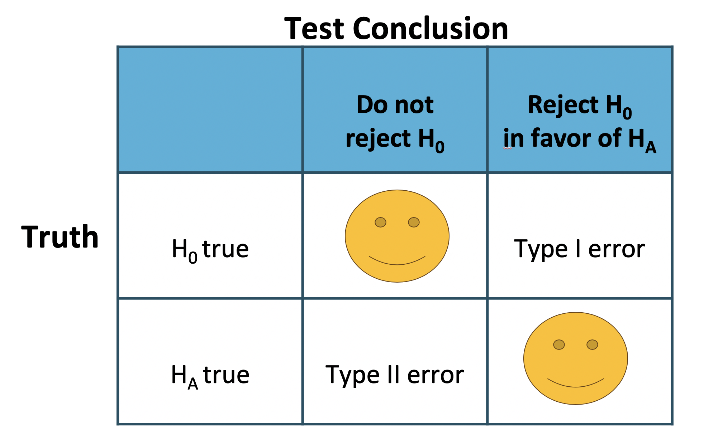

```{r setup, include=FALSE}
# load packages ----------------------------------------------------------------

library(learnr)
library(kableExtra)
library(tidyverse)
library(infer)
library(emo)

# knitr options ----------------------------------------------------------------

knitr::opts_chunk$set(fig.align = "center", 
                      fig.height = 3, 
                      fig.width = 5,
                      echo = FALSE, 
                      message = FALSE, 
                      warning = FALSE)

# data prep --------------------------------------------------------------------

opportunity <- data.frame(
  decision = c(rep("buyDVD", 97), rep("nobuyDVD", 53)),
  group = c(rep("control", 56), rep("treatment", 41), rep("control", 19), rep("treatment", 34))
)

diff_obs <- opportunity |>
  group_by(group) |>
  summarize(prop_buy = mean(decision == "buyDVD")) |>
  summarize(diff(prop_buy)) |> 
  pull()

opp_perm <- read_rds("data/opp_perm.rds")

# Hash generation helpers
# Should ideally be loaded from the imstutorials package when it exists
is_server_context <- function(.envir) {
  # We are in the server context if there are the follow:
  # * input - input reactive values
  # * output - shiny output
  # * session - shiny session
  #
  # Check context by examining the class of each of these.
  # If any is missing then it will be a NULL which will fail.
  
  inherits(.envir$input, "reactivevalues") &
    inherits(.envir$output, "shinyoutput") &
    inherits(.envir$session, "ShinySession")
}

check_server_context <- function(.envir) {
  if (!is_server_context(.envir)) {
    calling_func <- deparse(sys.calls()[[sys.nframe() - 1]])
    err <- paste0("Function `", calling_func, "`", " must be called from an Rmd chunk where `context = \"server\"`")
    stop(err, call. = FALSE)
  }
}
encoder_logic <- function(strip_output = FALSE) {
  p <- parent.frame()
  check_server_context(p)
  # Make this var available within the local context below
  assign("strip_output", strip_output, envir = p)
  # Evaluate in parent frame to get input, output, and session
  local(
    {
      encoded_txt <- shiny::eventReactive(
        input$hash_generate,
        {
          # shiny::getDefaultReactiveDomain()$userData$tutorial_state
          state <- learnr:::get_tutorial_state()
          shiny::validate(shiny::need(length(state) > 0, "No progress yet."))
          shiny::validate(shiny::need(nchar(input$name) > 0, "No name entered."))
          shiny::validate(shiny::need(nchar(input$studentID) > 0, "Please enter your student ID"))
          user_state <- purrr::map_dfr(state, identity, .id = "label")
          user_state <- dplyr::group_by(user_state, label, type, correct)
          user_state <- dplyr::summarize(
            user_state,
            answer = list(answer),
            timestamp = dplyr::first(timestamp),
            .groups = "drop"
          )
          user_state <- dplyr::relocate(user_state, correct, .before = timestamp)
          user_info <- tibble(
            label = c("student_name", "student_id"),
            type = "identifier",
            answer = as.list(c(input$name, input$studentID)),
            timestamp = format(Sys.time(), "%Y-%m-%d %H:%M:%S %Z", tz = "UTC")
          )
          learnrhash::encode_obj(bind_rows(user_info, user_state))
        }
      )
      output$hash_output <- shiny::renderText(encoded_txt())
    },
    envir = p
  )
}

hash_encoder_ui <- {
  shiny::div("If you have completed this tutorial and are happy with all of your", "solutions, please enter your identifying information, then click the button below to generate your hash", textInput("name", "What's your name?"), textInput("studentID", "What is your student ID?"), renderText({
    input$caption
  }), )
}
```


## Example: opportunity cost

In this lesson, we'll look at data from a study on opportunity cost from Frederick et al. The researchers investigated whether reminding students about saving money would make it less likely for them to spend money on a DVD. The students were randomly assigned to a control or treatment group with different instructions.

### The study

Seventy-five students were assigned to the control group and were presented with two options. Each student could either buy the DVD or not buy the DVD.

Another 75 students were assigned to the treatment group and were given a slight variation on the same two options. The first option was also to buy the DVD, but the second option was to not buy the DVD while being reminded that the money could also be saved.

### State the hypotheses

The null hypothesis is that the two sets of choices don't impact buying habits. The research, or alternative, hypothesis is that, in this setting, a reminder might make people more inclined to save.

Of the 75 students assigned to the control group, 56, or about 75%, bought the DVD. Of the 75 students assigned to the treatment group, 41, or about 55%, bought the DVD. As before, you will use a null distribution to determine whether the difference of 20% could be attributed to random variability.

```{r the data}
dt <- tibble(Group = c('Control group','Treatment group', 'Total'), Buy_DVD = c(56,41,97), 
             Not_buy_DVD = c(19,34,53), Total = c(75,75,150), Proportion = c('0.7467', '0.5467','-')) |>
  mutate(Proportion = cell_spec(Proportion, "html", color = '#144efa', bold = T))

kable(dt, format = "html", escape = F) |>
  kable_styling("striped", full_width = F)

```


### Summarizing opportunity cost (1)

As you saw in the lesson, we're interested in whether the treatment and control groups were equally likely to buy a DVD after reading the experimental statements.  

In this exercise, you'll use the data from the study to find the sample statistics (here: proportions) that are needed for the analysis.

*Instructions*

- Use the `count()` function to tabulate the dataset called `opportunity`. *Make a note of the values in the `decision` column for use in the next step.*
- For each experimental group, find the proportion who bought a DVD. That is, calculate the mean where `decision` is `"buyDVD"`.

```{r opportunity_cost_1, exercise=TRUE}
# Tabulate the data
opportunity |>
  ___(decision, group)

# Find the proportion who bought the DVD in each group
opportunity |>
  group_by(___) |>
  summarize(buy_prop = ___(___))
```

```{r opportunity_cost_1-hint-1}
opportunity |>
  count(decision, group)
```

```{r opportunity_cost_1-hint-2}
opportunity |>
  group_by(group) |>
  summarize(buy_prop = ___(___))
```

```{r opportunity_cost_1-solution}
# Tabulate the data
opportunity |>
  count(decision, group)

# Find the proportion who bought the DVD in each group
opportunity |>
  group_by(group) |>
  summarize(buy_prop = mean(decision == "buyDVD"))
```


Okay, so about 75% of the control group bought the DVD and about 55% of the treatment group (i.e. the group that was reminded that the money could be saved) bought the DVD. Interesting!


### Plotting opportunity cost

Again, interest is in whether the treatment and control groups were equally likely to buy a DVD after reading the experimental statements.  Here, you'll create a barplot to visualize the difference in proportions between the treatment and control groups.

*Instructions*
- Using the `opportunity` dataset, plot `group` `fill`ed by `decision`.  
- Call `geom_bar()` to add a bar plot layer, setting the position argument to `"fill"` to compare relative frequencies. Note that fill should be defined by the `decision` for each group.

```{r plot, exercise=TRUE}
# Plot group, filled by decision
ggplot(opportunity, aes(x = ___, fill = ___)) + 
  # Add a bar layer, with position "fill"
  ___
```

```{r plot-hint}
ggplot(opportunity, aes(x = ___, fill = decision)) + 
  ___
```

```{r plot-solution}
# Plot group, filled by decision
ggplot(opportunity, aes(x = group, fill = decision)) + 
  # Add a bar layer, with position "fill"
  geom_bar(position = "fill")
```


Great! The barplot better displays the results from the study. The treatment seems like it might have had an effect.

### Randomizing opportunity cost

As in lesson 2, you will permute the data to generate a distribution of differences as if the null hypothesis were true.

In the study, the number of individuals in each of the control and treatment groups is fixed.  Additionally, when you assume that the null hypothesis is true—that is, the experiment had no effect on the outcome of buying a DVD—it is reasonable to infer that the number of individuals who would buy a DVD is also fixed.  That is, 97 people were going to buy a DVD regardless of which treatment group they were in.

Using the new data and the methods from the previous lesson, create a randomization distribution of the difference in proportions calculated on permuted data.

 (1)

- Using the `opportunity` dataset, calculate the observed difference in purchase rate.
    - Group by `group`.
    - Summarize to calculate the proportion deciding to buy a DVD. That is, get the `mean()` of cases of `decision` equaling `"buyDVD"`.
    - Summarize again to calculate the `diff()`erence of `prop_buy` between groups.

```{r randomizing_cost_1, exercise=TRUE}
# Calculate the observed difference in purchase rate
diff_obs <- opportunity |>
  # Group by group
  ___(___) |>
  # Calculate proportion deciding to buy a DVD
  ___(prop_buy = ___(___)) |>
  # Calculate difference between groups
  ___(stat = ___) |> 
  pull()
```

```{r randomizing_cost_1-hint-1}
opportunity |>
  group_by(group) |>
  ___(prop_buy = ___(___)) |>
  ___(stat = ___) |> 
  pull()
```

```{r randomizing_cost_1-hint-2}
opportunity |>
  group_by(group) |>
  summarize(prop_buy = mean(decision == "buyDVD")) |>
  ___(stat = ___) |> 
  pull()
```

```{r randomizing_cost_1-hint-3}
opportunity |>
  group_by(group) |>
  summarize(prop_buy = mean(decision == "buyDVD")) |>
  summarize(stat = ___) |> 
  pull()
```

```{r randomizing_cost_1-solution}
# Calculate the observed difference in purchase rate
diff_obs <- opportunity |>
  # Group by group
  group_by(group) |>
  # Calculate proportion deciding to buy a DVD
  summarize(prop_buy = mean(decision == "buyDVD")) |>
  # Calculate difference between groups
  summarize(stat = diff(prop_buy)) |> 
  pull()
    
# Review the result
diff_obs
```

 (2)

- Create a data frame of permuted differences in purchase rates.
    - Specify the model `decision` vs. `group`, with the `success` value `"buyDVD"`.
    - Hypothesize `"independence"`.
    - Generate `1000` reps of type `"permute"`.
    - Calculate the summary statistic `"diff in props"`.

```{r randomizing_cost_2, exercise=TRUE}
# Create data frame of permuted differences in purchase rates
opp_perm <- opportunity |>
  # Specify decision vs. group, where success is buying a DVD
  ___(___, success = ___) |>
  # Set the null hypothesis to independence
  __(null = ___) |>
  # Generate 1000 reps of type permute
  ___(reps = ___, type = ___) |>
  # Calculate the summary stat difference in proportions
  ___(stat = ___, order = c("treatment", "control"))
    
# Review the result
opp_perm
```

```{r randomizing_cost_2-hint-1}
opportunity |>
  specify(decision ~ group, success = "buyDVD") |>
  __(null = ___) |>
  ___(reps = ___, type = ___) |>
  ___(stat = ___, order = c("treatment", "control"))
```

```{r randomizing_cost_2-hint-2}
opportunity |>
  specify(decision ~ group, success = "buyDVD") |>
  hypothesize(null = "independence") |>
  ___(reps = ___, type = ___) |>
  ___(stat = ___, order = c("treatment", "control"))
```

```{r randomizing_cost_2-hint-3}
opportunity |>
  specify(decision ~ group, success = "buyDVD") |>
  hypothesize(null = "independence") |>
  generate(reps = 1000, type = "permute") |>
  ___(stat = ___, order = c("treatment", "control"))
```

```{r randomizing_cost_2-solution}
# Create data frame of permuted differences in purchase rates
opp_perm <- opportunity |>
  # Specify decision vs. group, where success is buying a DVD
  specify(decision ~ group, success = "buyDVD") |>
  # Set the null hypothesis to independence
  hypothesize(null = "independence") |>
  # Generate 1000 reps of type permute
  generate(reps = 1000, type = "permute") |>
  # Calculate the summary stat difference in proportions
  calculate(stat = "diff in props", order = c("treatment", "control"))
    
# Review the result
opp_perm
```

 (3)

Draw a histogram of permuted differences.

- Using the permutation dataset, `opp_perm`, plot `stat`.
- Add a histogram layer with `geom_histogram()`. The `binwidth` is set to `0.005`.
- Add a vertical line with `geom_vline()`. The `xintercept` is at `diff_obs`.


```{r randomizing_cost_3, exercise=TRUE}
# From previous steps
diff_obs <- opportunity |>
  group_by(group) |>
  summarize(prop_buy = mean(decision == "buyDVD")) |>
  summarize(stat = diff(prop_buy)) |> 
  pull()

opp_perm <- opportunity |>
  specify(decision ~ group, success = "buyDVD") |>
  hypothesize(null = "independence") |>
  generate(reps = 1000, type = "permute") |>
  calculate(stat = "diff in props", order = c("treatment", "control"))
  
# Using the permuation data, plot stat
ggplot(___, aes(x = ___)) + 
  # Add a histogram layer with binwidth 0.005
  ___(binwidth = ___) +
  # Add a vline layer with intercept diff_obs
  ___(aes(xintercept = ___), color = "red")
```

```{r randomizing_cost_3-hint-1}
ggplot(opp_perm, aes(x = ___)) + 
  ___(binwidth = ___) +
  ___(aes(xintercept = ___), color = "red")
```

```{r randomizing_cost_3-hint-2}
ggplot(opp_perm, aes(x = stat)) + 
  ___(binwidth = ___) +
  ___(aes(xintercept = ___), color = "red")
```

```{r randomizing_cost_3-hint-3}
ggplot(opp_perm, aes(x = stat)) + 
  geom_histogram(binwidth = 0.005) +
  ___(aes(xintercept = ___), color = "red")
```

```{r randomizing_cost_3-solution}
# From previous steps
diff_obs <- opportunity |>
  group_by(group) |>
  summarize(prop_buy = mean(decision == "buyDVD")) |>
  summarize(stat = diff(prop_buy)) |> 
  pull()

opp_perm <- opportunity |>
  specify(decision ~ group, success = "buyDVD") |>
  hypothesize(null = "independence") |>
  generate(reps = 1000, type = "permute") |>
  calculate(stat = "diff in props", order = c("treatment", "control"))
  
# Using the permuation data, plot stat
ggplot(opp_perm, aes(x = stat)) + 
  # Add a histogram layer with binwidth 0.005
  geom_histogram(binwidth = 0.005) +
  # Add a vline layer with intercept diff_obs
  geom_vline(aes(xintercept = diff_obs), color = "red")
```

Great work! In the next exercise, you'll calculate the p-value to judge if the difference in proportions permuted is consistent with the observed difference.

### Summarizing opportunity cost (2)

Now that you've created the randomization distribution, you'll use it to assess whether the observed difference in proportions is consistent with the null difference. You will measure this consistency (or lack thereof) with a p-value, or the *proportion of permuted differences less than or equal to the observed difference*.

The permuted dataset and the original observed statistic are available in your workspace as `opp_perm` and `diff_obs` respectively.

`visualize()`, `shade_p_value()`, and `get_p_value()` using the built-in infer functions. Remember that the null statistics are above the original difference, so the p-value (which represents how often a null value is more *extreme*) is calculated by counting the number of null values which are `less` than the original difference.

- First `visualize()` the sampling distribution of the permuted statistics indicating the place where `obs_stat = diff_obs`, and coloring in values below with the command `direction = "less"` using `shade_p_value()`.
- Then `get_p_value()` is calculated as the proportion of permuted statistics which are `direction = "less"` than `obs_stat = diff_obs`.
- As an alternative way to calculate the p-value, use `summarize()` and `mean()` to find the proportion of times the permuted differences in `opp_perm` (called `stat`) are less than or equal to the observed difference (called `diff_obs`).
- You can test your knowledge by trying out: `direction = "greater"`, `direction = "two_sided"`, and `direction = "less"` before submitting your answer to both `visualize()` and `get_p_value()`.

```{r summarizing_opportunity_cost-setup}
opp_perm <- read_rds("data/opp_perm2.rds") 
```

```{r summarizing_opportunity_cost, exercise=TRUE}
# Visualize the statistic 
opp_perm |>
  ___() +
  ___(___, ___)

# Calculate the p-value using `get_p_value()`
opp_perm |>
  ___(___, ___)

# Calculate the p-value using `summarize`
opp_perm |>
  summarize(p_value = ___)
```

```{r summarizing_opportunity_cost-hint-1}
opp_perm |>
  visualize() +
  shade_p_value(obs_stat = diff_obs, direction = "less")
```

```{r summarizing_opportunity_cost-hint-2}
opp_perm |>
  get_p_value(obs_stat = diff_obs, direction = "less")
```

```{r summarizing_opportunity_cost-solution}
# Visualize the statistic 
opp_perm |>
  visualize() +
  shade_p_value(obs_stat = diff_obs, direction = "less")

# Calculate the p-value using `get_p_value()`
opp_perm |>
  get_p_value(obs_stat = diff_obs, direction = "less")

# Calculate the p-value using `summarize`
opp_perm |>
  summarize(p_value = mean(stat <= diff_obs))
```

Great work! The small p-value indicates that the observed data are inconsistent with the null hypothesis.  We should reject the null claim and conclude that financial advice does affect the likelihood of purchase.


### Opportunity cost conclusion

In the last exercise, you computed the p-value, or the proportion of permuted differences less than or equal to the observed difference:

```{r opportunity_cost_conclusion}
opp_perm |>
  summarize(p_value = mean(stat <= diff_obs))
```

```{r mc1}
question("Based on this result of 0.007, what can you conclude from the study about the effect of reminding students to save money?",
  correct = "Good job! We can confidently say the different messaging *caused* the students to change their buying habits, since they were randomly assigned to treatment and control groups. Let\'s continue.", allow_retry = TRUE,
  answer("Reminding them causes them to be less likely to buy the DVD.", correct = TRUE),
  answer("Reminding them causes them to be more likely to buy the DVD.", message = "Not quite. Look back at the research question."),
  answer("There is no effect due to reminding students to save money.", message = "Try again. What does the p-value tell you?"),
  answer("Students who are reminded are less likely to buy the DVD, but it could be for reasons other than the reminder (i.e. the relationship is not necessarily causal).", message = "Incorrect. Because the study is an experiment, all other variables are balanced across the two treatment groups, and the researchers are correct in concluding causation.")
)
```

## Errors and their consequences

From the null distribution that you just created, it seems that reminding students to save does have a causal impact on the likelihood that they will buy a DVD. That's because the observed difference is not consistent with the null differences.  [Remember, we are only allowed to make a causal claim because the DVD study was an **experiment** where the explanatory variable was assigned randomly by the researcher, so the resulting differences must be due to the questions asked and not any other confounding variables.]

```{r plot_errors_and_their_consequences}
# From previous steps
diff_obs <- opportunity |>
  group_by(group) |>
  summarize(prop_buy = mean(decision == "buyDVD")) |>
  summarize(stat = diff(prop_buy)) |> 
  pull()

opp_perm <- opportunity |>
  specify(decision ~ group, success = "buyDVD") |>
  hypothesize(null = "independence") |>
  generate(reps = 1000, type = "permute") |>
  calculate(stat = "diff in props", order = c("treatment", "control"))
  
# Using the permuation data, plot stat
ggplot(opp_perm, aes(x = stat)) + 
  # Add a histogram layer with binwidth 0.005
  geom_histogram(binwidth = 0.005) +
  # Add a vline layer with intercept diff_obs
  geom_vline(aes(xintercept = diff_obs), color = openintro::COL[4,1])
```

But what is the consequence of concluding that a reminder causes students to be less likely to buy DVDs? What if our conclusion is wrong? Before completing the hypothesis test, it is important to understand how and why things can go wrong with statistical inference.

### Errors in hypothesis testing

Notice that there are two possible decisions to make in hypothesis testing. Either the observed data are inconsistent with the null hypothesis, in which case the null hypothesis is rejected. Or the observed data are consistent with the null hypothesis, in which case the null hypothesis is not rejected and no conclusion is made about a larger population.

{ width=80% }

There are also two possible “truth” states: either the null hypothesis is true or the alternative hypothesis is true. Keep in mind, however, that we can't ever know the true state of the population.

Because the research statement is almost always the same as the alternative hypothesis, the goal of the scientific study is to be in the bottom box where the alternative hypothesis is true and the data provide convincing evidence to reject the null hypothesis. However, any of the other three boxes are also possible. We cannot know which row has resulted, but we do know which conclusion has been made, thereby specifying the column.

Which is to say, if the null hypothesis is rejected, then either the science is correct or a Type I error has been made. If the null hypothesis is not rejected, it has either been done so correctly or a Type II error has been made.

Recall that the decision being made controls the Type I error rate, that is the false positive rate, at, for example, 0.05, for both mathematical and historical reasons.

### Errors in US judicial system

{ width=80% }

The logic of hypothesis testing shares many key elements with the US judicial system. The jury does not know whether the defendant committed the crime, but they must decide whether or not to convict the individual. The jury is presented with evidence, akin to data, and asked whether the evidence is consistent with innocence. If the evidence is outside of what would be expected, the defendant is charged with a crime.


### Different choice of error rate

Consider again a situation where the task is to differentiate the proportion of successes across two different groups.  

```{r mc2}
question("What decision should be made if the goal is to never make a Type II error \\(false negative\\)?",
  correct = "Right! If you always claim there is a difference in proportions, you will be always reject the null hypothesis, so you will be only make Type I errors, if any.",
  allow_retry = TRUE,
  answer("Never claim there is a difference in proportions.",
    message = "Not quite, never claiming there is a difference means you will be never reject the null hypothesis!  \\(In that case, you would never make a Type I error.\\)"
  ),
  answer("Always claim there is a difference in proportions.",
    correct = TRUE
  ),
  answer("Claim there is a difference in proportions only if the difference is large enough.",
    message = "Incorrect.  While your answer is a good strategy, it will lead to sometimes making a Type II error."
  )
)
```

### Errors for two-sided hypotheses

Sometimes you'll be interested in identifying *any* difference in proportions (as opposed to one larger proportion).  Consider these slightly adjusted hypotheses for the opportunity cost example:

* **$H_0$**: Reminding students that they can save money for later purchases will not have any impact on students' spending decisions.
* **$H_A$**: Reminding students that they can save money for later purchases will *change* the chance they will continue with a purchase.


```{r mc3}
question("What are Type I (false positive) and Type II (false negative) errors for the **two-sided** hypotheses related to the opportunity costs example?",
  correct = "Correct!",
  allow_retry = TRUE,
  answer("**Type I**: There is a difference in proportions, but the observed difference is not big enough to indicate that the proportions are different.  
  **Type II**: There is not a difference in proportions, but the observed difference is large enough to indicate that the proportions are different.  ",
    message = "Try again. You can only make a Type I error if there is **no** difference in proportions."
  ),
  answer("**Type I**: There is not a difference in proportions, and the observed difference is not big enough to indicate that the proportions are different.  
  **Type II**: There is a difference in proportions, and the observed difference is large enough to indicate that the proportions are different.",
    message = "Incorrect. In the cases described, there would not be any error!"
  ),
  answer("**Type I**: There is not a difference in proportions, but the observed difference is big enough to indicate that the proportions are different.  
  **Type II**: There is a difference in proportions, but the observed difference is not large enough to indicate that the proportions are different.",
    correct = TRUE
  ),
  answer("**Type I**: There is a difference in proportions, and the observed difference is big enough to indicate that the proportions are different.  
  **Type II**: There is not a difference in proportions, and the observed difference is not large enough to indicate that the proportions are different.",
    message = "Incorrect. In the cases described, there would not be any error!"
  )
)
```


### p-value for two-sided hypotheses: opportunity costs

The p-value measures the likelihood of data as or more extreme than the observed data, given the null hypothesis is true. Therefore, the appropriate p-value for a two-sided alternative hypothesis is a two-sided p-value.  

To find a two-sided p-value, you simply double the one sided p-value. That is, you want to find two times the proportion of permuted differences that are less than or equal to the observed difference.

The `opp_perm` data frame, containing the differences in permuted proportions, and the original observed statistic, `diff_obs`, are available in your workspace.

Use `opp_perm` to compute the two-sided p-value, or twice the proportion of permuted differences that are less than or equal to the original difference.

```{r opportunity_costs, exercise=TRUE}
# Calculate the two-sided p-value
opp_perm |>
  summarize(p_value = ___)
```

```{r opportunity_costs-hint}
 This should be double what you calculated as one-tailed p-value before.
```

```{r opportunity_costs-solution}
# Calculate the two-sided p-value
opp_perm |>
  summarize(p_value = 2 * mean(stat <= diff_obs))
```

Great work! Take a moment to remind yourself why you used the proportion of permuted statistics that are smaller than (instead of bigger than) the observed value. Hint: Look at the histogram of permuted statistics.

## Summary of opportunity costs

### Significance

The difference in observed proportions is not consistent with the null hypothesis. Only seven of the 1000 permutations for a p-value of 0.007 were smaller than the observed data value. Even if we had performed a more conservative two-sided test, the p-value would still have been equal to just 14 out of 1000, or 0.014.

```{r}
opp_perm <- opp_perm |>
  mutate(diff_perm = stat)
```

```{r echo = TRUE}
opp_perm |>
  summarize(pvalue = mean(diff_perm <= diff_obs))
```

```{r}
ggplot(opp_perm) +
  geom_histogram(aes(x = diff_perm), binwidth = .005) +
  geom_vline(xintercept = diff_obs, color = openintro::COL[4,1])
```


### Causation

Because the p-value is substantially less than 0.05, we conclude that it was not simply random variability that led to fewer students buying the DVD when being reminded to save.

Because the study was randomized, that is, the individuals were randomly assigned the choices, there was nothing systematically different about the participants in the treatment and control groups. The only difference in the two groups was the set of options they received.

Therefore, any difference in DVD buying rates is due to the options given, that is, being reminded to save. A causal inference can be made in this setting.

Importantly, however, the 150 individuals in the sample were not randomly sampled from all people. Indeed, they were said to be students. Students are certainly different from the adult population in many ways.

In order to generalize to a larger population, we would need more information about the students and who they represented.

OK, now that you have the hang of testing, let's move on to inferential estimation.

    

## Congratulations!

You have successfully completed Lesson 3 in Tutorial 4: Foundations of inference.  
If you need to generate a hash for submission, click "Next Topic".

What's next?

`r emo::ji("ledger")` [Full list of tutorials supporting OpenIntro::Introduction to Modern Statistics](https://openintrostat.github.io/ims-tutorials/)

`r emo::ji("spiral_notepad")` [Tutorial 4: Foundations of inference](https://openintrostat.github.io/ims-tutorials/04-foundations/)

`r emo::ji("one")` [Tutorial 4 - Lesson 1: Sampling variability](https://openintro.shinyapps.io/ims-04-foundations-01/)

`r emo::ji("two")` [Tutorial 4 - Lesson 2: Randomization test](https://openintro.shinyapps.io/ims-04-foundations-02/)

`r emo::ji("three")` [Tutorial 4 - Lesson 3: Errors in hypothesis testing](https://openintro.shinyapps.io/ims-04-foundations-03/)

`r emo::ji("four")` [Tutorial 4 - Lesson 4: Parameters and confidence intervals](https://openintro.shinyapps.io/ims-04-foundations-04/)

`r emo::ji("open_book")` [Learn more at Introduction to Modern Statistics](http://openintro-ims.netlify.app/)


## Submit

```{r, echo=FALSE, context="server"}
encoder_logic()
```

```{r encode, echo=FALSE}
learnrhash::encoder_ui(ui_before = hash_encoder_ui)
```
