```{r setup, include=FALSE}
# load packages ----------------------------------------------------------------
library(learnr)
library(broom)
library(knitr)
library(tidyverse)
library(infer)
library(openintro)
library(emo)

# knitr options ----------------------------------------------------------------

knitr::opts_chunk$set(fig.align = "center", 
                      fig.height = 3, 
                      fig.width = 5,
                      echo = TRUE, 
                      message = FALSE, 
                      warning = FALSE)

# data prep --------------------------------------------------------------------

# load data

gss2016 <- read_rds("data/gss-sampled-2016.rds")

# set seed

set.seed(12345)
```

## Proportions: testing and power

This lesson dives deeper into performing hypothesis tests and creating confidence intervals for a single parameter. Then, you'll learn how to perform inference on a difference between two proportions. Finally, this lesson wraps up with an exploration of what happens when you know the null hypothesis is true.

## Hypothesis test for a proportion

In this lesson you will extend your toolbox to include hypothesis tests on proportions. The hypothesis test is very closely related to the confidence interval that was covered in the last lesson

### Confidence interval

A confidence interval is formed using the standard error, which is the standard deviation of the sampling distribution. This distribution is the heart of the confidence interval.

```{r echo=FALSE, out.width = "60%"}
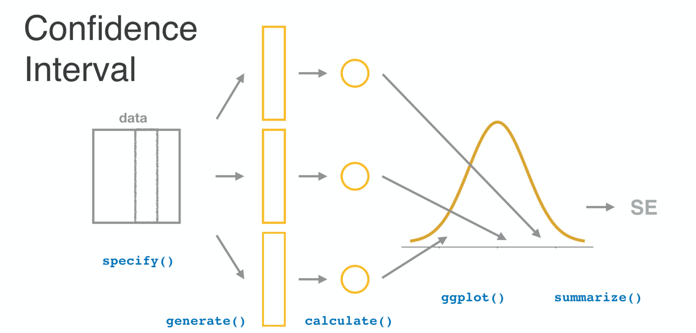
```

### 

It captures how much uncertainty you have in your estimate. The more data that your estimate is based upon, the narrower this distribution and the confidence interval become.

```{r echo=FALSE, out.width = "60%"}
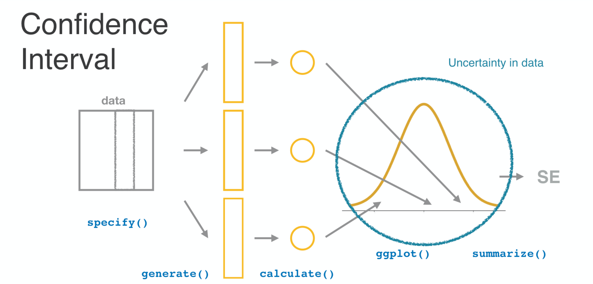
```

### Hypothesis test

A hypothesis test on a proportion asks the question: what sort of p-hats would you observe if the true parameter p held a particular value?

```{r echo=FALSE, out.width = "60%"}
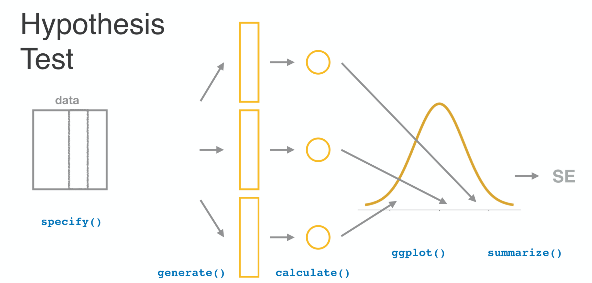
```

### 

We assert this hypothesis, this model of the true state of the world, using hypothesize.

```{r echo=FALSE, out.width = "60%"}
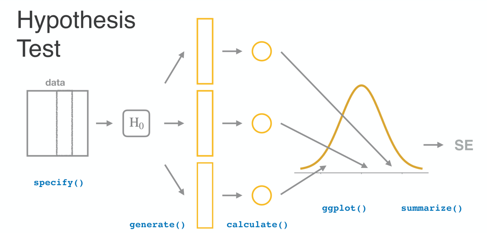
```

### 

The insertion of this command will cause generate to now generate data sets according to the world as set out in hypothesize.

```{r echo=FALSE, out.width = "60%"}
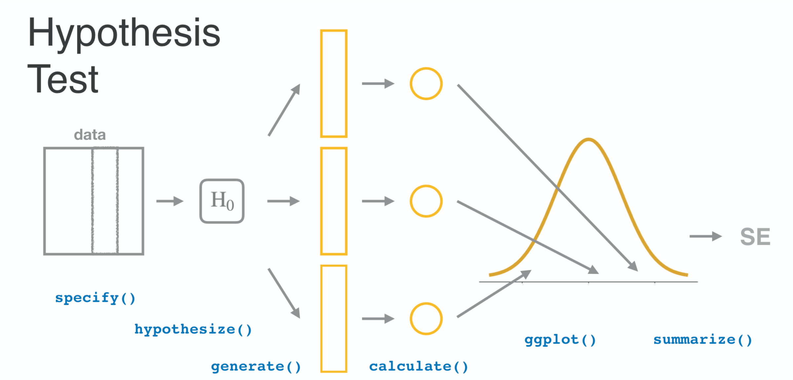
```

### 

Thus the sampling distribution, now called the null distribution, captures the variability in p-hat that you might observe in a world where H0 is true.

```{r echo=FALSE, out.width = "60%"}
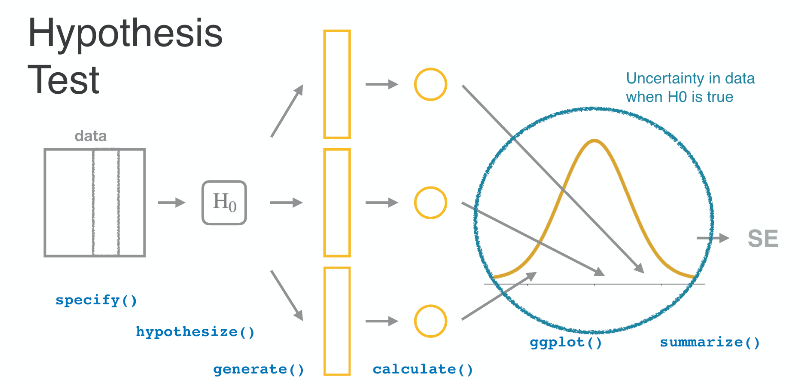
```

### Do half of Americans favor capital punishment?

Let’s use a hypothesis test to study another question on the gss. Respondents were asked if they favor or oppose capital punishment, also called the death penalty, for the crime of murder. You can look at the distribution of answers by forming a bar chart. You see that of the 150 respondents, more than half answered favor.

You can calculate that proportion, p-hat, CL more precisely using the summarize command, and you learn that the proportion is about 0.57.

```{r echo=TRUE}
p_hat <- gss2016 |>
  summarize(mean(cappun == "FAVOR")) |>
  pull()
p_hat
``` 

### 

Is this data consistent with a world in which only half of Americans favor the death penalty? It’s hard to say. We only have 150 subjects in our sample, so it’s possible that we happened to select slightly more people in favor of it just by chance. The hypothesis test helps sort this out. Begin by specifying the column that you’re interested in as well as the level of that variable that will indicate a success. We’ll use FAVOR, but you could just as easily use OPPOSE. 

Next, you hypothesize that the true proportion that favor is 0.5. This is an example of a "point" null hypothesis - you are fixing a particular point value for a parameter. 

Next, we generate through "simulation", 500 data sets that might occur under this hypothesis, and calculate the proportion that favor for each. We’ll save this data frame under the name null.

If you print out the top of the null data frame, you’ll see in the stat column you have 500 examples of the type of p-hats that might occur if in fact the true parameter is 0.5. Recall that in the confidence interval setting, these are clustered around the p-hat that was found in the original `gss2016` data set, whereas here they are clustered around the null value 0.5.

```{r include=FALSE}
set.seed(12345)
```

```{r echo=TRUE}
null <- gss2016 |>
  specify(response = cappun, success = "FAVOR") |>
  hypothesize(null = "point", p = 0.5) |> 
  generate(reps = 500, type = "draw") |> 
  calculate(stat = "prop")

null
``` 

### 

The distribution of those statistics can be visualized using a density plot. We’ll add in `geom_vline` to overlay a vertical red line at the location of our observed p-hat, 0.57. The curve represents the sort of p-hats you would see if p was 0.50 and the red line is the p-hat that you actually observed. If your p-hat is in the main part of the null distribution, then it is consistent with the null hypothesis. If it’s far into the tails, though, it’s deemed very unlikely if the null hypothesis were true. 

```{r eval=TRUE}
ggplot(null, aes(x = stat)) +
  geom_density() +
  geom_vline(
    xintercept = p_hat, 
    color = "red"
  )
```

This is formalized by computing the p-value, the proportion of generated p-hats that were more extreme than the observed p-hat. In other words, we want to summarize the column of statistics by finding the proportion that are greater than 0.57. We multiply that number by two to account for the left tail of the null distribution, which also contained p-hats that were farther from the center of the distribution than 0.57.

```{r eval=TRUE, echo=TRUE}
null |>
  summarize(mean(stat > p_hat)) |>
  pull() * 2
```

### Hypothesis test

- Null hypothesis: theory about the state of the world.
- Null distribution: distribution of test statistics assuming null is true.
- p-value: a measure of consistency between null hypothesis and your observations.
    - high p-value: consistent (p-val > alpha) 
    - low p-value: inconsistent (p-val < alpha)

To recap, the hypothesis test is formulated around a null hypothesis that states a theory about the way the world works, in this case the particular point value taken by a proportion. 

The null distribution provides a sense of the statistics, the p-hats, that would be calculated if you were to generate many data sets according to the null hypothesis. The p-value tells you where your actual observed p-hat falls into that distribution. 

If it's in the body of the distribution, the p-value will be high, indicating consistency between your data and the null hypothesis. 

If it's in the tails of the distribution, the p-value will be low, indicating that it's inconsistent with the null hypothesis.

### Life after death

In this lesson, you'll continue to dig into the data from the General Social Survey. One of the questions that was asked of respondents was: "Do you believe there is a life after death?" 

Let's see how your sample of Americans responded to this question in 2016.

Using `gss2016`, visualize the distribution of `postlife` as a bar plot.

```{r ex1, exercise=TRUE}
# Using `gss2016`, plot postlife
___ +
  # Add bar layer
  ___
```

```{r ex1-hint}
ggplot(___, aes(x = ___)) +
  geom_bar()
```

```{r ex1-solution}
# Using `gss2016`, plot postlife
ggplot(gss2016, aes(x = postlife)) +
  # Add bar layer
  geom_bar()
```

We can exclude the missing data by calling `na.omit`:

```{r ex1-naomit, exercise=TRUE}
gss2016_completecases <- gss2016 |>
                          na.omit
# Using `gss2016`, plot postlife
ggplot(gss2016_completecases, aes(x = postlife)) +
  # Add bar layer
  geom_bar()
```


Compute the proportion of respondents that do believe in life after death and save it has `p_hat`.

```{r ex2, exercise=TRUE}
# Calculate and save proportion that believe
p_hat <- ___ |>
  summarize(prop_yes = ___) |>
  pull()

# See the result
p_hat
```

```{r ex2-hint}
p_hat <- ___ |>
  na.omit() |> 
  summarize(prop_yes = mean(postlife == "YES")) |>
  pull()
```

```{r ex2-solution}
# Compute and save proportion that believe
p_hat <- gss2016 |>
  na.omit() |>
  summarize(prop_yes = mean(postlife == "YES")) |>
  pull()

# See the result
p_hat
```

### Generating from H0

Imagine that when reading the newspaper, you come across someone who makes the following claim: "3/4 of all Americans believe in life after death". This can be interpreted as a _point_ null hypothesis that the population proportion has a value of 0.75.

Use this hypothesis to generate a single data set to explore.

Using `gss2016`, 

- Specify the variable of interest and what constitutes a success.
- Form a `"point"` null hypothesis that the true proportion is 0.75.
- Generate a *single* simulated data set under this null hypothesis.


```{r ex3, exercise=TRUE}
# Generate one data set under H0
sim1 <- gss2016 |>
  # Specify the response and success
  ___(response = ___, success = ___) |>
  # Hypothesize the null value of p
  ___(null = ___, p = ___) |>
  # Generate a single simulated dataset
  ___(reps = ___, type = ___)

# See the result
sim1
```

```{r ex3-hint}
 
- In `specify()`, set `response` to `postlife` and `success` to `"YES"`.
- In `hypothesize()`, set `null` to `"point"` and `p` to `0.75`.
- In `generate()`, set `reps` to `1` and `type` to `"simulate"`.
```

```{r ex3-solution}
# Generate one data set under H0
sim1 <- gss2016 |>
  # Explicitly exclude missing data
  na.omit() |> 
  # Specify the response and success
  specify(response = postlife, success = "YES") |>
  # Hypothesize the null value of p
  hypothesize(null = "point", p = 0.75) |>
  # Generate a single simulated dataset
  generate(reps = 1, type = "draw")

# See the result
sim1
```


Using `sim1`, construct a bar plot to visualize the distribution of `postlife`.


```{r ex4, exercise=TRUE}
# From previous step
sim1 <- gss2016 |>
  na.omit() |> 
  specify(response = postlife, success = "YES") |>
  hypothesize(null = "point", p = 0.75) |>
  generate(reps = 1, type = "draw")

# Using sim1, plot postlife
___ +
  # Add bar layer
  ___
```

```{r ex4-hint}
- In `ggplot()`, use `sim1` as the dataset and map the `x` aesthetic to `postlife`.
- Use `geom_bar()`.
```

```{r ex4-solution}
# From previous step
sim1 <- gss2016 |>
  na.omit() |> 
  specify(response = postlife, success = "YES") |>
  hypothesize(null = "point", p = 0.75) |>
  generate(reps = 1, type = "draw")

# Using sim1, plot postlife
ggplot(sim1, aes(x = postlife)) +
  # Add bar layer
  geom_bar()
```

Compute the proportion of simulated respondents in `sim1` that believe in life after death.

```{r ex5, exercise=TRUE}
# From previous steps
sim1 <- gss2016 |>
  na.omit() |> 
  specify(response = postlife, success = "YES") |>
  hypothesize(null = "point", p = 0.75) |>
  generate(reps = 1, type = "draw")

# Compute proportion that believe
sim1 |>
  ___(prop_yes = ___(___ == "___")) |>
  pull()
```

```{r ex5-hint}
In `summarize()`, set `prop_yes` to the mean of cases where `postlife` equals `"YES"`.
```

```{r ex5-solution}
# From previous steps
sim1 <- gss2016 |>
  na.omit() |> 
  specify(response = postlife, success = "YES") |>
  hypothesize(null = "point", p = 0.75) |>
  generate(reps = 1, type = "draw")

# Compute proportion that believe
sim1 |>
    na.omit() |>    
    summarize(prop_yes = mean(postlife == "YES")) |>
    pull()
```

### Testing a claim

In the last exercise, you got a sense of what a single simulated p-hat might be if in fact the true proportion of believers was 0.75. That p-hat was likely different from the p-hat in `gss2016`, but was that a fluke or is there a systematic inconsistency between that claim and the data in the GSS?

In this exercise, you'll settle this question.

```{r testing_a_claim_setup, echo=FALSE}
sim1 <- gss2016 |>
  na.omit() |> 
  specify(response = postlife, success = "YES") |>
  hypothesize(null = "point", p = 0.75) |>
  generate(reps = 1, type = "draw")
# Find the observed proportion
p_hat <- gss2016 |>
    na.omit() |>    
    summarize(prop_yes = mean(postlife == "YES")) |>
    pull()
```

Extend your code for the last exercise to `calculate()` sample proportions of believers in 500 generated data sets. Save this collection of p-hats to `null`.

```{r ex6, exercise=TRUE}
# Generate null distribution
___ <- gss2016 |>
  na.omit() |> 
  specify(response = postlife, success = "YES") |>
  hypothesize(null = "point", p = 0.75) |>
  generate(reps = ___, type = "draw") |>
  # Calculate proportions
  ___(stat = ___)
```

```{r ex6-hint}
 `stat = "prop"`
```

```{r ex6-solution}
# Generate null distribution
null <- gss2016 |>
  na.omit() |> 
  specify(response = postlife, success = "YES") |>
  hypothesize(null = "point", p = 0.75) |>
  generate(reps = 500, type = "draw") |>
  # Calculate proportions
  calculate(stat = "prop")
```

Visualize the null distribution by creating a density plot of the statistics. Using `geom_vline()`, add a vertical line at the value of `p_hat` (from the last exercise), colored `"red"`. 

```{r ex7, exercise=TRUE, exercise.setup="testing_a_claim_setup"}
null <- gss2016 |>
  na.omit() |> 
  specify(response = postlife, success = "YES") |>
  hypothesize(null = "point", p = 0.75) |>
  generate(reps = 500, type = "draw") |>
  # Calculate proportions
  calculate(stat = "prop")


# Visualize null distribution
___ +
  # Add density layer
  ___ +
  # Add line at observed
  geom_vline(xintercept = ___, color = "___")
```

```{r ex7-hint}
 
- Use `geom_density()` without arguments to create a density plot. 
- In the `geom_vline()` call, `xintercept` to `p_hat` and `color` to `"red"`.
```

```{r ex7-solution}
null <- gss2016 |>
  na.omit() |> 
  specify(response = postlife, success = "YES") |>
  hypothesize(null = "point", p = 0.75) |>
  generate(reps = 500, type = "draw") |>
  # Calculate proportions
  calculate(stat = "prop")

# Visualize null distribution
ggplot(null, aes(x = stat)) +
  # Add density layer
  geom_density() +
  # Add line at observed
  geom_vline(xintercept = p_hat, color = "red")  
```

- Compute the one-tailed p-value by finding the proportion of null values that are greater than or equal to your observed `p_hat`. 
- Compute the two-tailed p-value (where the proportion of null values is equal to or more extreme than the observed `p_hat`) from this by multiplying by 2.

```{r ex8, exercise=TRUE, exercise.setup="testing_a_claim_setup"}
null <- gss2016 |>
  na.omit() |> 
  specify(response = postlife, success = "YES") |>
  hypothesize(null = "point", p = 0.75) |>
  generate(reps = 500, type = "draw") |>
  # Calculate proportions
  calculate(stat = "prop")


___ |>
  summarize(
    # Compute the one-tailed p-value
    one_tailed_pval = ___(___ >= ___),
    # Compute the two-tailed p-value
    two_tailed_pval = ___ * ___
  ) |>
  pull(two_tailed_pval)
```

```{r ex8-hint}
 Find the p-value by figuring out the proportion of `stat`s that are greater than or equal `p_hat`.
```

```{r ex8-solution}
null <- gss2016 |>
  na.omit() |> 
  specify(response = postlife, success = "YES") |>
  hypothesize(null = "point", p = 0.75) |>
  generate(reps = 500, type = "draw") |>
  # Calculate proportions
  calculate(stat = "prop")


null |>
  summarize(
    # Compute the one-tailed p-value
    one_tailed_pval = mean(stat >= p_hat),
    # Compute the two-tailed p-value
    two_tailed_pval = 2 * one_tailed_pval
  ) |>
  pull(two_tailed_pval)
```

### Making a decision

It's common practice to conclude a hypothesis test by making a binary decision about the validity of the null hypothesis. Using an alpha level of .05, what is your decision regarding the null hypothesis?

Remember, you can compute p-value with the following.

```{r eval=FALSE}
null |>
  summarize(pval = 2 * mean(stat > p_hat)) |>
  pull()
```

*Hint:* When the p-value is less than alpha, that's strong evidence that the data is inconsistent with the null hypothesis.

```{r mc1, echo=FALSE}
question("Using an alpha level of .05, what is your decision regarding the null hypothesis?",
  answer("The p-value < alpha, thus the data is consistent with the null hypothesis so I fail to reject it as a reasonable explanation.", message="Nope. Look carefully at your p-value. Is it less than 0.05?"),
  answer("The p-value < alpha, thus the data is inconsistent with the null hypothesis so I reject it as a reasonable explanation.", message="Nope. Look carefully at your p-value. Is it less than 0.05?"),
  answer("The p-value > alpha, thus the data is consistent with the null hypothesis so I fail to reject it as a reasonable explanation.", correct = TRUE, message="Great! This data is consistent with a model in which 3/4 of Americans believe in life after death."),
  answer("The p-value > alpha, thus the data is inconsistent with the null hypothesis so I reject it as a reasonable explanation.", message="Nope. High p-values indicate consistency between the null and your data."),
  allow_retry = TRUE
)
```


```{r, include=FALSE}
sim1 <- gss2016 |>
specify(response = postlife, success = "YES") |>
hypothesize(null = "point", p = .75) |>
generate(reps = 1, type = "draw")
p_hat <- gss2016 |>
summarize(mean(postlife == "YES", na.rm = TRUE)) |>
pull()
null <- gss2016 |>
  na.omit() |> 
  specify(response = postlife, success = "YES") |>
  hypothesize(null = "point", p = .75) |>
  generate(reps = 500, type = "draw") |>
  # Calculate proportions
  calculate(stat = "prop")

# Visualize null distribution
ggplot(null, aes(x = stat)) +
  # Add density layer
  geom_density() +
  # Add line at observed
  geom_vline(xintercept = p_hat, color = "red")

# Compute the two-tailed p-value
null |>
  summarize(pval = mean(stat >= p_hat)) |>
  pull() * 2
```

## Intervals for differences

If you haven't guessed already, we created the claim that 3/4 of Americans believe in life after death primarily to demonstrate how you can formulate a hypothesis test on a single proportion.


### A question in two variables

Do women and men believe at different rates?

Let $p$ be the proportion that believe in life after death.

- $H\_{0} : p\_{female} - p\_{male} = 0$ 
- $H\_{A} : p\_{female} - p\_{male} \ne 0$ 

There are plenty of more pressing questions that just beg to be asked of this data, but they require that we look at more than just a single variable. We're curious to know: do men and women believe at different rates? 

Let's let p be the true proportion that believe in life after death. 

We can then phrase this question as the null hypothesis that the difference in the proportion of men that believe and the proportion of women that believe is zero. 

The alternative hypothesis would then be that that difference is non-zero.


### Do women and men have different opinions on life after death?


```{r}
ggplot(gss2016, aes(x = sex, fill = postlife)) +
  geom_bar()
```


Let's take a look at how these proportions compare in the gss2016 data set. The data live in two columns, postlife and sex, so we can map sex to the x-axis and their belief to the color fill of the bars. If we add a geom_bar layer, we get a stacked bar chart that shows us that we have more females in our data set than males and that opinions are split.


### 


```{r }
ggplot(gss2016, aes(x = sex, fill = postlife)) +
  geom_bar(position = "fill")
```


We can convert these to proportions by adding the position equals "fill" argument. It looks like the proportion for men is a bit lower than the proportion for women.


### 


```{r }
p_hats <- gss2016 |>
  group_by(sex) |>
  summarize(mean(postlife == "YES", na.rm = TRUE)) |>
  pull()
``` 

```{r eval=FALSE}
d_hat <- diff(p_hats)
d_hat
``` 

```{out}
0.1472851
```


We can calculate the difference in these proportions by using our normal summarize method of calculating a proportion, but add in a group_by line to indicate we want to calculate that proportion for men and women separately. The result is a vector of two proportions. We take their difference with the diff function and save it as d-hats, which we learn is 0.147.


### Generating data from H0


- $H\_{0} : p\_{female} - p\_{male} = 0$

- There is no association between belief in the afterlife and the sex of a subject. 
- The variable `postlife` is independent from the variable `sex`.

&rArr; **Generate data by permutation** 


Now to answer the question of whether this statistic is consistent with the null hypothesis that the difference in proportions is zero, we need some way to generate data sets as if this were true. 

It's helpful to realize that we can restate in null hypothesis as "There is no association between belief in the afterlife and the sex of a subject." 

We could also phrase it as "The variable postlife is independent from the variable sex." Well, if there truly is no association between our two variables, we should be able generate more data simply by shuffling or permuting the data.


### Do women and men have different opinions on life after death?


```{r eval=FALSE}
gss2016 |>
  specify(
    response = postlife, 
    explanatory = sex, 
    success = "YES"
  ) |>
  hypothesize(null = "independence") |>
  generate(reps = 1, type = "permute")
```


To see how this generation works, let's start up our inference chain just like before, with specify feeding into hypothesize feeding into generate. We're looking to explain postlife based on the subjects sex, so we'll add that as an explanatory variable. The type of null that we're specifying is one of independence which allows us to generate data via permutation.

This code will work, but before we run it we'll make one change.

### 

```{r eval=FALSE}
gss2016 |>
  specify(
    postlife ~ sex,  # this line is new
    success = "YES"
  ) |>
  hypothesize(null = "independence") |>
  generate(reps = 1, type = "permute")
```


```{out}
Response: postlife (factor)
Explanatory: sex (factor)
Null Hypothesis:  independence 
# A tibble: 137 x 3
# Groups:   replicate [1]
   postlife sex    replicate
   <fct>    <fct>      <int>
 1 YES      FEMALE         1
 2 YES      MALE           1
 3 YES      FEMALE         1
 4 YES      MALE           1
 5 YES      MALE           1
 6 YES      FEMALE         1
 7 NO       FEMALE         1
``` 


and that is to specify the variables via the formula notation like this. It can be read as, "I'd like to explain postlife as a function of sex".

When we run this code, we see it generates a data set with these two columns but where the postlife column has been shuffled or permuted. Let's keep track: the six rows show YES and the seventh shows NO.


### 


```{r eval=FALSE}
gss2016 |>
  specify(
    postlife ~ sex, 
    success = "YES"
  ) |>
  hypothesize(null = "independence") |>
  generate(reps = 1, type = "permute")
```


```
Response: postlife (factor)
Explanatory: sex (factor)
Null Hypothesis:  independence 
# A tibble: 137 x 3
# Groups:   replicate [1]
   postlife sex    replicate
   <fct>    <fct>      <int>
 1 YES      FEMALE         1
 2 NO       MALE           1
 3 NO       FEMALE         1
 4 YES      MALE           1
 5 YES      MALE           1
 6 YES      FEMALE         1
 7 YES      FEMALE         1
 ``` 


So if we run this code again we'll get a different permutation. 

One with the second and third being NO and the rest being YES. Both are examples of data sets similar to the one that we observed, but generated as if from a world where there was no association between these variables.

Let's use this method to build up a full null distribution.


### 


 
```{r eval=FALSE}
gss2016 |>
  specify(postlife ~ sex, success = "YES") |>
  hypothesize(null = "independence") |>
  generate(reps = 500, type = "permute") |>
  calculate(stat = "diff in props", order = c("FEMALE", "MALE"))
```

```
Warning message:
Removed 13 rows containing missing values. 
``` 

The inference chain should look familiar but now we're going to generate 500 data sets and calculate a difference in proportions for each one. We need to specify the order of that difference, so we'll look at proportion of female minus proportion of male so that it's in the same order as the d-hat that we calculated from our data. 

You'll see a warning message pop up here. That's just to let us know that we have some missing data that have been excluded from our analysis. Earlier, we explicitly excluded such missing data by specifying `na.omit`.


### 


```{r eval=FALSE}
ggplot(null, aes(x = stat)) +
  geom_density() +
  geom_vline(xintercept = d_hat, color = "red")
```

**These data suggest that there is a difference between sexes in the belief of life after death.** 


```{r echo=FALSE, out.width = "60%"}
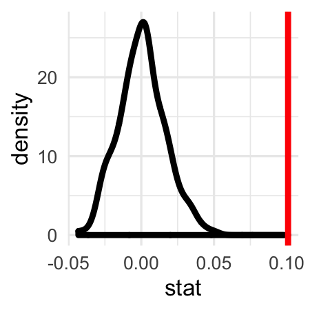
```


When we plot our observed statistic against the null distribution,  we learn that that observed difference of around 0.15 is quite a bit greater than the sort of differences that we'd see if there was no association.  This corresponds to a p-value of 0.02.  These data constitute evidence that there is a more general association between sex and belief in the afterlife in the population of all Americans.

### Death penalty and sex

While you're on the topic of death and the afterlife, take a look at another question from the GSS:

*Do you favor or oppose the death penalty for people convicted of murder?*

Your objective here is to explore if opinions on capital punishment (`cappun`) diverged between men and women in the `gss2016` data.

Construct a bar plot to visualize the distribution of `cappun` broken down by `sex`. To enable easy comparison, be sure you're plotting proportions instead of counts (recall this means you set the position of the bars so that they `"fill"` the plot).


```{r ex9, exercise=TRUE}
# Plot distribution of sex filled by cappun
___(___, aes(x = ___, fill = ___)) +
  # Add bar layer
  ___(position = "___")
```

```{r ex9-hint}
 To plot proportions instead of counts, set `position` to `"fill"` within your bar layer.
```

```{r ex9-solution}
# Plot distribution of sex filled by cappun
ggplot(gss2016, aes(x = sex, fill = cappun)) +
  # Add bar layer
  geom_bar(position = "fill")
```


Compute the proportion that `FAVOR` for men and women respectively, then save that two-element vector to `p_hats`. `pull()` is used (here and elsewhere) to pull the values out of the data frame for subsequent computation.


```{r ex10, exercise=TRUE}
# Compute two proportions
___ <- gss2016 |>
  # Group by sex
  group_by(___) |>
  # Calculate proportion that FAVOR
  summarize(prop_favor = ___) |>
  pull()

# See the result
p_hats
```

```{r ex10-hint}
 Group the data by the `sex` variable to find the proportion of respondents that favor capital punishment in each group.
```

```{r ex10-solution}
# Compute two proportions
p_hats <- gss2016 |>
  # Group by sex
  group_by(sex) |>
  # Calculate proportion that FAVOR
  summarize(prop_favor = mean(cappun == "FAVOR")) |>
  pull()

# See the result
p_hats
```


Compute the difference in `p_hats` using the `diff()` function and save it to `d_hat`.


```{r ex11, exercise=TRUE}
# From previous step
p_hats <- gss2016 |>
  group_by(sex) |>
  summarize(prop_favor = mean(cappun == "FAVOR")) |>
  pull()
  
# Compute difference in proportions
d_hat <- ___

# See the result
d_hat
```

```{r ex11-hint}
 Use the `diff()` function to find the difference between the two elements of `p_hats`.
```

```{r ex11-solution}
# From previous step
p_hats <- gss2016 |>
  group_by(sex) |>
  summarize(prop_favor = mean(cappun == "FAVOR")) |>
  pull()
  
# Compute difference in proportions
d_hat <- diff(p_hats)

# See the result
d_hat
```


### Hypothesis test on the difference in proportions


In the last exercise you learned that about 52% of women favor the death penalty while about 63% of men do, a difference of about 11 percentage points. That seems like a large difference, but what if it's just due to chance and in fact there is no relationship between sex and support for the death penalty? Find out by testing the null hypothesis that sex and support for the death penalty are independent of one another.

The `stat`istic that you'll be using in this exercise is a `"diff in props"`, which requires that you specify the order of the difference by adding an argument, `order = c("FIRST", "SECOND")`, where first and second refer to the group names. This results in the calculation: FIRST - SECOND.


```{r d_hat_difference}
p_hats <- gss2016 |>
  group_by(sex) |>
  summarize(mean(cappun == "FAVOR", na.rm = TRUE)) |>
  pull()

# Compute difference in proportions
d_hat <- diff(p_hats)
set.seed(31)
```


Set up an infer chain which ends with the calculation of many differences in proportions, calculated as the proportion of `"FEMALE"` that `"FAVOR"` minus the proportion of `"MALE"` that do. Save the result to `null`.


```{r ex12, exercise=TRUE}
# Create null distribution
___ <- gss2016 |>
  # Specify the response and explanatory as well as the success
  ___(___ ~ ___, success = "___") |>
  # Set up null hypothesis
  ___(null = "___") |>
  # Generate 500 reps by permutation
  ___(___ = ___, ___ = "___") |>
  # Calculate the statistics
  ___(stat = ___, order = c("___", "___"))
```

```{r ex12-hint}
 In `calculate()` you need to specify the `stat` and `order` arguments this time.
```

```{r ex12-solution}
# Create null distribution
null <- gss2016 |>
  # specify the response and explanatory as well as the success
  specify(cappun ~ sex, success = "FAVOR") |>
  # set up null hypothesis
  hypothesize(null = "independence") |>
  # generate 500 permuted reps
  generate(reps = 500, type = "permute") |>
  # calculate the statistics
  calculate(stat = "diff in props", order = c("FEMALE", "MALE"))
```


Construct a density plot to visualize the statistics stored in the `null` distribution and add a vertical red line to indicate the observed test statistic `d_hat` that you calculated in the last exercise.


```{r ex13, exercise=TRUE, exercise.setup="d_hat_difference"}
# From previous step
null <- gss2016 |>
  specify(cappun ~ sex, success = "FAVOR") |>
  hypothesize(null = "independence") |>
  generate(reps = 500, type = "permute") |>
  calculate(stat = "diff in props", order = c("FEMALE", "MALE"))
  
# Visualize null
___ +
  # Add density layer
  __ +
  # Add red vertical line at obs stat
  geom_vline(xintercept = ___, color = "___")
```

```{r ex13-hint}
 Use `geom_density()` to create a density plot.
```

```{r ex13-solution}
# From previous step
null <- gss2016 |>
  specify(cappun ~ sex, success = "FAVOR") |>
  hypothesize(null = "independence") |>
  generate(reps = 500, type = "permute") |>
  calculate(stat = "diff in props", order = c("FEMALE", "MALE"))
  
# Visualize null
ggplot(null, aes(x = stat)) +
  # Add density layer
  geom_density() +
  # Add red vertical line at obs stat
  geom_vline(xintercept = d_hat, color = "red")
```

Compute the two-tailed p-value.

- Compute the one-tailed p-value by summarizing the statistics column by the proportion of statistics that are less than or equal to `d_hat`.
- Double it to get the two-tailed p-value.


```{r ex14, exercise=TRUE, exercise.setup="d_hat_difference"}
# From previous step
null <- gss2016 |>
  specify(cappun ~ sex, success = "FAVOR") |>
  hypothesize(null = "independence") |>
  generate(reps = 500, type = "permute") |>
  calculate(stat = "diff in props", order = c("FEMALE", "MALE"))
  
# Compute two-tailed p-value
null |>
  ___(
    one_tailed_pval = ___(___ ___ ___),
    two_tailed_pval = ___ * ___
  ) |>
  pull(two_tailed_pval)
```

```{r ex14-hint}
 Use the `mean()` function to find the proportion of statistics that are less than `d_hat`.
```

```{r ex14-solution}
# From previous step
null <- gss2016 |>
  specify(cappun ~ sex, success = "FAVOR") |>
  hypothesize(null = "independence") |>
  generate(reps = 500, type = "permute") |>
  calculate(stat = "diff in props", order = c("FEMALE", "MALE"))
  
# Compute two-tailed p-value
null |>
  summarize(
    one_tailed_pval = mean(stat <= d_hat),
    two_tailed_pval = 2 * one_tailed_pval
  ) |>
  pull(two_tailed_pval)
```


### Interpreting the test

What is your conclusion regarding the association between sex and support for the death penalty? Recall that this code calculates the p-value:
```{r eval=FALSE}
# Compute two-tailed p-value
null |>
  summarize(pval = 2 * mean(stat <= d_hat))
```

*Hint:* Recall that the null hypothesis you are testing is that there is no association between `cappun` and `sex`.

```{r mc2, echo=FALSE}
question("",
  answer("The data are consistent with the hypothesis that there is no association.",correct = TRUE, message="Bingo! Despite the difference that we found between men and women in our sample, it quite possible it's simply an artifact of the process of drawing a random sample."),
  answer("The data are strong evidence that there is an association.", message="Incorrect. If the data constituted strong evidence against the null, it would be farther into the tails of the null distribution."),
  answer("The data are not suitable to answer this particular question.", message="Incorrect. The survey is a representative sample of Americans and the questions directly address the association between sex and support for the death penalty."),
  allow_retry = TRUE
)
```


```{r, include=FALSE}
set.seed(31)
null <- gss2016 |>
  specify(cappun ~ sex, success = "FAVOR") |>
  hypothesize(null = "independence") |>
  generate(reps = 500, type = "permute") |>
  calculate(stat = "diff in props", order = c("FEMALE", "MALE"))

p_hats <- gss2016 |>
  group_by(sex) |>
  summarize(mean(cappun == "FAVOR", na.rm = TRUE)) |>
  pull()

# Compute difference in proportions
d_hat <- diff(p_hats)
# Visualize null
ggplot(null, aes(x = stat)) +
  geom_density() +
  geom_vline(xintercept = d_hat, color = "red")
```

### Hypothesis tests and confidence intervals

As was mentioned at the very beginning of this lesson, there is a close link between hypothesis tests and confidence intervals. The former explores whether a particular hypothesis about the world is consistent with your data. The latter has no hypothesis, it simply quantifies your uncertainty in your point estimate by adding and subtracting the margin of error.

In this exercise you will explore the duality by forming a confidence interval around the difference in proportions, `d_hat`. To get you started, here is the code that you used to form the null distribution:

```
# Reference code for null distribution
null <- gss2016 |>
   specify(cappun ~ sex, success = "FAVOR") |>
   hypothesize(null = "independence") |>
   generate(reps = 500, type = "permute") |>
   calculate(stat = "diff in props", order = c("FEMALE", "MALE"))`
```


```{r}
p_hats <- gss2016 |>
  group_by(sex) |>
  summarize(mean(cappun == "FAVOR", na.rm = TRUE)) |>
  pull()

# Compute difference in proportions
d_hat <- diff(p_hats)
```


Adapt the code used to form the *null distribution* for hypothesis test to form the *bootstrap distribution* for use in a confidence interval.

- Remove the hypothesis step.
- Change the generation type to `"bootstrap"`.
- Save it as `boot`.

```{r ex15, exercise=TRUE}
# Create the bootstrap distribution
___ <- gss2016 |>
  # Specify the variables and success
  ___ |>
  # Generate 500 bootstrap reps
  ___ |>
  # Calculate statistics
  ___
```

```{r ex15-hint}
 When using the bootstrap to create a confidence interval, you no longer have to `hypothesize()`.
```

```{r ex15-solution}
# Create the bootstrap distribution
boot <- gss2016 |>
  # Specify the variables and success
  specify(cappun ~ sex, success = "FAVOR") |>
  # Generate 500 bootstrap reps
  generate(reps = 500, type = "bootstrap") |>
  # Calculate the statistics
  calculate(stat = "diff in props", order = c("FEMALE", "MALE"))
```


- Compute the standard deviation, `sd()`,  of the bootstrap distribution to estimate the standard error and save it as `SE`.
- Formulate the 95% confidence interval for `d_hat` by subtracting and adding 2 SEs.

```{r ex16, exercise=TRUE, exercise.setup="d_hat_difference"}
# From previous step
boot <- gss2016 |>
  specify(cappun ~ sex, success = "FAVOR") |>
  generate(reps = 500, type = "bootstrap") |>
  calculate(stat = "diff in props", order = c("FEMALE", "MALE"))
    
# Compute the standard error
___ <- ___ |>
  summarize(se = ___(___)) |>
  pull()
  
# Form the CI (lower, upper)
c(___, ___)
```

```{r ex16-hint}

- The `sd()` function computes the standard deviation.
- The bounds of the confidence interval are the observed statistic plus or minus twice the standard error.
```

```{r ex16-solution}
# From previous step
boot <- gss2016 |>
  specify(cappun ~ sex, success = "FAVOR") |>
  generate(reps = 500, type = "bootstrap") |>
  calculate(stat = "diff in props", order = c("FEMALE", "MALE"))
    
# Compute the standard error
SE <- boot |>
  summarize(se = sd(stat)) |>
  pull()
  
# Form the CI (lower, upper)
c(d_hat - 2 * SE, d_hat + 2 * SE)
```

## Statistical errors

Any time you perform a hypothesis test, there is a chance that you've made an error. We're not talking about an error in your measurements or an error in your code - those happen too. I'm talking about statistical errors, errors that are baked in to the procedure of a hypothesis test.


### 

The first such error can occur in situations where the null hypothesis that you're testing is indeed true.

```{r echo=FALSE, out.width = "60%"}

```

### 

In this case, you would be right to retain the null hypothesis,

```{r echo=FALSE, out.width = "60%"}

```


### 

and you'd be committing what's called a Type I error if you rejected it.

```{r echo=FALSE, out.width = "60%"}
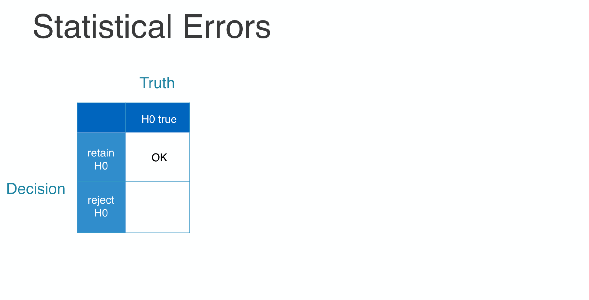
```

### 

```{r echo=FALSE, out.width = "60%"}

```

### 

What is the probability that you will reject a true null hypothesis?

```{r echo=FALSE, out.width = "60%"}
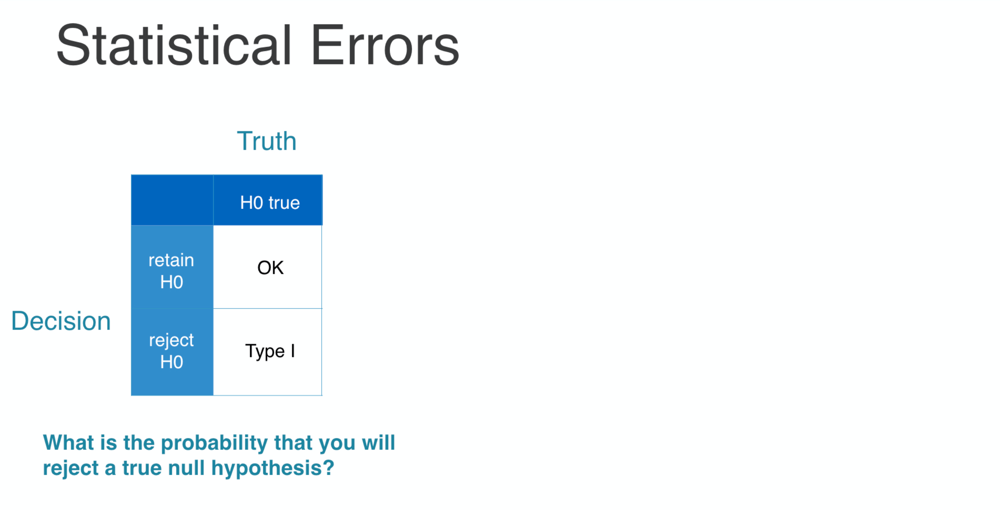
```

### 

Consider the situation where you're testing a null hypothesis that the difference in two proportions is zero.

```{r echo=FALSE, out.width = "60%"}
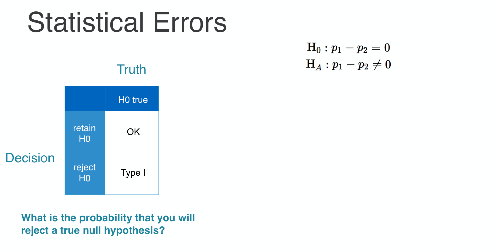
```

### 

You can use either permutation or the normal approximation to find the null distribution...

```{r echo=FALSE, out.width = "60%"}
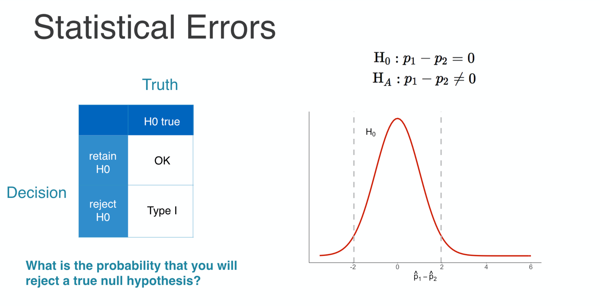
```

### 

The distribution of the differences in p-hats that you might observe in a given sample if the null is true.

```{r echo=FALSE, out.width = "60%"}
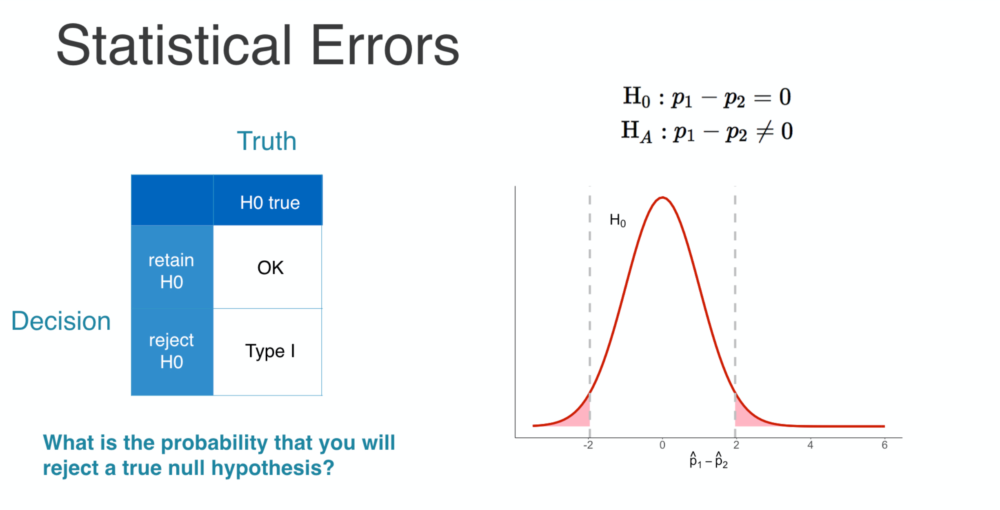
```

### 

If the sample statistic calculated from your data falls into the tails of this distribution, it is considered too unlikely to have happened under the null hypothesis, so you would reject the null.

```{r echo=FALSE, out.width = "60%"}

```

### 

This is formalized by checking to see if the statistic falls within the area of the tails that account for some proportion, alpha, of the total distribution. It's most common to set alpha to point-0-5.

```{r echo=FALSE, out.width = "60%"}
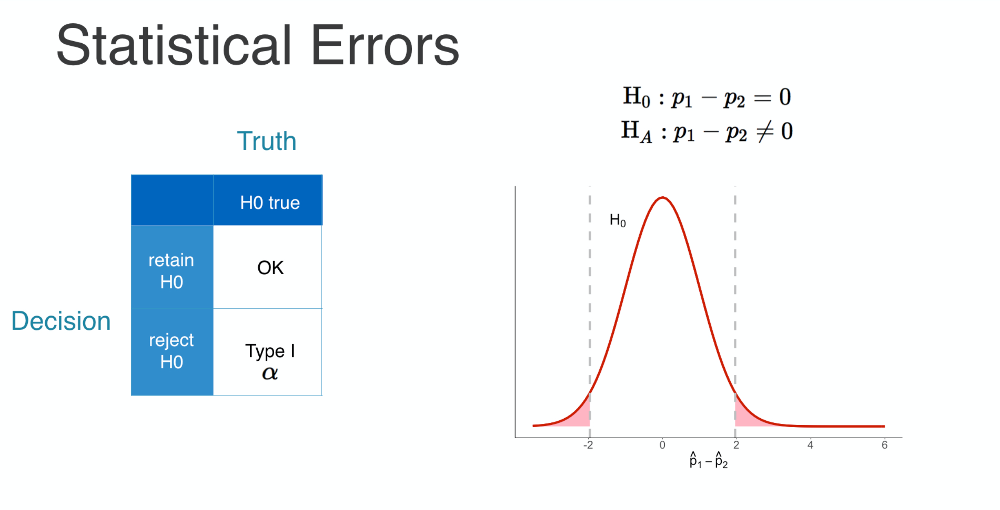
```

### 

Since you will reject the null hypothesis anytime you observe a statistic in this region, in setting alpha you're actually setting your Type I error rate.

```{r echo=FALSE, out.width = "60%"}
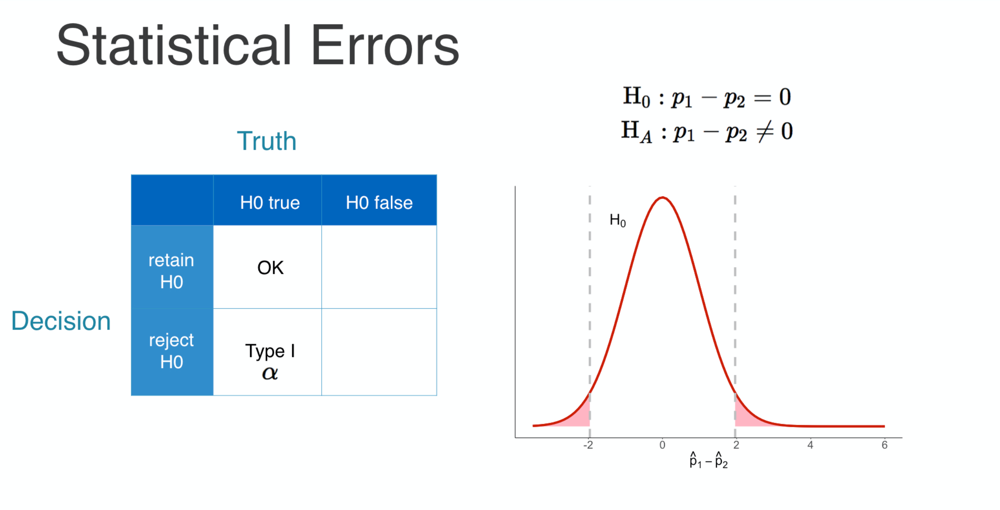
```

### 

If you use alpha equal to point-0-5, you're resigning yourself to incorrectly rejecting the null hypothesis 5% of the time.

```{r echo=FALSE, out.width = "60%"}
knitr::include_graphics("images/2-3-13.png")
```

### 

There's a second type of error to be aware of when conducting hypothesis tests, one that occurs when in fact H0 is false and some other model we'll call HA is the true model.

```{r echo=FALSE, out.width = "60%"}

```

### 

One hopes that after looking at your data and computing a p-value you would decide to reject H0.

```{r echo=FALSE, out.width = "60%"}

```

### 

If you fail to reject H0, you've committed what's called a Type II error.

```{r echo=FALSE, out.width = "60%"}
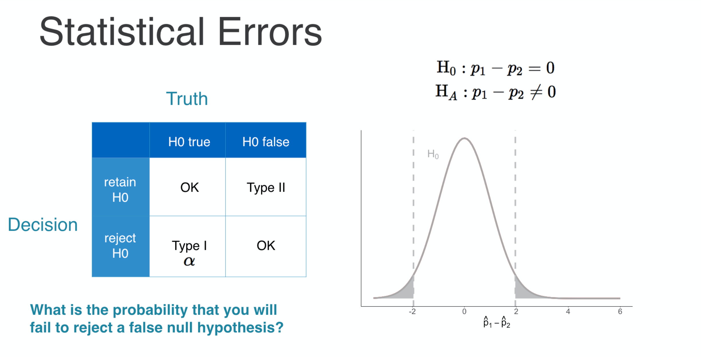
```

### 

To visualize a Type II error, you have to start by realizing that H0 is no longer the model that is generating your data. Now, it's coming from HA.

```{r echo=FALSE, out.width = "60%"}
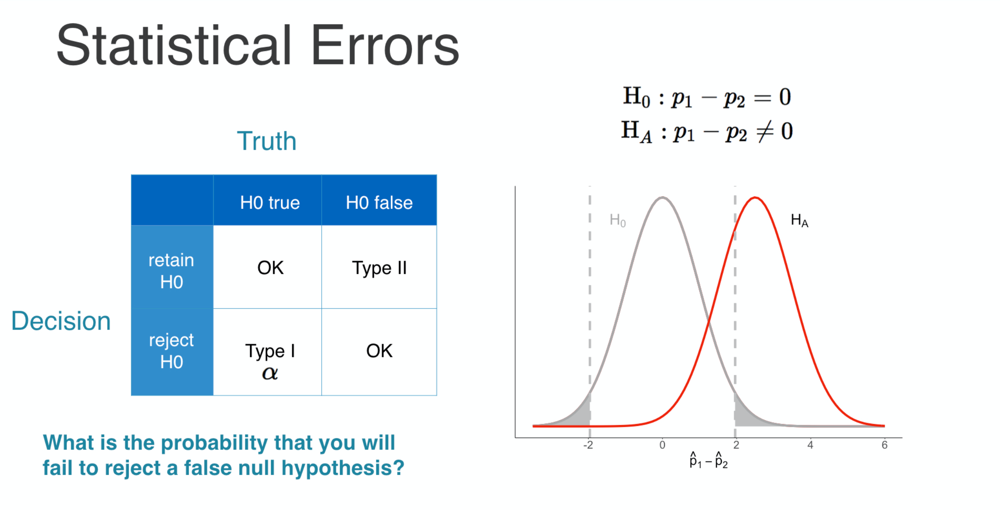
```

### 

However, you are using the same thresholds, those dotted gray lines, for the reject and fail-to-reject regions, so you will retain H0 whenever you observe a statistic in this region.

```{r echo=FALSE, out.width = "60%"}

```

### 

The probability of that event corresponds to the area shaded here, which is usually given the Greek letter beta.

```{r echo=FALSE, out.width = "60%"}
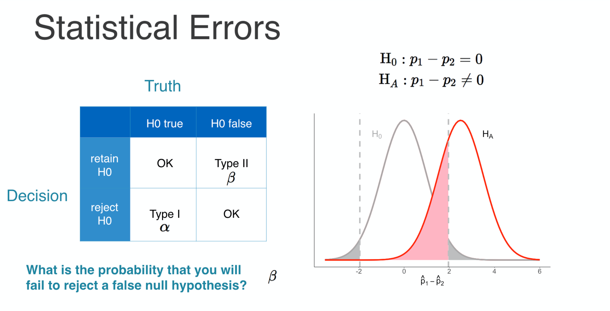
```

The other potion of the area under this curve, 1 - Beta, is called the power. The statistical power of the test is the probability that it will reject H0 if in fact it is false. Said another way, it's your power to detect an effect if it exists. This is an extremely important property of a statistical test. In general, you can affect and increase in the power in two ways. First is to increase the size of the reject region by increasing alpha. This has a trade-off though: now you're increased the Type I error rate. The second is to increase your sample size. This will have the effect of shrinking the variance of these curves, which would increase the area of the curve that is in the reject region.

### When the null is true

In this exercise, you will run an experiment: what happens when you conduct a hypothesis test when you *know* that the null hypothesis is true? You hope that you will retain the null hypothesis, but there's always a chance that you will make a statistical error.

To begin the experiment, we have created a new explanatory variable called `coinflip` that captures the result of a fair coin toss for every subject. With that variable in hand you can pose the following null hypothesis:

$$
H\_{0}: p\_{heads} - p\_{tails} = 0
$$

This claims that there is no difference in the proportions that favor the death penalty between the people that flipped `"heads"` and those that flipped `"tails"`. Since `coinflip` was formed independently of `cappun`, we *know* that this null hypothesis is true. The question is: will your test reject or retain this null hypothesis?


```{r gssmod_init}
# Set seed
set.seed(384)

# Add coinflip column
gssmod <- gss2016 |>
  mutate(coinflip  = sample(c("heads", "tails"), 
  size = nrow(gss2016), 
  replace = TRUE, 
  prob = c(0.5, 0.5)))
```

- *Inspect the new `coinflip` variable.*
- Compute the proportions that `FAVOR` among both `heads` and `tails` values of `coinflip` using the dataset `gssmod`. Save this statistic to `p_hats`.

```{r ex17, exercise=TRUE, exercise.setup="gssmod_init"}
# Inspect coinflip
gssmod |>
  select(coinflip)

# Compute two proportions
___ <- gssmod |>
  group_by(coinflip) |>
  summarize(prop_favor = mean(___ == ___)) |>
  pull()
  
# See the result
p_hats
```

```{r ex17-hint}
 Use the `mean()` function to compute the proportions you're after.
```

```{r ex17-solution}
# Inspect coinflip
gssmod |>
  select(coinflip)
  
# Compute two proportions
p_hats <- gssmod |>
  group_by(coinflip) |>
  summarize(prop_favor = mean(cappun == "FAVOR")) |>
  pull()
  
# See the result
p_hats
```

Compute your final test statistic, `d_hat`, as the difference in `p_hats`.

```{r ex18, exercise=TRUE, exercise.setup="gssmod_init"}
# From previous step
p_hats <- gssmod |>
  group_by(coinflip) |>
  summarize(prop_favor = mean(cappun == "FAVOR")) |>
  pull()
  
# Compute difference in proportions
d_hat <- ___
```

```{r ex18-hint}
 The `diff()` function will calculate the difference between the two elements of `p_hats`.
```

```{r ex18-solution}
# From previous step
p_hats <- gssmod |>
  group_by(coinflip) |>
  summarize(prop_favor = mean(cappun == "FAVOR")) |>
  pull()
  
# Compute difference in proportions
(d_hat <- diff(p_hats))
```

Construct the null distribution of the difference in proportions under the null hypothesis that `cappun` and `coinflip` are independent and save it to `null`. Note that the order of the difference should be `"heads"` then `"tails"`.

```{r ex19, exercise=TRUE, exercise.setup="gssmod_init"}
# From previous steps
p_hats <- gssmod |>
  group_by(coinflip) |>
  summarize(prop_favor = mean(cappun == "FAVOR")) |>
  pull()
d_hat <- diff(p_hats)

# Form null distribution
null <- gssmod |>
  # Specify the response and explanatory var and success
  __
  # Set up the null hypothesis
  ___
  # Generate 500 permuted data sets
  ___
  # Calculate statistics
  ___
```

```{r ex19-hint}
 Use the formula `cappun ~ coinflip` in `specify()`.
```

```{r ex19-solution}
# From previous steps
p_hats <- gssmod |>
  group_by(coinflip) |>
  summarize(prop_favor = mean(cappun == "FAVOR")) |>
  pull()
d_hat <- diff(p_hats)

# Form null distribution
null <- gssmod |>
  # Specify the response and explanatory var and success
  specify(cappun ~ coinflip, success = "FAVOR") |>
  # Set up the null hypothesis
  hypothesize(null = "independence") |>
  # Generate 500 permuted data sets
  generate(reps = 500, type = "permute") |>
  # Calculate statistics
  calculate(stat = "diff in props", order = c("heads", "tails"))
```

Visualize the distribution of the null statistics using a density plot and add a vertical red line at the value of your observed `d_hat`.

```{r ex20, exercise=TRUE, exercise.setup="gssmod_init"}
# From previous steps
p_hats <- gssmod |>
  group_by(coinflip) |>
  summarize(prop_favor = mean(cappun == "FAVOR")) |>
  pull()
d_hat <- diff(p_hats)
null <- gssmod |>
  specify(cappun ~ coinflip, success = "FAVOR") |>
  hypothesize(null = "independence") |>
  generate(reps = 500, type = "permute") |>
  calculate(stat = "diff in props", order = c("heads", "tails"))
  
# Visualize null
___ +
  # Add density layer
  ___ +
  # Add vertical red line at observed stat
  ___
```

```{r ex20-hint}
 You can create a density plot with `geom_density()`.
```

```{r ex20-solution}
# From previous steps
p_hats <- gssmod |>
  group_by(coinflip) |>
  summarize(prop_favor = mean(cappun == "FAVOR")) |>
  pull()
d_hat <- diff(p_hats)
null <- gssmod |>
  specify(cappun ~ coinflip, success = "FAVOR") |>
  hypothesize(null = "independence") |>
  generate(reps = 500, type = "permute") |>
  calculate(stat = "diff in props", order = c("heads", "tails"))
  
# Visualize null
ggplot(null, aes(x = stat)) +
  # Add density layer
  geom_density() +
  # Add vertical red line at obs stat
  geom_vline(xintercept = d_hat, color = "red")
```

### Decision

In the last exercise, the observed difference in proportions is comfortably in the middle of the null distribution. In this exercise, you'll come to a formal decision on if you should reject the null hypothesis, but instead of using p-values, you'll use the notion of a rejection region.

The rejection region is the range of values of the statistic that would lead you to reject the null hypothesis. In a two-tailed test, there are two rejection regions. You know that the upper region should contain the largest 2.5% of the null statistics (when alpha = .05), so you can extract the cutoff value by finding the .975 `quantile()`. Similarly, the lower region contains the smallest 2.5% of the null statistics, which can also be found using `quantile()`.

Here's a quick look at how the `quantile()` function works for this simple data set `x`.

```{r}
x <- c(0, 2, 4, 6, 8, 10, 12, 14, 16, 18, 20)
quantile(x, probs = .5)
quantile(x, probs = .8)
```

Once you have the rejection region defined by the upper and lower cutoffs, you can make your decision regarding the null by checking if your observed statistic falls between those cutoffs (in which case you will fail to reject) or outside of them (in which case you will reject).


```{r decision_init, echo=FALSE}
set.seed(384)
gssmod <- gss2016 |>
  mutate(coinflip  = sample(c("heads", "tails"), 
                       size = nrow(gss2016), 
                       replace = TRUE,
                       prob = c(0.5, 0.5)))
p_hats <- gssmod |>
  group_by(coinflip) |>
  summarize(mean(cappun == "FAVOR")) |>
  pull()
d_hat <- diff(p_hats)
null <- gssmod |>
  specify(cappun ~ coinflip, success = "FAVOR") |>
  hypothesize(null = "independence") |>
  generate(reps = 500, type = "permute") |>
  calculate(stat = "diff in props", order = c("heads", "tails"))
```

- Create an object called `alpha` that takes the value `0.05`.
- Find the upper cutoff by starting with the `null` data frame, which has been carried over from the last exercise, and summarizing the `stat` column by finding the alpha / 2 `quantile()`. Save this value as `lower`. Next, find the 1 - alpha / 2 `quantile()` and save it to `upper`.
- Check if your observed value of `d_hat` is `between()` the `lower` and `upper` cutoffs to find whether you should fail to reject the null hypothesis.

```{r ex21, exercise=TRUE, exercise.setup="decision_init"}
# Set alpha
___

# Find cutoffs
lower <- null |>
  summarize(l = quantile(___, probs = ___)) |>
  pull()
upper <- null |>
  summarize(u = quantile(___, probs = ___)) |>
  pull()

# Is d_hat inside cutoffs?
d_hat |>
  between(___, ___)
```

```{r ex21-hint}
 
- To find the upper bound, place `quantile(stat, probs = 1 - alpha/2)` in your call to `summarize()`.
- The `between()` function takes the arguments `x`, `left`, and `right` and returns `TRUE` or `FALSE`.
```

```{r ex21-solution}
# Set alpha
alpha <- 0.05

# Find cutoffs
lower <- null |>
  summarize(l = quantile(stat, probs = alpha / 2)) |>
  pull()
upper <- null |>
  summarize(u = quantile(stat, probs = 1 - alpha / 2)) |>
  pull()
  
# Is d_hat inside cutoffs?
d_hat |>
  between(lower, upper)
```

Visualize the reject and fail to reject regions by starting with your null distribution from last time and adding one vertical blue line for each cutoff.

```{r ex22, exercise=TRUE, exercise.setup="decision_init"}
# From previous step
alpha <- 0.05
upper <- null |>
  summarize(u = quantile(stat, probs = 1 - alpha / 2)) |>
  pull()
lower <- null |>
  summarize(l = quantile(stat, probs = alpha / 2)) |>
  pull()
  
# Visualize cutoffs
ggplot(null, aes(x = stat)) +
  geom_density() +
  geom_vline(xintercept = d_hat, color = "red") +
  # Add vertical blue line for lower cutoff
  geom_vline(xintercept = ___, color = "___") +
  # Add vertical blue line for upper cutoff
  geom_vline(xintercept = ___, color = "___")
```

```{r ex22-hint}
 Add two more calls to `geom_vline()`, with `lower` and `upper` as the respective x-intercepts, both colored `"blue"`.
```

```{r ex22-solution}
# From previous step
alpha <- 0.05
upper <- null |>
  summarize(u = quantile(stat, probs = 1 - alpha / 2)) |>
  pull()
lower <- null |>
  summarize(l = quantile(stat, probs = alpha / 2)) |>
  pull()
  
# Visualize cutoffs
ggplot(null, aes(x = stat)) +
  geom_density() +
  geom_vline(xintercept = d_hat, color = "red") +
  # Add vertical blue line for lower cutoff
  geom_vline(xintercept = lower, color = "blue") +
  # Add vertical blue line for upper cutoff
  geom_vline(xintercept = upper, color = "blue")
```


## Congratulations!

You have successfully completed Lesson 2 in Tutorial 5: Statistical inference.  
If you need to generate a hash for submission, click "Next Topic".

What's next?

`r emo::ji("ledger")` [Full list of tutorials supporting OpenIntro::Introduction to Modern Statistics](https://openintrostat.github.io/ims-tutorials/)

`r emo::ji("spiral_notepad")` [Tutorial 5: Statistical inference](https://openintrostat.github.io/ims-tutorials/05-infer/)

`r emo::ji("one")` [Tutorial 5 - Lesson 1: Inference for a single proportion](https://openintro.shinyapps.io/ims-05-infer-01/)

`r emo::ji("two")` [Tutorial 5 - Lesson 2: Hypothesis Tests to Compare Proportions](https://openintro.shinyapps.io/ims-05-infer-02/)

`r emo::ji("three")` [Tutorial 5 - Lesson 3: Chi-squared Test of Independence](https://openintro.shinyapps.io/ims-05-infer-03/)

`r emo::ji("four")` [Tutorial 5 - Lesson 4: Chi-squared Goodness of Fit Test](https://openintro.shinyapps.io/ims-05-infer-04/)

`r emo::ji("five")` [Tutorial 5 - Lesson 5: Bootstrapping for estimating a parameter](https://openintro.shinyapps.io/ims-05-infer-05/)

`r emo::ji("six")` [Tutorial 5 - Lesson 6: Introducing the t-distribution](https://openintro.shinyapps.io/ims-05-infer-06/)

`r emo::ji("seven")` [Tutorial 5 - Lesson 7: Inference for difference in two parameters](https://openintro.shinyapps.io/ims-05-infer-07/)

`r emo::ji("eight")` [Tutorial 5 - Lesson 8: Comparing many means](https://openintro.shinyapps.io/ims-05-infer-08/)

`r emo::ji("open_book")` [Learn more at Introduction to Modern Statistics](http://openintro-ims.netlify.app/)


## Submit

```{r, echo=FALSE, context="server"}
source(here::here("encoder_logic.R"))
encoder_logic()
```

```{r encode, echo=FALSE}
source(here::here("encoder_ui.R"))
learnrhash::encoder_ui(ui_before = hash_encoder_ui)
```

