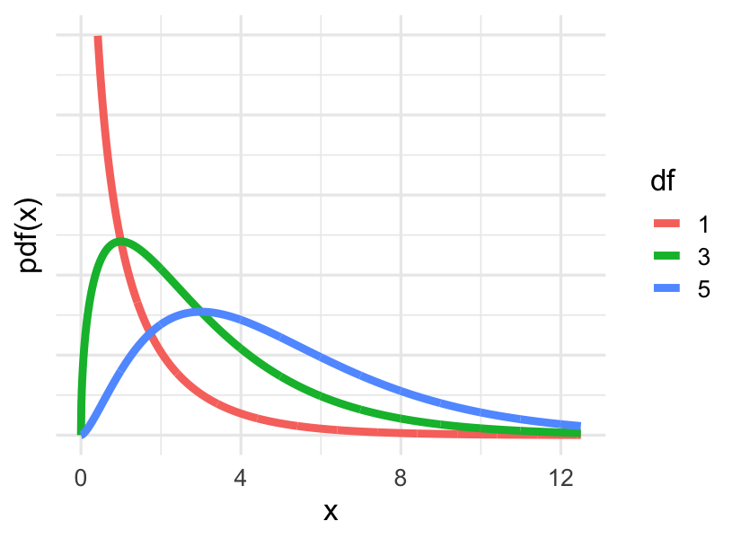

```{r setup, include=FALSE}
# load packages ----------------------------------------------------------------
library(learnr)
library(openintro)
library(broom)
library(knitr)
library(tidyverse)
library(infer)
library(emo)
library(patchwork)

# knitr options ----------------------------------------------------------------

knitr::opts_chunk$set(fig.align = "center", 
                      fig.height = 3, 
                      fig.width = 5,
                      echo = FALSE, 
                      message = FALSE, 
                      warning = FALSE)

# data prep --------------------------------------------------------------------

# load data

gss2016 <- read_rds("data/gss-sampled-2016.rds") |>
  mutate(party = case_when(
    str_detect(partyid, "DEMOCRAT")   ~ "Dem",
    str_detect(partyid, "REPUBLICAN") ~ "Rep",
    str_detect(partyid, "IND")        ~ "Ind",
    TRUE                              ~ "Oth"
  ))

# objects to be used later

gss_party <- gss2016 |>
  filter(party != "Oth") |>
  droplevels()

# set seed

set.seed(12345)

# Hash generation helpers
# Should ideally be loaded from the imstutorials package when it exists
is_server_context <- function(.envir) {
  # We are in the server context if there are the follow:
  # * input - input reactive values
  # * output - shiny output
  # * session - shiny session
  #
  # Check context by examining the class of each of these.
  # If any is missing then it will be a NULL which will fail.
  
  inherits(.envir$input, "reactivevalues") &
    inherits(.envir$output, "shinyoutput") &
    inherits(.envir$session, "ShinySession")
}

check_server_context <- function(.envir) {
  if (!is_server_context(.envir)) {
    calling_func <- deparse(sys.calls()[[sys.nframe() - 1]])
    err <- paste0("Function `", calling_func, "`", " must be called from an Rmd chunk where `context = \"server\"`")
    stop(err, call. = FALSE)
  }
}
encoder_logic <- function(strip_output = FALSE) {
  p <- parent.frame()
  check_server_context(p)
  # Make this var available within the local context below
  assign("strip_output", strip_output, envir = p)
  # Evaluate in parent frame to get input, output, and session
  local(
    {
      encoded_txt <- shiny::eventReactive(
        input$hash_generate,
        {
          # shiny::getDefaultReactiveDomain()$userData$tutorial_state
          state <- learnr:::get_tutorial_state()
          shiny::validate(shiny::need(length(state) > 0, "No progress yet."))
          shiny::validate(shiny::need(nchar(input$name) > 0, "No name entered."))
          shiny::validate(shiny::need(nchar(input$studentID) > 0, "Please enter your student ID"))
          user_state <- purrr::map_dfr(state, identity, .id = "label")
          user_state <- dplyr::group_by(user_state, label, type, correct)
          user_state <- dplyr::summarize(
            user_state,
            answer = list(answer),
            timestamp = dplyr::first(timestamp),
            .groups = "drop"
          )
          user_state <- dplyr::relocate(user_state, correct, .before = timestamp)
          user_info <- tibble(
            label = c("student_name", "student_id"),
            type = "identifier",
            answer = as.list(c(input$name, input$studentID)),
            timestamp = format(Sys.time(), "%Y-%m-%d %H:%M:%S %Z", tz = "UTC")
          )
          learnrhash::encode_obj(bind_rows(user_info, user_state))
        }
      )
      output$hash_output <- shiny::renderText(encoded_txt())
    },
    envir = p
  )
}

hash_encoder_ui <- {
  shiny::div("If you have completed this tutorial and are happy with all of your", "solutions, please enter your identifying information, then click the button below to generate your hash", textInput("name", "What's your name?"), textInput("studentID", "What is your student ID?"), renderText({
    input$caption
  }), )
}
```


## Comparing many parameters: independence

This part of the tutorial will teach you how to use both resampling methods and classical methods to test for the independence of two categorical variables. This lesson covers how to perform a Chi-squared test.

## Contingency tables

In the last lesson you opened up methods that allow you to learn about the relationship between two two-level categorical variables. In this lesson we expand on this to include more complex variables.

### Politics and military spending

```{r}
gss2016 |>
  select(party, natarms) |>
  glimpse()
```

Let's investigate the relationship between the variables party and natarms. The first contains the political party affiliation of the respondent: Republican, Democrat, or independent. The second contains opinions on whether the government is spending too much money, too little money or about the right amount of money on national defense. A natural way to visualize the relationship between these two variables is with a stacked bar plot.


### 

```{r}
ggplot(gss2016, aes(x = party, fill = natarms)) +
  geom_bar(position = "fill")
```


We can construct that by putting party on the x-axis and filling the bars using natarms. To make it easy to compare proportions, we can add the position equals "fill" option. If we look at the two major parties, we learn that a much larger proportion of Republicans than Democrats think we spend too little on the military.

This also jumps out. It appears that all people who listed "O" or "Other" think that spending is just about right. Can this be correct? Just how many people are in this other group?


### 


```{r}
ggplot(gss2016, aes(x = party, fill = natarms)) +
  geom_bar()
```

One way to find out is to remove this position equals "fill" argument so that the height of the bars is just the count of people. When we make this change we see that that group is very tiny. To figure out just how tiny this group is, we can represent this data as a contingency table.

This process of moving between a data frame involves working with untidy data, so let's load the broom package to help keep things clean.


### Tables and tidy data

```{r}
tab <- gss2016 |>
  select(natarms, party) |>
  table()
tab
```


```{r}
ggplot(gss2016, aes(x = party, fill = natarms)) +
  geom_bar()
```


To create a contingency table you select the columns of interest then send them to the table function. A contingency table puts one of the categorical variables along the rows and the other along the columns then counts up each of the combinations.

Here we see that there was only one person that listed other and that person thought that funding was just about right. In fact, the counts inside this table are precisely what this bar plot of counts is representing visually.

It's very common to run across data presented in a table like this. It's a fine format for displaying data but it's awkward for analyzing data because the rows don't represent observations of data, they represent levels of a variable.

To see the same counts, but in a data frame format, use `count()`:

```{r}
gss2016 |>
  count(party, natarms)
```

### Politics and Space

While the relationship between political party and military spending is no big surprise, what about the relationship between political party and another spending priority: space exploration? 

Start your exploration by simplifying the data set to include only people that identified as Republicans (Rep), Democrats (Dem), and Independents (Ind).

Create a new data set called `gss_party` that is `gss2016` with a filter applied to remove people who responded `"Oth"` to `party`.


```{r ex1, exercise=TRUE}
# Subset data
gss_party <- ___
  # Filter out the "Oth"
  ___
```

```{r ex1-hint}
filter(party != "Oth")
```

```{r ex1-solution}
# Subset data
gss_party <- gss2016 |>
  # Filter out the "Oth"
  filter(party != "Oth")
```


Using `gss_party`, construct a stacked bar plot of `party` filled based on `natspac`. Modify the geometry so that the plot displays proportions.


```{r ex2, exercise=TRUE}
# Visualize distribution take 1
___
  ___ +
  # Add bar layer of proportions
  ___
```

```{r ex2-hint}
geom_bar(position = "fill")
```

```{r ex2-solution}
# Visualize distribution take 1
gss_party |>
  ggplot(aes(x = party, fill = natspac)) +
  # Add bar layer of proportions
  geom_bar(position = "fill")
```


Construct a second plot that illustrates the same relationship but this time, modify the plot to display counts.


```{r ex3, exercise=TRUE}
# Visualize distribution take 2 
___
  ___ +
  # Add bar layer of counts
  ___
```

```{r ex3-hint}
 Just `geom_bar()` this time!
```

```{r ex3-solution}
# Visualize distribution take 2 
gss_party |>
  ggplot(aes(x = party, fill = natspac)) +
  # Add bar layer of counts
  geom_bar()
```

### Understanding contingency tables

The bar plot of counts that you constructed is a visual representation of a contingency table.

Which of the following is FALSE regarding contingency tables?

```{r}
ggplot(gss_party, aes(x = party, fill = natspac)) +
  geom_bar()
```

*Hint:* Contingency tables show the counts of different combinations of two variables.


```{r mc1, echo=FALSE}
question("Which of the following is FALSE regarding contingency tables?
",
  answer("They are a common method of displaying categorical data.", message="We have used contingency tables to display categorical data in this lesson."),
  answer("They have one variable across the columns and another variable along the rows.", message="This is how contingency tables are displayed."),
  answer("They have the variables across the columns and observations down the rows.", correct = TRUE, message="Correct! That's a description of tidy data. Contingency tables are not tidy!"),
  answer("They should be transformed to a tidy format for analysis.", message="It's easier to analyze the data after tidying it."),
  allow_retry = TRUE
)
```


### From tidy to table to tidy


The `gss_party` data set that you created is in a tidy format to facilitate visualization and analysis. In this exercise, you'll untidy the data to create a contingency table to display counts. As a data analyst, it's commonplace to be given data in a contingency table, so you'll also practice tidying it back up.

Using `gss_party`, create a contingency `table()` of `natspac` and `party` and save it to `Obs` for observed table.


```{r ex4, exercise=TRUE}
# Create table of natspac and party
___ <- ___
  # Select columns of interest
  ___
  # Create table
  ___
```

```{r ex4-hint}
- Select the `natspac` and `party` columns.
- Call `table()` without arguments to make a contingency table.
```

```{r ex4-solution}
# Create table of natspac and party
Obs <- gss_party |>
  # Select columns of interest
  select(natspac, party) |>
  # Create table
  table()
```

## Chi-squared test statistic

When you look at the bar plots that relate party to spending on space exploration and spending on the military, you get two very different stories.

### Comparing bar plots

```{r}
p1 <- ggplot(gss_party, aes(x = party, fill = natspac)) +
  geom_bar(position = "fill") +
  ggtitle("Party and Space Spending")

p2 <- ggplot(gss_party, aes(x = party, fill = natarms)) +
  geom_bar(position = "fill")+
  ggtitle("Party and Military Spending")

p1 + p2
```

The plot on the left shows little relationship between party affiliation and space, but this plot on the right suggests that in fact opinions do differ based on party. This is the structure in our particular data set, but is it convincing evidence that this relationship exists in the population of all Americans? This is a question to be answered with a hypothesis test.


### Hypothesis test

Recall that in a hypothesis test you specify the variables you're studying, assume a hypothesis that can generate data, then for each data set calculate a relevant test statistic that you can compare to your observed test statistic. In this case, since we're interested in the association between two variables, we can use the same null as before, that these variables are in fact independent. That allows us to generate data through permutation. The question is: what test statistic should we use?

```{r eval=FALSE}
null <- data |>
  specify(var1 ~ var2) |>
  hypothesize(null = "independence") |>
  generate(reps = 100, type = "permute") |>
  calculate(stat = ?)
```


### Choosing a statistic

What we'd like is a test statistic that can capture how different each of these bar plots is from...

```{r echo=FALSE, out.width = '60%'}

```

### 

the bar plot that shows absolutely no relationship - this one. This plot, though, is built from proportions, and a statistic will be be easier to build from counts.

```{r echo=FALSE, out.width = '60%'}

```

### 

So let's switch to looking at the bar plot of counts for space and the corresponding contingency table which this time we've renamed "observed_counts".

```{r echo=TRUE}
ggplot(gss_party, aes(x = party, fill = natspac)) +
  geom_bar()+
  ggtitle("Party and Space Spending")
```

```{r eval=FALSE}
observed_counts
```

```{r echo=FALSE}
table(gss_party$natspac, gss_party$party)
```

What we'd like is a table of the counts that we could expect if these two variables were independent from one another. It's tempting to think that the counts of all cells in the table should be equal, but keep in mind we have to respect the marginal distributions of both variables. For example, we need to be sure we're still expecting that there are more independents in our data set than republicans. Computing these expected counts while respecting the marginal distributions is a bit tedious, so we'll be relying upon R for this calculation. 
This is the appropriate table of expected counts if the variables were independent of one another, we'll call it "expected_counts". The question is, how can we summarize the difference between the expected table and the observed table in just a single number?

```{r eval=FALSE}
expected_counts
``` 

```{r echo=FALSE}
chisq.test(table(gss_party$natspac, gss_party$party))$expected |> round(1)
```

### 

```{r eval=FALSE}
(observed_counts - expected_counts) ^ 2
```

```{r echo=FALSE}
x <- chisq.test(table(gss_party$natspac, gss_party$party))
(x$observed - x$expected)^2
```

```{r eval=FALSE}
sum((observed_counts - expected_counts) ^ 2)
``` 

```{r echo=FALSE}
sum((x$observed - x$expected)^2)
``` 

One option would be to simply find the difference in the counts in each cell of the table and add them all up. That does result in a single number, but realize that the positive differences and the negative differences will cancel one another out, which isn't good. We can fix that by squaring each of those differences so that they're now positive. That's a big improvement but notice that the cells that have very large counts to begin with will dominate this sum. To put the cells on more even footing, we could divide each squared difference by the expected count.

### Chi-squared distance

This statistic that we've just formulated is called the chi-squared statistic. It captures the distance between a contingency table and the table you would expect if the variables were independent of one another. We found that the statistic for the relationship between party and natspac was 1.33. If we calculate the statistic for the relationship with natarms, we get a much greater distance: 18.97.

```{r echo=FALSE, out.width = '60%'}

```

With this statistic in hand, you can return to the hypothesis test to answer the question of if either of these observed statistics: 1.33 or 18.97 is so great as to lead you to reject the null hypothesis that these spending priorities are independent of political party.

### A single permuted Chi-squared

The key to generating data under a null hypothesis of independence is *permutation*. Generate just a single data set to see what sort of chi-squared statistic you might observe when in fact these two variables are independent of one another.

Using `gss_party`, first specify that you'd like to study `natarms` as a function of `party`, create a null hypothesis of independence, then generate a single data set via permutation. Save this as `perm_1`.


```{r ex6, exercise=TRUE}
# Create one permuted data set
___ <- ___
  # Specify the variables of interest
  ___
  # Set up the null
  ___
  # Generate a single permuted data set
  ___
```

```{r ex6-hint}
 Take a look at some of the exercises from the last lesson for a refresher on how to create a permuted dataset.
```

```{r ex6-solution}
# Create one permuted data set
perm_1 <- gss_party |>
  # Specify the variables of interest
  specify(natarms ~ party) |>
  # Set up the null
  hypothesize(null = "independence") |>
  # Generate a single permuted data set
  generate(reps = 1, type = "permute")
```

Using `perm_1`, visualize the relationship between `natarms` and `party` by constructing a stacked bar plot of counts.

```{r ex7, exercise=TRUE}
# From previous step
perm_1 <- gss_party |>
  specify(natarms ~ party) |>
  hypothesize(null = "independence") |>
  generate(reps = 1, type = "permute")
  
# Visualize permuted data
___ +
  # Add bar layer
  ___
```

```{r ex7-hint}
 Map `x` to `party` and `fill` to `natarms` to make your bar plot.
```

```{r ex7-solution}
# From previous step
perm_1 <- gss_party |>
  specify(natarms ~ party) |>
  hypothesize(null = "independence") |>
  generate(reps = 1, type = "permute")
  
# Visualize permuted data
ggplot(perm_1, aes(x = party, fill = natarms)) +
  # Add bar layer
  geom_bar()
```

Calculate the chi-squared test statistic associated with by running the `gss_party` data through the `chisq_stat()` function and specifying the variables using the formula notation as you did in `specify()`.

```{r ex8, exercise=TRUE}
# Compute chi-squared stat
gss_party |>
  chisq_stat(___)
```

```{r ex8-hint}
 To get the statistic, add the argument that specifies the variables: `natarms ~ party`.
```

```{r ex8-solution}
# Compute chi-squared stat
gss_party |>
  chisq_stat(natarms ~ party)
```

### Building two null distributions


To get a sense of the full distribution that the chi-squared test statistic can take under this hypothesis, you need to generate many more data sets.

Do this by first adding onto your work from the previous exercise with the `natspac` variable, then conduct a second hypothesis test to see if `party` is independent of `natarms`. Once you have both null distributions, you can visualize them to see if they're consistent with your observed statistics.

```{r}
chi_obs_spac <- chisq_stat(gss_party, natspac ~ party)
chi_obs_arms <- chisq_stat(gss_party, natarms ~ party)
```

- Extend your code from the previous exercise to generate 500 data sets under the null hypothesis that `natspac` is independent from `party`. Save this as `null_spac`.
- Create a density plot of `null_spac` and add a vertical red line to indicate the location of the observed statistic (saved in your workspace as `chi_obs_spac`).


```{r ex9, exercise=TRUE}
# Create null
___ <- gss_party |>
  specify(natspac ~ party) |>
  hypothesize(null = "independence") |>
  generate(reps = ___, type = "permute") |>
  calculate(stat = "Chisq")

# Visualize null
___ +
  # Add density layer
  ___ +
  # Add vertical line at obs stat
  ___
```

```{r ex9-hint}
 
- The `stat` you're after is the `"Chisq"`.
- Use `geom_density()` to make a density plot.
```

```{r ex9-solution}
# Create null
null_spac <- gss_party |>
  specify(natspac ~ party) |>
  hypothesize(null = "independence") |>
  generate(reps = 500, type = "permute") |>
  calculate(stat = "Chisq")
  
# Visualize null
ggplot(null_spac, aes(x = stat)) +
  # Add density layer
  geom_density() +
  # Add vertical line at obs stat
  geom_vline(xintercept = chi_obs_spac, color = "red")
```


- Construct a similar null distribution under the hypothesis that `natarms` is independent from `party` using the `"Chisq"` statistic. Save this as `null_arms`.
- Create a density plot of `null_arms` and add a vertical red line to indicate the location of the observed statistic (saved in your workspace as `chi_obs_arms`).


```{r ex10, exercise=TRUE}
# Create null that natarms and party are indep
___ <- gss_party |>
  specify(___) |>
  hypothesize(null = "independence") |>
  generate(reps = 500, type = "permute") |>
  calculate(stat = "Chisq")
  
# Visualize null
ggplot(___, aes(x = stat)) +
  # Add density layer
  geom_density() +
  # Add vertical red line at obs stat
  geom_vline(xintercept = ___, color = "red")
```

```{r ex10-solution}
# Create null
null_arms <- gss_party |>
  specify(natarms ~ party) |>
  hypothesize(null = "independence") |>
  generate(reps = 500, type = "permute") |>
  calculate(stat = "Chisq")
  
# Visualize null
ggplot(null_arms, aes(x = stat)) +
  # Add density layer
  geom_density() +
  # Add vertical red line at obs stat
  geom_vline(xintercept = chi_obs_arms, color = "red")
```


### Is the data consistent with the model?


In general, it's a good idea to use *two-tailed* p-values, which you have calculated like this:

```{r eval=FALSE}
# Compute two-tailed p-value
null |>
  summarize(pval = 2 * mean(stat <= d_hat))
```


In the case of the chi-squared, however, you compute only the right tail, which makes it a *one-tailed* test. This is the tail with statistics that are more common when the hypothesis of independence is false.

Using the objects that you created in the previous exercise (`null_spac`, `null_arms`, `chi_obs_spac`, and `chi_obs_arms`), compute the p-values of these two hypothesis tests and use them to select the correct answer below. Note that you'll have to tweak the code above to be sure to include only the right (greater than) tail in your p-values.


```{r}
chi_obs_spac <- chisq_stat(gss_party, natspac ~ party)
chi_obs_arms <- chisq_stat(gss_party, natarms ~ party)

null_spac <- gss_party |>
  specify(natspac ~ party) |>
  hypothesize(null = "independence") |>
  generate(reps = 500, type = "permute") |>
  calculate(stat = "Chisq")
 
null_arms <- gss_party |>
  specify(natarms ~ party) |>
  hypothesize(null = "independence") |>
  generate(reps = 500, type = "permute") |>
  calculate(stat = "Chisq")
```

*Hint:* Remember that the null hypothesis in both tests is that there's no relationship between the variables.

```{r option-b, echo=FALSE}
question("Select the correct answer",
  answer("Since both p-values are above 0.05, we fail to reject the hypotheses that both military spending and spending on space exploration are independent of political party.", message="Incorrect. The p-value corresponding to chi_obs_arms is very small."),
  answer("The data set is consistent with the hypothesis that there is no relationship between political party and space exploration spending, but does suggestion a relationship between party and spending on the military.", correct = TRUE, message="Yep! These it seems that spending on the military is a partisan issue, while spending on space exploration is not."),
  answer("The data set is inconsistent with the hypothesis that there is no relationship between both military spending and party as well as spending for space exploration and party.", message="Incorrect. The p-value corresponding to chi_obs_spac is actually fairly large, indicating consistency with the null."),
  answer("The data set is consistent with the hypothesis that there is no relationship between political party and military spending, but does suggestion a relationship between party and spending on space exploration.
", message="Incorrect. A low p-value indicates that the data is inconsistent with the null hypothesis of no relationship."),
  allow_retry = TRUE
)
```


## Alternate method: the chi-squared distribution

Now you have some experience conducting a hypothesis test of independence using the chi-squared statistic and permutation.


### Approximation distributions: normal


- Statistics: $\hat{p}, \hat{p}\_{1} - \hat{p}\_{2}$

```{r echo=FALSE, out.width = '60%'}

```


Next, you'll learn how to conduct the same test using an approximation method. This is the most commonly-used way to formulate the null distribution, so let's dive in.

The approximation distribution that you're most familiar with is the Normal distribution. This can be used to approximate the null distribution when the statistic is a proportion or a difference in proportions and the sample size is large.


### 


- Statistics: $\hat{x}^{2}$
- Shape is determined by degrees of freedom {{1}}
- $df = (nrows - 1) \times (ncols - 1)$  {{2}}

```{r echo=FALSE, out.width = '60%'}

```


In the case of the chi-squared statistic, the distribution is called, conveniently enough, the chi-squared distribution. You'll sometimes see it written out in words and other times given the Greek letter that looks like an X. The shape of this distribution is determined by one parameter called the degrees of freedom. Here are three different chi-squared distributions, with one, three, and five degrees of freedom. You'll note that they're all positive and they're all right skewed, but as the degrees of freedom increases, the mean increases. You can find the appropriate degrees of freedom for your test by taking the number of rows minus one and multiplying it by the number of columns minus one.


### 


```{r}
null_spac <- gss_party |>
  specify(natspac ~ party) |>
  hypothesize(null = "independence") |>
  generate(reps = 100, type = "permute") |>
  calculate(stat = "Chisq")
```

```{r}
ggplot(null_spac, aes(x = stat)) +
  geom_density() +
  stat_function(
    fun = dchisq, 
    args = list(df = 4), 
    color = "blue"
  ) +
  geom_vline(xintercept = chi_obs_spac, color = "red")
```


In the last exercises, you conducted permutation test to assess if natspac was independent of party. The observed chi-squared statistic was 1.33, which you found to be not too far into the tails of your null distribution.


### H-test via approximation

```{r}
gss_party |>
  select(natarms, party) |>
  table()
```


```{r}
pchisq(chi_obs_spac, df = 4)
```


```{r}
1 - pchisq(chi_obs_spac, df = 4)
```


```{r echo=FALSE, out.width = '60%'}
knitr::include_graphics("images/ch3v3-htest-approx.png")
```


Instead of using this null distribution, we could instead rely upon the chi-squared distribution. The number of rows in this table was three and the number of columns was three, so the appropriate chi-squared distribution to use is the one with four degrees of freedom. If we plot that on top of our null distribution, we see that the two are very close. 

To find a p-value according to this distribution, ask for the proportion of the chisq distribution, pchisq, that is to the left of our observed statistic. We're interested in the right-tail, however, so the p-value is calculated as 1 minus this value. Not surprisingly, this is very close to the p-value from the permutation approach.


### The chi-squared distribution


Becomes a good approximation when:

- $expected\\\_count >= 5$

- $df >= 2$

```{r echo=FALSE, out.width = '60%'}

```


Like the normal distribution, the chi-squared distribution only becomes a good approximation when the sample size is large. A good rule of thumb is that the expected counts in each cell should be five or greater. Another recommendation is to only use this distribution when the degrees of freedom is two or greater. If you have one degree of freedom, you're looking at a two by two table, which means you can just compare proportions using the normal distribution.

### Checking conditions

There are three new data sets in your environment, `ds1`, `ds2`, and `ds3`, that all contain two columns of categorical data. You can test the independence of the two variables for all three data sets using a *permutation* chi-squared test, however the chi-squared *approximation* method will only be accurate for one of them. Which one?

Note: since these data sets only have two columns, you can form a contingency table by simply running `table()` on the original data frame.


```{r}
ds1 <- tibble(var1 = rep(c("A", "B"), times = c(22, 24)),
              var2 = c(rep(c("X", "Y"), times = c(10, 12)),
                     rep(c("X", "Y"), times = c(14, 10))))
ds2 <- tibble(var1 = rep(c("A", "B", "C"), times = c(22, 24, 11)),
              var2 = c(rep(c("X", "Y", "Z"), times = c(8, 12, 2)),
                     rep(c("X", "Y", "Z"), times = c(15, 2, 7)),
                     rep(c("X", "Y", "Z"), times = c(4, 5, 2))))
ds3 <- tibble(var1 = rep(c("A", "B"), times = c(47, 62)),
              var2 = c(rep(c("X", "Y", "Z"), times = c(14, 11, 22)),
                     rep(c("X", "Y", "Z"), times = c(28, 20, 14))))
```


*Hint:* Remember, the chi-squared approximation can be invalid if there are fewer than 5 observations in any cell of the contingency table. It is also suggested that the degrees of freedom be greater than 1 (that is, the table has greater than 2 rows and 2 columns). You can view the tables using `lapply(globalenv(), table)`.

```{r option-c, echo=FALSE}
question("The chi-squared *approximation* method will only be accurate for one of them. Which one?",
  answer("ds1", message="Incorrect. This is a 2x2 table, which only has 1 degree of freedom. A test of the difference of two proportions using the Normal distribution would be more appropriate here."),
  answer("ds2", message="Nope. Some of these cell counts are very low and would correspond to expected counts less than 5."),
  answer("ds3", correct = TRUE, message="Correct! You can expect your chi-squared approximation to provide you with accurate p-values in this setting."),
  allow_retry = TRUE
)
```


### The geography of happiness


In addition to information regarding their opinions on policy issues, GSS survey respondents also provided the region of the United States in which they live. With this in hand, you can explore the question:

*Does this data set provide evidence of an association between happiness and geography?*


- Using `gss2016`,construct a bar plot of proportions capturing the relationship between `region` and `happy`. Plots like this are easier to read when the variable with the fewer number of levels is mapped to `fill`.
- Use `chisq_stat()` to compute the observed chi-squared statistic associated with this bar plot and save it as `chi_obs`.

```{r ex11, exercise=TRUE}
# Visualize distribution of region and happy
___ +
  # Add bar layer of proportions
  ___
  
# Calculate and save observed statistic
chi_obs <- ___ |>
  ___

# See the result
chi_obs
```

```{r ex11-hint}
 
- Map the values of `happy` to the `fill` aesthetic.
- `select()` the variables of interest before using the `table()` function.
- The function `chisq_stat()` takes a formula that specifies the response and explanatory variables.
```

```{r ex11-solution}
# Visualize distribution of region and happy
ggplot(gss2016, aes(x = region, fill = happy)) +
  # Add bar layer of proportions
  geom_bar(position = "fill")
  
# Calculate and save observed statistic
chi_obs <- gss2016 |>
  chisq_stat(region ~ happy)

# See the result
chi_obs
```


### A p-value two ways

In this exercise you'll find out if the observed chi-squared statistic is unusually large under the following notion that,

$H_0$: Region is independent of Happy.

The competing notion is the alternative hypothesis that there is an association between these variables. For the sake of comparison, you'll be finding the p-value first from the computational approach, then use the approximation.


```{r}
chi_obs <- chisq_stat(gss2016, happy ~ region)
```


Generate a distribution of the `"Chisq"` statistic under a null hypothesis of independence between `happy` and `region`. Save this object to `null`.


```{r ex12, exercise=TRUE}
# Generate null distribution
___ <- ___
  # Specify variables
  ___
  # Set up null
  ___
  # Generated 500 permuted data sets
  ___
  # Calculate statistics
  ___
```

```{r ex12-hint}
 
- Be sure to start by specifying the response and explanatory variables, along with what constitutes a `success`.
- Under a null hypothesis of `"independence"`, the type of data generation is `"permute"`.
```

```{r ex12-solution}
# Generate null distribution
null <- gss2016 |>
  # Specify variables
  specify(happy ~ region, success = "HAPPY") |>
  # Set up null
  hypothesize(null = "independence") |>
  # Generated 500 permuted data sets
  generate(reps = 500, type = "permute") |>
  # Calculate statistics
  calculate(stat = "Chisq")
```


Create a density plot of `null`, add a vertical red line at `chi_obs`, and overlay the corresponding approximation from the Chi-squared distribution with the appropriate degrees of freedom.


```{r ex13, exercise=TRUE}
# From previous step
null <- gss2016 |>
  specify(happy ~ region, success = "HAPPY") |>
  hypothesize(null = "independence") |>
  generate(reps = 500, type = "permute") |>
  calculate(stat = "Chisq")
  
# Visualize null
___
  # Add density layer
  ___ +
  # Add red vertical line at obs stat
  ___ +
  # Overlay chisq approximation
  stat_function(fun = dchisq, args = list(df = ___), color = "___")
```

```{r ex13-hint}
 The degrees of freedom is calculated from the contingency table as the (number of rows - 1)x(number of columns - 1).
```

```{r ex13-solution}
# From previous step
null <- gss2016 |>
  specify(happy ~ region, success = "HAPPY") |>
  hypothesize(null = "independence") |>
  generate(reps = 500, type = "permute") |>
  calculate(stat = "Chisq")
  
# Visualize null
ggplot(null, aes(x = stat)) +
  # Add density layer
  geom_density() +
  # Add red vertical line at obs stat
  geom_vline(xintercept = chi_obs, color = "red") +
  # Overlay chisq approximation
  stat_function(fun = dchisq, args = list(df = 3), color = "blue")
```


- Compute the permutation p-value.
- Compute the approximation p-value. Recall that `pchisq()` will return the left tail of the distribution. To return the right tail, add an argument `lower.tail = FALSE`.


```{r ex14, exercise=TRUE}
# From previous step
null <- gss2016 |>
  specify(happy ~ region, success = "HAPPY") |>
  hypothesize(null = "independence") |>
  generate(reps = 500, type = "permute") |>
  calculate(stat = "Chisq")
  
# Calculate computational pval
___ |>
  summarize(pval = ___)

# Calculate approximate pval
pchisq(chi_obs, df = ___, lower.tail = ___)
```

```{r ex14-hint}

- For the permutation p-value, find the proportion (`mean()`) of `stat`s that are greater than or equal to the observed statistic.
- Use the argument `df = 3` again.
```

```{r ex14-solution}
# From previous step
null <- gss2016 |>
  specify(happy ~ region, success = "HAPPY") |>
  hypothesize(null = "independence") |>
  generate(reps = 500, type = "permute") |>
  calculate(stat = "Chisq")
  
# Calculate computational pval
null |> 
  summarize(pval = mean(stat >= chi_obs))

# Calculate approximate pval
pchisq(chi_obs, df = 3, lower.tail = FALSE)
```


## Intervals for the chi-squared distribution


At this point you should be familiar with this diagram


### Classic inference

```{r echo=FALSE, out.width = '60%'}

```


which shows how we formulate the null distribution as the distribution of test statistics for data generated in a world where the null hypothesis is true. The procedure is the same when were testing independence using the chi squared statistic its just the shape of the null distribution that changes. To formulate a confidence interval for the chi squared, it makes sense to simply remove the step where we propose a null hypothesis and instead generate data simply through bootstrap resampling.

### 

that give us a sampling distribution

```{r echo=FALSE, out.width = '60%'}

```


### 

of the chi squared statistic

```{r echo=FALSE, out.width = '60%'}

```

### 

so that we can formulate an interval

```{r echo=FALSE, out.width = '60%'}

```


### 

to capture the true chi squared parameter but hold on

```{r echo=FALSE, out.width = '60%'}

```

### 

True chi squared parameter? What would that even mean? We know how to think about a difference in two parameters as being a meaningful parameter, but a chi squared? It turns out that the chi squared is only really a useful statistic in the context of a hypothesis test. You're unlikely to ever see a confidence interval here.

```{r echo=FALSE, out.width = '60%'}
knitr::include_graphics("images/4-3-6-2.png")
```

### 

So we can just scratch this approach. There you have it. The shortest lesson ever!

```{r echo=FALSE, out.width = '60%'}

```


## Congratulations!

You have successfully completed Lesson 3 in Tutorial 5: Statistical inference.  
If you need to generate a hash for submission, click "Next Topic".

What's next?

`r emo::ji("ledger")` [Full list of tutorials supporting OpenIntro::Introduction to Modern Statistics](https://openintrostat.github.io/ims-tutorials/)

`r emo::ji("spiral_notepad")` [Tutorial 5: Statistical inference](https://openintrostat.github.io/ims-tutorials/05-infer/)

`r emo::ji("one")` [Tutorial 5 - Lesson 1: Inference for a single proportion](https://openintro.shinyapps.io/ims-05-infer-01/)

`r emo::ji("two")` [Tutorial 5 - Lesson 2: Hypothesis Tests to Compare Proportions](https://openintro.shinyapps.io/ims-05-infer-02/)

`r emo::ji("three")` [Tutorial 5 - Lesson 3: Chi-squared Test of Independence](https://openintro.shinyapps.io/ims-05-infer-03/)

`r emo::ji("four")` [Tutorial 5 - Lesson 4: Chi-squared Goodness of Fit Test](https://openintro.shinyapps.io/ims-05-infer-04/)

`r emo::ji("five")` [Tutorial 5 - Lesson 5: Bootstrapping for estimating a parameter](https://openintro.shinyapps.io/ims-05-infer-05/)

`r emo::ji("six")` [Tutorial 5 - Lesson 6: Introducing the t-distribution](https://openintro.shinyapps.io/ims-05-infer-06/)

`r emo::ji("seven")` [Tutorial 5 - Lesson 7: Inference for difference in two parameters](https://openintro.shinyapps.io/ims-05-infer-07/)

`r emo::ji("eight")` [Tutorial 5 - Lesson 8: Comparing many means](https://openintro.shinyapps.io/ims-05-infer-08/)

`r emo::ji("open_book")` [Learn more at Introduction to Modern Statistics](http://openintro-ims.netlify.app/)


## Submit

```{r, echo=FALSE, context="server"}
encoder_logic()
```

```{r encode, echo=FALSE}
learnrhash::encoder_ui(ui_before = hash_encoder_ui)
```
