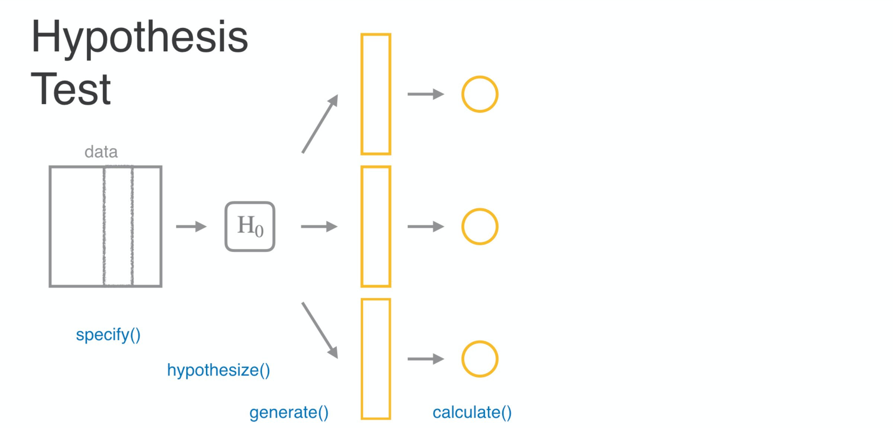

```{r setup, include=FALSE}
# load packages ----------------------------------------------------------------
library(learnr)
library(openintro)
library(broom)
library(knitr)
library(tidyverse)
library(gapminder)
library(infer)
library(emo)

# knitr options ----------------------------------------------------------------

knitr::opts_chunk$set(fig.align = "center", 
                      fig.height = 3, 
                      fig.width = 5,
                      echo = FALSE, 
                      message = FALSE, 
                      warning = FALSE)

# data prep --------------------------------------------------------------------

iran <- read_csv("data/iran.csv")
iowa <- read_csv("data/iowa.csv")

gss2016 <- read_rds("data/gss-sampled-2016.rds") |>
  mutate(party = case_when(
    str_detect(partyid, "DEMOCRAT")   ~ "Dem",
    str_detect(partyid, "REPUBLICAN") ~ "Rep",
    str_detect(partyid, "IND")        ~ "Ind",
    TRUE                              ~ "Oth"
  )) |> 
  filter(party != "Oth") |>
  droplevels()

# custom function –-------------------------------------------------------------

get_first <- function(x) {
    substr(as.character(x), 1, 1) |>
      as.numeric() |>
      as.factor()
}

# Hash generation helpers
# Should ideally be loaded from the imstutorials package when it exists
is_server_context <- function(.envir) {
  # We are in the server context if there are the follow:
  # * input - input reactive values
  # * output - shiny output
  # * session - shiny session
  #
  # Check context by examining the class of each of these.
  # If any is missing then it will be a NULL which will fail.
  
  inherits(.envir$input, "reactivevalues") &
    inherits(.envir$output, "shinyoutput") &
    inherits(.envir$session, "ShinySession")
}

check_server_context <- function(.envir) {
  if (!is_server_context(.envir)) {
    calling_func <- deparse(sys.calls()[[sys.nframe() - 1]])
    err <- paste0("Function `", calling_func, "`", " must be called from an Rmd chunk where `context = \"server\"`")
    stop(err, call. = FALSE)
  }
}
encoder_logic <- function(strip_output = FALSE) {
  p <- parent.frame()
  check_server_context(p)
  # Make this var available within the local context below
  assign("strip_output", strip_output, envir = p)
  # Evaluate in parent frame to get input, output, and session
  local(
    {
      encoded_txt <- shiny::eventReactive(
        input$hash_generate,
        {
          # shiny::getDefaultReactiveDomain()$userData$tutorial_state
          state <- learnr:::get_tutorial_state()
          shiny::validate(shiny::need(length(state) > 0, "No progress yet."))
          shiny::validate(shiny::need(nchar(input$name) > 0, "No name entered."))
          shiny::validate(shiny::need(nchar(input$studentID) > 0, "Please enter your student ID"))
          user_state <- purrr::map_dfr(state, identity, .id = "label")
          user_state <- dplyr::group_by(user_state, label, type, correct)
          user_state <- dplyr::summarize(
            user_state,
            answer = list(answer),
            timestamp = dplyr::first(timestamp),
            .groups = "drop"
          )
          user_state <- dplyr::relocate(user_state, correct, .before = timestamp)
          user_info <- tibble(
            label = c("student_name", "student_id"),
            type = "identifier",
            answer = as.list(c(input$name, input$studentID)),
            timestamp = format(Sys.time(), "%Y-%m-%d %H:%M:%S %Z", tz = "UTC")
          )
          learnrhash::encode_obj(bind_rows(user_info, user_state))
        }
      )
      output$hash_output <- shiny::renderText(encoded_txt())
    },
    envir = p
  )
}

hash_encoder_ui <- {
  shiny::div("If you have completed this tutorial and are happy with all of your", "solutions, please enter your identifying information, then click the button below to generate your hash", shiny::textInput("name", "What's your name?"), shiny::textInput("studentID", "What is your student ID?"), shiny::renderText({
    input$caption
  }), )
}
```

## Comparing many parameters: goodness of fit

The tutorial wraps up with two case studies using election data. Here, you'll learn how to use a Chi-squared test to check goodness-of-fit. You'll study election results from Iran and Iowa and test if Benford's Law applies to these datasets.

## Case study: election fraud

Welcome to the final lesson of the tutorial on inference for categorical data. We have one more statistical test to add to our toolbox - the goodness of fit test. Let's introduce it in the context of a case study on election fraud.

### Election fraud

The phrase election fraud can mean many things including vote buying, casting two ballots in different locations, and stuffing ballot boxes with fake ballots. We're going to focus on a version of the third, when the vote totals at a particular precinct are fiddled with by election officials.

As an example, imagine that these were the vote totals at the end of the night at several precincts in your town

```{r out.width = "60%"}

```

### 

An official who was perpetrating election fraud would come in and alter these numbers before reporting them to the authorities, usually in a manner that favored one of the candidates, in this case candidate B. If the original ballot data is not retained, this sort of fraud may be difficult to detect and prove. This has led some to look to a statistical method based on something called Benford's Law.

```{r out.width = "60%"}

```

### Benford’s Law A.K.A. "the first digit law"

Benford's Law appears when looking at broad collections of numbers, and paying attention to only to the first digit of each number. For example, consider the populations of every country on earth. This demographic data lives inside the gapminder package. We can restrict our attention to data from two thousand and seven and select off the country name and population variables. Now Benford's Law is only concerned with the first digit, so here we see that that Afghanistan, Albania, and Algeria all start with three, Angola starts with one, and so on. If we do this for all one hundred and forty two countries in this data set and visualize the distribution in a bar chart, what do you think it would look like? Would it be uniform?

```{r out.width = "60%"}

```

```{r out.width = "60%"}

```

It turns out it's not, not by a long shot. The most common number is one, the second most common is two, and so on with the higher numbers being less common. This decaying distribution of first digits is what is captured precisely by Benford's Law. It proposes, for example, that exactly thirty-point-one percent of the first digits should be one, seventeen-point-six percent should be two, and so on.

### 

- If the election was fair then vote counts should follow Benford’s Law.
- If the election was fraudulent then vote counts should not follow Benford’s Law.

```{r out.width = "60%"}

```

```{r out.width = "60%"}

```

To think about why this pattern emerges, imagine if these populations were drawn randomly from the integers between 1 and 150. What proportion of these numbers lead with a 1? Well, there's 1, there's 10 through 19, then there's the whole swath of 100 to 150. That's more than 40% of these numbers. To see why two is the second most common, imagine if instead these numbers were between 1 and 250. That would be a lot of leading twos. 

The distribution of first digits becomes distributed according to Benford's Law when the numbers span many orders of magnitude.
The idea behind using Benford's Law to detect election fraud is that in a free and fair election, the distribution of first digits should roughly follow Benford's Law. If instead election officials are fiddling with the totals manually, they will tend to use leading digits drawn more uniformly between 1 and 9; more sevens, for example.

This approach to detecting election fraud was prominently used in the 2009 presidential election in Iran.

### Iran election 2009

In this election, the incumbent, Mahmoud Ahmadinejad, faced several challengers, the most prominent of whom was Mir-Hossein Mousavi. There were widespread claims of election fraud from both the international community and some parties within Iran.

```{r out.width = "60%"}

```

One of the key points of evidence that was used in arguing fraud were the vote counts, which are available in a data set called Iran.

```{r message=FALSE}
iran |>
  select(city, ahmadinejad, mousavi, total_votes_cast)
```

###  

In the following exercises, you'll have the chance to get your hands into this real election data and use Benford's Law to evaluate the claim of voter fraud.

### Getting to know the Iran data

An important first step is to get a sense of the nature of your data set by asking questions like: What does each row refer to? What variables do I have recorded? What type of variables are there? What are the dimensions of my data set?

```{r echo=TRUE}
glimpse(iran)
```

```{r mc1, echo=FALSE}
question("Which of the following is FALSE regarding the `iran` data set?",
  answer("Each row refers to a single ballot cast.", correct = TRUE, message = "Correct! Each row refers to the total ballots for a particular *city*."),
  answer("The data set has 9 variables on 366 observations.", message = "Incorrect. Those are the correct `dim()`ensions of this data set."),
  answer("The variables contain vote counts for various candidates as well as categorical data for the city and province names.", message = "Incorrect. The data set indeed does contain vote totals as well as province and city names."),
  answer("There appear to be four candidates represented in this data set.", message = "Incorrect. Indeed there are four candidates: Ahmadinejad, Rezai, Karrubi, and Mousavi."),
  allow_retry = TRUE
)
```

### Who won?

The `iran` data set contains *all* of the votes cast in this election, meaning that you can find the victor by computing the total number of votes for each candidate. In addition to answering the question of who won nationwide, you can also see how the results differed by province.

Along the way, you'll use a very useful function called `gather()`. This allows you to reshape your dataframe by taking information stored in variable names and moving it to live in its own column.

```{r message=FALSE}
get_first <- function(x) {
    substr(as.character(x), 1, 1) |>
      as.numeric() |>
      as.factor()
}
```

- Using the `iran` data, compute the total votes for each candidate by `summarize()`ing each of the candidate count columns with their sum. Name each new column with the name of the candidate.
- Print `totals` to your screen.

```{r ex1, exercise=TRUE}
# Compute and save candidate totals
totals <- ___ |>
  ___(ahmadinejad = ___,
            rezai = ___,
            karrubi = ___,
            mousavi = ___)

# Inspect totals
totals
```

```{r ex1-hint}
 Sum the column corresponding to each candidate to compute the vote totals. 
```

```{r ex1-solution}
# Compute and save candidate totals
totals <- iran |>
  summarize(ahmadinejad = sum(ahmadinejad),
            rezai = sum(rezai),
            karrubi = sum(karrubi),
            mousavi = sum(mousavi))

# Inspect totals
totals
```


- `gather()` the candidate names into a new column alongside their respective votes. The names of the previous columns are called the `key`, which you should rename `"candidate"` and the contents are cells are the `value`, which you should rename `"votes"`.
- Inspect the resulting data frame to understand its structure.


```{r ex2, exercise=TRUE}
# From previous step
totals <- iran |>
  summarize(ahmadinejad = sum(ahmadinejad),
            rezai = sum(rezai),
            karrubi = sum(karrubi),
            mousavi = sum(mousavi))

# Gather data
gathered_totals <- totals |>
  gather(key = ___, value = ___)

# Inspect gathered totals
gathered_totals
```

```{r ex2-hint}
 Set `key = "candidate"` and `value = "votes"`.
```

```{r ex2-solution}
# From previous step
totals <- iran |>
  summarize(ahmadinejad = sum(ahmadinejad),
            rezai = sum(rezai),
            karrubi = sum(karrubi),
            mousavi = sum(mousavi))

# Gather data
gathered_totals <- totals |>
  gather(key = "candidate", value = "votes")

# Inspect gathered totals
gathered_totals
```


- Use `gathered_totals` to construct a bar plot of `votes` to visualize the overall election outcome. Since you already have the totals for each candidate, you need to map `candidate` to the `x`, `votes` to the `y`, then add a `geom_col()` layer.


```{r ex3, exercise=TRUE}
# From previous steps
totals <- iran |>
  summarize(ahmadinejad = sum(ahmadinejad),
            rezai = sum(rezai),
            karrubi = sum(karrubi),
            mousavi = sum(mousavi))
gathered_totals <- totals |>
  gather(key = "candidate", value = "votes")

# Plot total votes for each candidate
___ +
  # Add col layer
  ___
```

```{r ex3-hint}
 Since the result will be a bar plot, it's tempting to use `geom_bar()`, but don't! Re-read the instructions for this step.
```

```{r ex3-solution}
# From previous steps
totals <- iran |>
  summarize(ahmadinejad = sum(ahmadinejad),
            rezai = sum(rezai),
            karrubi = sum(karrubi),
            mousavi = sum(mousavi))
gathered_totals <- totals |>
  gather(key = "candidate", value = "votes")

# Plot total votes for each candidate
ggplot(gathered_totals, aes(x = candidate, y = votes)) +
  # Add col layer
  geom_col()
```


### Breaking it down by province


Although the overall vote totals are the most important, you can dig deeper into this data by utilizing the geographic information. In this exercise, you'll see how the results differed by province.

Did Ahmadinejad win throughout the country, or were there provinces where the second place candidate came out on top? To answer this question, start by creating a province-level data set.


- Start with `iran`, group by province, then summarize with two variables: the sum of the votes of the first place candidate and the sum of the votes of the second place candidate. Name each new column with the name of the candidate.
- Inspect `province_totals`.
- Filter `province_totals` for every row where the second-place candidate got more votes than the first-place candidate.


```{r message=FALSE, warning=FALSE}
get_first <- function(x) {
  x |>
    # Convert the numbers to strings
    as.character() |>
    # Extract the first digit
    substr(1, 1) |>
    # Make it a categorical variable, with levels from 1 to 9 
    factor(levels = 1:9)
}
```


```{r ex4, exercise=TRUE}
# Construct province-level dataset
province_totals <- ___ |>
  # Group by province
  ___ |>
  # Sum up votes for top two candidates
  ___ 

   
# Inspect data frame
province_totals

# Filter for won provinces won by #2
___ |>
  ___(___ > ___)
```

```{r ex4-hint}
 
- The top two candidates are `ahmadinejad` and `mousavi`.
- To filter for the provinces won by #2, you want all rows where `mousavi > ahmadinejad`.
```

```{r ex4-solution}
# Construct province-level dataset
province_totals <- iran |>
  # Group by province
  group_by(province) |>
  # Sum up votes for top two candidates
  summarize(mousavi = sum(mousavi),
            ahmadinejad = sum(ahmadinejad))
 
# Inspect data frame
province_totals

# Filter for won provinces won by #2
province_totals |>
  filter(mousavi > ahmadinejad)
```


### Extracting the first digit I


To address the question of voter fraud, begin by creating a new column of data containing the first digit of the total number of votes cast. For this, you'll need a custom function which we've created for you called `get_first()`. The core of this function is `substr()`, which will take a string and extract a section of it called a substring.

Once you create a new variable containing only the first digit, you can get a sense of how close it follows Benford's Law by constructing a bar plot.


- Take a look at how `get_first()` works by simply typing the name of the function (with no parentheses). All it does is fiddle with the output from `substr()` so that it's a factor.
- Mutate a new column in the `iran` data frame called `first_digit` that contains the first digit of city by city total votes cast.
- Check to see that `get_first()` worked. From the `iran` data, select off the columns `total_votes_cast` and `first_digit` and print them to the screen.
- Construct a bar plot to visualize the distribution of the first digit.


```{r message=FALSE}
get_first <- function(x) {
  x |>
    # Convert the numbers to strings
    as.character() |>
    # Extract the first digit
    substr(1, 1) |>
    # Make it a categorical variable, with levels from 1 to 9 
    factor(levels = 1:9)
}
```


```{r ex5, exercise=TRUE}
# Print get_first
get_first

# Create first_digit variable
iran <- iran |>
  ___
  
# Check if get_first worked
___ |>
  ___

# Construct bar plot
___ +
  # Add bar layer
  ___
```


```{r ex5-hint}
 
- Use `get_first(total_votes_cast)` to create `first_digit`.
- After piping in the `iran` data, `select()` takes just two arguments: the names of the columns you'd like to peel off.
- Map the `x` aesthetic to `first_digit` and use `geom_bar()` to create your bar plot.
```

```{r ex5-solution}
# Print get_first
get_first

# Create first_digit
iran <- iran |>
  mutate(first_digit = get_first(total_votes_cast))

# Check if get_first worked
iran |>
  select(total_votes_cast, first_digit)
  
# Construct bar plot
ggplot(iran, aes(x = first_digit)) +
  # Add bar layer
  geom_bar()
```


## Goodness of fit

The distribution of first digit counts in the Iran data


### First Digit Distribution

```{r out.width = "60%"}

```


captures many of the main features of Benford's Law: 1 is the most common digit,


### 

```{r out.width = "60%"}
knitr::include_graphics("images/4-2-2.png")
```


followed by 2, then it generally continues to decay as the numbers increase. You'll note, though, that it's not a perfect fit. There sure are a lot of twos


### 

```{r out.width = "60%"}

```


and also the number of sevens


### 

```{r out.width = "60%"}

```


is actually greater than the number of sixes. Essentially, we're left wondering  if these deviations from Benford's Law are just due to random chance, or if they indicate that in fact Benford's Law is not a good description of this voter data. That's a question of statistical significance, and to answer that, we first need to come up with a statistic,


### 

```{r out.width = "60%"}

```


a measure of how far the vote distribution is from Benford's Law. In fact, we don't need to look far.


### Chi-squared distance

```{r out.width = "60%"}

```


The Chi squared distance that we used to measure independence in the last lesson can also be used to measure goodness of fit.

Let's review how we used that statistic to measure the distance between these two visualizations: the relationship between political party and space funding that we actually observed (on the left) and the distribution we'd expect if they're independent of one another (on the right).


### 

```{r out.width = "60%"}

```


This calculation goes cell by cell, so let's start up in this corner


### 


```{r out.width = "60%"}

```


and take difference between the observed count, O,


### 

```{r out.width = "60%"}

```


and the expected count over here, E.


### 

```{r out.width = "60%"}

```


To be sure this difference is positive, we square it ,


### 

```{r out.width = "60%"}

```


then we divide it by E to scale it by the size of this cell. The resulting number is this cell's contribution to the chi-square.


### 

```{r out.width = "60%"}

```


We then move to the next cell and do the same thing.


### 

```{r out.width = "60%"}

```


Take the squared and scaled difference.


### 

```{r out.width = "60%"}

```


We continue this routine through all 9 cells, then add them up: that is the chi-squared distance.


### 

```{r out.width = "60%"}

```


For these distributions, that distance was 1-point-32. Let's see how this applies in the goodness of fit situation.


### First Digit Distribution

```{r out.width = "60%"}
knitr::include_graphics("images/4-2-16.png")
```


Here each cell is on of the digit categories, but the rest of the calculation is the same. We calculate the squared difference between


### 

```{r out.width = "60%"}

```


the counts of leading ones


### 

```{r out.width = "60%"}
knitr::include_graphics("images/4-2-18.png")
```


and we add that to the squared difference in counts of leading twos


### 


```{r out.width = "60%"}

```


all the way up to leading nines, and we add them together and that gives us our chi squared distance.


### Example: uniformity of party


```{r }
ggplot(gss2016, aes(x = party)) +
  geom_bar() +
  geom_hline(yintercept = 149/3, color = "goldenrod", size = 2)
```

```{r }
tab <- gss2016 |>
     select(party) |>
     table()
tab
```


```{r }
p_uniform <- c(Dem = 1/3, Ind = 1/3, Rep = 1/3)
chisq.test(tab, p = p_uniform)$stat
```


Let's walk through an example with the gss data of using the Chi-squared to assess the goodness of fit. Here's the distribution of the party variable, a simple bar chart with three categories. Say we'd like to assess the distance between this distribution and the uniform distribution where each party is the same size. I've added a gold line to indicate what the bar heights would be if this was uniform. The first step in computing the chi-squared statistic is making a table  of the counts in the bar chart. Once we have that table of counts, we need to describe the uniform distribution as a named vector of three probabilities , each one being 1/3. With those two components, we can use the built-in chisq-dot-test function to calculate the chi-squared distance, which we find is about 15-point-8. The next question is: is this a big distance? That's a question for a hypothesis test, which at this point you have a lot of experience with. You can get a sense of the sort of data you would see under null hypothesis that the distribution is uniform by

### Simulating the null

```{r }
gss2016 |>
  specify(response = party) |>
  hypothesize(null = "point", p = p_uniform) |>
  generate(reps = 1, type = "draw")
```

simulating a single sample. Let's walk through how this code works. You take the gss 2016 dataset, specify that the variable you're interested in is "party", then hypothesize a null determined by the vector of probabilities corresponding to the uniform distribution. Since you're giving specific parameter values, this is called a "point" null hypothesis. That allows us to generate a single data set through simulation - essentially flipping many three-sided coins where each face is "D", "I", or "R". This yields a new data set under the null hypothesis. 
I'd like to visualize this data, so we'll go ahead and save it to sim_1, then construct a bar plot.

### 

```{r }
sim_1 <- gss2016 |>
   specify(response = party) |>
   hypothesize(null ="point",p = p_uniform) |>
   generate(reps = 1, type = "draw")
```

```{r }
ggplot(sim_1, aes(x = party)) +
   geom_bar()
```

```{r out.width = "60%"}

```

This one looks much closer to the uniform distribution, and we'd expect that the chi-squared distance is quite a bit less than 15-point-8. What we need to do next is repeat this many times to build up a null distribution of chi-squared statistics.

###  

So let's jump into the exercises and port this idea of a goodness of fit hypothesis test using the chi-squared back to your case study of evaluating Benford's Law's ability to describe voting data.

### Goodness of fit test

The null hypothesis in a goodness of fit test is a list of specific parameter values for each proportion. In your analysis, the equivalent hypothesis is that Benford's Law applies to the distribution of first digits of total vote counts at the city level. You could write this as:

$$
H\_0: p\_1 = .30, p\_2 = .18, \ldots, p\_9 = .05
$$

Where $p_1$ is the height of the first bar in the Benford's bar plot. The alternate hypothesis is that at least one of these proportions is different; that the first digit distribution *doesn't* follow Benford's Law.

In this exercise, you'll use simulation to build up the null distribution of the sorts of chi-squared statistics that you'd observe if in fact these counts did follow Benford's Law.

- Inspect `p_benford` by printing it to the screen.
- Starting with `iran`, compute the chi-squared statistic by using `observe()`. Note that you must specify the variable in the data frame that will serve as your response as well as the vector of probabilities that you wish to compare them to.
- Construct a null distribution with 500 samples of the `Chisq` statistic via simulation under the `point` null hypothesis that the vector of proportions `p` is `p_benford`. Save the resulting statistics as `null`.

```{r message=FALSE, warning=FALSE}
#p_benford <- 1:9 |> setNames(log10(1 + 1 / .), .)
p_benford <- 1:9 |> (\(x) setNames(log10(1 + 1/x),x))()
get_first <- function(x) {
  x |>
    # Convert the numbers to strings
    as.character() |>
    # Extract the first digit
    substr(1, 1) |>
    # Make it a categorical variable, with levels from 1 to 9 
    factor(levels = 1:9)
}

iran <- iran |>
  mutate(first_digit = get_first(total_votes_cast))
```

```{r ex6, exercise=TRUE}
# Inspect p_benford
p_benford

# Compute observed stat
chi_obs_stat <- ___
  observe(response = ___, stat = ___, p = ___)

# Form null distribution
null <- ___
  # Specify the response
  ___
  # Set up the null hypothesis
  ___
  # Generate 500 reps
  ___
  # Calculate statistics
  ___
```

```{r ex6-hint}
 
- You can print an object to the screen simply by typing its name.
- The response is `first_digit`.
- Use the argument `null = "point"` and specify the value of `p` to create the null distribution.
```

```{r ex6-solution}
# Inspect p_benford
p_benford

# Compute observed stat
chi_obs_stat <- iran |>
   observe(response = first_digit, stat = "Chisq", p = p_benford)

# Form null distribution
null <- iran |>
  # Specify the response
  specify(response = first_digit) |>
  # Set up the null hypothesis
  hypothesize(null = "point", p = p_benford) |>
  # Generate 500 reps
  generate(reps = 500, type = "draw") |>
  # Calculate statistics
  calculate(stat = "Chisq")
```

### A p-value, two ways

You've seen before how there are usually two ways to get to the null distribution: through computation and through a mathematical approximation. The chi-squared goodness of fit test is no exception. The approximation distribution is again the "Chi-squared distribution" with degrees of freedom equal to the number of categories minus one.

In this exercise you'll compare these two approaches to calculate a p-value that measures the consistency of the distribution of the Iran first digits with Benford's Law. Note that the observed statistic that you created in the last exercise is saved in your work space as `chi_obs_stat`.

```{r message=FALSE, warning=FALSE}
set.seed(123)

p_benford <- 1:9 |> (\(x) setNames(log10(1 + 1/x),x))()
get_first <- function(x) {
  x |>
    # Convert the numbers to strings
    as.character() |>
    # Extract the first digit
    substr(1, 1) |>
    # Make it a categorical variable, with levels from 1 to 9 
    factor(levels = 1:9)
}

iran <- iran |>
  mutate(first_digit = get_first(total_votes_cast))
tab <- iran |>
  select(first_digit) |>
  table()
null <- iran |>
  specify(response = first_digit) |>
  hypothesize(null = "point", p = p_benford) |>
  generate(reps = 500, type = "draw") |>
  calculate(stat = "Chisq")
chi_obs_stat <- chisq.test(tab, p = p_benford)$stat
```

- Compute the degrees of freedom of the chi-squared approximation by taking the `first_digit` vector from the `iran` data then calculating the number of categories using the `nlevels()` function then subtracting one.
- Using `null`, plot the distribution of the chi-squared statistics using a density plot. Add a vertical line indicating the observed statistic, then overlay the curve of the chi-squared approximation with the degrees of freedom in blue.

```{r ex7, exercise=TRUE}
# Compute degrees of freedom
degrees_of_freedom <- ___ |>
  # Pull out first_digit vector
  pull("first_digit") |> 
  # Calculate n levels and subtract 1
  ___

# Plot both null dists
___
  # Add density layer
  ___
  # Add vertical line at obs stat
  ___ 
  # Overlay chisq approx
  stat_function(fun = dchisq, args = list(df = ___), color = "blue")
```

```{r ex7-hint}
 
- Compute the degrees of freedom from the vector of digits using `nlevels() - 1`.
- Use the argument `df = degrees_of_freedom` to plot `dchisq` in `stat_function()`.
```

```{r ex7-solution}
# Compute degrees of freedom
degrees_of_freedom <- iran |> 
  # Pull out first_digit vector
  pull(first_digit) |> 
  # Calculate n levels and subtract 1
  nlevels() - 1

# Plot both null dists
ggplot(null, aes(x = stat)) +
  # Add density layer
  geom_density() +
  # Add vertical line at obs stat
  geom_vline(xintercept = chi_obs_stat) + 
  # Overlay chisq approx
  stat_function(fun = dchisq, args = list(df = degrees_of_freedom), color = "blue")
```

- Compute the permutation p-value by summarizing the statistics with the proportion that are greater than the observed statistic.
- Compute the approximation p-value using the `pchisq()` function. Recall that this will return the area under the curve to the *left* of the observed value, so you'll need to modify it to return the *right* tail.

```{r ex8-setup, include = FALSE}
iran <- iran |>
  mutate(first_digit = get_first(total_votes_cast))

p_benford <- 1:9 |> (\(x) setNames(log10(1 + 1/x),x))()

chi_obs_stat <- iran |>
  observe(response = first_digit, p = p_benford, stat = "Chisq") |>
  pull()
```

```{r ex8, exercise=TRUE}
# From previous step
degrees_of_freedom <- iran |> 
  pull(first_digit) |> 
  nlevels() - 1

# Permutation p-value
___ |>
  ___(pval = ___)
  
# Approximation p-value
___
```

```{r ex8-hint}
- The `mean()` function, when applied to a TRUE/FALSE operation (such as `obj_1 >= obj_2`), will yield a proportion.
- Use `pchisq()` with the observed chi-squared stat and the calculated degrees of freedom, setting `lower.tail` to `FALSE` to find the area under the right tail.
```

```{r ex8-solution}
# From previous step
degrees_of_freedom <- iran |> 
  pull(first_digit) |> 
  nlevels() - 1

# Permutation p-value
null |>
  summarize(pval = mean(stat >= chi_obs_stat))

# Approximation p-value
pchisq(chi_obs_stat, df = degrees_of_freedom, lower.tail = FALSE)
```

### Is this evidence of fraud?

*Hint:* Remember, the null hypothesis you're testing is that Benford's Law describes the distribution of first digits in vote totals for the 2009 Iranian election.

```{r mc2, echo=FALSE}
question("Based on your p-value of approximately 0.006, which of the following statements is FALSE?",
  answer("If the null hypothesis is true, the probability of observing a test statistic more extreme than the observed statistic is 0.006.", message = "Nope, this one is true. This is the definition of a p-value."),
  answer("This data is consistent with a model in which Benford's Law applies to vote totals from the 2009 Iranian election.", correct = TRUE, message = "Bingo! The low p-value suggests this data is inconsistent with the proportions expected by Benford's Law."),
  answer("The p-value is a measure of the consistency between a data set and a particular hypothesis.", message = "Incorrect. This is a valid interpretation of a p-value."),
  allow_retry = TRUE
)
```

## And now to US

The goodness of fit test that you just conducted used as the null hypothesis that the first digits in the voting data were drawn from the digit distribution specified by Benford's Law.

### Iran election fraud

```{r out.width = "60%"}

```

This corresponds to the notion that the 2009 presidential election in Iran was fair.

### 

```{r out.width = "60%"}

```

The alternative hypothesis was that the election was fraudulent, that Benford's Law does not describe this voting data well.

### 

```{r out.width = "60%"}

```

Our results are well summarized by looking at the null distribution of the chi squared statistic either under a simulation or using the mathematical approximation. The two methods give a very similar answer, that the chi squared distance that we actually observed indicated by the vertical line is very unlikely if indeed Benford's Law does hold.

### 

```{r out.width = "60%"}

```

If we're comfortable with establishing election fraud by using Benford's Law, then this analysis serves as evidence of fraud in the Iranian election, but before you embrace that real life conclusion, let's take a moment and think through a good sanity check. One way to check the viability of assessing electoral fraud using Benford's Law is to look at an election that you think to be fair and run the same analysis.

### U.S.A. 2016 election

$H\_{0}:$ the election was fair (Benford’s Law holds)

$H\_{A}:$ the election was fraudulent (Benford’s Law does not hold)

For that, let's turn to the voting data from the US presidential election of 2016 where the two primary party candidates were Donald Trump and Hilary Clinton. You'll use the same hypotheses and the same analytical approach, extracting first digits and seeing how well they conform to Benford's Law. While you could consider this analysis at many different scales, let's focus in on a single state, Iowa.

### Iowa vote totals

```{r out.width = "60%"}
knitr::include_graphics("images/Iowa_in_United_States.svg")
```

In the following exercises, you'll be working with the Iowa dataset.
By TUBS [CC BY SA 3.0], from Wikimedia Commons

### 

```{r message=FALSE}
iowa
```

In substance, it contains the same vote total information as the Iran dataset, but form is a bit different.

### Getting to know the Iowa data

This exercise should feel familiar: introducing yourself to the dataset by acquainting yourself with its basic structure. Questions that you should be thinking about include: What do the rows refer to? What about the columns? What type of data to they contain? How does this compare to the `iran` data?

After you've familiarized yourself with the `iowa` data, determine which of the following statements is FALSE.

```{r echo=TRUE}
glimpse(iowa)
```

```{r mc3, echo=FALSE}
question("Determine which of the following statements is FALSE",
  answer("There are 1386 observations on 5 variables.", message = "Incorrect. This one is true."),
  answer("The columns contain the name of the office, the candidate, the party, the county, and the votes cast, all of which are categorical data.", correct = TRUE, message = "Well done! Most, but not all, of those variables are categorical. Votes cast is numerical."),
  answer("Each row refers to candidate pair (President/Vice President) in a single county.", message = "Nope. This is the correct description of what each row refers to."),
  answer("There appear to be 14 distinct categories in the `candidate` column.", message = "Incorrect. There are indeed 14 distinct candidates."),
  allow_retry = TRUE
)
```

### Extracting the first digit II

There are different levels at which we could consider looking at vote totals. We could look at precincts, or counties, or states, and each level might give us a slightly different picture of what's going on.

For this analysis, look at totals at the *county* level in Iowa and focus on the votes for the two major party candidates: Republicans Trump / Pence and Democrats Clinton / Kaine.

```{r message=FALSE}
get_first <- function(x) {
  x |>
    # Convert the numbers to strings
    as.character() |>
    # Extract the first digit
    substr(1, 1) |>
    # Make it a categorical variable, with levels from 1 to 9 
    factor(levels = 1:9)
}
```

Using the `iowa` data set, filter the rows so they contain only the two main party candidates, then group based on `county` and add up the votes to create a new column called `dem_rep_votes`. Save the resulting data frame to `iowa_county`.

```{r ex9, exercise=TRUE}
# Get Iowa county vote totals
iowa_county <- ___ |>
  # Filter for rep/dem
  ___(candidate %in% c(___, ___)) |>
  # Group by county
  ___
  # Compute total votes in each county
  ___(dem_rep_votes = ___)
  
# See the result
iowa_county
```

```{r ex9-hint}
 
- The candidate pairs to filter on are `"Hillary Clinton / Tim Kaine"` and `"Donald Trump / Mike Pence"`.
- In the `summarize()` call, set `dem_rep_votes` to the `sum()` of the votes from each group.
```

```{r ex9-solution}
# Get Iowa county vote totals
iowa_county <- iowa |>
  # Filter for rep/dem
  filter(candidate %in% c("Hillary Clinton / Tim Kaine", "Donald Trump / Mike Pence")) |>
  # Group by county
  group_by(county) |>
  # Compute total votes in each county
  summarize(dem_rep_votes = sum(votes))
  
# See the result
iowa_county
```


Extract the first digit from the `dem_rep_votes` column using the custom function `get_first()`, call it `first_digit`, and save it back over `iowa_county`.


```{r ex10, exercise=TRUE}
# From previous step
iowa_county <- iowa |>
  filter(candidate == "Hillary Clinton / Tim Kaine" | 
         candidate == "Donald Trump / Mike Pence") |>
  group_by(county) |>
  summarize(dem_rep_votes = sum(votes)) 
  
# Add first_digit
iowa_county <- iowa_county |>
  ___
  
# See the result
iowa_county
```

```{r ex10-hint}
 Use `mutate()` to create the new column and include in it the output from the `get_first()` function.
```

```{r ex10-solution}
# From previous step
iowa_county <- iowa |>
  filter(candidate == "Hillary Clinton / Tim Kaine" | 
         candidate == "Donald Trump / Mike Pence") |>
  group_by(county) |>
  summarize(dem_rep_votes = sum(votes)) 
  
# Add first digit
iowa_county <- iowa_county |>
  mutate(first_digit = get_first(dem_rep_votes))
  
# See the result
iowa_county
```


Construct a bar plot of `first_digit`.


```{r ex11, exercise=TRUE}
# From previous steps
iowa_county <- iowa |>
  filter(candidate == "Hillary Clinton / Tim Kaine" | 
         candidate == "Donald Trump / Mike Pence") |>
  group_by(county) |>
  summarize(dem_rep_votes = sum(votes)) |>
  mutate(first_digit = get_first(dem_rep_votes))
  
# Using iowa_county, plot first_digit
___
  # Add bar layer
  ___
  
# See the result
iowa_county
```

```{r ex11-hint}
 A bar chart of one variable requires that you assign one variable to `x` in the `aes()` function, then add on a `geom_bar()` layer.
```

```{r ex11-solution}
# From previous steps
iowa_county <- iowa |>
  filter(candidate == "Hillary Clinton / Tim Kaine" | 
         candidate == "Donald Trump / Mike Pence") |>
  group_by(county) |>
  summarize(dem_rep_votes = sum(votes)) |>
  mutate(first_digit = get_first(dem_rep_votes))
  
# Using iowa_county, plot first_digit
ggplot(iowa_county, aes(x = first_digit)) +
  # Add bar layer
  geom_bar()
  
# See the result
iowa_county
```


### Testing Iowa


You probably noticed that the bar plot of first digits is alarming: it looks quite different from what Benford's Law prescribes! Before you get ahead of yourself, though, realize that those bars each only contained a handful of counties, so you don't actually have that much data.

This is a prime example of when a hypothesis test is handy. It can tell you if the structure that you see (in this case, the deviation from Benford's Law) could just be due to the random variability of your small sample, or if it's indicative of a systematic difference.


```{r message=FALSE}
p_benford <- 1:9 |> (\(x) setNames(log10(1 + 1/x),x))()
get_first <- function(x) {
  x |>
    # Convert the numbers to strings
    as.character() |>
    # Extract the first digit
    substr(1, 1) |>
    # Make it a categorical variable, with levels from 1 to 9 
    factor(levels = 1:9)
}

iowa_county <- iowa |>
  filter(candidate == "Hillary Clinton / Tim Kaine" | candidate == "Donald Trump / Mike Pence") |>
  group_by(county) |>
  summarize(dem_rep_votes = sum(votes))
iowa_county <- iowa_county |>
  mutate(first_digit = get_first(dem_rep_votes))
```

Starting with `iowa_county`, compute the observed chi-squared statistic using `observe()`.

```{r ex12, exercise=TRUE}
# Compute observed stat
chi_obs_stat <- ___ |>
  ___
```

```{r ex12-hint}
The three argument required of the `observe()` function are the `response` variable, the `stat`istic of interest, and vector of probabilities, `p`, which are already saved to your workspace as `p_benford.`
```

```{r ex12-solution}
# Compute observed stat
chi_obs_stat <- iowa_county |>
  observe(response = first_digit, stat = "Chisq", p = p_benford)
```

Form the null distribution of chi-squared statistics via simulation under the point null hypothesis that these data come from the probabilities specified by Benford's Law. Save this distribution to `null`.

```{r ex13, exercise=TRUE}
# Form null distribution
null <- ___
  # Specify response
  ___
  # Set up null
  ___
  # Generate 500 reps
  ___
  # Calculate statistics
  ___
```

```{r ex13-hint}
 The data here is generated by `"draw"`-ing from a ``"point"`` null hypothesis where `p = p_benford`.
```

```{r ex13-solution}
# Form null distribution
null <- iowa_county |>
  # Specify response
  specify(response = first_digit) |>
  # Set up null
  hypothesize(null = "point", p = p_benford) |>
  # Generate 500 reps
  generate(reps = 500, type = "draw") |>
  # Calculate statistics
  calculate(stat = "Chisq")
```


Construct a density plot of the distribution of the `null` statistics and add a vertical line indicating the location of the `chi_obs_stat`.


```{r ex14, exercise=TRUE}
# From previous steps
chi_obs_stat <- iowa_county |>
  observe(response = first_digit, stat = "Chisq", p = p_benford)
null <- iowa_county |>
  specify(response = first_digit) |>
  hypothesize(null = "point", p = p_benford) |>
  generate(reps = 500, type = "draw") |>
  calculate(stat = "Chisq")

# Visualize null stat
___
  # Add density layer
  ___
  # Add vertical line at observed stat
  ___
```

```{r ex14-hint}
 You can add the vertical line using `geom_vline` and setting the `xintercept` to `chi_obs_stat`.
```

```{r ex14-solution}
# From previous steps
chi_obs_stat <- iowa_county |>
  observe(response = first_digit, stat = "Chisq", p = p_benford)
null <- iowa_county |>
  specify(response = first_digit) |>
  hypothesize(null = "point", p = p_benford) |>
  generate(reps = 500, type = "draw") |>
  calculate(stat = "Chisq")

# Visualize null stat
ggplot(null, aes(x = stat)) +
  # Add density layer
  geom_density() +
  # Add vertical line at observed stat
  geom_vline(xintercept = chi_obs_stat)
```


### Fraud in Iowa?

```{r mc4, echo=FALSE}
question("Based on the null distribution that you constructed in the last exercise and the p-value (which you can compute using `null` and `chi_obs_stat` in your workspace here), which of the following statements is FALSE?",
  answer("The low p-value indicates that if in fact there *was* election fraud in Iowa, there would be a very small probability of observing this data or more extreme."),
  answer("Because the observed statistic is far into the tails of the null distribution, this indicates that your data is inconsistent with the null hypothesis that Benford's Law applies to vote totals in Iowa."),
  answer("The high p-value indicates a high probability that that our null hypothesis (that Benford's Law applies to vote totals in Iowa) is true.", correct = TRUE, message = "Bingo! Not only was the p-value not high, this is also an invalid interpretation of a p-value. It is *never* the probability that the null is true."),
  allow_retry = TRUE,
  incorrect = "Remember, the null hypothesis is that Benford's Law describes the distribution of the first digits in this data set."
)
```


```{r message=FALSE, warning=FALSE}
p_benford <- 1:9 |> (\(x) setNames(log10(1 + 1/x),x))()
get_first <- function(x) {
  x |>
    # Convert the numbers to strings
    as.character() |>
    # Extract the first digit
    substr(1, 1) |>
    # Make it a categorical variable, with levels from 1 to 9 
    factor(levels = 1:9)
}

iowa <- iowa |>
  filter(candidate == "Hillary Clinton / Tim Kaine" | candidate == "Donald Trump / Mike Pence") |>
  group_by(county) |>
  summarize(dem_rep_votes = sum(votes, na.rm = T))
iowa <- iowa |>
  mutate(first_digit = get_first(dem_rep_votes))
tab <- iowa |>
  select(first_digit) |>
  table()
chi_obs_stat <- chisq.test(tab, p = p_benford)$stat

# Form null distribution
null <- iowa |>
  specify(response = first_digit) |>
  hypothesize(null = "point", p = p_benford) |>
  generate(reps = 500, type = "draw") |>
  calculate(stat = "Chisq")
```

## Election fraud in Iran and Iowa: debrief

OK, at this point, you're probably thinking: wait, what?

### Iowa election fraud

```{r out.width = "60%"}
knitr::include_graphics("images/4-4-1.png")
```

Were officials in Iowa really altering vote totals?!

### 

```{r out.width = "60%"}

```

Political scientists and election observers assure us that the answer to this question is: no. The 2016 presidential election was largely free of this sort of election fraud.

### 

```{r out.width = "60%"}

```

So what happened? Why did your hypothesis test give you the wrong answer?

### What went wrong?

```{r out.width = "60%"}

```

One possibility that you should always consider when you reject the null hypothesis is the possibility that you have made a Type I error, that is, rejecting the null hypothesis when it is true.

### 

```{r out.width = "60%"}

```

If your test is performing properly, you know exactly the probability of this event, in fact you get to set it: it's your threshold for rejecting the null hypothesis, which we commonly set to 5%.

### 

```{r out.width = "60%"}

```

So you may have made a Type I error but a more fundamental issue might be at work here. To be very precise, you tested the hypothesis that the first digit distribution from Benford's Law is a good fit to the first digit distribution of your data.

### 

```{r out.width = "60%"}

```

What if Benford's Law doesn't actually apply to this sort of data even when it's a free and fair election? To get that nicely shaped decaying distribution of first digits, the counts need to span many orders of magnitude and be uniformly distributed in their logarithms.

### 

```{r out.width = "60%"}

```

Certain phenomena like populations of world cities fit these criteria and are a good fit for Benford's Law. But it's not clear that vote totals are a good fit for this distribution.

### Take-home lesson

```{r out.width = "60%"}
knitr::include_graphics("images/Iowa_in_United_States.svg")
```

The statistical tool must be appropriate for the task.

```{r out.width = "60%"}

```

This is an important lesson: you need to be certain of the appropriateness of a particular analytical method to the context of the data that you're studying before you put much weight in the result. When in doubt, one solution is to do as you've done here: do a sanity check with an analysis where you know the correct answer. In this case, your Iowa analysis should make you skeptical of the Iran analysis. Of course, there may be other, more convincing sources of evidence that the 2009 Iran Election was fraudulent, but this particular analysis, based on Benford's Law, can't really tell us much either way.

- By TUBS [CC BY-SA 3.0], from Wikimedia Commons
- By P30Carl [GFDL] or [CC BY-SA 3.0], from Wikimedia Commons

### Methods for categorical data

### Confidence Intervals

- One proportion
- Difference in proportions

### Hypothesis tests

- One proportion
- Difference in proportions
- Test of independence
- Goodness of fit

Alright, that's it, let's wrap up this tutorial. In case you've lost track, you've learned several techniques to carry out inference on categorical data. You started with confidence intervals on one proportion and the difference in two proportions, then shifted to the other side of the coin with hypothesis tests on proportions. From there, you moved into the case where you need to assess the independence of two categorical variables that had many different levels. That led you to the chi-squared test of independence. In this lesson, you looked at another use for the chi-squared statistic: in testing the goodness of fit of a data set to a particular categorical distribution.

### 

That might seem like a long list to remember, but really all you need to internalize are these steps every test follows:

### 

```{r out.width = "60%"}

```

You specify the variable or variables of interest,

### 

```{r out.width = "60%"}

```

you propose your null hypothesis,

### 

```{r out.width = "60%"}

```

you generate data sets that would appear in a world where that hypothesis is true,

### 

```{r out.width = "60%"}

```

then you calculate an appropriate test statistic for each one of those data sets.

### 

```{r out.width = "60%"}

```

The final step is to simply assess the distribution of these null statistics and see if the statistic that you actually observed is consistent or inconsistent with it.

## Congratulations!

You have successfully completed Lesson 4 in Tutorial 5: Statistical inference.  
If you need to generate a hash for submission, click "Next Topic".

What's next?

`r emo::ji("ledger")` [Full list of tutorials supporting OpenIntro::Introduction to Modern Statistics](https://openintrostat.github.io/ims-tutorials/)

`r emo::ji("spiral_notepad")` [Tutorial 5: Statistical inference](https://openintrostat.github.io/ims-tutorials/05-infer/)

`r emo::ji("one")` [Tutorial 5 - Lesson 1: Inference for a single proportion](https://openintro.shinyapps.io/ims-05-infer-01/)

`r emo::ji("two")` [Tutorial 5 - Lesson 2: Hypothesis Tests to Compare Proportions](https://openintro.shinyapps.io/ims-05-infer-02/)

`r emo::ji("three")` [Tutorial 5 - Lesson 3: Chi-squared Test of Independence](https://openintro.shinyapps.io/ims-05-infer-03/)

`r emo::ji("four")` [Tutorial 5 - Lesson 4: Chi-squared Goodness of Fit Test](https://openintro.shinyapps.io/ims-05-infer-04/)

`r emo::ji("five")` [Tutorial 5 - Lesson 5: Bootstrapping for estimating a parameter](https://openintro.shinyapps.io/ims-05-infer-05/)

`r emo::ji("six")` [Tutorial 5 - Lesson 6: Introducing the t-distribution](https://openintro.shinyapps.io/ims-05-infer-06/)

`r emo::ji("seven")` [Tutorial 5 - Lesson 7: Inference for difference in two parameters](https://openintro.shinyapps.io/ims-05-infer-07/)

`r emo::ji("eight")` [Tutorial 5 - Lesson 8: Comparing many means](https://openintro.shinyapps.io/ims-05-infer-08/)

`r emo::ji("open_book")` [Learn more at Introduction to Modern Statistics](http://openintro-ims.netlify.app/)

## Submit

```{r, echo=FALSE, context="server"}
encoder_logic()
```

```{r encode, echo=FALSE}
learnrhash::encoder_ui(ui_before = hash_encoder_ui)
```