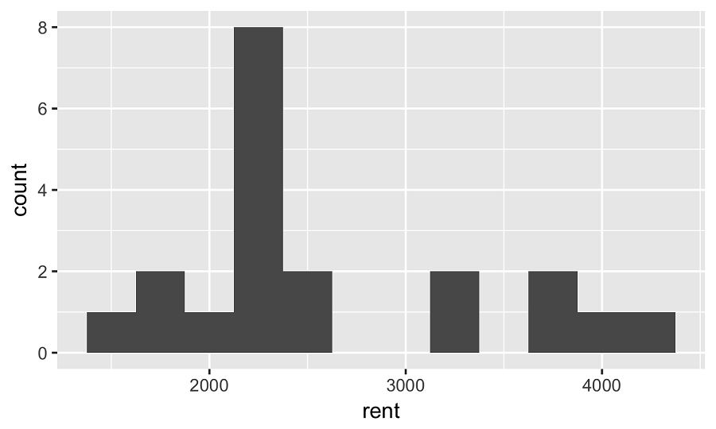
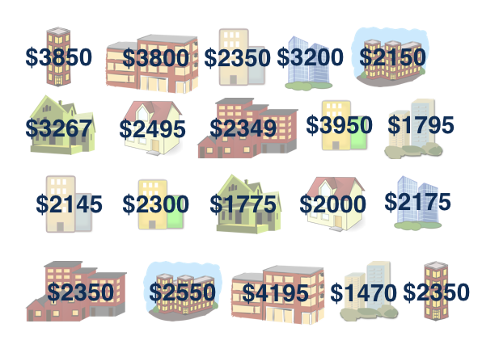
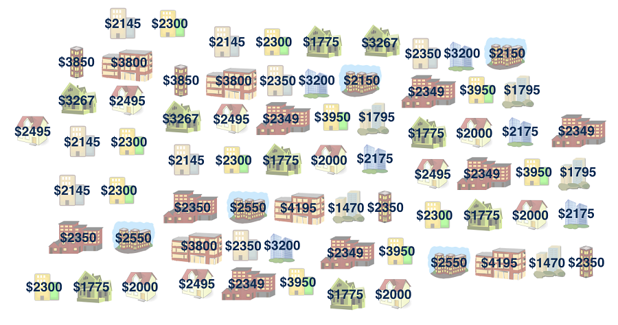
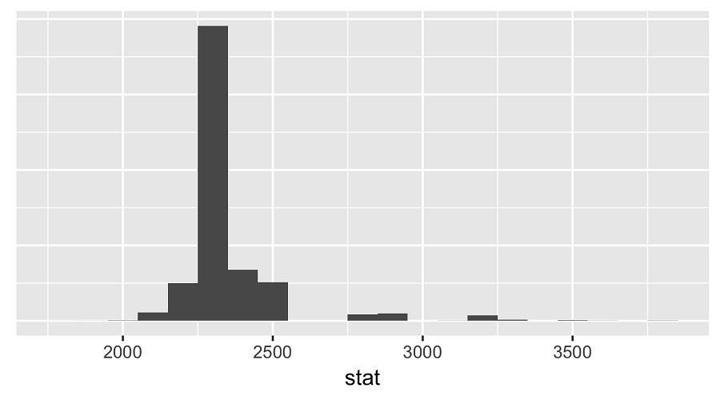
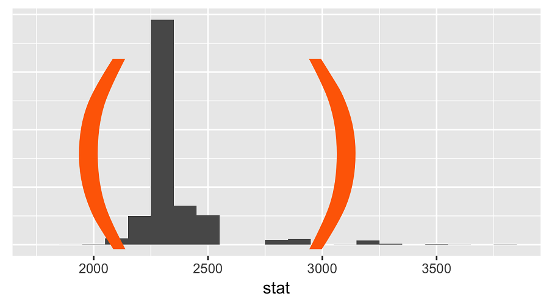
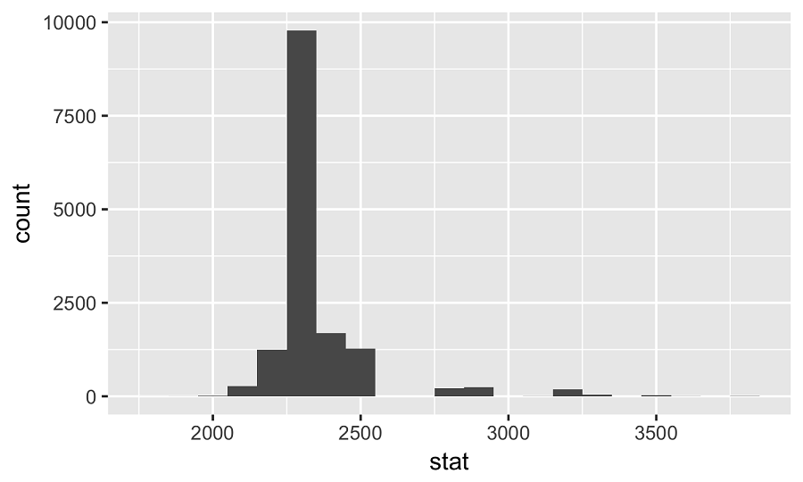
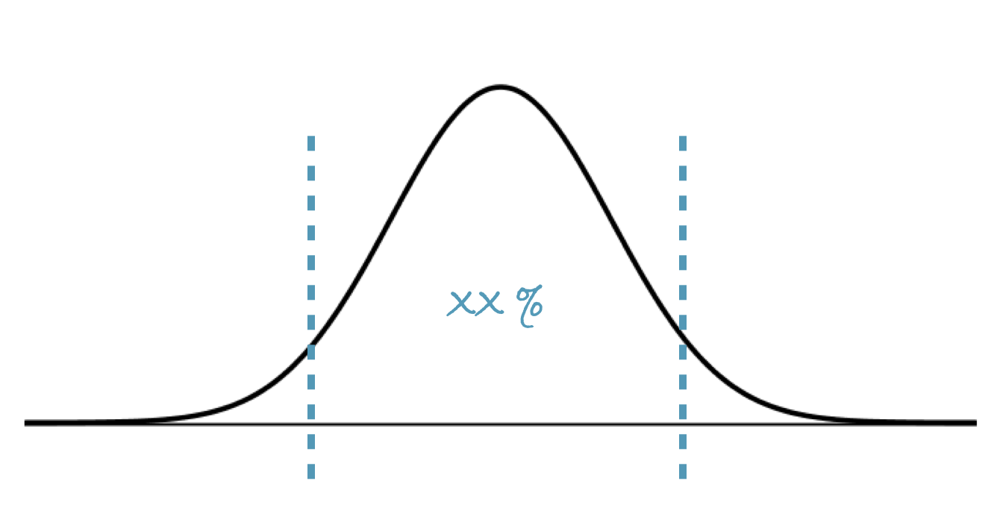
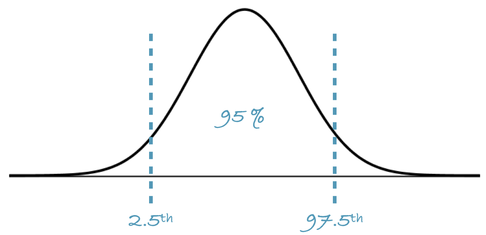
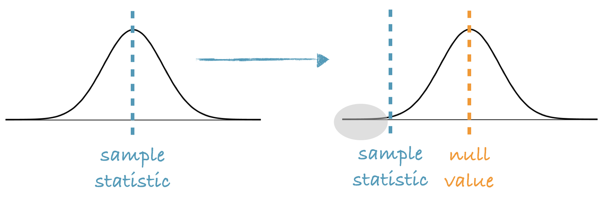

```{r setup, include=FALSE}
# load packages ----------------------------------------------------------------

library(learnr)
library(tidyverse)
library(infer)
library(openintro)
library(emo)

# knitr options ----------------------------------------------------------------

knitr::opts_chunk$set(fig.align = "center", 
                      fig.height = 3, 
                      fig.width = 5,
                      echo = FALSE, 
                      message = FALSE, 
                      warning = FALSE)

# data prep --------------------------------------------------------------------

manhattan <- read_csv("data/manhattan.csv")
set.seed(20170801)
```

## Welcome

Welcome to Inference for Numerical Data! In this tutorial you will learn concepts that are essential for conducting inference on numerical data and the associated R code for doing so.

We'll begin with using bootstrapping techniques to conduct inference on a single parameter of a numerical distribution. 

Let's get to it!


## Rent in Manhattan

On a given day, twenty 1 BR apartments were randomly selected on Craigslist Manhattan from apartments listed as "by owner" (as opposed to by a rental agency).

Is the mean or the median a better measure of typical rent in Manhattan?



On a given day, twenty 1 BR apartments were randomly selected on Craigslist Manhattan from apartments listed as "by owner", as opposed to by a rental agency. First, let's take a look at the distribution of these rents. The distribution is unimodal and right skewed. 

Then, is the mean or the median a better measure of typical rent in Manhattan? 

Since the distribution is right skewed, median is a better measure of typical rent.

### Bootstrapping techniques

Assuming that this sample is representative of the population of all one bedroom apartments in Manhattan, which is a bit unlikely since these data come from only one classifieds website, we can use bootstrapping techniques to estimate the median rental price of one bedrooms apartments in Manhattan.

Remember that the term bootstrapping comes from the phrase pulling oneself up by one's bootstraps, which is a metaphor for accomplishing an impossible task without any outside help. In this case the impossible task is estimating the population parameter using data from only the given sample. Note that this is what statistical inference is all about -- we have a sample, and we use that sample to make inferences about the unknown population.

### Observed sample

**Sample median = $2,350**



Here's our original sample of 20 apartments and their rents. The sample median is two thousand three hundred and fifty dollars.

Using this sample, we want to estimate the population median and we will do so via bootstrapping. Remember, in bootstrapping we take random samples from the original sample with replacement.


### Bootstrap population



We sample with replacement because we believe that for every observation in the sample, there are more like it in the population. So we can think of our bootstrap population as a population where each observation from the sample appears many times. And then we take many samples from this population to understand what medians of samples from the original population would look like, if in fact we had the resources to take many samples from the population.

### 

How does this work in practice?

We first take a bootstrap sample: a random sample taken with replacement from the original sample, and of the same size as the original sample.

Then we calculate the bootstrap statistic for this sample. Remember in this example we're interested in the median, but we could use the same scheme for a mean, a proportion, a standard deviation, a slope, etc.

We repeat steps one and two many times to create the bootstrap distribution. This is a distribution of bootstrap statistics. This is actually just like creating the sampling distribution, but there is one big difference: in bootstrapping we are taking samples from the original sample instead of from the population.

### Bootstrapping scheme, in R

```{r eval=FALSE, echo=TRUE}

___ %>%                               # start with data frame
  specify(response = ___) %>%         # specify the variable of interest
```

Next let's discuss is implementing bootstrapping in R using the infer package. We can construct the bootstrap distribution in one pipe.

We start with our data frame, and first specify the variable of interest, which in this case is rent.

### 

```{r eval=FALSE, echo=TRUE}
___ %>%                               # start with data frame
  specify(response = ___) %>%         # specify the variable of interest
  generate(reps = ___, type = "bootstrap") %>%  # generate bootstrap samples
```

Then we generate bootstrap samples, many many of them!

### 

```{r eval=FALSE, echo=TRUE}
___ %>%                               # start with data frame
  specify(response = ___) %>%         # specify the variable of interest
  generate(reps = ___, type = "bootstrap") %>%  # generate bootstrap samples
  calculate(stat = "___")             # calculate bootstrap statistic
```

And finally we calculate the statistic in each one of these samples, which in this case is the median.

### Constructing the bootstrap interval

```{r eval=FALSE, echo=TRUE}
___ %>%                               # start with data frame
  specify(response = ___) %>%         # specify the variable of interest
  generate(reps = ___, type = "bootstrap") %>%  # generate bootstrap samples
  calculate(stat = "___")             # calculate bootstrap statistic
```



The result is the bootstrap distribution.

### 

```{r eval=FALSE, echo=TRUE}
___ %>%                               # start with data frame
  specify(response = ___) %>%         # specify the variable of interest
  generate(reps = ___, type = "bootstrap") %>%  # generate bootstrap samples
  calculate(stat = "___")             # calculate bootstrap statistic
```



and using this distribution we determine the bounds of the confidence interval.

Now let's put what you've learned so far to use.

### Generate bootstrap distribution for median

When building a bootstrap distribution for a single statistic, we first generate a series of bootstrap resamples, and then record the relevant statistic (in this case, the median) of each distribution. 

In this exercise, the **tidyverse** packages, including **ggplot2** have been loaded for you, as has **infer**.

### 

Next is a two part exercise: First, generate 15000 bootstrap distributions of `rent` in the `manhattan` data frame and record the median of each bootstrap distribution.
 
- Specify that `rent` is the response variable.
- Generate 15000 bootstrap replicates.
- Calculate the median of each distribution.


```{r bootstrap_distribution, exercise=TRUE}
# Generate bootstrap distribution of medians
rent_med_ci <- manhattan %>%
  # Specify the variable of interest
  ___(response = ___) %>%  
  # Generate 15000 bootstrap samples
  ___(reps = ___, type = "___") %>% 
  # Calculate the median of each bootstrap sample
  ___(stat = "___")
  
# Take a peek
glimpse(rent_med_ci)
```

```{r bootstrap_distribution-hint, echo = FALSE}
**Hint:** 
- In `specify()`, set `response` to `rent` without quotes.
- In `generate()`, set `reps` to `15000` and `type` to `"bootstrap"`.
- In `calculate()`, set `stat` to `"median"`.
```

```{r bootstrap_distribution-solution}
# Generate bootstrap distribution of medians
rent_med_ci <- manhattan %>%
  # Specify the variable of interest
  specify(response = rent) %>%  
  # Generate 15000 bootstrap samples
  generate(reps = 15000, type = "bootstrap") %>%
  # Calculate the median of each bootstrap sample
  calculate(stat = "median")
  
# Take a peek
glimpse(rent_med_ci)
```

### 

Then, plot a histogram of the bootstrap medians.

- Using `rent_med_ci`, plot `stat` on the `x` axis.
- Add a histogram layer with a binwidth of `50`.

```{r bootstrap_medians-setup, include = FALSE}
# Set seed so that same bootstrap object can be reused later
set.seed(20170801)

# Create bootstrap distribution of medians
rent_med_ci <- manhattan %>%
  specify(response = rent) %>%
  generate(reps = 15000, type = "bootstrap") %>%
  calculate(stat = "median")
```

```{r bootstrap_medians, exercise = TRUE}
# Plot the rent_med_ci statistic
ggplot(___, aes(___)) +
  # Make it a histogram with a binwidth of 50
  ___
```

```{r bootstrap_medians-hint, echo = FALSE}
**Hint:** 
- Use `ggplot()` with `rent_med_ci` as the dataset.
- Inside `aes()`, map `x` to `stat`.
- Add `geom_histogram()`, setting `binwidth` to `50`.
```

```{r bootstrap_medians-solution}
# Plot the rent_med_ci statistic
ggplot(rent_med_ci, aes(x = stat)) +
  # Make it a histogram with a binwidth of 50
  geom_histogram(binwidth = 50)
```

## Review: Percentile and standard error methods

In the previous tutorials you have already discussed percentile and standard error methods for constructing bootstrap confidence intervals. In this lesson we review these methods.

### Bootstrap distribution



Here is our bootstrap distribution, comprised of 15000 bootstrap medians. Each observation in this plot is a median from a bootstrap sample. And remember that each bootstrap sample is a sample taken with replacement from the original sample, and of the same size as the original sample. 

It's really important to  understand what "with replacement" means in this context, as well as the purpose it serves. Say w had a bag with 20 cards in it, each card showing the rent for one of the apartments in my original sample. Taking a bootstrap sample from this bag would mean picking a card, noting the rent on that card, and then putting the card back into the bag before selecting the next card. So the first card becomes a candidate for the second draw as well. Suppose that the first apartment we select from the sample has a rent of 2000 dollars. The idea behind sampling with replacement is that there may be many other such apartments in the population, so if we had the luxury to go back and sample from the population, we could conceivably get more such apartments in our sample.

Using this bootstrap distribution we can calculate a confidence interval in one of two ways.

### Percentile method



The first is the percentile method: where we estimate, say, a 95% confidence interval simply as the middle 95% of the bootstrap distribution.

### 




So the bounds of a 95% confidence interval are the 2.5th and the 97.5th percentiles of the bootstrap distribution.


### Standard error method


sample statistic $\pm$ $t\_{df = n - 1}^*$ $\times$ $SE\_{boot}$

- $df$ for $t^*$ is $n - 1$, where $n$ is the sample size 
- $SE_{boot}$ is the standard deviation of the bootstrap distribution distribution 


A second, and a more accurate, method is the standard error method. In this method we calculate the interval as the sample statistic plus or minus t-star times the bootstrap standard error.

The degrees of freedom for the critical t-score is n-1, where n is the original sample size.

The bootstrap standard error is just the standard deviation of the bootstrap distribution.

Time to put this into practice.


### Calculate bootstrap interval using both methods

Using our bootstrap distribution from an earlier exercise, we can calculate bootstrap intervals for the median price of 1 bedroom apartments in Manhattan. Remember that we saved the bootstrap distribution as `rent_med_ci`.

```{r bootstrap_interval-setup, include=FALSE}
# Set seed so that same bootstrap object can be reused later
set.seed(20170801)

# Create bootstrap distribution of medians
rent_med_ci <- manhattan %>%
  specify(response = rent) %>%
  generate(reps = 15000, type = "bootstrap") %>%
  calculate(stat = "median")
```


### 

Next up is a 4 part exercise. First, calculate a 95% bootstrap confidence interval using the percentile method.

- Summarize `rent_med_ci`'s statistic with appropriate lower and upper quantiles.


```{r bootstrap_interval, exercise=TRUE}
# Calculate bootstrap CI as lower and upper quantiles
rent_med_ci %>%
  summarize(
    l = quantile(___, ___),
    u = ___
  ) 
```

```{r bootstrap_interval-hint, echo = FALSE}
**Hint:** 
- Use `summarize()`, with `quantile(stat, 0.025)` for the 2.5th percentile.
- The `probs` arguments for the `l` and `u` quantiles should add up to one.
```

```{r bootstrap_interval-solution}
# Calculate bootstrap CI as lower and upper quantiles
rent_med_ci %>%
  summarize(
    l = quantile(stat, 0.025),
    u = quantile(stat, 0.975)
  ) 
```

### 

Then, calculate the observed median rent.

- Summarize to calculate the median rent.
- Pull out the value.


```{r bootstrap_interval_2, exercise=TRUE}
rent_med_obs <- manhattan %>%
  # Calculate observed median rent
  ___(median_rent = ___) %>%
  # Pull out the value
  ___
  
# See the result
rent_med_obs
```

```{r bootstrap_interval_2-hint, echo = FALSE}
**Hint:** 
- Use `summarize()` and `median_rent` to the median of `rent`.
- Use `pull()` to extract the vector from the data frame.
```

```{r bootstrap_interval_2-solution}
rent_med_obs <- manhattan %>%
  # Calculate observed median rent
  summarize(median_rent = median(rent)) %>%
  # Pull out the value
  pull()
  
# See the result
rent_med_obs
```

### 

Then, determine the critical value.

- Calculate the degrees of freedom in the dataset.
- Use the t-distribution to determine the critical value for a 95% confidence interval. *`qt()` takes the percentile of the t-distribution you want to find and the degrees of freedom as arguments.*

```{r bootstrap_interval_3-setup, include=FALSE}
rent_med_obs <- manhattan %>%
  summarize(median_rent = median(rent)) %>%
  pull()
```

```{r bootstrap_interval_3, exercise=TRUE}
# Calculate the degrees of freedom
degrees_of_freedom <- ___  
  
# Determine the critical value
t_star <- ___
```

```{r bootstrap_interval_3-hint, echo = FALSE}
**Hint:** 
- The degrees of freedom is n - 1.
- Use `qt()`, setting `p` to `0.975` and `df` to the degrees of freedom.
```

```{r bootstrap_interval_3-solution}
# Calculate the degrees of freedom
degrees_of_freedom <- nrow(manhattan) - 1  
  
# Determine the critical value
t_star <- qt(0.975, df = degrees_of_freedom)
```

### 

And finally, complete the calculation of the 95% bootstrap confidence interval using the standard error method.

- Summarize to calculate the standard error of the bootstrap medians.
- Summarize again to calculate the lower and upper limits of the CI.
- *Compare the interval to the one you calculated in step 1.*

```{r bootstrap_interval_4-setup, include=FALSE}
# Set seed so that same bootstrap object can be reused later
set.seed(20170801)

# Create bootstrap distribution of medians
rent_med_ci <- manhattan %>%
  specify(response = rent) %>%
  generate(reps = 15000, type = "bootstrap") %>%
  calculate(stat = "median")

rent_med_obs <- manhattan %>%
  summarize(median_rent = median(rent)) %>%
  pull()

degrees_of_freedom <- nrow(manhattan) - 1 
t_star <- qt(0.975, df = degrees_of_freedom)
```

```{r bootstrap_interval_4, exercise=TRUE}
# Calculate the CI using the std error method
rent_med_ci %>%
  # Calculate the std error of the statistic
  summarize(boot_se = ___) %>%
  # Calculate the lower and upper limits of the CI
  summarize(
    l = ___ - ___ * ___,
    u = ___ + ___ * ___
  )
```

```{r bootstrap_interval_4-hint, echo = FALSE}
**Hint:** 
- Use `summarize()` to calculate `boot_se` as the standard deviation of `stat`.
- Use `summarize()` again, setting `l_se` to the observed median minus the critical value times the bootstrap standard error.
```

```{r bootstrap_interval_4-solution}
# Calculate the CI using the std error method
rent_med_ci %>%
  # Calculate the std error of the statistic
  summarize(boot_se = sd(stat)) %>%
  # Calculate the lower and upper limits of the CI
  summarize(
    l_se = rent_med_obs - t_star * boot_se,
    u_se = rent_med_obs + t_star * boot_se
  )
```

```{r bootstrap_interval_5-setup, include=FALSE}
# Set seed so that same bootstrap object can be reused later
set.seed(20170801)

# Create bootstrap distribution of medians
rent_med_ci <- manhattan %>%
  specify(response = rent) %>%
  generate(reps = 15000, type = "bootstrap") %>%
  calculate(stat = "median")
```

```{r bootstrap_interval_5, exercise = TRUE}
# Recall the CI using the percentile method from step 1
rent_med_ci %>%
  summarize(
    l = quantile(stat, 0.025),
    u = quantile(stat, 0.975)
  )
```


### 

Whew! The standard error method sure is more work, but often it provides a better estimate.

### Which method more appropriate: percentile or SE?


```{r quiz_1}
quiz(
  question("Which method is more appropriate for calculating the bootstrap confidence interval for the median rent of 1 BR apartments in Manhattan?", 
           correct = "Great job! The standard error method is more appropriate here.", 
           allow_retry = TRUE,
    answer("Percentile method.", message = "This method doesn't always give the best results."),
    answer("Standard error method.", correct = TRUE)
  ), caption = ""
)
```

```{r}
rent_med_ci <- manhattan %>%
  specify(response = rent) %>%
  generate(reps = 15000, type = "bootstrap") %>%
  calculate(stat = "median")

ggplot(data = rent_med_ci, mapping = aes(x = stat)) +
  geom_histogram(binwidth = 50)
```


### Doctor visits during pregnancy

The state of North Carolina released to the public a large data set containing information on births recorded in this state. This data set has been of interest to medical researchers who are studying the relation between habits and practices of expectant mothers and the birth of their children. The `ncbirths` dataset (which is already loaded for you) is a random sample of 1000 cases from this data set. Among other variables, the number of doctor's visits (`visits`) the mother had throughout the pregnancy is recorded. 

```{r quiz_2}
quiz(
  question("Which of the following is **false** about the distribution of `visits`?", 
           correct = "Correct! Filtering the dataset for `is.na(visits)` values reveals missing values for several mothers.", 
           allow_retry = TRUE,
    answer("On average, mothers visit the doctor approximately 12 times throughout pregnancy.", message = "No, this is true. Calculate the mean and median of the `visits` column of `ncbirths`."),
    answer("The distribution of number of doctor's visits is unimodal and roughly symmetric.", message = "No, this is true. Plot a histogram of the distribution of the `visits` column of `ncbirths`."),
    answer("The median number of doctor's visits throughout the pregnancy is roughly equal to the mean number of visits.", message = "No, this is true. Calculate the mean and median of the `visits` column of `ncbirths`."),
    answer("The number of doctor's visits for one of the mothers in the dataset is missing.", correct = TRUE)
  ), caption = ""
)
```


```{r doctor_visit, exercise=TRUE}

```
### Average number of doctor's visits

Next, we construct a bootstrap interval for the average number of doctor's visits during pregnancy.

First, filter `ncbirths` for rows where `visits` is not missing.

```{r doctor, exercise=TRUE}
# Filter for rows with non-missing visits
ncbirths_complete_visits <- ncbirths %>%
  ___
  
# See the result
glimpse(ncbirths_complete_visits)

```

```{r doctor-hint, echo = FALSE}
**Hint:** 
- Use `summarize()` to calculate `boot_se` as the standard deviation of `stat`.
- Use `summarize()` again, setting `l` to the observed median minus the critical value times the bootstrap standard error.
- For `u`, change the minus to a plus.
```

```{r doctor-solution}
# Filter for rows with non-missing visits
ncbirths_complete_visits <- ncbirths %>%
  filter(!is.na(visits))
  
# See the result
glimpse(ncbirths_complete_visits)
```


###

Then, generate 15000 bootstrap means of the number of visits.

- Specify `visits` as the variable of interest.
- Generate 15000 bootstrap replicates.
- Calculate the mean.


```{r doctor_2, exercise=TRUE}
# From previous step
ncbirths_complete_visits <- ncbirths %>%
  filter(!is.na(visits))

# Generate 15000 bootstrap means
visit_mean_ci <- ncbirths_complete_visits %>%
  # Specify visits as the response
  ___(response = ___) %>%
  # Generate 15000 bootstrap replicates
  ___(reps = ___, type = ___) %>%
  # Calculate the mean
  ___(stat = ___)
```

```{r doctor_2-hint, echo = FALSE}
**Hint:** 
- Use `specify()`, setting `response` to `visits`.
- Use `generate()`, setting `reps` to `15000` and `type` to `"bootstrap"`.
- Use `calculate()`, setting `stat` to `"mean"`.
```

```{r doctor_2-solution}
# From previous step
ncbirths_complete_visits <- ncbirths %>%
  filter(!is.na(visits))

# Generate 15000 bootstrap means
visit_mean_ci <- ncbirths_complete_visits %>%
  # Specify visits as the response
  specify(response = visits) %>%
  # Generate 15000 bootstrap replicates
  generate(reps = 15000, type = "bootstrap") %>%
  # Calculate the mean
  calculate(stat = "mean")
```

### 

And finally, calculate the 90% confidence interval via percentile method.

- Summarize to calculate appropriate quantiles of the bootstrap statistic.

```{r doctor_3, exercise=TRUE}
# From previous steps
ncbirths_complete_visits <- ncbirths %>%
  filter(!is.na(visits))
visit_mean_ci <- ncbirths_complete_visits %>%
  specify(response = visits) %>%
  generate(reps = 15000, type = "bootstrap") %>%
  calculate(stat = "mean")
  
# Calculate the 90% CI via percentile method
visit_mean_ci %>%
  summarize(
    l = ___,
    u = ___
  )
```

```{r doctor_3-hint, echo = FALSE}
**Hint:** 
- Use `summarize()`, setting `l` to the `0.05` quantile of `stat`.
- The `probs` arguments for the `l` and `u` quantiles should add up to one.
```

```{r doctor_3-solution}
# From previous steps
ncbirths_complete_visits <- ncbirths %>%
  filter(!is.na(visits))
visit_mean_ci <- ncbirths_complete_visits %>%
  specify(response = visits) %>%
  generate(reps = 15000, type = "bootstrap") %>%
  calculate(stat = "mean")
  
# Calculate the 90% CI via percentile method
visit_mean_ci %>%
  summarize(
    l = quantile(stat, 0.05),
    u = quantile(stat, 0.95)
  )
```

### 

Fantastic! Quick mental check before you move on: How would you interpret this interval?


### SD of number of doctor's visits

Suppose now we're interested in the standard deviation of the number of doctor's visits throughout pregnancy.

```{r doctor_4-setup, include=FALSE}
# Remove NA visits
ncbirths_complete_visits <- ncbirths %>%
  filter(!is.na(visits))
```

For the number of doctor's visits, first generate 15000 bootstrap replicates and calculate their standard deviations.

```{r doctor_4, exercise=TRUE}
# Calculate 15000 bootstrap standard deviations of visits
visit_sd_ci <- ncbirths_complete_visits %>%
  ___ %>%
  ___ %>%
  ___
  
# See the result
visit_sd_ci
```

```{r doctor_4-hint, echo = FALSE}
**Hint:** 
- Use `specify()`, setting `response` to `visits`.
- Use `generate()`, setting `reps` to `15000` and `type` to `"bootstrap"`.
- Use `calculate()`, setting `stat` to `"sd"`.
```

```{r doctor_4-solution}
# Calculate 15000 bootstrap standard deviations of visits
visit_sd_ci <- ncbirths_complete_visits %>%
  specify(response = visits) %>%
  generate(reps = 15000, type = "bootstrap") %>%
  calculate(stat = "sd")
  
# See the result
visit_sd_ci
```

### 

Then, calculate a 90% confidence interval for the bootstrap standard deviations using the percentile method.

```{r doctor_5, exercise=TRUE}
# From previous step
visit_sd_ci <- ncbirths_complete_visits %>%
  specify(response = visits) %>%
  generate(reps = 15000, type = "bootstrap") %>%
  calculate(stat = "sd")
  
# Calculate the 90% CI via percentile method
visit_sd_ci %>%
  ___(
    l = ___,
    u = ___
  )
```

```{r doctor_5-hint, echo = FALSE}
**Hint:** 
- Use `summarize()`, setting `l` to the `0.05` quantile of `stat`.
- The `probs` arguments for the `l` and `u` quantiles should add up to one.
```

```{r doctor_5-solution}
# From previous step
visit_sd_ci <- ncbirths_complete_visits %>%
  specify(response = visits) %>%
  generate(reps = 15000, type = "bootstrap") %>%
  calculate(stat = "sd")
  
# Calculate the 90% CI via percentile method
visit_sd_ci %>%
  summarize(
    l = quantile(stat, 0.05),
    u = quantile(stat, 0.95)
  )
```

## Re-centering a bootstrap distribution

So far we learned how to create bootstrap confidence intervals for estimation purposes. But what do we do if our goal is testing, not estimation? How can we use simulation methods to test whether a single parameter of a numerical distribution is different from, greater than, or smaller than some value? The answer is simple, though not necessarily intuitive. However if you keep in mind one important aspect of hypothesis testing -- namely that we assume the null hypothesis is true -- hopefully the approach makes sense.

### Re-centering a bootstrap distribution for hypothesis testing

> - Bootstrap distributions are by design centered at the observed sample statistic. 
> - However since in a hypothesis test we assume that $H_0$ is true, we shift the bootstrap distribution to be centered at the null value. 
> - p-value = The proportion of simulations that yield a sample statistic at least as favorable to the alternative hypothesis as the observed sample statistic. 

Bootstrap distributions are by design centered at the observed sample statistic.

However since in a hypothesis test we assume that the null hypothesis is true, we shift the bootstrap distribution to be centered at the null value.

The p-value is then defined as the proportion of simulations that yield a sample statistic at least as favorable to the alternative hypothesis as the observed sample statistic.


### Re-centering the bootstrap distribution - sketch



Here is a graphical representation: We start with our bootstrap distribution, which is always centered at the observed sample statistic. We then shift this distribution so the center is at the null value, and calculate the p-value as the proportion of simulations that yield bootstrap statistics that are at least as extreme as the observed sample statistic.

Now it's time to practice.

### Test for median price of 1 BR apartments in Manhattan

Let's turn our attention back to Manhattan apartments. We would like to evaluate whether this data provides evidence that the median rent of 1 BR apartments in Manhattan is greater than $2,500.

```{r apartments-setup, include=FALSE}
# Set seed so that same bootstrap sample can be reused later
set.seed(20170802)
```

First, let's generate 15000 bootstrap samples centered at null. *The specify, generate, and calculate steps are completed for you.*

- Set a point null hypothesis with a `med`ian of `2500`.


```{r apartments, exercise=TRUE}
n_replicates <- 15000

# Generate 15000 bootstrap samples centered at null
rent_med_ht <- manhattan %>%
  specify(response = rent) %>%
  # Use a point hypothesis with a median of 2500
  ___(null = "___", med = ___) %>% 
  generate(reps = n_replicates, type = "bootstrap") %>% 
  calculate(stat = "median")
  
# See the result
rent_med_ht
```

```{r apartments-hint, echo = FALSE}
**Hint:** Call `hypothesize()`, setting `null` to `"point"` and `med` to `2500`.
```

```{r apartments-solution}
n_replicates <- 15000

# Generate 15000 bootstrap samples centered at null
rent_med_ht <- manhattan %>%
  specify(response = rent) %>%
  # Use a point hypothesis with a median of 2500
  hypothesize(null = "point", med = 2500) %>% 
  generate(reps = n_replicates, type = "bootstrap") %>% 
  calculate(stat = "median")
  
# See the result
rent_med_ht
```

### 

Then, calculate the observed median rent.

- Summarize to calculate the median rent.
- Pull out the value.


```{r apartments_2, exercise=TRUE}
# From previous step
n_replicates <- 15000
rent_med_ht <- manhattan %>%
  specify(response = rent) %>%
  hypothesize(null = "point", med = 2500) %>% 
  generate(reps = n_replicates, type = "bootstrap") %>% 
  calculate(stat = "median")
  
rent_med_obs <- manhattan %>%
  # Calculate observed median rent
  ___(median_rent = ___) %>%
  # Pull out the value
  ___
  
# See the result
rent_med_obs
```

```{r apartments_2-hint, echo = FALSE}
**Hint:** 
- Use `summarize()`, setting `median_rent` to the median of `rent`.
- Use `pull()` to extract the vector from the data frame.
```

```{r apartments_2-solution}
# From previous step
n_replicates <- 15000
rent_med_ht <- manhattan %>%
  specify(response = rent) %>%
  hypothesize(null = "point", med = 2500) %>% 
  generate(reps = n_replicates, type = "bootstrap") %>% 
  calculate(stat = "median")
  
rent_med_obs <- manhattan %>%
  # Calculate observed median rent
  summarize(median_rent = median(rent)) %>%
  # Pull out the value
  pull()
  
# See the result
rent_med_obs
```

### 

And finally, calculate the p-value as the proportion of bootstrap statistics greater than the observed statistic.

- Filter for rows where the bootstrap median is greater than or equal to the observed median.
- Summarize to calculate `p_val` as the number of rows in the filtered dataset divided by the number of replicates.


```{r apartments_3, exercise=TRUE}
# From previous step
n_replicates <- 15000
rent_med_ht <- manhattan %>%
  specify(response = rent) %>%
  hypothesize(null = "point", med = 2500) %>% 
  generate(reps = n_replicates, type = "bootstrap") %>% 
  calculate(stat = "median")
rent_med_obs <- manhattan %>%
  summarize(median_rent = median(rent)) %>%
  pull()
  
rent_med_ht %>%
  # Filter for bootstrap stat greater than or equal to observed stat
  filter(___ >= ___) %>%
  # Calculate the p-value
  summarize(p_val = ___ / ___)
```

```{r apartments_3-hint, echo = FALSE}
**Hint:** 
- Use `filter()`, using the condition `stat` greater than or equal to the observed median rent, `rent_med_obs`.
- Use `summarize()`, setting `p_val` to the number of rows, `n()`, divided by the total number of replicates, `n_replicates`.
```

```{r apartments_3-solution}
# From previous step
n_replicates <- 15000
rent_med_ht <- manhattan %>%
  specify(response = rent) %>%
  hypothesize(null = "point", med = 2500) %>% 
  generate(reps = n_replicates, type = "bootstrap") %>% 
  calculate(stat = "median")
rent_med_obs <- manhattan %>%
  summarize(median_rent = median(rent)) %>%
  pull()
  
rent_med_ht %>%
  # Filter for bootstrap stat greater than or equal to observed stat
  filter(stat >= rent_med_obs) %>%
  # Calculate the p-value
  summarize(p_val = n() / n_replicates)
```

### Conclude the hypothesis test on median

The p-value you calculated in the previous exercise is available as `rent_p_value`.
Recall the problem statement: We would like to evaluate whether this data provides evidence that the median rent of 1 BR apartments in Manhattan is greater than $2,500.


```{r quiz_3}
quiz(
  question("What is the conclusion of the hypothesis test at the 5% significance level?", 
           correct = "Correct! The p-value is above the significance level, so we fail to reject the null hypothesis, and conclude that the data do not provide convincing evidence for the alternative hypothesis.", 
           allow_retry = TRUE,
    answer("We reject $H_0$ since the p-value is above the significance level, and conclude that the data provide convincing evidence that median rent of 1 BR apartments in Manhattan is greater than $2500.", message = "No. A p-value above the significance level means we should not reject the null hypothesis."),
    answer("We fail to reject $H_0$ since the p-value is above the significance level, and conclude that the data provide convincing evidence that median rent of 1 BR apartments in Manhattan is greater than $2500.", message = "No. A p-value above the significance level means that the data do not provide convincing evidence of the alternative hypothesis."),
    answer("We reject $H_0$ since the p-value is below the significance level, and conclude that the data do not provide convincing evidence that median rent of 1 BR apartments in Manhattan is greater than $2500.", message = "No. The p-value is above the significance level."),
    answer("We fail to reject $H_0$ since the p-value is above the significance level, and conclude that the data do not provide convincing evidence that median rent of 1 BR apartments in Manhattan is greater than $2500.", correct = TRUE)
  ), caption = ""
)
```

```{r apartments_4-setup, echo=TRUE}
# Set seed so that same bootstrap sample can be reused later
set.seed(20170802)
# From previous step
n_replicates <- 15000
rent_med_ht <- manhattan %>%
  specify(response = rent) %>%
  hypothesize(null = "point", med = 2500) %>% 
  generate(reps = n_replicates, type = "bootstrap") %>% 
  calculate(stat = "median")
rent_med_obs <- manhattan %>%
  summarize(median_rent = median(rent)) %>%
  pull()
  
rent_p_value <- rent_med_ht %>%
  # Filter for bootstrap stat greater than or equal to observed stat
  filter(stat >= rent_med_obs) %>%
  # Calculate the p-value
  summarize(p_val = n() / n_replicates)
```

### Test for average weight of babies


We'll wrap up inference on a single parameter of a numerical distribution by revisiting the `ncbirths` dataset, specifically the `weight` variable, indicating the birth weight of the baby. Do these data provide convincing evidence that the average birth weight of babies born in North Carolina is different than 7 pounds?

Calculate 1500 bootstrap replicates of the mean `weight`. Use a point null hypothesis of weights being `mu = 7` pounds.

```{r babies, exercise=TRUE}
n_replicates <- 1500

weight_mean_ht <- ncbirths %>%
  # Specify weight as the response
  ___ %>%
  # Set the hypothesis that weights are 7 pounds
  ___ %>% 
  # Generate 1500 bootstrap replicates
  ___ %>% 
  # Calculate the mean
  ___
```

```{r babies-hint, echo = FALSE}
**Hint:** 
- Use `specify()`, setting `response` to `weight`.
- Use `hypothesize()`, setting `null` to `"point"` and `mu` to `7`.
- Use `generate()`, setting `reps` to `n_replicates` and `type` to `"bootstrap"`.
- Use `calculate()`, setting `stat` to `"sd"`.
```

```{r babies-solution}
n_replicates <- 1500

weight_mean_ht <- ncbirths %>%
  # Specify weight as the response
  specify(response = weight) %>%
  # Set the hypothesis that weights are 7 pounds
  hypothesize(null = "point", mu = 7) %>% 
  # Generate 1500 bootstrap replicates
  generate(reps = n_replicates, type = "bootstrap") %>% 
  # Calculate the mean
  calculate(stat = "mean")
```

###

First, calculate the mean observed weight and pull out the value.


```{r babies_2, exercise=TRUE}
n_replicates <- 1500
weight_mean_ht <- ncbirths %>%
  specify(response = weight) %>%
  hypothesize(null = "point", mu = 7) %>% 
  generate(reps = n_replicates, type = "bootstrap") %>% 
  calculate(stat = "mean")

# Calculate observed mean
weight_mean_obs <- ncbirths %>%
  # Summarize to calculate the mean observed weight
  ___(mean_weight = ___) %>% 
  # Pull out the value
  ___
```

```{r babies_2-hint, echo = FALSE}
**Hint:** 
- Use `summarize()`, setting `mean_weight` to the mean of `weight`.
- Use `pull()` to extract the vector from the data frame.
```

```{r babies_2-solution}
# From previous step
n_replicates <- 1500
weight_mean_ht <- ncbirths %>%
  specify(response = weight) %>%
  hypothesize(null = "point", mu = 7) %>% 
  generate(reps = n_replicates, type = "bootstrap") %>% 
  calculate(stat = "mean")

# Calculate observed mean
weight_mean_obs <- ncbirths %>%
  # Summarize to calculate the mean observed weight
  summarize(mean_weight = mean(weight)) %>%
  # Pull out the value
  pull()
```

### 

Then, calculate the two-sided p-value.

- Filter for rows where the bootstrap median is greater than or equal to the observed median.
- Summarize to calculate `one_sided_p_val` as the number of rows in the filtered dataset divided by the number of replicates.
- Calculate `two_sided_p_val` from `one_sided_p_val`.


```{r babies_3, exercise=TRUE}
# From previous steps
n_replicates <- 1500
weight_mean_ht <- ncbirths %>%
  specify(response = weight) %>%
  hypothesize(null = "point", mu = 7) %>% 
  generate(reps = n_replicates, type = "bootstrap") %>% 
  calculate(stat = "mean")
weight_mean_obs <- ncbirths %>%
  summarize(mean_weight = mean(weight)) %>%
  pull()

# Calculate p-value
weight_mean_ht %>%
  # Filter on stat greater than or equal to weight_mean_obs
  filter(___ >= ___) %>%
  # p_val is twice the number of filtered rows divided by the total number of rows
  summarize(
    one_sided_p_val = ___ / ___,
    two_sided_p_val = ___ * ___
  )
```

```{r babies_3-hint, echo = FALSE}
**Hint:** 
- Use `filter()`, using the condition `stat` greater than or equal to the observed median rent.
- Use `summarize()`, setting `one_sided_p_val` to the number of rows, `n()`, divided by the total number of replicates, `n_replicates`.
- Inside `summarize()`, set `two_sided_p_val` to double `one_sided_p_val`.
```

```{r babies_3-solution}
# From previous steps
n_replicates <- 1500
weight_mean_ht <- ncbirths %>%
  specify(response = weight) %>%
  hypothesize(null = "point", mu = 7) %>% 
  generate(reps = n_replicates, type = "bootstrap") %>% 
  calculate(stat = "mean")
weight_mean_obs <- ncbirths %>%
  summarize(mean_weight = mean(weight)) %>%
  pull()

# Calculate p-value
weight_mean_ht %>%
  # Filter on stat greater than or equal to weight_mean_obs
  filter(stat >= weight_mean_obs) %>%
  # p_val is twice the number of filtered rows divided by the total number of rows
  summarize(
    one_sided_p_val = n() / n_replicates,
    two_sided_p_val = 2 * one_sided_p_val
  )
```

## Congratulations!

You have successfully completed Lesson 1 in Tutorial 5: Statistical inference.  

What's next?

`r emo::ji("ledger")` [Full list of tutorials supporting OpenIntro::Introduction to Modern Statistics](https://openintrostat.github.io/ims-tutorials/)

`r emo::ji("spiral_notepad")` [Tutorial 5: Statistical inference](https://openintrostat.github.io/ims-tutorials/05-infer/)

`r emo::ji("one")` [Tutorial 5 - Lesson 1: Bootstrapping for estimating a parameter](https://openintro.shinyapps.io/ims-05-infer-01/)

`r emo::ji("one")` [Tutorial 5 - Lesson 2: Introducing the t-distribution](https://openintro.shinyapps.io/ims-05-infer-02/)

`r emo::ji("one")` [Tutorial 5 - Lesson 3: Inference for difference in two parameters](https://openintro.shinyapps.io/ims-05-infer-03/)

`r emo::ji("one")` [Tutorial 5 - Lesson 4: Comparing many means](https://openintro.shinyapps.io/ims-05-infer-04/)

`r emo::ji("open_book")` [Learn more at Introduction to Modern Statistics](http://openintro-ims.netlify.app/)
