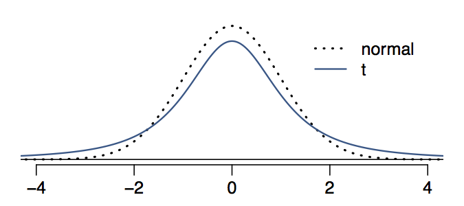
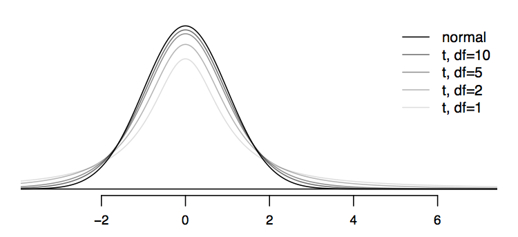
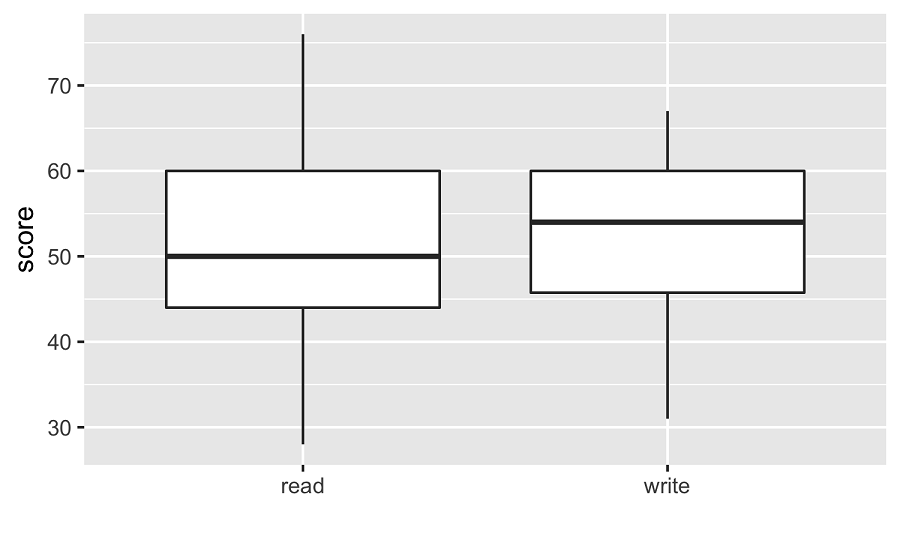

```{r setup, include=FALSE}
# load packages ----------------------------------------------------------------
library(learnr)
library(tidyverse)
library(infer)
library(openintro)
library(emo)

# knitr options ----------------------------------------------------------------

knitr::opts_chunk$set(fig.align = "center", 
                      fig.height = 3, 
                      fig.width = 5,
                      echo = FALSE, 
                      message = FALSE, 
                      warning = FALSE)

# data prep --------------------------------------------------------------------

set.seed(20170801)

acs12_emp <- acs12 |>
  filter(employment == "employed")

hsb2 <- hsb2 |> 
  mutate(diff = read - write)
```

## t-distribution

So far we have discussed inference on numerical data using simulation based methods. When the parameter of interest is the mean (or a difference between two means) and certain conditions are not violated, we can also use methods based on the Central Limit Theorem for conducting inference.

> - $\sigma$ is unknown (almost always) $\rightarrow$ $\bar{x}~\sim~$ t-distribution
> - t-distribution is bell shaped but has thicker tails the normal
> - Observations more likely to fall beyond 2 SDs from the mean



In a nutshell the t-distribution is useful for describing the distribution of the sample mean when the population standard deviation, sigma, is unknown, which is almost always.

This distribution also has a bell shape, so it's unimodal and symmetric. It looks a lot like the normal distribution, however its tails are thicker.

Comparing the normal and t distributions visually is the best way to understand what we mean by "thick tails". Notice that the peak of the T distribution doesn't go as high as the peak of the normal distribution. In other words, the T distribution is somewhat squished in the middle, and the additional area is added to the tails. 

This means that under the t distribution observations are more likely to fall 2 standard deviations away from the mean than under the normal distribution. This implies that confidence intervals constructed using the t distribution will be wider, in other words more conservative, than those constructed with the normal distribution.

## Shape of the t-distribution

> - Always centered at 0 
> - Has one parameter: **degrees of freedom** (df) - determines thickness of tails 
>   - As df increases, the t-distribution looks more and more like the normal distribution 



The t-distribution is always centered at zero, and it has one parameter, degrees of freedom, which determines the thickness of its tails.

What happens to the shape of the t-distribution as the degrees of freedom increases?

This plot shows a series of bell curves, going from light to dark shades of gray as the degrees of freedom increases. 

We can see that as the degrees of freedom increases, the t-distribution approaches the normal distribution.

This is why you might see in other resources that if the sample size is "large enough" one can use the normal distribution to approximate the sampling distribution of the mean. Often such statements will be accompanied by a sample size that can be considered "large enough" for the statement to hold. In this tutorial we will keep things simple and straightforward -- when working with the mean (or difference of means) use the t-distribution for Central Limit Theorem based inference.

Now let's try some examples.


### When to t?

```{r quiz_1}
question("Which of the following describes best why we might need to use the t-distribution for inference?", 
           correct = "Great job! You're a t-pro!", 
           allow_retry = TRUE,
    answer("When the population distribution is not known", message = "No. If you don't know anything about the population distribution, the t-distribution won't help you."),
    answer("When the population standard deviation is unknown", correct = TRUE),
    answer("When the sample is not random", message = "No. If your sample is not random, a t-distribution is not appropriate."),
    answer("When the sample is not representative of the population", message = "Sorry. If your sample is not representative of the population, you shouldn't use it to infer things about that population.")
  )
```

### Probabilities under the t-distribution

We can use the `pt()` function to find probabilities under the t-distribution. For a given cutoff value `q` and a given degrees of freedom `df`, `pt(q, df)` gives us the probability under the t-distribution with `df` degrees of freedom for values of $t$ less than `q`. In other words, $P(t_{df} < T)$ = `pt(q = T, df)`.

In the exercise below, 

- Find the probability under the t-distribution with 10 degrees of freedom below $T = 3$.
- Find the probability under the t-distribution with 10 degrees of freedom above $T = 3$.
- Find the probability under the t-distribution with 100 degrees of freedom above $T = 3$.
- How do the last two probabilities compare? Why?


```{r t-distribution, exercise=TRUE}
# P(T < 3) for df = 10
(x <- pt(___, df = ___))

# P(T > 3) for df = 10
(y <- ___)

# P(T > 3) for df = 100
(z <- ___)

# Comparison
y == z
y > z
y < z
```

```{r t-distribution-hint}

- Call `pt()` setting the quantile, `q`, to `3` and `df` to the number of degrees of freedom.
- The total area under a probability distribution is 1.
```

```{r t-distribution-solution}
# P(T < 3) for df = 10
(x <- pt(3, df = 10))

# P(T > 3) for df = 10
(y <- 1 - x)

# P(T > 3) for df = 100
(z <- 1 - pt(3, df = 100))

# Comparison
y == z
y > z
y < z
```

### 

Great job! Do your findings agree with the statement that as the degrees of freedom increases the area in the tails decreases?

### Cutoffs under the t-distribution

We can use the `qt()` function to find cutoffs under the t-distribution. For a given probability `p` and a given degrees of freedom `df`, `qt(p, df)` gives us the cutoff value for the t-distribution with `df` degrees of freedom for which the probability under the curve is `p`. In other words, if $P(t_{df} < T) = p$, then $T$ = `qt(p, df)`. For example, if $T$ corresponds to the 95th percentile of a distribution, $p = 0.95$. The "middle 95%" is between percentiles `p = 0.025` and `p = 0.975`.

In the exercise below, 

- Find the 95th percentile of the t-distribution with 10 degrees of freedom.
- Find the cutoff value that bounds the upper end of the middle 95th percent of the t-distribution with 10 degrees of freedom.
- Find the cutoff value that bounds the upper end of the middle 95th percent of the t-distribution with 100 degrees of freedom.
- *How do the last percentiles compare? Based on your findings, is the middle 95% of the t-distribution wider for lower or higher degrees of freedom?*


```{r t-distribution-cutoffs, exercise=TRUE}
# 95th percentile for df = 10
(x <- qt(___, df = ___))

# Upper bound of middle 95th percent for df = 10
(y <- ___)

# Upper bound of middle 95th percent for df = 100
(z <- ___)

# Comparison
y == z
y > z
y < z
```

```{r t-distribution-cutoffs-hint}

- The first argument to the `qt()` function is the percentile you want find the cutoff for. For example, `qt(0.5, df = 5)` returns the 50th percentile of the t-distribution with 5 degrees of freedom.
- The upper bound of the middle 95% is `0.975`.
```

```{r t-distribution-cutoffs-solution}
# 95th percentile for df = 10
(x <- qt(0.95, df = 10))

# Upper bound of middle 95th percent for df = 10
(y <- qt(0.975, df = 10))

# Upper bound of middle 95th percent for df = 100
(z <- qt(0.975, df = 100))

# Comparison
y == z
y > z
y < z
```

## Estimating with the t-interval

In this lesson we learn how to construct confidence intervals for a population mean using the t-distribution.

### Quantifying variability of sample means


> Suppose among a random sample of 100 people 13 are left handed. If you were to select another random sample of 100, would you be surprised if only 12 are left handed? What about 15? Or 30? Or 1 or 90?

> Ways to quantify the variability of the sample mean:
> - Simulate with bootstrapping
> - Approximate with Central Limit Theorem

Let's start with a motivating question:  Suppose among a random sample of 100 people 13 are left handed. If you were to select another random sample of 100, would you be surprised if only 12 are left handed? Probably not... What about 15? Again, probably not... or 30? Hard to tell... What about 1 or 90? We can probably agree that these look quite unlikely.

Clearly, we need a way to quantify how much variability is expected between samples.

Bootstrapping is one way to quantify how much sample means vary from one sample to the other.

Another approach is to use theory, or specifically the Central Limit Theorem, to approximate how much sample means vary from one sample to the other. This will be our next focus.

### Central Limit Theorem

> $$ \bar{x} \sim N \left( mean = \mu, SE = \frac{\sigma}{\sqrt{n}} \right) $$

> - SE (standard error) = standard deviation of the sampling distribution 
> - $\sigma$ unknown: 
>   - $SE = \frac{s}{\sqrt{n}}$ 
>   - Use $t_{df = n - 1}$ for inference for a mean 
> - Only true if certain conditions are not violated... 

The Central Limit Theorems states the distribution of sample means is nearly normal, centered at the population mean, and with a standard error equal to the population standard deviation divided by the square root of the sample size.

The standard error is defined as the standard deviation of the sampling distribution, which is the distribution of sample means of samples from the original population. Note, this is a theoretical distribution that we in reality can't generate because we don't have the luxury of going back to the original population to take new samples. It's similar in spirit to the bootstrap distribution but it's different as the samples are not resampled from the original sample, but instead the population. The standard error from the bootstrap distribution can be thought of as an approximation to this *true* standard error of the sampling distribution. 

Since the population standard deviation is often unknown, in practice, the standard error is estimated by the standard deviation of the sample divided by the square root of the sample size. 

And this additional uncertainty introduced by using the sample standard deviation is mitigated by using a t-distribution with degrees of freedom n - 1 since compared to the normal distribution the t-distribution is more conservative with thicker tails.

And as with most theorems, this one also only applies if certain condition are mathematically met. However, it would be incredibly difficult to "prove" that these conditions are mathematically "met," so, instead, we will evaluate the degree to which it appears that these mathematical conditions are violated. 


### Conditions

> 1. Independent observations: Hard to check, but... 
>     - random sampling / assignment 
>     - if sampling without replacement, n < 10% of population 
> 2. Sample size / skew: The more skewed the original population, the larger the sample size should be. 


Here are the conditions:

First, the observations in our sample should be independent of each other with respect to the response variable. This is difficult to verify.

However if the study employs random sampling and/or random assignment, the risk of dependent observations is substantially lower. 

And for studies that employ random sampling without replacement -- which is almost all polls and surveys -- the sample size should be less than 10% of the population. If we know that our sample is less than 10% of the population, it seems more reasonable to assume that the observations in the sample are independent of each other.

Second, the more skewed the original population distribution, the larger a sample size we need to have an approximately normal sampling distribution. So it's important to plot the distribution of the sample, which is the best window we have into the unknown population, and verify the skewness of the distribution.

### Confidence interval for a mean


> Estimate the average number of hours Americans work in their usual schedule (variable: `hours`) using data from the 2010 General Social Survey (data: `gss`).

Let's use data from the 2010 General Social Survey to estimate the number of hours Americans work during their "typical" schedule. The data are stored in a dataframe called `gss` and the variable of interest is called `hours`.

### 

> Estimate the average number of hours Americans work during their "usual" schedule (variable: `hours`) using data from the 2010 General Social Survey (data: `gss`).

```{r echo=TRUE}
gss |> 
  t_test(response = hours,
         conf_int = TRUE,
         conf_level = 0.95)
```

We can create the confidence interval using the `t_test()` -- don't worry about the word "test" for now -- by using the variable we're interested in as the `response`, specifying that we are interested in a confidence interval by setting `conf_int` to `TRUE`, and setting the confidence level as 0.95 (or 95%).

Based on this output, we are 95% confident that the average number of hours per week Americans work in their usual schedule is between 40.1 and 42.7. 

Time to put this into practice.

### Average commute time of Americans

Each year since 2005, the US Census Bureau surveys about 3.5 million households with The [American Community Survey](https://www.census.gov/programs-surveys/acs/) (ACS). Data collected from the ACS have been crucial in government and policy decisions, helping to determine the allocation of federal and state funds each year. Data from the 2012 ACS is available in the `acs12` dataset.

By default, when given one argument, `t_test()` tests whether the population mean of its input is different than 0. That is $H_0: \mu_{variable} = 0$ and $H_A: \mu_{variable} \ne 0$. And, as we saw earlier, `t_test()` can also provide a confidence interval for the population mean.

In the exercise below, 

- Filter the `acs12` dataset for individuals whose employment status is `"employed"`, and save this new dataset as `acs12_emp`.
- Use `t_test()` to construct a 95% confidence interval for the average commute time of Americans, recorded as the variable `time_to_work`.

```{r Average_commute_time_of_Americans, exercise=TRUE}
# Filter for employed respondents
acs12_emp <- acs12 |>
  filter(___)

# Construct 95% CI for avg time_to_work
acs12_emp |> 
  t_test(response = ___, 
         conf_int = TRUE, 
         conf_level = ___)
```

```{r Average_commute_time_of_Americans-hint}

- Call `filter()` with the condition that `employment` is equal to (`==`) `"employed"`.
- Call `t_test()`, using `time_to_work` as the `response` and using a confidence level of `0.95`.
```

```{r Average_commute_time_of_Americans-solution}
# Filter for employed respondents
acs12_emp <- acs12 |>
  filter(employment == "employed")

# Construct 95% CI for avg time_to_work
acs12_emp |> 
  t_test(response = time_to_work, 
         conf_int = TRUE, 
         conf_level = 0.95)
```

### 

And now you know a range of values you would expect for the true commute time for *all* Americans to take on. Furthermore, if you constructed these intervals for multiple different samples, you would expect that, on average, with 95% of them would capture this true commute time.


### Average number of hours worked

Full-time employment is employment in which a person works a minimum number of hours defined as such by his/her employer. Companies in the United States commonly require 40 hours per week to be considered a full time employee. This time, we will use data from the American Community Survey to estimate the number of hours Americans work, and see if it differs from our original estimate. 

Use the `acs12_emp` dataset you created earlier; it's already loaded for you.

In this exercise, 

- Create a 95% confidence interval for `hrs_work`.
- *Interpret the confidence interval. Is it likely the average number of hours Americans work is equal to 40?* 
- *Compare the interval to the one obtained in the `gss` data. Do both intervals paint the same picture?*

```{r Average_number_of_hours_worked-setup, include = FALSE}
acs12_emp <- acs12 |>
  filter(employment == "employed")
```


```{r Average_number_of_hours_worked, exercise=TRUE}
# Run a t-test on hrs_work and look at the CI
acs12_emp |> 
  t_test(response = ___, 
         conf_int = ___, 
         conf_level = ___)
```

```{r Average_number_of_hours_worked-hint}
  

- Use `hrs_work` as the `response`.
- Say you want a confidence interval by specifying `TRUE` for `conf_int`. 
- Find a 95% confidence interval by setting `conf_level` to 0.95.
```

```{r Average_number_of_hours_worked-solution}
# Run a t-test on hrs_work and look at the CI
acs12_emp |> 
  t_test(response = hrs_work, 
         conf_int = TRUE, 
         conf_level = 0.95)
```

### 

For this analysis, it would have made more sense to use a subset excluding part time workers.

## t-interval for paired data

Next we discuss how we estimate the mean difference between data coming from two dependent groups, in other words, paired data. First, the good news: there's not much new here. We'll quickly see that we can summarize paired data in a way that allows us to re-use techniques we've already learned!

### High School and Beyond

As usual, let's frame our discussion around a real-world problem. 200 observations were randomly sampled from the High School and Beyond survey.

> The same students took a reading and writing test. 
> At a first glance, how are the distributions of reading and writing scores similar? How are they different?

```{r, echo = FALSE, out.width="50%"}

```

It appears that the median writing score is slightly higher than the median reading score. Both distributions seem fairly symmetric. But the reading scores are slightly more right skewed, as evidenced by the median that is closer to the 25th percentile than the 75th percentile. Also, the reading scores are slightly more variable than the writing scores. That all being said, at a first glance it's difficult to tell if there's a difference in the reading and writing scores.


### Independent scores?

> Can reading and writing scores for a given student student assumed to be independent of each other?
> Probably not! 

A student's reading score is likely not independent of their writing score. As both tests reflect students' knowledge, it is likely that they share information. 


### Analyzing paired data


> - When two sets of observations have this special correspondence (repeated observations), they are said to be paired.
> - To analyze paired data, it is often useful to look at the difference in outcomes of each pair of observations:
`diff = read − write`.

| student| read| write| diff|
|-------:|----:|-----:|----:|
|       1|   57|    52|    5|
|       2|   68|    59|    9|
|       3|   44|    33|   11|   
|     ...|  ...|   ...|  ...|
|     200|   63|    65|   -2|


To analyze paired data, it is often useful to look at the difference in outcomes of each pair of observations. Here, for example, for each student we would subtract their writing score from their reading score to create a new variable, called `diff`, the difference between the two scores.

### Estimating the mean difference in paired data

> Construct a 95% confidence interval for the mean difference between the average reading and writing scores.

Our goal is to construct a 95% confidence interval for the true mean difference between the average reading and writing scores. 

Notice here we are talking about the "mean difference" rather than the "difference in means." That is not an accident, it is how we talk about the mean of paired data. Here, we are interested in the mean of the differences between reading and writing scores. This is different than taking a difference in the mean of the writing scores and the mean of the reading scores. 

Implementation-wise there is not much new here. Our data is in a singe column, `diff`, so we simply build an interval for the mean of this single variable using the `t_test()` function.

```{r echo=TRUE}
hsb2 |> 
  t_test(response = diff,
         conf_int = TRUE, 
         conf_level = 0.95)
```

The 95% confidence interval is found to be (-1.78, 0.69).


### Interpreting the CI for mean difference in paired data

So how we interpret this 95% confidence interval for the mean difference between the reading and writing scores? 

A standard interpretation would say something along the lines of "95% confidence interval for the mean difference in reading and writing scores (read minus write) is -1.78 to 0.69.

But a good interpretation should convey directionality, in other words tell us which group is bigger than the other. 

> We are 95% confident that the true average reading score is between 1.78 points lower to 0.69 points higher than the average writing score. 

Time to put this into practice.

### t-interval at various levels

A random sample was taken of nearly 10% of UCLA courses. The most expensive textbook for each course was identified, and its price at the UCLA Bookstore and on Amazon.com were recorded. These data are recorded in the `textbooks` dataset. We want to test whether there is a difference between the average prices of textbooks sold in the UCLA bookstore vs. on Amazon. 

Since the book price data are *paired* (the price of the same book at the two stores are not independent), rather than using individual variables for the prices from each store, you will look at the a single variables of the differences in price. The `diff` column can be calculated as the UCLA Bookstore price minus the Amazon.com price for each book.

The data on these prices is stored in the `textbooks` dataset. The difference in prices has been calculated for you and stored in the `diff` column. 

In this exercise you will: 

- Construct a 90% confidence interval for the average difference in prices of the same textbook at at the UCLA bookstore and on Amazon.
- Construct the same interval at the 95% confidence level.
- And again at the 99% confidence level.
- Take a note of the widths of the intervals. You'll need these for the next exercise.

```{r t-interval_at_various_levels-setup, include=FALSE}
# Calculate diff
textbooks <- textbooks |>
  mutate(diff = ucla_new - amaz_new)
```


```{r t-interval_at_various_levels, exercise=TRUE}
# Run a t-test on diff with a 90% CI
textbooks |> 
  t_test(response = ___,
         conf_int = TRUE,
         conf_level = ___)

# Same with 95% CI
textbooks |> 
  t_test(response = ___,
         conf_int = ___,
         conf_level = ___)

# Same with 99% CI
textbooks |> 
  t_test(response = ___,
         conf_int = ___,
         conf_level = ___)
```

```{r t-interval_at_various_levels-hint}
 

- Use the `diff` column as the `response`. 
- Turn the confidence interval on by setting `conf_int` to `TRUE`.  
- Change the `conf_level` to the specified with (either 0.90, 0.95, or 0.99).
```

```{r t-interval_at_various_levels-solution}
# Run a t-test on diff with a 90% CI
textbooks |> 
  t_test(response = diff,
         conf_int = TRUE,
         conf_level = 0.90)

# Same with 95% CI
textbooks |> 
  t_test(response = diff,
         conf_int = TRUE,
         conf_level = 0.95)

# Same with 99% CI
textbooks |> 
  t_test(response = diff,
         conf_int = TRUE,
         conf_level = 0.99)
```

### 

Don't forget to take a mental note of the width of the intervals, as you'll need those in the next exercise.


### Understanding confidence intervals

```{r quiz_2}
question("Which of the following is false about confidence intervals when all else is held constant?",
  correct = "Correct! A larger sample size will decrease the margin of error of the interval.",
  allow_retry = TRUE,
  answer("As the confidence level increases, the margin of error of the interval increases as well.", 
         message = "No, this is true. At a higher confidence level, the margin of error of the interval will be greater too."),
  answer("As the confidence level increases, the width of the interval increases as well.", 
         message = "No, this is true. A higher confidence level implies a wider confidence interval."),
  answer("As the sample size increases, the margin of error of the interval increases as well.", 
         correct = TRUE),
  answer("As the sample size increases, the precision of the interval increases as well.", 
         message = "No, this is true. A larger sample size will increase the precision of the interval.")
)
```

## Testing for a mean with a t-test

In the last lesson of this tutorial we discuss t-tests. The functionality in `R` will be familiar to you, it's the same `t_test()` function we've used previously and pretty much the same conditions for inference. The structure of a hypothesis test will also be familiar from the previous lesson where we did simulation based hypothesis tests. The only difference is that we use the t-distribution to approximate the sampling distribution of the sample mean and find the p-value as the tail area under the t-distribution curve.


### Hypotheses

Let's revisit the High School and Beyond survey data. 

> Do the data provide convincing evidence of a difference between the average reading and writing scores of students? Use a 5% significance level.  
>
> $H_0: \mu_{\text{diff}} = 0$, There is no difference between the average reading and writing scores. 
>
> $H_A: \mu_{\text{diff}} \ne 0$, There is a difference between the average reading and writing scores.

Using the same High School and Beyond survey data from earlier, we answer the question "Do the data provide convincing evidence of a difference between the average reading and writing scores of students?" with a hypothesis test, at the 5% significance level.

The null hypothesis, representing the status quo of "there is nothing going on", says the average difference between the reading and writing scores of all students in the population is 0. In other words $\mu_{\text{diff}}$ is 0.

The alternative hypothesis, which follows from the research question, says that there is a difference. In other words $\mu_{\text{diff}}$ is different than 0.


### Testing for a mean with a t-test

```{r, eval=FALSE, echo=TRUE}
hsb2 |> 
  t_test(response = diff,
         null = 0, 
         alternative = "two-sided", 
         conf_int = FALSE)
```

We use the `t_test()` function again. The first argument is the variable of interest: the paired differences between reading and writing scores (`diff`). We then specify a `null` value for the hypothesis test, which is 0. We specify what direction should be used to calculate the p-value, based on the alternative hypothesis. Finally, since we are carrying out a hypothesis test, we can turn the confidence interval off (by setting it to `FALSE`). 


### Testing for a mean with a t-test

The resulting output states a p-value of 0.387.  With such a large p-value we fail to reject the null hypothesis and conclude that the data do not provide convincing evidence of a mean difference between the average reading and writing scores of students.

Now let's try some more examples.

### Estimate the median difference in textbook prices

Suppose instead of the mean, we want to estimate the median difference in prices of the same textbook at the UCLA bookstore and on Amazon. You can't do this using a t-test, as the Central Limit Theorem only talks about means, not medians. You'll use an **infer** pipeline to estimate the difference in medians.

### 

First, for the price differences, generate 1000 bootstrap replicates and calculate their medians. Remember, for the test of a single mean you only need to `specify()` a `response` variable. 

```{r estimate_the_median_difference_in_textbook_prices, exercise=TRUE}
# Calculate 1000 bootstrap medians of diff
textdiff_med_ci <- textbooks |>
  sepecify(response = ___) |>
  generate(reps = ___, type = ___) |>
  calculate(stat = ___)
```

```{r estimate_the_median_difference_in_textbook_prices-hint}
 

- Use `specify()`, setting `response` to `diff`.
- Use `generate()`, setting `reps` to `1000` and `type` to `"bootstrap"`.
- Use `calculate()`, setting `stat` to `"median"`.
```

```{r estimate_the_median_difference_in_textbook_prices-solution}
# Calculate 10000 bootstrap medians of diff
textdiff_med_ci <- textbooks |>
  specify(response = diff) |>
  generate(reps = 1000, type = "bootstrap") |>
  calculate(stat = "median")
```

###

Then, calculate a 95% confidence interval for the bootstrap median price differences using the `get_confidence_interval()` function. Specifically, use the `"percentile"` method.

```{r estimate_the_median_difference_in_textbook_prices_2-setup, include = FALSE}
# From previous step
textdiff_med_ci <- textbooks |>
  specify(response = diff) |>
  generate(reps = 1000, type = "bootstrap") |>
  calculate(stat = "median")

```


```{r estimate_the_median_difference_in_textbook_prices_2, exercise=TRUE}
# Calculate the 95% CI via percentile method
textdiff_med_ci |> 
  get_confidence_interval(level = ___, 
                          type = ___)
```

```{r estimate_the_median_difference_in_textbook_prices_2-hint}
Set `level` equal to 0.95 and `type` equal to `"percentile"`. 
```

```{r estimate_the_median_difference_in_textbook_prices_2-solution}
# Calculate the 95% CI via percentile method
textdiff_med_ci |> 
  get_confidence_interval(level = 0.95, 
                          type = "percentile")
 
```

### 

Wunderbar! But not so fast... Take a moment to interpret this interval in a way that makes it clear where the textbooks can be found for cheaper, on average.

### Test for a difference in median test scores

The High School and Beyond survey is conducted on high school seniors by the National Center of Education Statistics. We randomly sampled 200 observations from this survey, and these data are in the `hsb2` data frame (which is already loaded for you). Among other variables, this data frame contains scores on `math` and `science` scores of each sampled student.

### 

First, add a column to `hsb2` named `diff` containing the `math` scores minus the `science` scores.


```{r test-for-a-difference-in-median-test-scores, exercise=TRUE}
# Add a column, diff, of math minus science
hsb2 <- hsb2 |>
  mutate(diff = ___)
```

```{r test-for-a-difference-in-median-test-scores-hint}
Calculate `diff` as `math` minus `science`.
```

```{r test-for-a-difference-in-median-test-scores-solution}
# Add a column, diff, of math minus science
hsb2 <- hsb2 |>
  mutate(diff = math - science)
```

### 

Then,

- Specify `diff` as the response.
- Use a point null hypothesis of the score difference being `med = 0`.
- Generate 1000 shifted bootstrap samples.
- Calculate the median for each bootstrap sample.

```{r test-for-a-difference-in-median-test-scores_2-setup, include = FALSE}
# From previous step
hsb2 <- hsb2 |>
  mutate(diff = math - science)

```


```{r test-for-a-difference-in-median-test-scores_2, exercise=TRUE}
# Generate 1000 bootstrap medians centered at null
scorediff_med_ht <- hsb2 |>
  specify(response = ___) |>
  hypothesize(null = "point", med = ___) |> 
  generate(reps = ___, type = "bootstrap") |> 
  calculate(stat = ___)
```

```{r test-for-a-difference-in-median-test-scores_2-hint}

- Use `specify()`, setting `response` to `diff`.
- Use `hypothesize()`, setting `null` to `"point"` and `mu` to `0`.
- Use `generate()`, setting `reps` to 1000 and `type` to `"bootstrap"`.
- Use `calculate()`, setting `stat` to `"median"`.
```

```{r test-for-a-difference-in-median-test-scores_2-solution}
scorediff_med_ht <- hsb2 |>
  specify(response = diff) |>
  hypothesize(null = "point", med = 0) |> 
  generate(reps = 1000, type = "bootstrap") |> 
  calculate(stat = "median")
```

### 

Next, find the observed median difference (`diff`) using the `summarize()` function.   

```{r test-for-a-difference-in-median-test-scores_3-setup, include = FALSE}
hsb2 <- hsb2 |>
  mutate(diff = math - science)

scorediff_med_ht <- hsb2 |>
  specify(response = diff) |>
  hypothesize(null = "point", med = 0) |> 
  generate(reps = 1000, type = "bootstrap") |> 
  calculate(stat = "median")

```


```{r test-for-a-difference-in-median-test-scores_3, exercise=TRUE}
# Calculate observed median of differences
scorediff_med_obs <- hsb2 |>
  summarize(median_diff = ___) 

## See what the value is 
scorediff_med_obs
```


```{r test-for-a-difference-in-median-test-scores_3-hint}


- Set `median_diff` to the median of the observed `diff` column.
```

```{r test-for-a-difference-in-median-test-scores_3-solution}
# Calculate observed median of differences
scorediff_med_obs <- hsb2 |>
  summarize(median_diff = median(diff))

## See what the value is 
scorediff_med_obs
```

### 

And finally, calculate the two-sided p-value using the `get_p_value()` function. Remember, you need to specify what the observed median difference is (`scorediff_med_obs`) and the direction of the alternative hypothesis (`"two-sided"`). 

```{r test-for-a-difference-in-median-test-scores_4-setup, include = FALSE}
hsb2 <- hsb2 |>
  mutate(diff = math - science)
scorediff_med_ht <- hsb2 |>
  specify(response = diff) |>
  hypothesize(null = "point", med = 0) |> 
  generate(reps = 1000, type = "bootstrap") |> 
  calculate(stat = "median")

scorediff_med_obs <- hsb2 |>
  summarize(median_diff = median(diff)) |>
  pull()
```


```{r test-for-a-difference-in-median-test-scores_4, exercise=TRUE}
# Calculate two-sided p-value
scorediff_med_ht |>
  get_p_value(obs_stat = ___, 
              direction = ___)
```

```{r test-for-a-difference-in-median-test-scores_4-hint}


- Use `scorediff_med_obs` as the observed statistic. 
- Use `"two-sided"` as the direction in the alternative. 
```

```{r test-for-a-difference-in-median-test-scores_4-solution}
# Calculate two-sided p-value
scorediff_med_ht |>
  get_p_value(obs_stat = scorediff_med_obs, 
              direction = "two-sided")
```

### 

Great job! What is the conclusion of the hypothesis test?


### Interpret the p-value

In the previous exercise, you conducted a hypothesis test to evaluate whether the median scores on math and science exams are different.

```{r quiz_3}
question("Which of the following is the correct definition of the p-value of this hypothesis test?",
  correct = "Correct! A p-value is the probability of observing data at least as extreme as yours, given the null hypothesis is true.",
  allow_retry = TRUE,
  answer("The probability that there is no difference between the median math and science scores.", message = "No. The null hypothesis is that there is no difference, but that isn't what the p-value describes."),
  answer("The probability that the median math score is higher than the median science score.", message = "No. The p-value does not relate to the probabilities of each population median."),
  answer("The probability of getting a random sample of 200 high school students where there is no difference between the median math and science scores, if in fact the median difference between their math and science test scores is at least 1.", message = "No. This is backwards!"),
  answer("The probability of getting a random sample of 200 high school students where the median difference between their math and science test scores is at least 1, if in fact there is no difference between the median math and science scores.", correct = TRUE)
)
```

## Congratulations!

You have successfully completed Lesson 6 in Tutorial 5: Statistical inference.  

What's next?

`r emo::ji("ledger")` [Full list of tutorials supporting OpenIntro::Introduction to Modern Statistics](https://openintrostat.github.io/ims-tutorials/)

`r emo::ji("spiral_notepad")` [Tutorial 5: Statistical inference](https://openintrostat.github.io/ims-tutorials/05-infer/)

`r emo::ji("one")` [Tutorial 5 - Lesson 1: Inference for a single proportion](https://openintro.shinyapps.io/ims-05-infer-01/)

`r emo::ji("two")` [Tutorial 5 - Lesson 2: Hypothesis Tests to Compare Proportions](https://openintro.shinyapps.io/ims-05-infer-02/)

`r emo::ji("three")` [Tutorial 5 - Lesson 3: Chi-squared Test of Independence](https://openintro.shinyapps.io/ims-05-infer-03/)

`r emo::ji("four")` [Tutorial 5 - Lesson 4: Chi-squared Goodness of Fit Test](https://openintro.shinyapps.io/ims-05-infer-04/)

`r emo::ji("five")` [Tutorial 5 - Lesson 5: Bootstrapping for estimating a parameter](https://openintro.shinyapps.io/ims-05-infer-05/)

`r emo::ji("six")` [Tutorial 5 - Lesson 6: Introducing the t-distribution](https://openintro.shinyapps.io/ims-05-infer-06/)

`r emo::ji("seven")` [Tutorial 5 - Lesson 7: Inference for difference in two parameters](https://openintro.shinyapps.io/ims-05-infer-07/)

`r emo::ji("eight")` [Tutorial 5 - Lesson 8: Comparing many means](https://openintro.shinyapps.io/ims-05-infer-08/)

`r emo::ji("open_book")` [Learn more at Introduction to Modern Statistics](http://openintro-ims.netlify.app/)

