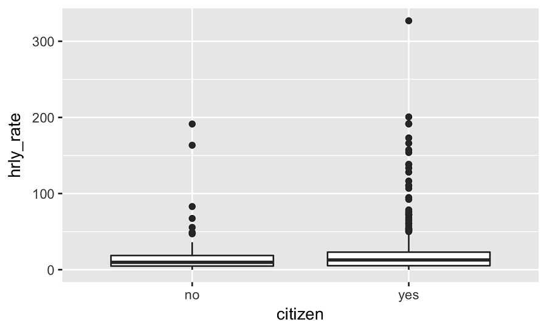

```{r setup, include=FALSE}
# load packages ----------------------------------------------------------------

library(learnr)
library(tidyverse)
library(infer)
library(openintro)
library(emo)

# knitr options ----------------------------------------------------------------

knitr::opts_chunk$set(fig.align = "center", 
                      fig.height = 3, 
                      fig.width = 5,
                      echo = FALSE, 
                      message = FALSE, 
                      warning = FALSE)

# data prep --------------------------------------------------------------------

set.seed(421398)

# Calculate difference between before and after
stem_cell <- stem_cell %>%
  mutate(change = after - before)

acs12 <- acs12 %>%
  mutate(hrly_pay = income / (hrs_work * 52))

acs12 <- acs12 %>%
  mutate(citizen = if_else(citizen == "no", "Non-citizen", "Citizen"))

acs12_complete_hrlypay_citizen <- acs12 %>%
  filter(!is.na(hrly_pay), !is.na(citizen))
```

## Hypothesis testing for a differnece in two means via simulation

In this lesson we demonstrate setting up and conducting a hypothesis test to compare means from two independent distributions using simulation.


### Motivation

> Does a treatment using embryonic stem cells help improve heart function following a heart attack more so than traditional therapy? 

Let's try to answer using the `stem_cell` data from the **openintro** package.

|trmt | before| after|
|:----|:-----:|:----:|
|ctrl |  35.25| 29.50|
|ctrl |  36.50| 29.50|
|ctrl |  39.75| 36.25|
|...  |   ... |  ... |
|esc  |  53.75| 51.00|


The motivating question is whether use of embryonic stem cells help improve heart function following a heart attack. The data can be found in the openintro package.

These data were collected as part of a study in which sheep that have had a heart attack were randomly assigned to the embryonic stem cell therapy (labeled as `"esc"` in the data) or to a traditional therapy as a control (labeled as `"ctrl"`). The researchers measured the heart pumping capacity of these sheep before and after the study. If a sheep's heart pumping capacity increased from before to after the study, this indicates a stronger recovery. In our analysis we want to evaluate the effect of the embryonic stem cell therapy on heart pumping capacity relative to the control group.


### Analysis outline

In order to do this we will first calculate the difference between before treatment and after treatment heart pumping capacities for each sheep. We call this variable `"change"`. 
We want to evaluate whether the data suggest that average change is *higher*, on average, for the treatment group.


|trmt | before| after| change |
|:----|:-----:|:----:|:----:|
|ctrl |  35.25| 29.50|  ?   |
|ctrl |  36.50| 29.50|  ?   |
|ctrl |  39.75| 36.25|  ?   |
|...  |   ... |  ... | ...  |
|esc  |  53.75| 51.00|  ?   |


> Step 1 Summary: Calculate `change` for each sheep -- the difference between before and after heart pumping capacities for each sheep.


### 

Next, we set our hypotheses.

Our null hypothesis should state the status quo, in other words, "there is nothing going on."
In context, this means no difference between the average change in the sheeps' heart pumping capacity between the treatment and control groups.

The alternative hypothesis says that the average change in the heart pumping capacity is higher for the sheep in the (`"esc"`) treatment group versus the sheep in the control (`"ctrl"`) group.

> Step 2 Summary: Set the hypotheses:  
> $H_0: \mu_{esc} = \mu_{ctrl}$; There is no difference between average change in heart pumping capacity between the treatment and control groups.  
> $H_A: \mu_{esc} > \mu_{ctrl}$; The sheep receiving the embryonic stem cell therapy have a larger change in heart pumping capacity compared to the sheep receiving the control. 


### 

Finally, we conduct the hypothesis test.

Conceptually here is how we go about it:

First, we write the values of "change" on 18 index cards, one card for each sheep.

Then we shuffle these cards and randomly split them into two equal sized decks, one representing treatment and other representing control. Note: the decks are equally sized because in the original study there were the same number of sheep in the treatment and control groups!

We then calculate and record the test statistic: difference in average change between the treatment and control groups. At this point we have no control over which card ended up in which pile. Since the cards are randomly shuffled into the two decks, we would not expect to see a difference in the average change values between the two decks. In other words, we would expect the simulated difference between the two sample means to be around 0. But of course, this number will not be exactly 0. Just by random chance it can be just a bit different than 0, or quite different than 0. That's what we need simulation to figure out! 

We repeat the simulation many times in order to get a sense of how much the simulated difference in means varies from sample to sample.

Finally we calculate the p-value as the percentage of simulations where the test statistic is at least as extreme as the observed difference in sample means.

> Step 3 Summary: Conduct the hypothesis test  
> - Write the values of `change` on 18 index cards (one card per sheep).   
> - (1) Shuffle the cards and randomly split them into two equal sized decks: treatment and control.   
> - (2) Calculate and record the test statistic: difference in average `change` between treatment and control.   
> - Repeat (1) and (2) many times to generate the sampling distribution of the difference in means under the null hypothesis.    
> - Calculate p-value as the percentage of simulations where the test statistic is at least as extreme as the observed difference in sample means.   

But, obviously, we don't actually do this by shuffling index cards...


### Hypothesis test: get started

Instead, we'll use the **infer** package to conduct the test. 

```{r eval=FALSE, echo=TRUE}
library(infer)
```

### Step 1: specify the model

We start with the data frame containing our variables of interest, and specify our model as response vs. explanatory. In our example the response variable is `change` and the explanatory variable is treatment (`trmt`) group.

```{r eval=FALSE, echo=TRUE}
diff_ht_mean <- stem_cell %>%
  specify(__) %>%   # Use the form: y-variable ~ x-variable
```


### Step 2: declare the null hypothesis

We then declare the null hypothesis. For a difference in means, the null hypothesize should be specified as `"independence"`, which indicates that we are assuming the change in heart pumping capacity is independent of the treatment group the sheep was in. 
```{r eval=FALSE, echo=TRUE}
diff_ht_mean <- stem_cell %>%
  specify(__) %>%                    # The same step from above! 
  hypothesize(null = __) %>%         # Use a hypothesis of "independence" 
  
```


### Step 3: generate new samples assuming $H_0$ is true:

Then, using the data, the model we specified, and the null hypothesis we declared, we generate many new samples by permuting the labels of the two groups.

```{r eval=FALSE, echo=TRUE}
diff_ht_mean <- stem_cell %>%
  specify(__) %>%                    # Same step from above!
  hypothesize(null = __) %>%         # Same step from above!
  generate(reps = __, type = __) %>% # Generate permutation ("permute") statistics and specify how many (at least 1000)
  ...
```


### Step 4: calculate the test statistic for each sample

Finally, we calculate the test statistic for each of our permutations. The statistic we're interested in is the difference in means and we want to use $\mu_{esc} - \mu_{ctrl}$ as our order of subtraction. 

Since we're testing for a difference, the order in which we subtract matters. We can specify it using the `order` argument in the `calculate()` function. For example, to achieve `group1 - group2` use `order = c("group1", "group2")`.

```{r eval=FALSE, echo=TRUE}
diff_ht_mean <- stem_cell %>%
  specify(__) %>%                     # Same step from above! 
  hypothesize(null = __) %>%          # Same step from above! 
  generate(reps = __, type = __) %>% # Same step from above! 
  calculate(stat = "diff in means", order = c("trmt", "ctrl")   # Specify to calculate a difference in means and what order of subtraction to use
```


### Calculate the p-value

Using the simulated sample statistics, we calculate the p-value as the proportion of simulations where the simulated difference between the sample means is at least as extreme as the one observed.

> Calculate the p-value as the proportion of simulations where the simulated difference between the sample means is at least as extreme as the observed  
> $$ \frac{ \text{number of permutations} \ge (\bar{x}_{esc, obs} - \bar{x}_{ctrl, obs})}{ \text{number of reps generated}} $$


We've walked you through the steps, now it's your turn!

## Your turn! 

__Evaluating the effectiveness of stem cell treatment__

The `stem_cell` data frame gives us the pumping capacity of the heart before and after the experiment. So first we need to find the difference between these for each experimental unit, and then use these `change` values to calculate the observed difference in mean change between the treatment and control groups.

###

First, use the `mutate()` function to add a column to `stem_cell` named `change`, equal to the difference between the `after` and `before` columns.

```{r stem_cell, exercise=TRUE}
# Calculate difference between before and after
stem_cell <- stem_cell %>%
  ___(change = ___)
```

```{r stem_cell-hint}
Call `mutate()`, setting `change` equal to `after` minus `before`.
```

```{r stem_cell-solution}
# Calculate difference between before and after
stem_cell <- stem_cell %>%
  mutate(change = after - before)
```

### 

Then, calculate observed difference in means between treatment groups, using the infer package. 

Here, since we aren't hypothesizing or generating new samples we only need to functions, `specify()` and `calculate()`. 

First, use the `specify()` function to specify the explanatory (`trmt`) and response (`change`) variables. 

Then, use the `calculate()` function to calculate the observed difference in means, being sure to use $\bar{x}_{esc} - \bar{x}_{ctrl}$. 

```{r stem_cell_2, exercise=TRUE}
# From previous step
stem_cell <- stem_cell %>%
  mutate(change = after - before)
  
# Calculate observed difference in means
diff_mean <- stem_cell %>%
  # Specify the response and explanatory variables
  specify(___) %>%
  # Calculate observed difference in means 
  calculate(___)

# Inspect the result
diff_mean
```

```{r stem_cell_2-hint}
  
- Use `change ~ trmt` to specify the response and explanatory variables.   
- Use `"diff in means"` to calculate the difference in means for each group, and `order = c("esc", "ctrl")` to get the correct order of subtraction. 
```

### 

Well done! We will use this observed difference in the following exercises.

### Evaluating the effectiveness of stem cell treatment (cont.)

Conduct the hypothesis test and compute the p-value for evaluating whether there is a difference between the mean heart pumping capacities of sheep's hearts in the control and treatment groups.

```{r stem_cell_3-setup, include=FALSE}
# Calculate observed difference in means
diff_mean <- stem_cell %>%
  # Specify the response and explanatory variables
  specify(change ~ trmt) %>%
  # Calculate observed difference in means 
  calculate(stat = "diff in means", order = c("esc", "ctrl"))
```

### 

First, generate 1000 differences in means via randomization (we can call it this because the treatment was randomly assigned).

- `specify()` the response and explanatory variables.
- `hypothesize()` that the treatment and the response are `"independent"`. 
- Generate 1000 `reps` via permutation (`"permute"`).
- Calculate the permuted difference in means (`esc` first, then `ctrl`).


```{r stem_cell_3, exercise=TRUE}
# Generate 1000 differences in means via randomization
diff_mean_ht <- stem_cell %>%
  # y ~ x
  specify(___ ~ ___) %>% 
  # Null = no difference between means
  hypothesize(null = "___") %>% 
  # Shuffle labels 1000 times
  generate(reps = ___, type = "___") %>% 
  # Calculate test statistic
  calculate(stat = "___", order = c("esc", "___")) 
```

```{r stem_cell_3-hint}
**Hint:**
- Call `specify()`, setting `formula` to a formula with `change` as the response variable and `trmt` as the explanatory variable.
- Call `hypothesize()`, setting `null` to `"independence"`.
- Call `generate()`, setting `reps` to `n_replicates` and `type` to `"permute"`.
- Call `calculate()`, setting `stat` to `"diff in means"` and `order` to `c("esc", "ctrl")`.
```

```{r stem_cell_3-solution}
# Generate 1000 differences in means via randomization
diff_mean_ht <- stem_cell %>%
  # y ~ x
  specify(change ~ trmt) %>% 
  # Null = no difference between means
  hypothesize(null = "independence") %>%  
  # Shuffle labels 1000 times
  generate(reps = 1000, type = "permute") %>% 
  # Calculate test statistic
  calculate(stat = "diff in means", order = c("esc", "ctrl")) 
```

### 

Then, calculate the one-sided p-value. Use the `get_p_value()` function to survey how many of the permuted differences in means are as large or larger than the observed difference. 

- Use the previously calculated difference in means stored inside `diff_mean` as the observed statistic. 
- Use a greater than alternative hypothesis to calculate the p-value. 

```{r stem_cell_4-setup, include=FALSE}
# Calculate observed difference in means
diff_mean <- stem_cell %>%
  # Specify the response and explanatory variables
  specify(change ~ trmt) %>%
  # Calculate observed difference in means 
  calculate(stat = "diff in means", order = c("esc", "ctrl"))

# Generate 1000 differences in means via randomization
diff_mean_ht <- stem_cell %>%
  # y ~ x
  specify(change ~ trmt) %>% 
  # Null = no difference between means
  hypothesize(null = "independence") %>%  
  # Shuffle labels 1000 times
  generate(reps = 1000, type = "permute") %>% 
  # Calculate test statistic
  calculate(stat = "diff in means", order = c("esc", "ctrl")) 

```

```{r stem_cell_4, exercise=TRUE}
diff_mean_ht %>%
  get_p_value(___)   # use diff_mean as the observed statistic, and "greater" as the direction

```

```{r stem_cell_4-solution}
diff_mean_ht %>%
  get_p_value(obs_stat = diff_mean, direction = "greater") 
```

### Conclusion of the hypothesis test


The p-value of the previous test was found to be approximately 0. Suppose the significance level of the test is 1%. Fill in the blanks: 

```{r quiz_1}
quiz(
  question("_____ between the heart pumping capacities of sheep's hearts in the control and treatment groups.", 
           correct = "Great job!", 
           allow_retry = TRUE,
           answer("There is a difference", message = "Sorry, try again. You can't make definitive statements; only explain what the data suggests."),
           answer("There is no difference", message = "Sorry, try again. You can't make definitive statements; only explain what the data suggests."),
           answer("The data provide convincing evidence of a difference", correct = TRUE),
           answer("The data provide convincing evidence that there is no difference", message = "Sorry, try again. The p-value, 0.001, is less than the significance level, 0.01.")
  ), caption = ""
)
```

## A New Application 

__Evaluating the relationship between smoking during pregnancy and birth weight__ 

The state of North Carolina released to the public a large data set containing information on births recorded in this state. This data set has been of interest to medical researchers who are studying the relation between habits and practices of expectant mothers and the birth of their children. `ncbirths` is a random sample of 1000 cases from this data set. We want to evaluate whether there is a difference between weights of babies born to smoker and non-smoker mothers.

### 

First, filter `ncbirths` for rows where `habit` is non-missing. 

Use the `is.na()` function to specify that you want values of `habit` that are not missing (where `is.na()` is FALSE).

```{r smoking, exercise=TRUE}
# Filter for subjects with non-missing habit
ncbirths_complete_habit <- ncbirths %>%
  filter(___)
```

```{r smoking-hint}
filter(is.na(habit) == FALSE)

# OR 

filter(!is.na(habit))  
```

```{r smoking-solution}
# Filter for subjects with non-missing habit
ncbirths_complete_habit <- ncbirths %>%
  filter(!is.na(habit))
```

### 


Next, use `specify()` and `calculate()` to calculate observed difference in mean baby `weight` between smoking habit groups. Use $\bar{x}_{nonsmoker} - \bar{x}_{smoker}$. 

```{r smoking_2-setup, include = FALSE}
# From previous steps
ncbirths_complete_habit <- ncbirths %>%
  filter(!is.na(habit))
```

```{r smoking_2, exercise=TRUE}
# Calculate observed difference in means
diff_mean_obs <- ncbirths_complete_habit %>%
  # Specify the response and explanatory variables
  specify(___) %>%
  # Calculate the observed difference in means
  calculate(stat = " ", order = c("nonsmoker", " "))
```

```{r smoking_2-hint}
  
- Use `weight ~ habit` to specify the response and explanatory variables.   
- Use `"diff in means"` to calculate the difference in means for each group, and `order = c("nonsmoker", "smoker")` to get the correct order of subtraction. 
```

```{r smoking_2-solution}

# Calculate observed difference in means
diff_mean_obs <- ncbirths_complete_habit %>%
  # Specify the response and explanatory variables
  specify(weight ~ habit) %>%
  # Calculate the observed difference in means
  calculate(stat = "diff in means", order = c("nonsmoker", "smoker"))
```

### 

Then, generate 1000 differences in means via permutation and store as `diff_mean_ht`

- `specify()` the model as birth `weight` versus smoking `habit`.
- `hypothesize()` that the variables are independent.
- `generate()` 1000 samples via permutation.
- `calculate()` the difference in means for each permutation. The order should have `"nonsmoker"`s first, then `"smoker"`s.

```{r smoking_3-setup, include = FALSE}
# From previous steps
ncbirths_complete_habit <- ncbirths %>%
  filter(!is.na(habit))

diff_mean_obs <- ncbirths_complete_habit %>%
  group_by(habit) %>%
  summarize(mean_weight = mean(weight)) %>%
  pull() %>%
  diff()
```


```{r smoking_3, exercise=TRUE}
# Generate 1000 differences in means via randomization
diff_mean_ht <- ncbirths_complete_habit %>% 
  # Specify weight vs. habit
  specify(___) %>% 
  # Null = independence of variables
  hypothesize(___) %>% 
  # Generate 1000 permutations
  generate(___) %>%
  # Calculate test statistic, nonsmoker then smoker
  calculate(___)
```

```{r smoking_3-hint}

- Call `specify()`, passing a formula of `weight ~ habit`.
- Call `hypothesize()`, setting `null` to `"independence"`.
- Call `generate()`, setting `reps` to 1000 and `type` to `"permute"`.
- Call `calculate()`, setting `stat` to `"diff in means"` and `order` to `c("nonsmoker", "smoker")`.
```


```{r smoking_3-solution}
# Generate 1000 differences in means via permutation
diff_mean_ht <- ncbirths_complete_habit %>% 
  # Specify weight vs. habit
  specify(weight ~ habit) %>% 
  # Null = independence of variables
  hypothesize(null = "independence") %>% 
  # Generate 1000 permutations
  generate(reps = 1000, type = "permute") %>%
  # Calculate test statistic, nonsmoker then smoker
  calculate(stat = "diff in means", order = c("nonsmoker", "smoker")) 
```

### 

And finally, calculate the p-value for the hypothesis test. Use the `get_p_value()` function to survey how many of the permuted differences in means are as large or larger than the observed difference. 

- Use the previously calculated difference in means stored inside `diff_mean_obs` as the observed statistic. 
- Use a "two-sided" alternative hypothesis to calculate the two-sided p-value. 

- Compare the two-sided p-value to the one-sided ("less") p-value. Is the one-sided p-value half of the two-sided?  

```{r smoking_4-setup, include = FALSE}
# From previous steps
ncbirths_complete_habit <- ncbirths %>%
  filter(!is.na(habit))

diff_mean_obs <- ncbirths_complete_habit %>%
  group_by(habit) %>%
  summarize(mean_weight = mean(weight)) %>%
  pull() %>%
  diff()

diff_mean_ht <- ncbirths_complete_habit %>% 
  specify(weight ~ habit) %>% 
  hypothesize(null = "independence") %>% 
  generate(reps = 1000, type = "permute") %>%
  calculate(stat = "diff in means", order = c("nonsmoker", "smoker")) 
```


```{r smoking_4, exercise=TRUE}
 
# Calculate p-value
  diff_mean_ht %>%
  # use diff_mean as the observed statistic, and "two-sided" as the direction
  get_p_value(obs_stat = , direction = " ") 

```

```{r smoking_4-hint}

- Use `diff_mean_obs` as the input to `obs_stat`. 
- Use a direction of `"two-sided"` for a two-sided hypothesis test. 
```

```{r smoking_4-solution}
# Calculate p-value
  diff_mean_ht %>%
  # use diff_mean as the observed statistic, and "two-sided" as the direction
  get_p_value(obs_stat = diff_mean_obs, direction = "two-sided") 

```

### 

Wonderful! What does your p-value suggest about the relationship between smoking during pregnancy and birth weight?

## Confidence interval for a difference in two means via simulation

A natural next step in your analysis would be to quantify the difference between the two population means using a confidence interval. 
Next, we outline the bootstrap scheme for estimating the difference between the two numerical population parameters. 
The following exercises will reveal that implementing this scheme in `R` takes only a few tweaks to the pipelines using the infer package that we have been using for doing simulation based inference.

Constructing a bootstrap interval for the difference in two means is quite similar to constructing a bootstrap interval for a single mean. The only difference is that now we have two samples to bootstrap from. 

So, we take bootstrap samples of each sample. That is, a random sample taken with replacement from each of the original samples, of the same size as each of the original samples.

Then, we calculate the bootstrap statistic. This is whatever we are interested in: a difference in means, medians, etc. of the bootstrap samples we generated. We record this value.

We then repeat steps 1 and 2 many times to create a bootstrap distribution.

Lastly, we calculate the interval using the percentile or the standard error method we learned earlier in the tutorial.

> 1. Take a bootstrap sample *of each sample* - a random sample taken with replacement from each of the original samples, of the same size as each of the original sample.
> 2. Calculate the bootstrap statistic - a statistic such as *difference* in means, medians, proportion, etc. computed based on the bootstrap sample.
> 3. Repeat steps (1) and (2) many times to create a bootstrap distribution - a sampling distribution of bootstrap statistics.
> 4. Calculate the a confidence interval for the population parameter using the percentile or the standard error method.

Now let's try some exercises.  

##

### Smoking during pregnancy and birth weight

Let's construct a bootstrap interval for the difference in mean weights of babies born to smoker and non-smoker mothers. The `ncbirths_complete_habit` data frame you created earlier is available to use.

First, generate 1500 bootstrap differences in means for birth weight by smoking habit.

- `specify()` birth `weight` as the response and smoking `habit` as the explanatory variable.
- `generate()` 1500 bootstrap resamples.
- `calculate()` the difference in means, with order `"nonsmoker"` then `"smoker"`.

```{r smoking_bs-setup, include=FALSE}
# Remove subjects with missing habit
ncbirths_complete_habit <- ncbirths %>%
  filter(!is.na(habit))
```

```{r smoking_bs, exercise=TRUE}
# Generate 1500 bootstrap difference in means
diff_mean_ci <- ncbirths_complete_habit %>%
  # Specify weight vs. habit
  specify(___) %>%
  # Generate 1500 bootstrap replicates
  generate(___) %>%
  # Calculate the difference in means, nonsmoker then smoker
  calculate(___)
```

```{r smoking_bs-hint}
 

- Call `specify()`, passing a formula of `weight ~ habit`.
- Call `generate()`, setting `reps` to `1500` and `type` to `"bootstrap"`.
- Call `calculate()`, setting `stat` to `"diff in means"` and `order` to `c("nonsmoker", "smoker")`.
```

```{r smoking_bs-solution}
# Generate 1500 bootstrap difference in means
diff_mean_ci <- ncbirths_complete_habit %>%
  # Specify weight vs. habit
  specify(weight ~ habit) %>%
  # Generate 1500 bootstrap replicates
  generate(reps = 1500, type = "bootstrap") %>%
  # Calculate the difference in means, nonsmoker then smoker
  calculate(stat = "diff in means", order = c("nonsmoker", "smoker"))
```

### 

Then, calculate a 95% confidence interval for the bootstrap difference in mean birth weights using the `get_confidence_interval()` function. Use the `percentile` method.

```{r smoking_bs_2-setup, include = FALSE}
# Remove subjects with missing habit
ncbirths_complete_habit <- ncbirths %>%
  filter(!is.na(habit))

# From previous step
diff_mean_ci <- ncbirths_complete_habit %>%
  specify(weight ~ habit) %>%
  generate(reps = 1500, type = "bootstrap") %>%
  calculate(stat = "diff in means", order = c("nonsmoker", "smoker"))

```

```{r smoking_bs_2, exercise=TRUE}
# Calculate the 95% CI via percentile method
diff_mean_ci %>%
  get_confidence_interval(level = , type = " ")
```

```{r smoking_bs_2-hint}
 

- Specify the confidence `level` to be 0.95 for a 95% confidence interval. 
- Specify the `type` of interval to be "percentile". 
```

```{r smoking_bs_2-solution}
# From previous step
diff_mean_ci <- ncbirths_complete_habit %>%
  specify(weight ~ habit) %>%
  generate(reps = 1500, type = "bootstrap") %>%
  calculate(stat = "diff in means", order = c("nonsmoker", "smoker"))
  
# Calculate the 95% CI via percentile method
diff_mean_ci %>%
  get_confidence_interval(level = 0.95, type = "percentile")
```

### 

Great! How would you interpret this interval?

## Your turn! 

__Smoking during pregnancy and length of gestation__

Let's turn our attention to another variable, `weeks`, indicating the length of the pregnancy. Construct a bootstrap interval for the difference in median lengths of pregnancies of smoker and non-smoker mothers.

Filter `ncbirths` for rows where __both__ smoking `habit` and length of pregnancy in `weeks` are not missing.


```{r smoking_bs_3, exercise=TRUE}
# Filter for non-missing habit & non-missing weeks
ncbirths_complete_habit_weeks <- ncbirths %>%
  filter(___, ___) 
```

```{r smoking_bs_3-hint}
Call `filter()`, passing two conditions, using `!` and `is.na()` to keep only rows where `habit` and `weeks` are not `NA`.  

Specifically, the conditions should look like: `!is.na(habit)` and `!is.na(weeks)`. These should be joined with a comma to indicate that they *both* need to be satisfied.  
```

```{r smoking_bs_3-solution}
# Filter for non-missing habit & non-missing weeks
ncbirths_complete_habit_weeks <- ncbirths %>%
  filter(!is.na(habit), !is.na(weeks))
```

### 

Now that we've eliminated the missing data, generate 1500 bootstrap difference in *medians* for pregnancy length in weeks by smoking habit.

- `specify()` pregnancy length in `weeks` as the response variable and smoking `habit` as the explanatory variable.
- `generate()` 1500 bootstrap resamples.
- `calculate()` the difference in medians, with order `"nonsmoker"` then `"smoker"`.

```{r smoking_bs_4-setup, include = FALSE}
# Filter for non-missing habit & non-missing weeks
ncbirths_complete_habit_weeks <- ncbirths %>%
  filter(!is.na(habit), !is.na(weeks))
```


```{r smoking_bs_4, exercise=TRUE}
# Generate 1500 bootstrap difference in medians
diff_med_ci <- ncbirths_complete_habit_weeks %>%
  # Specify weeks versus habit
  specify(___) %>%
  # Generate 1500 bootstrap replicates
  generate(___) %>%
  # Calculate the difference in medians, nonsmoker then smoker
  calculate(___)
```

```{r smoking_bs_4-hint}

- Call `specify()`, passing a formula of `weeks` versus `habit`.
- Call `generate()`, setting `reps` to `1500` and `type` to `"bootstrap"`.
- Call `calculate()`, setting `stat` to `"diff in medians"` and `order` to `c("nonsmoker", "smoker")`.
```

```{r smoking_bs_4-solution}
# Generate 1500 bootstrap difference in medians
diff_med_ci <- ncbirths_complete_habit_weeks %>%
  # Specify weeks versus habit
  specify(weeks ~ habit) %>%
  # Generate 1500 bootstrap replicates
  generate(reps = 1500, type = "bootstrap") %>%
  # Calculate the difference in medians, nonsmoker then smoker
  calculate(stat = "diff in medians", order = c("nonsmoker", "smoker"))
```

### 

Then, calculate a 92% confidence interval for the bootstrap difference in median pregnancy length in weeks using the percentile method.

```{r smoking_bs_5-setup, include = FALSE}
# Filter for non-missing habit & non-missing weeks
ncbirths_complete_habit_weeks <- ncbirths %>%
  filter(!is.na(habit), !is.na(weeks))

diff_med_ci <- ncbirths_complete_habit_weeks %>%
  specify(weeks ~ habit) %>%
  generate(reps = 1500, type = "bootstrap") %>%
  calculate(stat = "diff in medians", order = c("nonsmoker", "smoker"))
```


```{r smoking_bs_5, exercise=TRUE}
# Calculate the 95% CI via percentile method
diff_med_ci %>%
  get_confidence_interval(level = , type = " ")
```

```{r smoking_bs_2-hint}

- Specify the confidence `level` to be 0.92 for a 92% confidence interval. 
- Specify the `type` of interval to be "percentile". 
```


```{r smoking_bs_5-solution}
# Calculate the 95% CI via percentile method
diff_med_ci %>%
  get_confidence_interval(level = 0.92, type = "percentile")
```

### 

Well done! Quick mental check before you move on: What do we mean when we say we're "92% confident"?

## Comparing means with a t-test

In this lesson we return to the American Community Survey data and compare average pay for citizens and non-citizens.

### A (more) standard measure of pay


Instead of comparing average annual `income`, let's compare average `hrly_rate`. We'll calculate this by:

> - assuming there is 52 weeks in a year 
> - using the formula `hrly_rate = income / (hrs_work * 52)`

One obvious measure of pay is annual income. However instead of comparing annual incomes directly, we should adjust for the number of hours worked, and compare average hourly rates. So first, we'll create a new variable called `hrly_rate`. 

To do so we'll make the assumption that there are 52 weeks in a year, and calculate hourly rate as income divided by weekly hours times 52 weeks in the year.

```{r, echo = TRUE}
acs12 <- acs12 %>%
  mutate(hrly_pay = income / (hrs_work * 52))
```

### Research question and hypotheses

> Do the data provide convincing evidence of a difference between the average hourly rate of citizens and non-citizens in the US?

> Let $\mu$ represent the true average hourly pay
> 
> $H_0: \mu_{citizen} = \mu_{non-citizen}$
> 
> $H_A: \mu_{citizen} \ne \mu_{non-citizen}$


Our research question is "Do the data provide convincing evidence of a difference between the average hourly rate of citizens and non-citizens in the US?". We use a hypothesis test to answer this question.

If $\mu$ is defined as average hourly pay in the population, the null hypothesis states there is no difference between the average hourly rates of citizens and non-citizens. The alternative hypothesis follows from the research question, stating that there is a difference between the average hourly rates of citizens and non-citizens.


### Summary statistics

```{r}
acs12 %>%
  filter(!is.na(hrly_pay)) %>%
  group_by(citizen) %>%
  summarise(x_bar = round(mean(hrly_pay), 2),
            s = round(sd(hrly_pay), 2),
            n = length(hrly_pay)) 
```

Let's take a look at the relevant summary statistics. To do so, we group the data by citizenship status and then calculate mean, standard deviation, and sample size for each group. The observed average hourly rates for non-citizens and non-citizens are indeed different, but we want to know how they compare in the population, not just in this sample.


### Conducting the test

> __Null__:   
> $H_0: \mu_{citizen} = \mu_{non-citizen}$  OR  $H_0: \mu_{citizen} - \mu_{non-citizen} = 0$ 
>
> __Alternative__:   
$H_A: \mu_{citizen} \ne \mu_{non-citizen}$ OR $H_A: \mu_{citizen} - \mu_{non-citizen} \neq 0$

We can use the `t_test` function from the infer package to conduct this test. The arguments for the `t_test()` function are as follows: 

1. the dataframe with the variables of interest 

2. a formula of the form of `y  ~ x`, where `y` is the response variable and `x` is the explanatory variable 

3. the order of subtraction to be used (similar to what is used in the `calculate()` function) 

4. the direction of the alternative hypothesis (similar to the `direction` in the `calculate()` function)

5. if a confidence interval should be calculated (yes = `TRUE`, no = `FALSE`) 

5. what confidence level should be used for the confidence interval 

Here, our null hypothesis alternative hypothesis says that there is a difference between the two groups means, which coincides with a `"two-sided"` hypothesis test. 

### 


```{r, echo=TRUE}
acs12 %>%
t_test(hrly_pay ~ citizen,  
       order = c("Citizen", "Non-citizen"), 
       alternative = "two-sided", 
       conf_int = TRUE, 
       conf_level = 0.95)
```

The p-value of the test is 0.5637, which is higher than any reasonable significance level. Hence, we fail to reject the null hypothesis and conclude that the data do not provide convincing evidence of a difference between the average hourly rate of citizens and non-citizens in the US.

### Conditions

> - Independence:  
>   *  Observations in each sample should be independent of each other. 
>   *  The two samples should be independent of each other. 
> - Sample size / skew: The more skewed the original data, the higher the sample size required to have a symmetric sampling distribution. 

```{r, echo = FALSE, out.width= "50%"}

```

Before we wrap up our discussion of comparing means across two groups, let's also review conditions for this test.

First, we need independence. But independence of what?

Observations in each sample should be independent of each other. We discussed earlier that this is a difficult condition to check, but there are a few "simple" checks we can make. First, did the study use random sampling? If so, the observations can be assumed to be independent! Second, did the study use random assignment? If so, the observations between groups can be assumed to be independent. Third, did the study use random sampling without replacement (almost all observational studies do this) and is the sample less than 10% of their respective populations? If so, we can also be fairly comfortable assuming that the observations are independent. 

The American Community Survey employs random sampling, and our sample sizes are definitely less than 10% of all citizens and non citizens in the US. Also, observations across the two samples should be independent of each other, as it would be impossible for an individual to be both a citizen and an non-citizen. 

The distributions of each group's hourly rate appears skewed, but they do exhibit similar spread. Both groups have values from close to 0 to values close to 200. There is one observation in the citizen group with a pay of $300, but the condition is not violated from one observation! 

Lastly, we need to assess if the distributions of each group appear approximately normal. Indeed, there is a substantial skew to each distribution which may be concerning. However, for larger sample sizes, we can assume that the distribution of differences in means are normal, even if the distributions of the groups are not. Here, we have sample sizes of 58 (non-citizen) and 901 (citizen) which aids us in assuming that the distribution of difference in sample means can be assumed to be fairly normal.

Time to put this into practice.

## Your turn! 

__Hourly pay vs. citizenship status__

Using the `acs12` data, and specifically the variables `income`, `hrs_work`, and `citizen`, summarize, visualize, and compare the distributions of hourly pay rate for citizens and non-citizens.

### 

First, filter `acs12` for rows where hourly pay (`hrly_pay`) and U.S. citizenship status (`citizen`) are __both__ non-missing.  

```{r citizens, exercise=TRUE}
# Filter for non-missing hrly_pay and non-missing citizen
acs12_complete_hrlypay_citizen <- acs12 %>%
  filter(___, ___)
```

```{r citizens-hint}
Call `filter()`, passing two conditions, using `!` and `is.na()` to keep only rows where `hrly_pay` and `citizen` are not `NA`.  

Specifically, the arguments should look like: `!is.na(hrly_pay)` and `!is.na(citizen)`.  
```

```{r citizens-solution}
# Filter for non-missing hrly_pay and non-missing citizen
acs12_complete_hrlypay_citizen <- acs12 %>%
  filter(!is.na(hrly_pay), !is.na(citizen))
```


### 

Next calculate summary statistics for citizens and non-citizens. To do this, use the following steps: 

1. `group_by()` citizenship status. 
2. Use `summarize()` to calculate the mean of `hrly_pay`, the standard deviation of `hrly_pay`, and the number of observations in that citizenship group.

```{r citizens_3-setup, include = FALSE}
## Complete hourly pay and citizenship 
acs12_complete_hrlypay_citizen <- acs12 %>% 
  filter(!is.na(hrly_pay))
```

```{r citizens_3, exercise=TRUE}
acs12_complete_hrlypay_citizen %>%
  # Group by citizen
  group_by(___) %>%
  summarize(
    # Calculate mean hourly pay
    mean_wage = ___,
    # Calculate std dev of hourly pay
    sd_wage = ___,
    # Count number of rows
    n_obs = ___
  )
```

```{r citizens_3-hint}
  

- Call `group_by()`, passing `citizen` as the argument.
- Call `summarize()`, using `mean()` to calculate the mean of `hrly_pay`, `sd()` to calculate the standard deviation of `hrly_pay`, and `n()` to find the number of observations in each group. 
```

```{r citizens_3-solution}
acs12_complete_hrlypay_citizen %>%
  # Group by citizen
  group_by(citizen) %>%
  summarize(
    # Calculate mean hourly pay
    mean_wage = mean(hrly_pay),
    # Calculate std dev of hourly pay
    s_wage = sd(hrly_pay),
    # Count number of rows
    n_obs = n()
  )
```

### 

Finally, plot a histogram of the `hrly_pay`, faceted by citizenship status.

- Using `acs12_complete_hrlypay_citizen` dataset, plot `hrly_pay` on the x axis.
- Add a histogram layer with a `binwidth` of 5.
- Facet by the `citizen`ship status, using the `vars()` function. 

```{r citizens_4-setup, include = FALSE}
## Complete hourly pay and citizenship 
acs12_complete_hrlypay_citizen <- acs12 %>%
  filter(!is.na(hrly_pay), !is.na(citizen))

```

```{r citizens_4, exercise=TRUE}
acs12_complete_hrlypay_citizen %>% 
  # Using acs12_complete_hrlypay_citizen, plot hrly_pay
  ggplot(___) +
  # Add a histogram layer
  geom_XXX___ +
  facet_wrap(vars(___))
```

```{r citizens_4-hint}
   

- Call ggplot() with `acs12_complete_hrlypay_citizen` as the dataset.
- Inside `aes()`, map `x` to `hrly_pay`.
- Add `geom_histogram()`, setting `binwidth` to 5.  
- Use `facet_wrap(vars(citizen))` to facet the plots by citizenship status. 
```

```{r citizens_4-solution}
# Using acs12_complete_hrlypay_citizen, plot hrly_pay
acs12_complete_hrlypay_citizen %>% 
ggplot(aes(x = hrly_pay)) +
  # Add a histogram layer
  geom_histogram(binwidth = 5) +
  facet_wrap(vars(citizen))
```

### Estimating the difference of two means using a t-interval

Earlier we used summary statistics and a visualization to compare the hourly pay of citizens vs. non-citizens. In this exercise we estimate the difference between the average hourly pay between these two groups with a 90% confidence interval. 

The `acs12_complete_hrlypay_citizen` is already loaded for you.

- Run a t-test to find a confidence interval for the difference in average hourly pay, `hrly_pay` between citizen and non-citizens, `citizen` in the `acs12_complete_hrlypay_citizen` dataset. Assign the test results to the `test_results` object.

**Remember** the `t_test()` function behaves similarly to the `calculate()` function! 

```{r citizens_5-setup, include = FALSE}
## Complete hourly pay and citizenship 
acs12_complete_hrlypay_citizen <- acs12 %>%
  filter(!is.na(hrly_pay), !is.na(citizen))
```

```{r citizens_5, exercise=TRUE}
# Construct 90% CI using a t-test
test_results <- acs12_complete_hrlypay_citizen %>% 
  t_test(___ ~ ___, 
            order = c("Citizen", " "), 
            alternative = " ", 
            conf_int = TRUE, 
            conf_level = )

# See the results
test_results
```

```{r citizens_5-hint}
  

- Use the formula of `hrly_pay ~ citizen` 
- Add "Non-citizen" to the order of subtraction 
- Specify the alternative to be "two-sided"  
- Specify the confidence level to be 0.90
```

```{r citizens_5-solution}
# Construct 90% CI using a t-test
test_results <- acs12_complete_hrlypay_citizen %>% 
  t_test(hrly_pay ~ citizen, 
            order = c("Citizen", "Non-citizen"), 
            alternative = "two-sided", 
            conf_int = TRUE, 
            conf_level = 0.90)

# See the results
test_results
 
```

## Congratulations!

You have successfully completed Lesson 7 in Tutorial 5: Statistical inference.  

What's next?

`r emo::ji("ledger")` [Full list of tutorials supporting OpenIntro::Introduction to Modern Statistics](https://openintrostat.github.io/ims-tutorials/)

`r emo::ji("spiral_notepad")` [Tutorial 5: Statistical inference](https://openintrostat.github.io/ims-tutorials/05-infer/)

`r emo::ji("one")` [Tutorial 5 - Lesson 1: Inference for a single proportion](https://openintro.shinyapps.io/ims-05-infer-01/)

`r emo::ji("two")` [Tutorial 5 - Lesson 2: Hypothesis Tests to Compare Proportions](https://openintro.shinyapps.io/ims-05-infer-02/)

`r emo::ji("three")` [Tutorial 5 - Lesson 3: Chi-squared Test of Independence](https://openintro.shinyapps.io/ims-05-infer-03/)

`r emo::ji("four")` [Tutorial 5 - Lesson 4: Chi-squared Goodness of Fit Test](https://openintro.shinyapps.io/ims-05-infer-04/)

`r emo::ji("five")` [Tutorial 5 - Lesson 5: Bootstrapping for estimating a parameter](https://openintro.shinyapps.io/ims-05-infer-05/)

`r emo::ji("six")` [Tutorial 5 - Lesson 6: Introducing the t-distribution](https://openintro.shinyapps.io/ims-05-infer-06/)

`r emo::ji("seven")` [Tutorial 5 - Lesson 7: Inference for difference in two parameters](https://openintro.shinyapps.io/ims-05-infer-07/)

`r emo::ji("eight")` [Tutorial 5 - Lesson 8: Comparing many means](https://openintro.shinyapps.io/ims-05-infer-08/)

`r emo::ji("open_book")` [Learn more at Introduction to Modern Statistics](http://openintro-ims.netlify.app/)