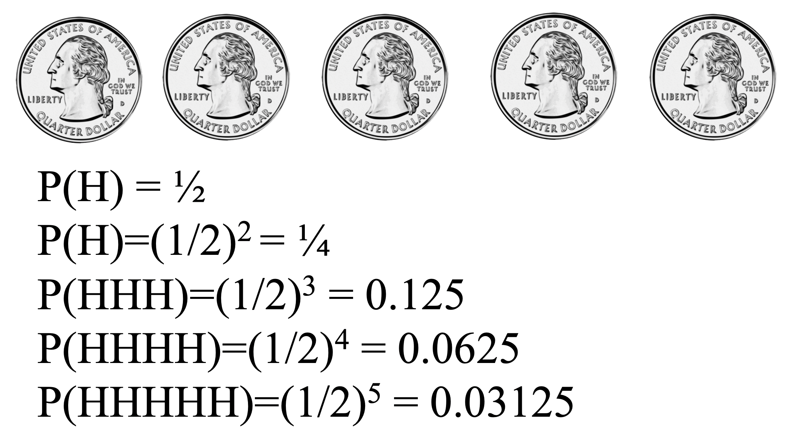

```{r setup, include=FALSE}
# load packages ----------------------------------------------------------------

library(learnr)
library(kableExtra)
library(tidyverse)
library(infer)
library(grid)
library(gridExtra)
library(emo)
library(openintro)
library(janitor)

# knitr options ----------------------------------------------------------------

knitr::opts_chunk$set(fig.align = "center", 
                      fig.height = 3, 
                      fig.width = 5,
                      echo = FALSE, 
                      message = FALSE, 
                      warning = FALSE)

# data prep --------------------------------------------------------------------

# Read pre-permuted data

gender_discrimination_big_perm <- read_rds("data/gender_discrimination_big_perm.rds")
gender_discrimination_big <- read_rds("data/gender_discrimination_big.rds")
gender_discrimination_new_perm <- read_rds("data/gender_discrimination_new_perm.rds")
gender_discrimination_new <- read_rds("data/gender_discrimination_new.rds")
gender_discrimination_perm <- read_rds("data/gender_discrimination_perm.rds")
gender_discrimination_small_perm <- read_rds("data/gender_discrimination_small_perm.rds")
gender_discrimination_small <- read_rds("data/gender_discrimination_small.rds")


diff_orig <- gender_discrimination %>%
  group_by(gender) %>%
  summarize(prop_promoted = mean(decision == "promoted")) %>%
  summarize(stat = diff(prop_promoted)) %>% 
  pull()
  
diff_orig_small <- gender_discrimination_small %>%
  group_by(gender) %>%
  summarize(prop_promoted = mean(decision == "promoted")) %>%
  summarize(diff(prop_promoted)) %>% 
  pull()

diff_orig_big <- gender_discrimination_big %>%
  group_by(gender) %>%
  summarize(prop_promoted = mean(decision == "promoted")) %>%
  summarize(diff(prop_promoted)) %>% 
  pull()

diff_orig_new <- gender_discrimination_new %>%
  group_by(gender) %>%
  summarize(prop_promoted = mean(decision == "promoted")) %>%
  summarize(diff(prop_promoted)) %>% 
  pull()
```

## Completing a randomization test: gender discrimination

### Example: gender discrimination

The example in this lesson is taken from a paper on the _“Influence of sex role stereotypes on personnel decisions”_ by Rosen and Jerdee, 1974. 

Forty-eight male bank supervisors were given personnel files and asked to judge whether the person should be promoted to a branch manager position. The files were all identical except that *half of them* indicated that the candidate was *male* and *the other half* indicated that the candidate was *female*.

The data were then collected showing that 14 out of the 24 female files were selected for promotion and 21 of the 24 male files were selected for promotion. 

### The data

```{r}
gender_discrimination %>%
  count(gender, decision) %>%
  pivot_wider(names_from = decision, values_from = n) %>%
  adorn_totals(where = c("row", "col")) %>%
  kable(format = "html", escape = FALSE) %>%
  kable_styling("striped", full_width = FALSE)
```

After summarizing the data, the difference in promotions can be identified using rates. That is, 58.3% of the women were promoted whereas 87.5% of the men were promoted. The important statistical question to ask after looking at the data is as follows: *is it plausible to observe such a difference in proportions in a scenario where men and women are equally likely to be promoted?*

```{r echo = TRUE}
gender_discrimination %>%
  count(gender, decision) %>%
  group_by(gender) %>%
  mutate(prop = n / sum(n))
```

All of the pieces of this code you've seen before, but let's review them! First, we count the number of observations for each `gender` (male, female) and each `decision` (promoted, not) using the `count()` function. Next, we group these counts by `gender`, so that we can use `mutate()` to create a new variable that is the proportion of observations in each gender that received or didn't receive a promotion. 

### Fewer females were promoted

That is to say, if we shuffle the data so that gender and promotion are not linked in any way, what sort of chance differences are observed? 

In the first shuffle of the data, we see that 17 women were promoted and 18 men were promoted, a difference in proportions of -0.04. Notice that the shuffled difference is closer to zero than the observed difference of 0.29.

*First shuffle*

```{r}
dt <- tibble(
  gender = c("female", "male", "Total"),
  not = c(7, 6, 13),
  promoted = c(17, 18, 35), Total = c(24, 24, 48)
) %>%
  mutate(
    Total = ifelse(Total < 30,
      cell_spec(Total, color = openintro::COL[4, 1], bold = T),
      cell_spec(Total, color = "black")
    ),
    promoted = ifelse(promoted > 30,
      cell_spec(promoted, color = openintro::COL[4, 1], bold = T),
      cell_spec(promoted, color = "black")
    )
  )

kable(dt, format = "html", escape = F) %>%
  kable_styling("striped", full_width = F, position = "float_left")
```

```{r}
randdiff <- data.frame(diff = c(17 / 24 - 18 / 24))
ggplot(randdiff) +
  geom_dotplot(aes(x = diff), binwidth = .05) +
  geom_vline(xintercept = 21 / 24 - 14 / 24, color = openintro::COL[4, 1], lwd = 1.3) +
  geom_vline(xintercept = -(21 / 24 - 14 / 24), color = openintro::COL[4, 1], lwd = 1.3) +
  xlab("Difference in Proportions") +
  theme(
    axis.title.y = element_blank(), axis.text.y.left = element_blank(),
    axis.ticks.y = element_blank(), panel.grid.major.y = element_blank(),
    panel.grid.minor = element_blank(), panel.grid.major.x = element_line()
  ) +
  scale_x_continuous(breaks = seq(-0.5, 0.5, 0.1), limits = c(-0.5, 0.5))
```

Keep in mind that a fixed number of male and female resumes were given out, 24 of each. Additionally, assume that there were a fixed number of people allowed to be promoted, here 35. However, the shuffling process breaks the relationship between gender and promotion decision, which allows us to understand the variability of the differences in promotion rates assuming there is no connection between the two variables.

### Random chance?

Even though here gender doesn't play a role in determining promotion, we still typically don't have a difference of zero. That's because of the natural variability associated with which manager gets which file. But the point of the randomization process is to identify how different the proportions can be naturally and, on the other hand, how big a difference would have to be to make us think something unusual was going on.

By shuffling the promotion variable repeatedly, not only do we see the variability in the null differences, but we also see that the observed statistic of 0.29 is on the extreme end of the plausible values generated by natural variability.

```{r}
p1 <- gender_discrimination_perm %>%
  head(5) %>%
  ggplot() +
  geom_dotplot(aes(x = stat), binwidth = 0.03) +
  geom_vline(xintercept = 21 / 24 - 14 / 24, color = openintro::COL[4, 1], lwd = 1.3) +
  geom_vline(xintercept = -(21 / 24 - 14 / 24), color = openintro::COL[4, 1], lwd = 1.3) +
  xlab("Difference in Proportions") +
  theme(
    axis.title.y = element_blank(), axis.text.y.left = element_blank(),
    axis.ticks.y = element_blank(), panel.grid.major.y = element_blank(),
    panel.grid.minor = element_blank(), panel.grid.major.x = element_line()
  ) +
  scale_x_continuous(breaks = seq(-0.5, 0.5, 0.1), limits = c(-0.5, 0.5))

p2 <- gender_discrimination_perm %>%
  head(10) %>%
  ggplot() +
  geom_dotplot(aes(x = stat), binwidth = 0.03) +
  geom_vline(xintercept = 21 / 24 - 14 / 24, color = openintro::COL[4, 1], lwd = 1.3) +
  geom_vline(xintercept = -(21 / 24 - 14 / 24), color = openintro::COL[4, 1], lwd = 1.3) +
  xlab("Difference in Proportions") +
  theme(
    axis.title.y = element_blank(), axis.text.y.left = element_blank(),
    axis.ticks.y = element_blank(), panel.grid.major.y = element_blank(),
    panel.grid.minor = element_blank(), panel.grid.major.x = element_line()
  ) +
  scale_x_continuous(breaks = seq(-0.5, 0.5, 0.1), limits = c(-0.5, 0.5))

p3 <- gender_discrimination_perm %>%
  head(20) %>%
  ggplot() +
  geom_dotplot(aes(x = stat), binwidth = 0.03) +
  geom_vline(xintercept = 21 / 24 - 14 / 24, color = openintro::COL[4, 1], lwd = 1.3) +
  geom_vline(xintercept = -(21 / 24 - 14 / 24), color = openintro::COL[4, 1], lwd = 1.3) +
  xlab("Difference in Proportions") +
  theme(
    axis.title.y = element_blank(), axis.text.y.left = element_blank(),
    axis.ticks.y = element_blank(), panel.grid.major.y = element_blank(),
    panel.grid.minor = element_blank(), panel.grid.major.x = element_line()
  ) +
  scale_x_continuous(breaks = seq(-0.5, 0.5, 0.1), limits = c(-0.5, 0.5))

p4 <- gender_discrimination_perm %>%
  head(50) %>%
  ggplot() +
  geom_dotplot(aes(x = stat), binwidth = 0.03) +
  geom_vline(xintercept = 21 / 24 - 14 / 24, color = openintro::COL[4, 1], lwd = 1.3) +
  geom_vline(xintercept = -(21 / 24 - 14 / 24), color = openintro::COL[4, 1], lwd = 1.3) +
  xlab("Difference in Proportions") +
  theme(
    axis.title.y = element_blank(), axis.text.y.left = element_blank(),
    axis.ticks.y = element_blank(), panel.grid.major.y = element_blank(),
    panel.grid.minor = element_blank(), panel.grid.major.x = element_line()
  ) +
  scale_x_continuous(breaks = seq(-0.5, 0.5, 0.1), limits = c(-0.5, 0.5))

grid.arrange(p1, p2, p3, p4,
  ncol = 2, nrow = 2
)
```

```{r}
gender_discrimination_perm %>%
  ggplot() +
  geom_dotplot(aes(x = stat), binwidth = .02) +
  geom_vline(xintercept = 21 / 24 - 14 / 24, color = openintro::COL[4, 1], lwd = 1.3) +
  geom_vline(xintercept = -(21 / 24 - 14 / 24), color = openintro::COL[4, 1], lwd = 1.3) +
  xlab("Difference in Proportions") +
  theme(
    axis.title.y = element_blank(), axis.text.y.left = element_blank(),
    axis.ticks.y = element_blank(), panel.grid.major.y = element_blank(),
    panel.grid.minor = element_blank(), panel.grid.major.x = element_line()
  ) +
  scale_x_continuous(breaks = seq(-0.5, 0.5, 0.1), limits = c(-0.5, 0.5)) +
  geom_label(label = "observed difference", color = openintro::COL[1, 1], x = 0.17, y = .85, cex = 3)

grid.lines(
  x = unit(c(0.6, 0.74), "npc"),
  y = unit(c(0.77, 0.7), "npc"),
  gp = gpar(fill = openintro::COL[1, 1], col = openintro::COL[1, 1]),
  arrow = arrow(
    length = unit(0.15, "inches"),
    ends = "last", type = "closed"
  )
)
```

### Gender discrimination hypotheses 

```{r hypotheses-mc}
question(
  "Which of the following null and alternative hypotheses are appropriate for the gender discrimination example described in the previous lesson?",
  correct = "Correct!",
  allow_retry = TRUE,
  answer("H0: gender and promotion are unrelated variables. HA: men are more likely to be promoted.",
    correct = TRUE
  ),
  answer("H0: gender and promotion are unrelated variables. HA: women are more likely to be promoted.",
    message = "Not quite, the researchers are expecting to see promotion bias in a particular direction (the alternative hypothesis)."
  ),
  answer("H0: men are more likely to be promoted. HA: gender and promotion are unrelated variables.",
    message = "Remember, the null hypothesis always contains the claim that there is no effect of the variables."
  ),
  answer("H0: women are more likely to be promoted. HA: gender and promotion are unrelated variables.",
    message = "Remember, the null hypothesis always contains the claim that there is no effect of the variables."
  )
)
```

### Summarizing gender discrimination

As the first step of any analysis, you should look at and summarize the data. 
Categorical variables are often summarized using proportions, and it is always important to understand the denominator of the proportion.

Do you want the proportion of women who were promoted or the proportion of promoted individuals who were women? Here, you want the first of these, so in your R code it's necessary to group by `gender` **before** you calculate the proportions! 

The discrimination study data are available in your workspace as `gender_discrimination`.

- Using the `count()` function, tabulate the variables `gender` and `decision`.
- Group the data by `gender`.
- Calculate the proportion of those who were and were not promoted in each gender and call this variable `prop`.

```{r gender-promoted, exercise=TRUE}
gender_discrimination %>%
  count(___, ___) %>%
  group_by(___) %>%
  mutate(___ = ___ / ___)
```

```{r gender-promoted-hint-1}
gender_discrimination %>%
  count(gender, decision) %>%
  group_by(___) %>%
  mutate(___ = ___ / ___)
```

```{r gender-promoted-hint-2}
gender_discrimination %>%
  count(gender, decision) %>%
  group_by(gender) %>%
  mutate(___ = ___ / ___)
```

```{r gender-promoted-hint-3}
gender_discrimination %>%
  count(gender, decision) %>%
  group_by(gender) %>%
  mutate(prop = ___ / ___)
```

```{r gender-promoted-hint-4}
gender_discrimination %>%
  count(gender, decision) %>%
  group_by(gender) %>%
  mutate(prop = ___ / sum(n))
```

```{r gender-promoted-solution}
gender_discrimination %>%
  count(gender, decision) %>%
  group_by(gender) %>%
  mutate(prop = n / sum(n))
```

The difference in proportions promoted is almost 0.3 (0.875 - 0.583). Great work! 

### Step-by-step through the permutation

To help you understand the code used to create the randomization distribution, this exercise will walk you through the steps of the infer framework. In particular, you'll see how differences in the generated replicates affect the calculated statistics. 

For simplicity, we'll keep our permutation to just 5 replicates -- in reality we would want this value to be much larger. 

In the code chunk below,  

- we start with our data frame: `gender_discrimination`,
- then we specify our model where `decision` is the response variable and `gender` is the explanatory (grouping) variable, and we note that we're calling `"promoted"` a *success*, 
- then we set our null hypothesis as `"independence"` (no gender discrimination), and 
- finally we permute 5 times under the specification we outlined so far.

```{r, echo = TRUE}
gender_discrimination %>%
  specify(decision ~ gender, success = "promoted") %>%
  hypothesize(null = "independence") %>%
  generate(reps = 5, type = "permute")
```

The resulting data frame has 240 rows: 48 observations per replicate (just like in the original `gender_discrimination` data) * 5 replicates.

In the next exercise, 

- Re-generate a permutation just like above and save the result as `gender_discrimination_perm5`. This code is already provided for you! 
- Group `gender_discrimination_perm5` by the new `replicate` variable.
- Count the variables of interest (`decision` within each `gender`) using `count()`.
- Using `gender_discrimination_perm5`, `calculate()` the statistic of interest. Set `stat` to `"diff in props"` and `order` to `c("male", "female")` to subtract proportion of promoted females from proportion of males.

```{r perm5, exercise=TRUE}
# Permute 5 times
gender_discrimination_perm5 <- gender_discrimination %>%
  specify(decision ~ gender, success = "promoted") %>%
  hypothesize(null = "independence") %>%
  generate(reps = 5, type = "permute")

# Group by replicate
# Then, count decisions for each gender within each replicate
gender_discrimination_perm5 %>%
  ___ %>%
  ___

# Calculate difference in proportion, male - female
gender_discrimination_perm5 %>%
  ___
```

```{r perm5-hint-1}
gender_discrimination_perm5 %>%
  ___(replicate) %>%
  count(___, ___)
```

```{r perm5-hint-2}
gender_discrimination_perm5 %>%
  group_by(replicate) %>%
  count(___, ___)
```

```{r perm5-hint-3}
gender_discrimination_perm5 %>%
  group_by(replicate) %>%
  count(gender, decision)
```

```{r perm5-hint-4}
gender_discrimination_perm5 %>%
  calculate(stat = "___", order = ___)
```

```{r perm5-hint-5}
gender_discrimination_perm5 %>%
  calculate(stat = "diff in props", order = ___)
```

```{r perm5-solution}
gender_discrimination_perm5 <- gender_discrimination %>%
  specify(decision ~ gender, success = "promoted") %>%
  hypothesize(null = "independence") %>%
  generate(reps = 5, type = "permute")

# Group by replicate
# Then, count decisions for each gender within each replicate
gender_discrimination_perm5 %>%
  group_by(replicate) %>%
  count(gender, decision)

# Calculate difference in proportion, male - female
gender_discrimination_perm5 %>%
  calculate(stat = "diff in props", order = c("male", "female"))
```

Well done! Each replicate had slightly different counts of promotion and gender, which led to slightly different statistics being calculated for each replicate.

### Randomizing gender discrimination

Recall that we are considering a situation where the number of men and women are fixed (representing the resumes) and the number of people promoted is fixed (the managers were able to promote only 35 individuals). 

In this exercise, you'll create a randomization distribution of the null statistic with 1000 replicates as opposed to just 5 in the previous exercise. As a reminder, the statistic of interest is the difference in proportions promoted between genders (i.e. proportion for males minus proportion for females). From the original dataset, you can calculate how the promotion rates differ between males and females. 

**Using the specify-hypothesis-generate-calculate workflow in infer, you can calculate the same statistic, but instead of getting a single number, you get a whole distribution.** The goal is to compare that single number from the original dataset to the distribution resulting from the simulation.

- Calculate the observed difference in promotion rate.
    - Group by `gender`.
    - Calculate the proportion promoted for each gender and call the summary variable `prop_promoted`.
    - Calculate the difference in proportions of promoted between genders by summarizing again, setting `stat` to the `diff()` of `prop_promoted`.

```{r diff-orig, exercise=TRUE}
# Calculate the observed difference in promotion rate
diff_orig <- gender_discrimination %>%
  # Group by gender
  group_by(___) %>%
  # Summarize to calculate proportion promoted
  summarize(prop_promoted = mean(decision == "promoted")) %>%
  # Summarize to calculate difference
  ___(stat = ___(___))
    
# See the result
diff_orig
```

```{r diff-orig-solution}
# Calculate the observed difference in promotion rate
diff_orig <- gender_discrimination %>%
  # Group by gender
  group_by(gender) %>%
  # Summarize to calculate proportion promoted
  summarize(prop_promoted = mean(decision == "promoted")) %>%
  # Summarize to calculate difference
  summarize(stat = diff(prop_promoted))
  
# See the result
diff_orig
```

### 

(1) Create a data frame of permuted differences in promotion rates.

- Specify `decision` vs. `gender`. (`"promoted"` is considered success.)
- Set the null hypothesis as `"independence"`.
- Generate `1000` reps of type `"permute"`.
- Calculate the summary stat `"diff in props"`.

```{r gender-discrimination-perm-1000, exercise=TRUE}
# Create data frame of permuted differences in promotion rates
gender_discrimination_perm <- gender_discrimination %>%
  # Specify decision vs. gender
  specify(___, success = "promoted") %>%
  # Set null hypothesis as independence
  hypothesize(null = "___") %>%
  # Generate 1000 permutations
  generate(reps = ___, type = "___") %>%
  # Calculate difference in proportions
  calculate(stat = "___", order = c("male", "female"))
```

```{r gender-discrimination-perm-1000-hint-1}
gender_discrimination_perm <- gender_discrimination %>%
  specify(___, success = "promoted") %>%
  hypothesize(null = "___") %>%
  generate(reps = ___, type = "___") %>%
  calculate(stat = "___", order = c("male", "female"))
```

```{r gender-discrimination-perm-1000-hint-2}
gender_discrimination_perm <- gender_discrimination %>%
  specify(decision ~ gender, success = "promoted") %>%
  hypothesize(null = "___") %>%
  generate(reps = ___, type = "___") %>%
  calculate(stat = "___", order = c("male", "female"))
```

```{r gender-discrimination-perm-1000-hint-3}
gender_discrimination_perm <- gender_discrimination %>%
  specify(decision ~ gender, success = "promoted") %>%
  hypothesize(null = "independence") %>%
  generate(reps = ___, type = "___") %>%
  calculate(stat = "___", order = c("male", "female"))
```

```{r gender-discrimination-perm-1000-hint-4}
gender_discrimination_perm <- gender_discrimination %>%
  specify(decision ~ gender, success = "promoted") %>%
  hypothesize(null = "independence") %>%
  generate(reps = 1000, type = "permute") %>%
  calculate(stat = "___", order = c("male", "female"))
```

```{r gender-discrimination-perm-1000-solution}
# Create data frame of permuted differences in promotion rates
gender_discrimination_perm <- gender_discrimination %>%
  # Specify decision vs. gender
  specify(decision ~ gender, success = "promoted") %>%
  # Set null hypothesis as independence
  hypothesize(null = "independence") %>%
  # Generate 1000 permutations
  generate(reps = 1000, type = "permute") %>%
  # Calculate difference in proportions
  calculate(stat = "diff in props", order = c("male", "female"))
```

### 

(2) Draw a histogram of permuted differences.

- Using the permutation dataset, `gender_discrimination_perm` (which we already calculated), plot the distribution of test statistics (`stat`).
- Specify a histogram layer with `geom_histogram()`, where the `binwidth` is set to `0.01`.
- Add a vertical line with `geom_vline()`, and specify the `xintercept` as the `diff_orig` (which we calculated earlier).

```{r gender-discrimination-perm-plot, exercise=TRUE}
# Using permutation data, plot stat
ggplot(gender_discrimination_perm, aes(x = ___)) + 
  # Add a histogram layer
  ___(binwidth = 0.01) +
  # Add a vertical line at diff_orig
  ___(aes(xintercept = ___), color = "red")
```

```{r gender-discrimination-perm-plot-hint-1}
ggplot(gender_discrimination_perm, aes(x = stat)) + 
  ___(binwidth = 0.01) +
  ___(aes(xintercept = ___), color = "red")
```

```{r gender-discrimination-perm-plot-hint-2}
ggplot(gender_discrimination_perm, aes(x = stat)) + 
  ___(binwidth = 0.01) +
  ___(aes(xintercept = ___), color = "red")
```

```{r gender-discrimination-perm-plot-hint-3}
ggplot(gender_discrimination_perm, aes(x = stat)) + 
  geom_histogram(binwidth = 0.01) +
  ___(aes(xintercept = ___), color = "red")
```

```{r gender-discrimination-perm-plot-solution}
# Using permutation data, plot stat
ggplot(gender_discrimination_perm, aes(x = stat)) + 
  # Add a histogram layer
  geom_histogram(binwidth = 0.01) +
  # Add a vertical line at diff_orig
  geom_vline(aes(xintercept = diff_orig), color = "red")
```

Great work! You'll learn more about the distribution of statistics in the next lesson.

## Distribution of statistics

Previously, we used the difference in proportions to distinguish between the null statistic and the observed statistic. But what if we used the ratio of proportions instead of the difference? We can still perform inference in this case. We are still most interested in whether or not the observed statistic is different from the values obtained by the shuffling.

* Difference in proportions: ${\hat p} - {p}$

* Ratio $\frac{\hat p}{p}$

* Interested in whether observed statistic is different from values obtained by shuffling

There isn't anything magical about differences in proportions except that they help you differentiate between null values and data that support the alternative hypothesis. We will stick with differences for this tutorial as a way to simplify the ideas you are learning. In other tutorials, you can investigate other statistics like ratios of proportions. 

### Calculating quantiles

One way to measure how far the observed statistic is from the null values is to calculate quantiles of the null statistics. After we've generated 100 different shuffles of the original data, we see that the 5% quantile is -0.208. That is, 5% of the observations are at -0.208 or below. The 95% quantile is 0.208. That is, 95% of the null observations are at 0.208 or below, meaning that our observed statistic of 0.29 is larger than 95% of the null statistics.

```{r}
gender_discrimination_perm %>%
  ggplot() +
  geom_dotplot(aes(x = stat), binwidth = .02) +
  geom_vline(xintercept = 21 / 24 - 14 / 24, color = openintro::COL[4, 1], lwd = 1.3) +
  geom_vline(xintercept = -(21 / 24 - 14 / 24), color = openintro::COL[4, 1], lwd = 1.3) +
  geom_vline(aes(xintercept = quantile(stat, probs = 0.05)), color = openintro::COL[1, 1], lwd = 1.3) +
  geom_vline(aes(xintercept = quantile(stat, probs = 0.95, type = 6)), color = openintro::COL[3, 1], lwd = 1.3) +
  xlab("Difference in Proportions") +
  theme(
    axis.title.y = element_blank(), axis.text.y.left = element_blank(),
    axis.ticks.y = element_blank(), panel.grid.major.y = element_blank(),
    panel.grid.minor = element_blank(), panel.grid.major.x = element_line()
  ) +
  scale_x_continuous(breaks = seq(-0.5, 0.5, 0.1), limits = c(-0.5, 0.5)) +
  geom_label(label = "95%", color = openintro::COL[3, 1], x = 0.13, y = .9, cex = 6) +
  geom_label(label = "5%", color = openintro::COL[1, 1], x = -0.4, y = .6, cex = 6) +
  scale_color_manual(values = c(openintro::COL[1, 1], openintro::COL[4, 1])) +
  scale_fill_manual(values = c(openintro::COL[1, 1], openintro::COL[4, 1]))

grid.lines(
  x = unit(c(0.67, 0.05), "npc"),
  y = unit(c(.8, 0.8), "npc"),
  gp = gpar(fill = openintro::COL[3, 1], col = openintro::COL[3, 1]),
  arrow = arrow(
    length = unit(0.15, "inches"),
    ends = "last", type = "closed"
  )
)

grid.lines(
  x = unit(c(.31, .05), "npc"),
  y = unit(c(.5, 0.5), "npc"),
  gp = gpar(fill = openintro::COL[1, 1], col = openintro::COL[1, 1]),
  arrow = arrow(
    length = unit(0.15, "inches"),
    ends = "last", type = "closed"
  )
)
```


### Quantile measurement

Using R, we can get the same quantile measurement that allow comparisons of the null statistics and the observed statistic. Given the previous simulations, we can see that 95% of the null differences are 0.208 or lower. These simulations give further evidence that the observed statistic is not consistent with the bulk of the null differences.

The `quantile()` function often comes in handy! It is a function from "base R" that calculates the quantile of a numerical variable, where the quantile is specified by the `probs` argument. By specifying  `probs = 0.05`, you are telling R that you are interested in the value of `stat` where 5% of the are below it. Similarly for `probs = 0.95`, where 95% of the values of `stat` are below it. 

```{r echo = TRUE}
gender_discrimination_perm %>%
  summarize(q.05 = quantile(stat, probs = 0.05),
            q.95 = quantile(stat, probs = 0.95))
```

### Critical region

Often the quantiles describing the tails of the null distribution determine what is called the **critical region**. The critical region determines which observed statistics are considered "consistent" with the null distribution.

```{r}
gender_discrimination_perm %>%
  ggplot() +
  geom_rect(aes(xmin = quantile(stat, probs = 0.05), xmax = quantile(stat, probs = 0.95, type = 6)),
    fill = openintro::COL[1, 4], alpha = .05, ymin = -Inf, ymax = Inf
  ) +
  geom_dotplot(aes(x = stat), binwidth = .02) +
  geom_vline(xintercept = 21 / 24 - 14 / 24, color = openintro::COL[4, 1], lwd = 1.3) +
  geom_vline(xintercept = -(21 / 24 - 14 / 24), color = openintro::COL[4, 1], lwd = 1.3) +
  geom_vline(aes(xintercept = quantile(stat, probs = 0.05)), color = openintro::COL[1, 1], lwd = 1.3) +
  geom_vline(aes(xintercept = quantile(stat, probs = 0.95, type = 6)), color = openintro::COL[1, 1], lwd = 1.3) +
  xlab("Difference in Proportions") +
  theme(
    axis.title.y = element_blank(), axis.text.y.left = element_blank(),
    axis.ticks.y = element_blank(), panel.grid.major.y = element_blank(),
    panel.grid.minor = element_blank(), panel.grid.major.x = element_line()
  ) +
  scale_x_continuous(breaks = seq(-0.5, 0.5, 0.1), limits = c(-0.5, 0.5)) +
  geom_label(label = "5%", color = openintro::COL[1, 1], x = 0.4, y = .9, cex = 6) +
  geom_label(label = "5%", color = openintro::COL[1, 1], x = -0.4, y = .9, cex = 6)

grid.lines(
  x = unit(c(0.7, 0.95), "npc"),
  y = unit(c(.8, 0.8), "npc"),
  gp = gpar(fill = openintro::COL[1, 1], col = openintro::COL[1, 1]),
  arrow = arrow(
    length = unit(0.15, "inches"),
    ends = "last", type = "closed"
  )
)

grid.lines(
  x = unit(c(.31, .05), "npc"),
  y = unit(c(.8, 0.8), "npc"),
  gp = gpar(fill = openintro::COL[1, 1], col = openintro::COL[1, 1]),
  arrow = arrow(
    length = unit(0.15, "inches"),
    ends = "last", type = "closed"
  )
)
```

### Reflecting on analysis

```{r reflect-mc}
question(
  "Based on the plot you created in the last exercise (displayed again here), which of the following seems like a reasonable conclusion about promotions?",
  correct = "Good job! There are very few permuted differences which are as extreme as the observed difference, but there cannot be a causative conclusion because the study was observational.", allow_retry = TRUE,
  answer("In the population there is no evidence that women are discriminated against.", message = "No, try again. Look at the curves to see if the observed data is consistent with the null hypothesis."),
  answer("In the population there is no evidence that women are promoted at a different rate from men.", message = "No, try again. Look at the curves to see if the observed data is consistent with the null hypothesis."),
  answer("In the population there is evidence that women are discriminated against.", message = "Incorrect. Although there is evidence of differential rates of promotion, the study was not set up to understand why the rates of promotion are different."),
  answer("In the population there is evidence that women are promoted at a different rate, but we cannot tell whether the difference is due to discrimination or something else.", correct = TRUE)
)
```

```{r plot_exercise_code}
# Make a histogram of permuted differences 
# with a red line at the observed difference
ggplot(gender_discrimination_perm, aes(x = stat)) + 
  geom_histogram(binwidth = .01) +
  geom_vline(aes(xintercept = diff_orig), color = "red")
```

### Critical region

It seems as though the statistic—a difference in promotion rates of 0.2917—is on the extreme end of the permutation distribution.
That is, there are very few permuted differences which are as extreme as the observed difference.

To quantify the extreme permuted (null) differences, we use the `quantile()` function.

The dplyr package has been loaded for you.

Using the permuted differences, `gender_discrimination_perm`, find the quantile values of `stat` such that:

- 10% of the permuted differences are above the value (0.9 quantile)
- 5% of the permuted differences are above the value (0.95 quantile)
- 1% of the permuted differences are above the value (0.99 quantile)

```{r critical_region, exercise=TRUE}
gender_discrimination_perm %>% 
  summarize(
    # Find the 0.9 quantile of stat
    q.90 = ___(___, probs = ___),
    # ... and the 0.95 quantile
    q.95 = ___,
    # ... and the 0.99 quantile
    q.99 = ___
  )
```

```{r critical_region-hint}
gender_discrimination_perm %>% 
  summarize(
    q.90 = quantile(stat, probs = 0.9),
    q.95 = quantile(___, ___ = 0.95),
    q.99 = ___
  )
```


```{r critical_region-solution}
gender_discrimination_perm %>% 
  summarize(
    # Find the 0.9 quantile of stat
    q.90 = quantile(stat, probs = 0.9),
    # ... and the 0.95 quantile
    q.95 = quantile(stat, probs = 0.95),
    # ... and the 0.99 quantile
    q.99 = quantile(stat, probs = 0.99)
  )
```

Nice job! You were able to figure out the upper bound of the permuted statistics. Note, different people will define `upper` differently. Different options are to use the top 10% or the top 5% or the top 1%.

### Two-sided critical region

For the discrimination data, the question at hand is whether or not women were promoted less often than men. However, there are often scenarios where the research question centers around a difference without directionality. 

For example, you might be interested in whether the rate of promotion for men and women is *different*. In that case, a difference in proportions of -0.29 is just as "extreme" as a difference of positive 0.29.

If you had seen that women were promoted more often, what would the other side of the distribution of permuted differences look like?  That is, what are the smallest (negative) values of the distribution of permuted differences?

Using the permuted differences, `gender_discrimination_perm`, find the quantile values such that:

- 1% of the permuted differences are below the value (0.01 quantile)
- 5% of the permuted differences are below the value (0.05 quantile)
- 10% of the permuted differences are below the value (0.1 quantile)

```{r two-sided-critical-region, exercise=TRUE}
# Use gender_discrimination_perm
___ %>% 
  # ... to calculate summary stats
  ___(
    # Find the 0.01 quantile of stat
    q.01 = ___,
    # ... and 0.05
    q.05 = ___,
    # ... and 0.1 
    q.10 = ___
  )
```

```{r two-sided-critical-region-hint}
gender_discrimination_perm %>% 
  summarize(
    q.01 = quantile(stat, probs = 0.01),
    q.05 = quantile(stat, probs = ___),
    q.10 = ___
  )
```

```{r two-sided-critical-region-solution}
# Use gender_discrimination_perm
gender_discrimination_perm %>% 
  # ... to calculate summary stats
  summarize(
    # Find the 0.01 quantile of stat
    q.01 = quantile(stat, probs = 0.01),
    # ... and 0.05
    q.05 = quantile(stat, probs = 0.05),
    # ... and 0.1 
    q.10 = quantile(stat, probs = 0.1)
  )
```


Great work! Now you've seen both the upper and lower values of the permuted statistics. The permuted statistics will help you know whether the value calculated from the data (the observed statistic) is large or small.


## Why 0.05?

In the previous exercises, you determined quantiles of the null distribution. The cutoff values allow you to know how big or small the observed statistic should be in order for you to reject the null hypothesis.

The choice of 0.05 for the quantile cutoff is somewhat arbitrary. However, the reasons to use it are historical, ingrained in much of science, and somewhat intuitive.  

The value of 5% as a cutoff should not be used as a way to determine truth. Indeed, the test of significance should be used to figure out which research to replicate and which research should not be pursued. 

We should understand that a 5% cutoff level is historical and arbitrary. However, it is also worth considering that any given level of significance is also personal and subjective.

### Personal level of significance

As it turns out, the 5% cutoff value is consistent with what many of us consider to be unusual. Consider a situation where you as the researcher are trying to decide whether a coin is fair or not.

{ width=80% }

Would you think that flipping one head is evidence that the coin is unfair? Probably not.

What about two heads? Three heads?

At what number of heads in a row would you start thinking that maybe this coin isn't actually a fair coin?

For many of you, four or five heads in a row would seem unusual. Interestingly, four or five heads in a row correspond to probabilities that are very close to 0.05. Some of you might need six or seven heads in a row before you start to doubt the fairness of the coin. The notion of statistical significance is similar using a cutoff of 0.01 instead of 0.05 indicates a higher degree of skepticism that an observed result is not simply due to random noise. Which is to say that the cutoff of 0.05 is personal and subjective, but not meaningless. 

If you are curious to test your own personal level of significance, try this assessment at [https://www.openintro.org/book/stat/why05/](https://www.openintro.org/book/stat/why05/). It may give you a sense for why we so often use 0.05 for hypothesis testing.

{ width=100% }


### How does sample size affect results?

Notice that the observed difference of 0.2917 is in the extreme right tail of the permuted differences. If the **sample was ten times larger** but the sample statistic was exactly the same (i.e. 0.2917), how would the distribution of permuted differences change? Complete the following sentence.

```{r sample-size-mc}
question(
  "The statistic of 0.2917 would ______.",
  correct = "Right! The statistic would be much farther to the right of the permuted differences, as you'll see in the next exercise.", allow_retry = TRUE,
  answer("Be closer to the bulk of the permuted differences (within the distribution).", message = "Not quite, a larger sample will lead to a less variable statistic."),
  answer("Remain in the same location (in the right tail of the distribution of permuted differences).", message = "Not quite, a larger sample will lead to a less variable statistic."),
  answer("Be much farther to the right of the permuted differences (completely off of the distribution).", correct = TRUE)
)
```

### Sample size in randomization distribution

We've created two new datasets for you with essentially the same difference in proportions as the original discrimination data. 
However, one of the datasets (`gender_discrimination_small`) is one third the size of the original dataset and the other (`gender_discrimination_big`) is 10 times larger than the original dataset.

Additionally, the same permutation code used previously has been run on the small and big datasets to create small and big distributions of permuted differences in promotion rates (`gender_discrimination_small_perm` and `gender_discrimination_big_perm`, respectively).

In this exercise, you'll use these two new distributions to get a sense for how the differences vary given widely different sample sizes. In particular, notice the range of variability on the x-axis of each plot.

### 

 (1)

- Tabulate the small dataset, `gender_discrimination_small`. That is, call `count()`, passing the `gender` and `promote` columns, to get a contingency table.
- Do the same with the big dataset, `gender_discrimination_big`.

```{r sample_size, exercise=TRUE}
# Tabulate the small dataset
gender_discrimination_small %>% 
  # Select gender and promote
  ___(___, ___)
  
# Do the same for gender_discrimination_big
___

```

```{r sample_size-hint}
gender_discrimination_small %>% 
  count(gender, decision)
```

```{r sample_size-solution}
# Tabulate the small dataset
gender_discrimination_small %>% 
  # Count by gender and promote
  count(gender, decision)
  
# Do the same for gender_discrimination_big
gender_discrimination_big %>% 
  count(gender, decision)
```

### 

 (2)

- Using the small permutation dataset, `gender_discrimination_small_perm`, plot `stat`.
- Add a histogram layer with `binwidth` `0.01`.
- Add a vertical line using `geom_vline()`, with x-axis intercept `diff_orig_small`.


```{r sample_size_2, exercise=TRUE}
# Using gender_discrimination_small_perm, plot stat
ggplot(___, aes(x = ___)) + 
  # Add a histogram layer with binwidth 0.01
  ___(binwidth = ___) +
  # Add a vline layer, crossing x-axis at diff_orig_small
  ___(aes(xintercept = ___), color = "red")
```

```{r sample_size_2-hint}
ggplot(gender_discrimination_small_perm, aes(x = stat)) + 
  geom_histogram(binwidth = 0.01) +
  geom_vline(aes(xintercept = ___), color = "red")
```

```{r sample_size_2-solution}
# Using gender_discrimination_small_perm, plot stat
ggplot(gender_discrimination_small_perm, aes(x = stat)) + 
  # Add a histogram layer with binwidth 0.01
  geom_histogram(binwidth = 0.01) +
  # Add a vline layer, crossing x-axis at diff_orig_small
  geom_vline(aes(xintercept = diff_orig_small), color = "red")
```

 (3)
Draw the same plot again, this time using the big dataset, `gender_discrimination_big_perm` and an x-axis intercept of `diff_orig_big`.


```{r sample_size_3, exercise=TRUE}
# Swap the dataset to gender_discrimination_big_perm
ggplot(___, aes(x = stat)) + 
  geom_histogram(binwidth = 0.01) +
  # Change the x-axis intercept to diff_orig_big
  geom_vline(aes(xintercept = ___), color = "red")
```

```{r sample_size_3-hint}
ggplot(gender_discrimination_big_perm, aes(x = stat)) + 
  geom_histogram(binwidth = 0.01) +
  geom_vline(aes(xintercept = ___), color = "red")
```

```{r sample_size_3-solution}
# Swap the dataset to gender_discrimination_big_perm
ggplot(gender_discrimination_big_perm, aes(x = stat)) + 
  geom_histogram(binwidth = 0.01) +
  # Change the x-axis intercept to diff_orig_big
  geom_vline(aes(xintercept = diff_orig_big), color = "red")
```

Great work! The observed difference is consistent with differences you would see by chance if the sample size was small. The observed difference would virtually never be observed by chance if the sample size was big.

### Sample size for critical region

Using the randomization distributions with the small and big datasets, calculate different cutoffs for significance. Remember, you are most interested in a large positive difference in promotion rates, so you are calculating the upper quantiles of 0.90, 0.95, and 0.99.

A function for calculating these quantiles, `calc_upper_quantiles()` is sown in the script. 
We don't expect for you to learn how to write a function in R! Instead, the function is intended to demonstrate how we can automate the process of finding the 90%, 95%, and 99% quantiles of a test statistic. When you click on the "Run Code" button, you are able to use the function, simply by typing its name (`calc_upper_quantiles()`).  

- As a reference point, run the call to `calc_upper_quantiles()` to calculate the relevant quantiles associated with the original dataset of 1000 permuted differences, `gender_discrimination_perm`.
- Do the same for the small dataset, `gender_discrimination_small_perm` ...
- and for the big dataset, `gender_discrimination_big_perm`.

```{r sample_size_critial_region, exercise=TRUE}
calc_upper_quantiles <- function(dataset) {
  dataset %>% 
    summarize(
      q.90 = quantile(stat, probs = 0.90),
      q.95 = quantile(stat, probs = 0.95),
      q.99 = quantile(stat, probs = 0.99)
    )
}

# Recall the quantiles associated with the original dataset
calc_upper_quantiles(gender_discrimination_perm)

# Calculate the quantiles associated with the small dataset
___

# Calculate the quantiles associated with the big dataset
___
```

```{r sample_size_critial_region-solution}
calc_upper_quantiles <- function(dataset) {
  dataset %>% 
    summarize(
      q.90 = quantile(stat, probs = 0.90),
      q.95 = quantile(stat, probs = 0.95),
      q.99 = quantile(stat, probs = 0.99)
    )
}
# Recall the quantiles associated with the original dataset
calc_upper_quantiles(gender_discrimination_perm)

# Calculate the quantiles associated with the small dataset
calc_upper_quantiles(gender_discrimination_small_perm)

# Calculate the quantiles associated with the big dataset
calc_upper_quantiles(gender_discrimination_big_perm)
```


Great work! Notice how the differences in proportions must be much larger to be "significant" if the sample size is small. With a big sample size, a small difference in proportions can be "significant."

## What is a p-value?

Remember, our interest is in how consistent the observed data are with data taken from a population where gender and promotion rates are delinked. 

By permuting the data repeatedly, we can quantify how likely the observed data are to have happened in a situation where the null hypothesis is true. The null hypothesis is that promotion rates, in the population, do not differ for men and women. 

We know what to expect in terms of variability when promotion rates don't differ and we compare that variability directly with the observed data of 0.2917.

*Observed data*

```{r}
dt <- tibble(gender = c('Female','Male','Total'), Promoted = c(21,14,35), Not_Promoted= c(3,10,13), Total = c(24,24,48)) 

kable(dt, format = "html", escape = F) %>%
  kable_styling("striped", full_width = F, position = "float_left")
```

```{r}
gender_discrimination_perm %>%
  ggplot() +
  geom_dotplot(aes(x=stat), binwidth = .02) + 
  geom_vline(xintercept = 21/24 - 14/24, color = openintro::COL[4,1], lwd=1.3) + 
  geom_vline(xintercept = -(21/24 - 14/24), color = openintro::COL[4,1], lwd=1.3) + 
  geom_vline(aes(xintercept = quantile(stat, probs = 0.05, type=1)), color = openintro::COL[3,1], lwd=1.3) + 
  geom_vline(aes(xintercept = quantile(stat, probs = 0.95, type=6)), color = openintro::COL[3,1], lwd=1.3) + 
  geom_vline(aes(xintercept = quantile(stat, probs = 0.1, type = 1)), color = openintro::COL[3,1], lwd=1.3) + 
  geom_vline(aes(xintercept = quantile(stat, probs = 0.01, type = 1)), color = openintro::COL[3,1], lwd=1.3) + 
  geom_vline(aes(xintercept = quantile(stat, probs = 0.9, type = 6)), color = openintro::COL[3,1], lwd=1.3) + 
  geom_vline(aes(xintercept = quantile(stat, probs = 0.99, type = 6)), color = openintro::COL[3,1], lwd=1.3) + 
  xlab("Difference in Proportions") +
  theme(axis.title.y = element_blank(), axis.text.y.left = element_blank(),
        axis.ticks.y = element_blank(), panel.grid.major.y = element_blank(),
        panel.grid.minor = element_blank(), panel.grid.major.x = element_line()) +
  scale_x_continuous(breaks = seq(-0.5,0.5,0.1), limits = c(-0.5,0.5)) 
```


Recall that the 0.1 quantile is 0.125, the 0.05 quantile is 0.208, and the 0.01 quantile is 0.375. So, depending on the level of significance, we may or may not reject the null hypothesis. To get around the "sometimes reject" problem, we quantify the degree to which the data disagree with the null distribution using something called a p-value.

### Definition of p-value

A p-value is the _probability of observing data as or more extreme than what we actually got, assuming the null hypothesis is true_.

In this example, the p-value (0.03) is the _probability of observing a difference of 0.2917 or greater assuming that promotion rates do not vary across gender_.

### Calculating the p-values

p-value measures the degree of disagreement between the data and the null hypothesis. Here, you will calculate the p-value for the original discrimination dataset as well as the small and big versions, `gender_discrimination_small` and `gender_discrimination_big`.

The original differences in proportions are available in your workspace, `diff_orig`, `diff_orig_small`, and `diff_orig_big`, as are the permuted datasets, `gender_discrimination_perm`, `gender_discrimination_small_perm`, and `gender_discrimination_big_perm`. 

Recall that you're only interested in the one-sided hypothesis test here. That is, you're trying to answer the question, "Are men __more likely__ to be promoted than women?" 
Thus, the p-value (which represents how often a null value is more *extreme*) would be calculated by counting the number of null values which are `greater` than the original difference. 

To retrieve the p-value, we can use the `get_p_value()` function, which comes in the infer package. 
This function has three arguments (inputs): 

1. a dataset with permuted statistics (output from `generate()`) 
2. the observed statistic (`obs_stat`) 
3. the direction of the alternative hypothesis ("greater", "less", or "two-sided")

We can also use the `visualize()` function to visualize where the observed statistic falls in the distribution of permuted statsitics, and shade the direction that the p-value was calculated from. 
The `visualize()` function has many inputs (find out more by typing `?visualize` in your console), but the most important ones are the __same__ as the `get_p_value()` function!  

Now, use the `visualize()` and `get_p_value()` functions for the original, small, and big datasets. 
First `visualize()` where the p-value lies on the distibution, and then calculate the p-value. 

- You can test out the different methods for calculating the p-value by trying out: `direction = "greater"`, `direction = "two_sided"`, and `direction = "less"`. 

```{r pvalue, exercise=TRUE}
# Visualize and calculate the p-value for the original dataset
gender_discrimination_perm %>%
  ___(obs_stat = ___, direction = "___")

gender_discrimination_perm %>%
  ___(___, ___)

# Visualize and calculate the p-value for the small dataset
___ %>%
  ___(___, ___)

___ %>%
  ___(___, ___)

# Visualize and calculate the p-value for the big dataset
___ %>%
  ___(___, ___)

___ %>%
  ___(___, ___)
```

<div id="pvalue-hint">
**Hint:** Argument of the both functions should be `obs_stat = diff_orig, direction = "greater"`, but remember to use the correct dataset! 
</div>

```{r pvalue-solution}
# Visualize and calculate the p-value for the original dataset
gender_discrimination_perm %>%
  visualize(obs_stat = diff_orig, direction = "greater")

gender_discrimination_perm %>%
  get_p_value(obs_stat = diff_orig, direction = "greater")

# Visualize and calculate the p-value for the small dataset
gender_discrimination_small_perm %>%
  visualize(obs_stat = diff_orig_small, direction = "greater")

gender_discrimination_small_perm %>%
  get_p_value(obs_stat = diff_orig_small, direction = "greater")

# Visualize and calculate the p-value for the big dataset
gender_discrimination_big_perm %>%
  visualize(obs_stat = diff_orig_big, direction = "greater")

gender_discrimination_big_perm %>%
  get_p_value(obs_stat = diff_orig_big, direction = "greater")
```

Well done! You may have noticed that the observed statistic is borderline "significant" (p-value = 0.03) for the original data. However, the same statistic would have been very consistent with the small dataset (p-value = 0.277 ) and extremely unusual for the large dataset (p-value $\approx$ 0).

### Practice calculating p-values

In the original dataset, 87.5% of the men were promoted and 58.3% of the women were promoted.

Consider a situation where there are 24 men, 24 women, and 35 people are still promoted. But in this new scenario, 75% of the men are promoted and 70.8% of the women are promoted. Does the difference in promotion rates still appear to be "statistically significant"? That is, could this difference in promotion rates have come from random chance?

You'll analyze these new data, contained in `gender_discrimination_new`, using the same permutation algorithm from before.

The `gender_discrimination_perm` and `gender_discrimination_perm` datasets are also available in your workspace.

  (1)
- Run the code to recall the counts of `gender` and `decision` in the original dataset.
- Then, get these counts for the new dataset, `gender_discrimination_new`.


```{r pvalue_2, exercise=TRUE}
# Recall the original data
gender_discrimination %>% 
  count(gender, decision)

# Count the promotions for each gender in the new data
___
```

<div id="pvalue_2-hint">
**Hint:** Change the data frame to `gender_discrimination_new`.
</div>

```{r pvalue_2-solution}
# Recall the original data
gender_discrimination %>% 
  count(gender, decision)

# Count the promotions for each gender in the new data
gender_discrimination_new %>% 
  count(gender, decision)
```

 (2)
- Run the code provided to recall the histogram of the statistics (differences in proportions) in the original permutation dataset.
- Create a histogram of the new permutation dataset, `gender_discrimination_new_perm`. On this plot, use `geom_vline()` to specify a red x-axis intercept of `diff_orig_new`.


```{r pvalue_3, exercise=TRUE}
# Recall the distribution of the original permuted differences
ggplot(gender_discrimination_perm, aes(x = stat)) + 
  geom_histogram() +
  geom_vline(aes(xintercept = diff_orig), color = "red")

# Plot the distribution of the new permuted differences
___
```

```{r  pvalue_3-solution}
# Recall the distribution of the original permuted differences
ggplot(gender_discrimination_perm, aes(x = stat)) + 
  geom_histogram() +
  geom_vline(aes(xintercept = diff_orig), color = "red")

# Plot the distribution of the new permuted differences
ggplot(gender_discrimination_new_perm, aes(x = stat)) + 
  geom_histogram() +
  geom_vline(aes(xintercept = diff_orig_new), color = "red")
```

 (3)
- Run the code provided to recall the p-value of the statistics (differences in proportions) in the original permutation dataset.
- Calculate the p-value of the new permutation dataset, `gender_discrimination_new_perm`, and the new observed difference, `diff_orig_new`.


```{r pvalue_4, exercise=TRUE}
# Recall the p-value from the original data
gender_discrimination_perm %>%
  summarize(p_value = mean(diff_orig <= stat))

# Find the p-value from the new data
___
```

```{r pvalue_4-solution}
# Recall the p-value from the original data
gender_discrimination_perm %>%
  summarize(p_value = mean(diff_orig <= stat))

# Find the p-value from the new data
gender_discrimination_new_perm %>%
  summarize(p_value = mean(diff_orig_new <= stat))
```


Great work!  Notice that the permutation differences (the two histograms) are essentially the same regardless of whether the original or the new dataset is used. Why do you think that is? 

**Hint:** Does the null hypothesis depend on the dataset, or is it the same for both? 

### Calculating two-sided p-values

What if the original research hypothesis had focused on *any* difference in promotion rates between men and women instead of focusing on whether men are *more likely* to be promoted than women?  In this case, a difference like the one observed would occur twice as often (by chance) because sometimes the difference would be positive and sometimes it would be negative.

When there is no directionality to the alternative hypothesis, the hypothesis and p-value are considered to be *two-sided*. In a two-sided setting, the p-value is double the one-sided p-value.

In this exercise, you'll calculate a two-sided p-value given the original randomization distribution and dataset.

The observed difference is stored in `diff_orig` and the difference in each permutation is the `stat` column of `gender_discrimination_perm`.

Use the `summarize()` function to calculate the two-sided p-value. 
You will use the p-value calculation from the previous exercise, and make the modification that the p-value is equal to twice the value of the original. 


```{r pvalue_5, exercise=TRUE}
# Calculate the two-sided p-value
gender_discrimination_perm %>%
  summarize(p_value = ___)
```

```{r pvalue_5-hint}
gender_discrimination_perm %>%
  summarize(p_value = 2 * mean(___ <= stat))
```

```{r pvalue_5-solution}
# Calculate the two-sided p-value
gender_discrimination_perm %>%
  summarize(p_value = 2 * mean(diff_orig <= stat))
```

Good job!  Notice, from the calculation, that the two-sided p-value is twice as big as the one-sided p-value. Two-sided p-values are often advocated for, as a way of avoiding making false "significance" claims.

## Summary of gender discrimination

The observed gender discrimination data is not really consistent with the permuted null differences. Only 30 of the 1000 permuted differences were larger than or equal to the observed statistic. That is, we would have observed data like ours only 3% of the time if men and women were equally likely to be promoted. 

```{r echo = TRUE}
gender_discrimination_perm %>%
  summarize(pvalue = mean(diff_orig <= stat)) 
```

```{r}
ggplot(gender_discrimination_perm) +
  geom_histogram(aes(x = stat)) + 
  geom_vline(xintercept = diff_orig, color = openintro::COL[4,1])
```
  

Pay special attention to how the p-value is computed here. First we identify permuted differences that are larger than or equal to the observed statistic and label those situations TRUE (or a value of 1), all other permutations FALSE (or a value of 0). By averaging the 0s and 1s, we can use the `mean()` to find the proportion of times the permuted difference is larger than or equal to the observed difference. 

Because 0.03 is less than 0.05, we decide to reject the null hypothesis in favor of the alternative, claiming that men are promoted at a higher rate than women. That is, we conclude that it was not simply random variability which led to a higher proportion of men being promoted. A p-value of 0.03 is reasonably close to 0.05 which means we should be somewhat careful in making strong claims. We should take the results as a indication that more work should be done on the claims. Indeed, in 40 years since this research was published, many social scientists have been able to replicate research on gender discrimination in the workforce.

Because the study was randomized, that is, they randomly assigned the resumes to the managers, there is nothing systematically different about the two groups except the name on the resume. As an example, it wouldn't make sense to have given the female resumes to the first 24 managers who arrived at the training. Those early arriving individuals might be less inclined to promote anyone given their strict adherence to being on time.

The only difference in the two groups, both the participants as well as the resumes, was the name on the top of the resume.

Therefore, we can conclude that *any difference in promotion rates is due to the gender of the applicant*. That is, we can infer a __causal__ connection between the gender of the applicant being male and a higher promotion rate.

The 35 individuals in the sample were not randomly sampled from all possible American bank managers; they were at a management training session. In order to generalize the results of the study to a larger population, we would need more information about the study and careful thinking about who the study participants might represent.

    
## Congratulations!

You have successfully completed Lesson 2 in Tutorial 5: Introduction to Statistical Inference. 

What's next?

`r emo::ji("ledger")` [Full list of tutorials supporting OpenIntro::Introduction to Modern Statistics](https://openintrostat.github.io/ims-tutorials/)

`r emo::ji("spiral_notepad")` [Tutorial 5: Introduction to Statistical Inference](https://openintrostat.github.io/ims-tutorials/05-introduction-to-statistical-inference/)

`r emo::ji("one")` [Tutorial 5 - Lesson 1: Sampling variability](https://openintro.shinyapps.io/ims-05-introduction-to-statistical-inference-01/)

`r emo::ji("one")` [Tutorial 5 - Lesson 2: Randomization test](https://openintro.shinyapps.io/ims-05-introduction-to-statistical-inference-02/)

`r emo::ji("one")` [Tutorial 5 - Lesson 3: Errors in hypothesis testing](https://openintro.shinyapps.io/ims-05-introduction-to-statistical-inference-03/)

`r emo::ji("one")` [Tutorial 5 - Lesson 4: Parameters and confidence intervals](https://openintro.shinyapps.io/ims-05-introduction-to-statistical-inference-04/)

`r emo::ji("open_book")` [Learn more at Introduction to Modern Statistics](http://openintro-ims.netlify.app/)
