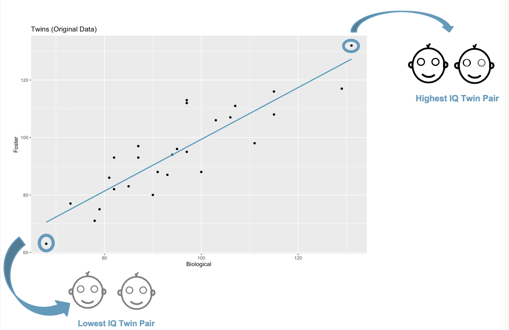
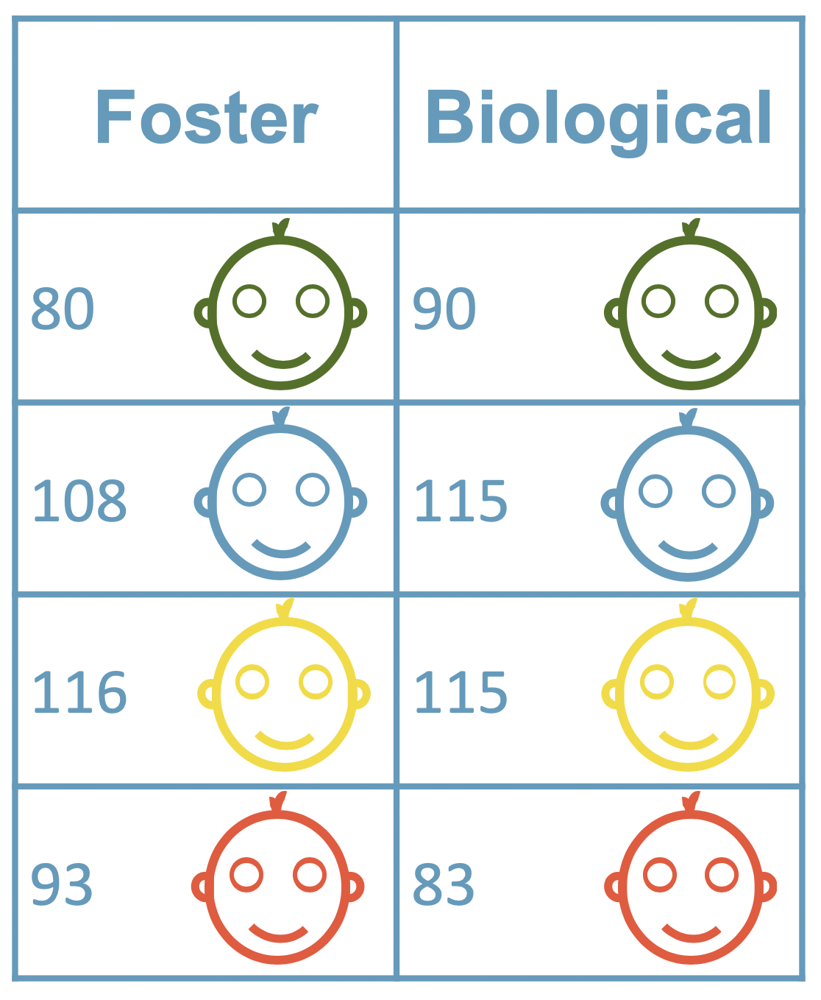
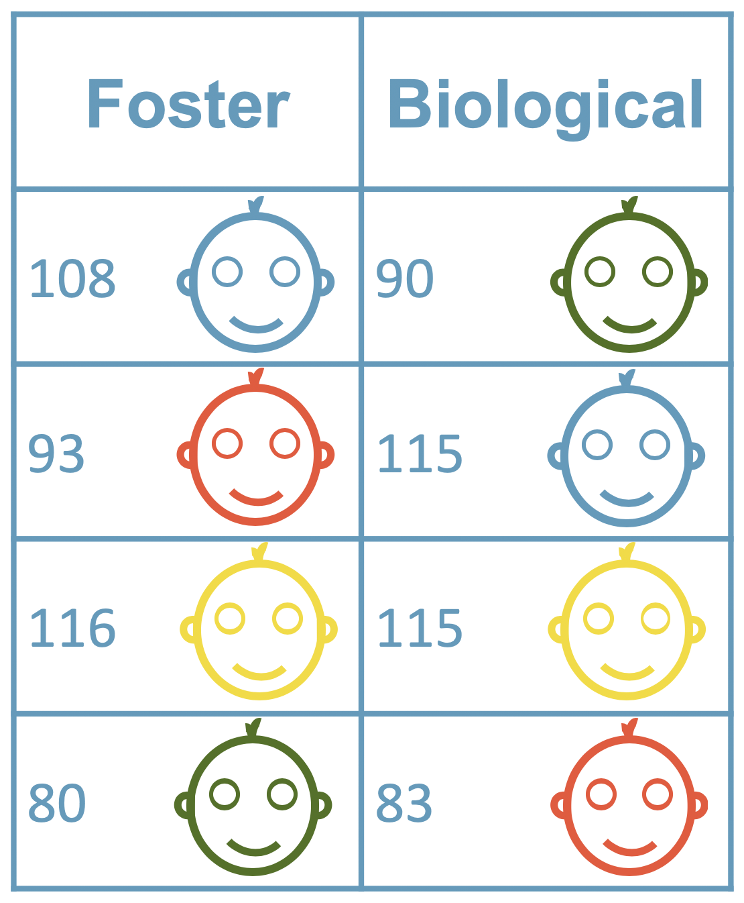
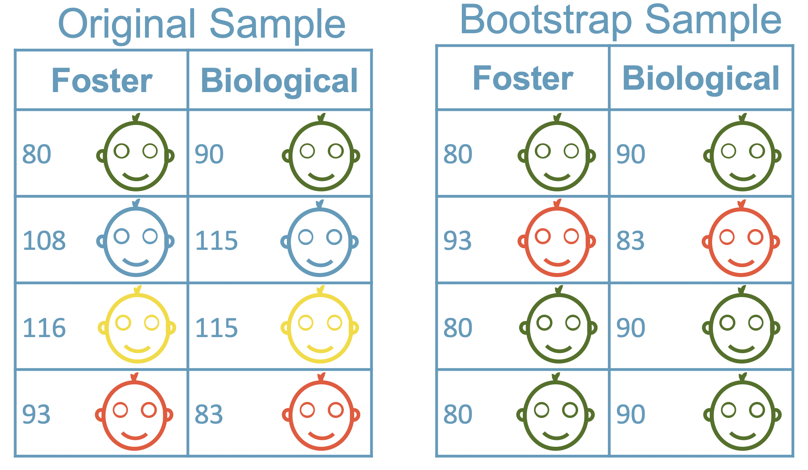

```{r setup, include=FALSE}
library(tidyverse)
library(learnr)
library(openintro)
library(broom)
library(knitr)
library(infer)
library(emo)

knitr::opts_chunk$set(echo = FALSE, warning = FALSE, message = FALSE)

# Read in the twins dataset
twins <- read_csv("data/twins.csv")

set.seed(4747)
perm_slope <- twins |>
  specify(Foster ~ Biological) |>
  hypothesize(null = "independence") |>
  generate(reps = 1000, type = "permute") |>
  calculate(stat = "slope") 

set.seed(4747)
BS_slope <- twins |>
  specify(Foster ~ Biological) |>
  generate(reps = 1000, type = "bootstrap") |>
  calculate(stat = "slope") 

set.seed(4747)
manytwins_perm <- twins |>
  rep_sample_n(size=27, replace=FALSE, reps=100)

set.seed(4747)
manytwins_BS <- twins |>
  rep_sample_n(size=27, replace=TRUE, reps=100) 

twin_lm <- lm(Foster ~ Biological, data = twins)
```


## Simulation-based Inference

In this lesson, we'll be working with twin data collected in the mid 20th century by Cyril Burt. He provides interesting data with which to work, but his research is the subject of some controversy, including the possibility that the data were falsified. But let's work with the data anyway.

### Twins -- original data

```{r echo = FALSE}
ggplot(data=twins, aes(x=Biological, y=Foster)) + geom_point() +
  geom_smooth(method="lm", se=FALSE, fullrange=TRUE, color = "#569BBD") +
  ggtitle("Twins (Original Data)")
```

The twin study tracked down identical twins who were separated at birth: one child was raised in the home of their biological parents and the other in a foster home. In an attempt to answer the question of whether intelligence is the result of nature or nurture, both children were given IQ tests.  

The resulting data is given for the IQs of the foster twins (`Foster` is the response variable) and the IQs of the biological twins (`Biological` is the explanatory variable).


### Pairs of twins


```{r echo=FALSE,  fig.cap="A scatter plot of twins' IQS.", out.width = '60%'}

```

Note that the Biological twin with the highest IQ is paired with the Foster twin with the highest IQ. Also, the Biological twin with the lowest IQ is paired with the Foster twin with the lowest IQ. If "nature" is playing a strong role here, then we would expect to see such a pattern. If "nature" is not playing a strong role, we would think that the observed pattern is simply due to chance.  

What if we permuted the Foster twins such that they were randomly matched-up with each Biological twin?  Would we see the same linear pattern?  Let's see...

### Twin data

```{r echo=FALSE,  fig.cap="A table of twins IQs. Each row corresponds to a pair of twins. The first column contains the IQ of the twin raised by foster parents, and the second column contains the IQ of the twin raised by biological parents.", out.width = '60%'}

```

The dataset itself can be thought of as two columns. Note that the two columns represent the IQ value of the biological twin and the IQ value of the foster twin.  As evidenced by the graphic, the IQ values are *paired*.  That is, each of the two IQ values come from one pair of twins.

### Permuted twin data

```{r echo=FALSE,  fig.cap="The table of twins IQs has had each column permuted, so that pairs of twins no longer appear together on the same row.", out.width = '60%'}

```

This figure now demonstrates the act of permuting the foster twins so that the IQ values are the same numbers but they are not matched to their biological twins.

### Permuted data (1) plotted

Original data

```{r echo = FALSE}

ggplot(data=twins, aes(x=Biological, y=Foster)) + geom_point() +
  geom_smooth(method="lm", se=FALSE, fullrange=TRUE, color = "#569BBD") +
  ggtitle("Twins (Original Data)")

```


Permuted data (1)

```{r echo = FALSE}
set.seed(474704)
ggplot(data=twins, aes(x=Biological, y=sample(Foster))) + geom_point() +
  geom_smooth(method="lm", se=FALSE, fullrange=TRUE, color = "#569BBD") +
  ggtitle("Twins (Permuted Data (1) )")

```


The permuted data are plotted in the same way that the original data were plotted.  Notice that the permuted data do not have any of the structure given in the original data.  That is because in the original data, each point represents a pair of twins.  In the permuted data, the twins have been mixed up, so the points no longer represent one family unit.


### Permuted data (2) plotted


Original data

```{r echo = FALSE}

ggplot(data=twins, aes(x=Biological, y=Foster)) + geom_point() +
  geom_smooth(method="lm", se=FALSE, fullrange=TRUE, color = "#569BBD") +
  ggtitle("Twins (Original Data")

```

Permuted data (2)


```{r echo = FALSE}
set.seed(40)
ggplot(data=twins, aes(x=Biological, y=sample(Foster))) + geom_point() +
  geom_smooth(method="lm", se=FALSE, fullrange=TRUE, color = "#569BBD") +
  ggtitle("Twins (Permuted Data (2) )")

```

A different permutation shows the same idea:  when each point is no longer associated with one *pair* of twins, there is not an association between the IQ values.


### Permuted data (1) and (2)


Permuted data (1)

```{r echo = FALSE}
set.seed(474704)
ggplot(data=twins, aes(x=Biological, y=sample(Foster))) + geom_point() +
  geom_smooth(method="lm", se=FALSE, fullrange=TRUE, color = "#569BBD") +
  ggtitle("Twins (Permuted Data (1) )")

```


Permuted data (2)

```{r echo = FALSE}
set.seed(40)
ggplot(data=twins, aes(x=Biological, y=sample(Foster))) + geom_point() +
  geom_smooth(method="lm", se=FALSE, fullrange=TRUE, color = "#569BBD") +
  ggtitle("Twins (Permuted Data (2) )")

```

Note that the two permuted datasets are not identical.  Indeed, by permuting the data, we get information about how the line would *vary* if there was not a relationship between IQs in the biological and foster kids.  That is, how does the line vary if the null hypothesis is true and the slope is actually zero?


### Linear model on permuted data

```{r echo=TRUE, eval=TRUE}
twins |>
   specify(Foster ~ Biological) |>
   hypothesize(null = "independence") |>
   generate(reps = 10, type = "permute") |>
   calculate(stat = "slope")
```


Using the infer package, we repeatedly sample the response variable so that any pattern in the linear model is due to random chance (and not an underlying relationship).  As with the infer package on other statistics, the steps used here are:

1. specify the linear model that we are predicting Foster IQ from Biological IQ
2. provide the null hypothesis that the two variables are independent
3. describe how to generate the sampling distribution, here it is done through permuting the biological IQ ten times
4. calculate the statistic of interest, here the slope


As you can see, sometimes the slope of the permuted data is positive, sometimes it is negative.


### Many permuted slopes

```{r echo=TRUE}
perm_slope <- twins |>
   specify(Foster ~ Biological) |>
   hypothesize(null = "independence") |>
   generate(reps = 1000, type = "permute") |>
   calculate(stat = "slope") 
 
ggplot(data=perm_slope, aes(x=stat)) + 
   geom_histogram() +
   xlim(-1,1)
```


The permuted slopes can be visualized in a histogram.  We see that the permuted slopes are centered around zero and vary by approximately plus or minus 0.5.


### Permuted slopes with observed slope in red


```{r echo=TRUE}
obs_slope <- lm(Foster ~ Biological, data = twins) |>
   tidy() |>   
   filter(term == "Biological") |>
   dplyr::select(estimate) |>   
   pull()

obs_slope

ggplot(data = perm_slope,
       aes(x = stat)) + 
   geom_histogram() +
   geom_vline(xintercept = obs_slope,
              color = "#F05133") +
   xlim(-1,1)
```


The observed slope was 0.9 which is no where close to the values obtained by permuting the data.  The comparison allows us to know that the observed slope would not have been obtained just by one chance permutation if the null hypothesis was true.

Notice in the R code that the value of the observed slope is given by using the tidy linear model code with the pull() function.

### Null sampling distribution of the slope

In the previous lesson, you investigated the sampling distribution of the slope from a population where the slope was non-zero.  Typically, however, to do inference, you will need to know the sampling distribution of the slope under the hypothesis that there is no relationship between the explanatory and response variables.  Additionally, in most situations, you don't know the population from which the data came, so the null sampling distribution must be derived from only the original dataset.

In the mid-20th century, a study was conducted that tracked down identical twins that were separated at birth: one child was raised in the home of their biological parents and the other in a foster home. In an attempt to answer the question of whether intelligence is the result of nature or nurture, both children were given IQ tests.  The resulting data is given for the IQs of the foster twins (`Foster` is the response variable) and the IQs of the biological twins (`Biological` is the explanatory variable).

In this exercise you'll use the `pull()` function. This function takes a data frame and returns a selected column as a vector (similar to `$`).


- Run a linear regression of `Foster` vs. `Biological` on the `twins` dataset.
- Tidy the result.
- Filter for rows where `term` equals `"Biological"`.
- Use `pull()` to pull out the `estimate` column.


```{r exer20, exercise=TRUE}
# Calculate the observed slope
# Run a lin. reg. of Foster vs. Biological on the twins data
obs_slope <- ___(___, ___) |>
  # Tidy the result
  ___() |>   
  # Filter for rows where term equal Biological
  ___(___) |>
  # Pull out the estimate column
  ___(___) 

# See the result
obs_slope
```


```{r exer20-hint}
- Call `lm()`, setting `formula` to `Foster ~ Biological` and `data` to `twins`.
- Call `tidy()` without arguments.
- Call `filter()` with the condition `term == "Biological"`.
- Call `pull()`, passing `estimate`.

```


```{r exer20-solution}
# Calculate the observed slope
# Run a lin. reg. of Foster vs. Biological on the twins data
obs_slope <- lm(Foster ~ Biological, data = twins) |>
  # Tidy the result
  tidy() |>   
  # Filter for rows where term equal Biological
  filter(term == "Biological") |>
  # Pull out the estimate column
  pull(estimate)  

# See the result
obs_slope
```


Simulate 10 slopes.

- Use `specify()` to specify `Foster` vs. `Biological` (same formula as for a linear regression).
- Use `hypothesize()`, to set a `null` hypothesis of `"independence"`.
- Use `generate()` to generate `10` replicates (`reps`) of `type` `"permute"`.
- Use `calculate()` to calculate the summary `stat`istic `"slope"`.


```{r exer21, exercise=TRUE}
set.seed(4747) 

# Simulate 10 slopes with a permuted dataset
perm_slope <- twins |>
  # Specify Foster vs. Biological
  ___(___) |>
  # Use a null hypothesis of independence
  ___(___) |>
  # Generate 10 permutation replicates
  ___(___, ___) |>
  # Calculate the slope statistic
  ___(___)

# See the result
perm_slope
```


```{r exer21-hint}
- Call `specify()`, passing `Foster ~ Biological`.
- Call `hypothesize()`, setting `null` to `"independence"`.
- Call `generate()`, setting `reps` to `10` and `type` to `"permute"`.
- Call `calculate()`, setting `stat` to `"slope"`.
```


```{r exer21-solution}
set.seed(4747) 

# Simulate 10 slopes with a permuted dataset
perm_slope <- twins |>
  # Specify Foster vs. Biological
  specify(Foster ~ Biological) |>
  # Use a null hypothesis of independence
  hypothesize(null = "independence") |>
  # Generate 10 permutation replicates
  generate(reps = 10, type = "permute") |>
  # Calculate the slope statistic
  calculate(stat = "slope") 

# See the result
perm_slope
```


### SE of the slope


The previous exercise generated 10 different slopes under a model of no (i.e., null) relationship between the explanatory and response variables.  Now repeat the null slope calculations 1000 times to derive a null sampling distribution for the slope coefficient.  The null sampling distribution will be used as a benchmark against which to compare the original data. Then, you'll calculate the mean and standard deviation of the null sampling distribution for the slope.


Simulate 500 slopes.

- Use `specify()` to specify `Foster` vs. `Biological` (same formula as for a linear regression).
- Use `hypothesize()`, to set a `null` hypothesis of `"independence"`.
- Use `generate()` to generate `500` replicates (`reps`) of `type` `"permute"`.
- Use `calculate()` to calculate the summary `stat`istic `"slope"`.


```{r ex22, exercise=TRUE}
# Simulate 500 slopes with a permuted dataset
perm_slope <- twins |>
  # Specify Foster vs. Biological
  ___ |>
  # Use a null hypothesis of independence
  ___ |>
  # Generate 500 permutation replicates
  ___ |>
  # Calculate the slope statistic
  ___ 
```


```{r ex22-hint}
- Call `specify()`, passing `Foster ~ Biological`.
- Call `hypothesize()`, setting `null` to `"independence"`.
- Call `generate()`, setting `reps` to `500` and `type` to `"permute"`.
- Call `calculate()`, setting `stat` to `"slope"`.
```


```{r ex22-solution}
# Simulate 500 slopes with a permuted dataset
perm_slope <- twins |>
  # Specify Foster vs. Biological
  specify(Foster ~ Biological) |>
  # Use a null hypothesis of independence
  hypothesize(null = "independence") |>
  # Generate 500 permutation replicates
  generate(reps = 500, type = "permute") |>
  # Calculate the slope statistic
  calculate(stat = "slope") 
```


- Using the `perm_slope` data, plot the `stat` you calculated with a density geom.


```{r ex23, exercise=TRUE}
# From previous step
perm_slope <- twins |>
  specify(Foster ~ Biological) |>
  hypothesize(null = "independence") |>
  generate(reps = 500, type = "permute") |>
  calculate(stat = "slope")

# Using perm_slope, plot stat
___ + 
  # Add a density layer
  ___
```


```{r ex23-hint}
- You can add a density geom using `geom_density()`.

```

```{r ex23-solution}
# From previous step
perm_slope <- twins |>
  specify(Foster ~ Biological) |>
  hypothesize(null = "independence") |>
  generate(reps = 500, type = "permute") |>
  calculate(stat = "slope")

# Using perm_slope, plot stat
ggplot(perm_slope, aes(x = stat)) + 
  # Add a density layer
  geom_density()
```


- Use `ungroup()` without arguments to ungroup the dataset.
- Use `summarize()` to calculate summary statistics.
    - Calculate `mean_stat` as the mean of `stat`.
    - Calculate `std_err_stat` as the standard error of `stat`, using `sd()`.


```{r ex24, exercise=TRUE}
# From previous step
perm_slope <- twins |>
  specify(Foster ~ Biological) |>
  hypothesize(null = "independence") |>
  generate(reps = 500, type = "permute") |>
  calculate(stat = "slope")

perm_slope |> 
  # Ungroup the dataset
  ___ |> 
  # Calculate summary statistics
  ___(
    # Mean of stat
    mean_stat = ___, 
    # Std error of stat
    std_err_stat = ___
  )
```


```{r ex24-hint}
- Call `ungroup()` without arguments.
- Call `summarize()`, setting `mean_stat` to the `mean()` of `stat` and `std_err_stat` to the `sd()` of `stat`.
```


```{r ex24-solution}
# From previous step
perm_slope <- twins |>
  specify(Foster ~ Biological) |>
  hypothesize(null = "independence") |>
  generate(reps = 500, type = "permute") |>
  calculate(stat = "slope")

perm_slope |> 
  # Ungroup the dataset
  ungroup() |> 
  # Calculate summary statistics
  summarize(
    # Mean of stat
    mean_stat = mean(stat), 
    # Std error of stat
    std_err_stat = sd(stat)
  )
```


### p-value

Now that you have created the null sampling distribution, you can use it to find the p-value associated with the original slope statistic from the `twins` data.  Although you might first consider this to be a one-sided research question, instead, use the absolute value function for practice performing two-sided tests on a slope coefficient.

You can calculate the proportion of `TRUE` values in a logical vector using `mean()`. For example, given a numeric vector `x`, the proportion of cases where `x` is greater than or equal to `10` can be calculated using `mean(x >= 10)`.


```{r echo=TRUE, eval=FALSE}

set.seed(4747)
perm_slope <- twins |>
  specify(Foster ~ Biological) |>
  hypothesize(null = "independence") |>
  generate(reps = 1000, type = "permute") |>
  calculate(stat = "slope") 
```


- Run a linear regression of `Foster` vs. `Biological` on the `twins` dataset.
- Tidy the result.
- Filter for rows where `term` equals `"Biological"`.
- Use `pull()` to pull out the `estimate` column.
- Use `abs()` to calculate the absolute value of the slopes.


```{r ex25, exercise=TRUE}
# Run a lin. reg. of Foster vs. Biological on twins
abs_obs_slope <- ___ |>
  # Tidy the result
  ___ |>   
  # Filter for rows where term equals Biological
  ___ |>
  # Pull out the estimate
  ___ |>
  # Take the absolute value
  ___
```


```{r ex25-hint}
- Call `lm()`, setting `formula` to `Foster ~ Biological` and `data` to `twins`.
- Call `tidy()` without arguments.
- Call `filter()` with the condition `term == "Biological"`.
- Call `pull()`, passing `estimate`.
```


```{r ex25-solution}
# Run a lin. reg. of Foster vs. Biological on twins
abs_obs_slope <- lm(Foster ~ Biological, data = twins) |>
  # Tidy the result
  tidy() |>   
  # Filter for rows where term equals Biological
  filter(term == "Biological") |>
  # Pull out the estimate
  pull(estimate) |>
  # Take the absolute value
  abs()
```


- Mutate `perm_slope` to add a column, `abs_perm_slope`, equal to the absolute value of `stat`.
- Summarize to calculate `p_value`, equal to the proportion of rows where `abs_perm_slope` is greater than or equal to `abs_obs_slope`.


```{r ex26, exercise=TRUE}
# From previous step
abs_obs_slope <- lm(Foster ~ Biological, data = twins) |>
  tidy() |>   
  filter(term == "Biological") |>
  pull(estimate) |>
  abs()

# Compute the p-value  
perm_slope |> 
  # Add a column of the absolute value of the slope
  ___ |>
  # Calculate a summary statistic
  summarize(
    # Get prop. cases where abs. permuted slope is greater than or equal to abs. observed slope
    p_value = ___
  )
```


```{r ex26-hint}
- Call `mutate()`, setting `abs_perm_slope` to the `abs()`olute value of `stat`.
- Call `summarize()`, setting `p_value` to the `mean()` of `abs_perm_slope >= abs_obs_slope`.
```

```{r ex26-solution}
# From previous step
abs_obs_slope <- lm(Foster ~ Biological, data = twins) |>
  tidy() |>   
  filter(term == "Biological") |>
  pull(estimate) |>
  abs()

# Compute the p-value  
perm_slope |> 
  # Add a column of the absolute value of the slope
  mutate(abs_perm_slope = abs(stat)) |>
  # Calculate a summary statistic
  summarize(
    # Get prop. cases where abs. permuted slope is greater than or equal to abs. observed slope
    p_value = mean(abs_perm_slope >= abs_obs_slope)
  )
```


### Inference on slope


#### What can we conclude based on the p-value associated with the twins data?


```{r ex27, exercise=TRUE}

```

```{r ex27-hint}
Rememeber that a p-value is the probability of seeing data this (or more) extreme, given the null hypothesis is true.
```


```{r ex27-solution}
- If there were no association between foster and biological twin IQ (no nature) in the population, we would be extremely unlikely to have collected a sample of data like we did. 
- A biological twin's IQ being higher causes a foster twin's IQ to be higher.
- Biological twins' IQs are higher than foster twins' IQs, on average.
- Given the data, the probability of biological and foster twins' IQs being unrelated is close to zero.
```


## Simulation-based CI for slope


Bootstrapping is another resampling method that allows for estimation of the sampling distribution of the statistic of interest (here, the slope).  Because interest is now in creating a CI, there is no null hypothesis, so there won't be any reason to permute either of the variables.


### Bootstrap resampling


```{r echo=FALSE, out.width = '60%'}

```


Recall that the idea behind bootstrap sampling is to resample from the original dataset *with* replacement.  That means, for each bootstrap sample, some of the observations will be replicated and others will be left out.  In the linear model setting, each resample is taken of a pair of observations one at a time.  That is, a set of twins is resampled with replacement.  The slope will be calculated based on the bootstrap resample of the original observations.

Notice that neither variable was permuted when resampling the observations:  each of the twins was paired up with their original sibling.


### Permutation vs. bootstrap variability


```{r echo = FALSE}
ggplot(manytwins_perm, aes(x=Biological, y=sample(Foster), group=replicate)) + 
  geom_point() + 
  geom_smooth(method="lm", se=FALSE, col = "#569BBD") +
  geom_hline(yintercept = mean(twins$Foster)) +
  ggtitle("100 slopes from permuted data")
```


```{r echo = FALSE}
ggplot(manytwins_BS, aes(x=Biological, y=Foster, group=replicate)) + 
  geom_point() + 
  geom_smooth(method="lm", se=FALSE, col = "#569BBD") +
  geom_abline(intercept = twin_lm$coef[1], slope = twin_lm$coef[2], color="black", size=1.2) +
  ggtitle("100 slopes from bootstrapped data")
```

Applying resampling techniques to the same dataset can help us understand the differences between permuting the data and bootstrapping the data.

The main difference between these two plots is that the permuted slopes are all centered at the flat line (in black on the left) whereas the bootstrapped slopes are centered around the observed regression line (in black on the right).


### Permutation vs. boostrap code


#### Permutation:

```{r echo=TRUE, eval=FALSE}
twins |> 
  specify(Foster ~ Biological) |> 
  hypothesize(null = "independence") |> 
  generate(reps = 100, type = "permute") |> 
  calculate(stat = "slope")
```


#### Bootstrap:

```{r echo=TRUE, eval=FALSE}
twins |> 
  specify(Foster ~ Biological) |>  
  generate(reps = 100, type = "bootstrap") |> 
  calculate(stat = "slope")
```


The **infer** package allows for repeated sampling from one of two possible models.  First, the `generate` step permutes the variables so that the null hypothesis is true (which allows for hypothesis testing).  Or the `generate` step bootstraps the data so as to estimate the variability of the slope which will be important for producing a confidence interval.


### Sampling distribution: randomization vs. bootstrap


Slopes from permuted data

```{r echo = FALSE}
ggplot(data=perm_slope, aes(x=stat)) + geom_histogram() +
  geom_vline(xintercept=obs_slope, color="#F05133") + xlim(-1,1)
```

Slopes from bootstrapped data

```{r echo = FALSE}
ggplot(data=BS_slope, aes(x=stat)) + geom_histogram() +
  geom_vline(xintercept = twin_lm$coef[2], color="#F05133")
```

When the permuted and bootstrapped data are compared, we can see, for example, that the permuted slopes are centered around zero, whereas the bootstrapped slopes are centered around the original slope statistic of 0.9.

### Bootstrapping the data

Using the **infer** package with `type = "bootstrap"`, you can repeatedly sample from the dataset to estimate the sampling distribution and standard error of the slope coefficient. Using the sampling distribution will allow you to directly find a confidence interval for the underlying population slope.

Use the **infer** steps to bootstrap the `twins` data 1000 times. You don't have to `hypothesize()` because now you're creating confidence intervals, not hypothesis testing!

- Specify `Foster` versus `Biological`.
- Generate `1000` replicates by bootstrapping.
- Calculate the slope statistic.


```{r ex28, exercise=TRUE}
# Set the seed for reproducibility
set.seed(4747)

# Calculate 1000 bootstrapped slopes
boot_slope <- twins |>
  # Specify Foster vs. Biological
  ___ |>
  # Generate 1000 bootstrap replicates
  ___ |>
  # Calculate the slope statistic
  ___

# See the result  
boot_slope
```


```{r ex28-hint}
- Call `specify()`, passing a formula with `Foster` as the response variable and `Biological` as the explanatory variable.
- Call `generate()`, setting `reps` to `1000` and `type` to `"bootstrap"`.
- Call `calculate()`, setting `stat` to `"slope"`.
```


```{r ex28-solution}
# Set the seed for reproducibility
set.seed(4747)

# Calculate 1000 bootstrapped slopes
boot_slope <- twins |>
  # Specify Foster vs. Biological
  specify(Foster ~ Biological) |>
  # Generate 1000 bootstrap replicates
  generate(reps = 1000, type = "bootstrap") |>
  # Calculate the slope statistic
  calculate(stat = "slope") 

# See the result  
boot_slope
```


### SE method - bootstrap CI for slope


The twins study was used to weigh in on the question of whether IQ is a result of nature (your genes) or nurture (your environment). If IQ was purely a result of nature, what slope would you expect to see in your linear model?

Recall that one way to create a confidence interval for a statistic is to calculate the statistic repeatedly under different bootstrap samples and to find the standard deviation associated with the bootstrapped statistics.

The `twins` data is already loaded in your workspace.


- As with the previous exercise, use the **infer** steps on the `twins` data to specify a `Foster` vs. `Biological` model, generate 1000 bootstrapped replicates, and calculate the slope statistic.
- Calculate the confidence interval of `stat` as the mean plus or minus two standard deviations.


```{r ex29, exercise=TRUE}
set.seed(4747)

# Calculate the slope statistic 
# from 1000 bootstrap replicates of
# the Foster vs. Biological model
# of the twins dataset
boot_slope <- ___


# Create a confidence interval of stat
# 2 std devs each side of the mean
boot_slope |> 
  summarize(
    lower = ___,
    upper = ___
  )
```


```{r ex29-hint}
- `boot_slope` is calculated in the same way as the previous exercise.
- Inside `summarize()`, `lower` is calculated as the `mean()` of `stat` minus `2` times the `sd()` of `stat`.
- Change the minus to a plus to calculate `upper`.
```


```{r ex29-solution}
set.seed(4747)

# Calculate the slope statistic 
# from 1000 bootstrap replicates of
# the Foster vs. Biological model
# of the twins dataset
boot_slope <- twins |>
  specify(Foster ~ Biological) |>
  generate(reps = 1000, type = "bootstrap") |>
  calculate(stat = "slope") 

# Create a confidence interval of stat
# 2 std devs each side of the mean
boot_slope |> 
  summarize(
    lower = mean(stat) - 2 * sd(stat),
    upper = mean(stat) + 2 * sd(stat)
  )
```


### Percentile method - bootstrap CI for slope

Alternatively, a CI for the slope can be created using the percentiles of the distribution of the bootstrapped slope statistics.  Recall that a CI is created in such a way that, over a lifetime of analysis, the coverage rate of a CI is (1-alpha)*100%.  If you always set alpha = 0.05, then the 95% confidence intervals will capture the parameter of interest (over your lifetime) 95% of the time.  Typically, out of the 5% of the time when the interval misses the parameter, sometimes the interval is too high (2.5% of the time) and sometimes the interval is too low (2.5% of the time).

The bootstrapped estimates of `slope`, `boot_slope`, are loaded in your workspace.


- Set `alpha` to be 0.05 (although for your own work, feel free to use a different confidence level).
- Calculate the relevant percentiles needed to create the confidence interval.
    - The lower percentile cutoff is at half `alpha`.
    - The upper percentile cutoff is at one minus half `alpha`.
- Create the confidence interval of `stat` using `quantile()` and the percentile cutoffs. Your interval ends should be named `lower` and `upper`.


```{r echo=TRUE, eval=FALSE}
set.seed(4747)
boot_slope <- twins |>
  specify(Foster ~ Biological) |>
  generate(reps = 1000, type = "bootstrap") |>
  calculate(stat = "slope")
```


```{r ex210, exercise=TRUE}
# Set alpha
alpha <- ___

# Set the lower percentile cutoff
p_lower <- ___

# Set the upper percentile cutoff
p_upper <- ___

# Create a confidence interval of stat using quantiles
boot_slope |> 
  ___
```


```{r ex210-hint}
- Calculate the confidence interval of `stat` inside a call to `summarize()`.
- The `quantile()` function takes a vector and a value between zero and one as its arguments.
```


```{r ex210-solution}
# Set alpha
alpha <- 0.05

# Set the lower percentile
p_lower <- alpha / 2

# Set the upper percentile
p_upper <- 1 - alpha / 2

# Create a confidence interval of stat using quantiles
boot_slope |> 
  summarize(
    lower = quantile(stat, p_lower), 
    upper = quantile(stat, p_upper)
  )
```


### Inference from randomization and bootstrapped distributions

Throughout this lesson we have investigated the slope associated with the regression of `Foster` twins on `Biological` twins.  The inference question was based on a randomization test assuming no relationship between the two types of twins (i.e., a slope of zero).  The confidence intervals investigated a research question associated with a 100% nature relationship (i.e., a slope of one).  What are the appropriate conclusions of this study?


```{r ex211, exercise=TRUE}

```


```{r ex211-hint}
Remember the difference between the population slope and the estimated slope. What do the inferential procedures you've performed say about each one?
```


```{r ex211-solution}
- Zero is not a plausible value for the population slope, one is a plausible value for the population slope.
- Zero is not a plausible value for the estimated slope, one is a plausible value for the estimated slope.
- Zero is a plausible value for the population slope, one is not a plausible value for the population slope.
- Zero is a plausible value for the estimated slope, one not is a plausible value for the estimated slope.
```


## Congratulations!

You have successfully completed Lesson 2 in Tutorial 6: Inferential modeling.  
If you need to generate a hash for submission, click "Next Topic".

What's next?

`r emo::ji("ledger")` [Full list of tutorials supporting OpenIntro::Introduction to Modern Statistics](https://openintrostat.github.io/ims-tutorials/)

`r emo::ji("spiral_notepad")` [Tutorial 6: Inferential modeling](https://openintrostat.github.io/ims-tutorials/06-model-infer/)

`r emo::ji("one")` [Tutorial 6 - Lesson 1: Inference in regression](https://openintro.shinyapps.io/ims-06-model-infer-01/)

`r emo::ji("two")` [Tutorial 6 - Lesson 2: Randomization test for slope](https://openintro.shinyapps.io/ims-06-model-infer-02/)

`r emo::ji("three")` [Tutorial 6 - Lesson 3: t-test for slope](https://openintro.shinyapps.io/ims-06-model-infer-03/)

`r emo::ji("four")` [Tutorial 6 - Lesson 4: Checking technical conditions for slope inference](https://openintro.shinyapps.io/ims-06-model-infer-04/)

`r emo::ji("five")` [Tutorial 6 - Lesson 5: Inference beyond the simple linear regression model](https://openintro.shinyapps.io/ims-06-model-infer-05/)

`r emo::ji("open_book")` [Learn more at Introduction to Modern Statistics](http://openintro-ims.netlify.app/)


## Submit

```{r, echo=FALSE, context="server"}
source(here::here("encoder_logic.R"))
encoder_logic()
```

```{r encode, echo=FALSE}
source(here::here("encoder_ui.R"))
learnrhash::encoder_ui(ui_before = hash_encoder_ui)
```

