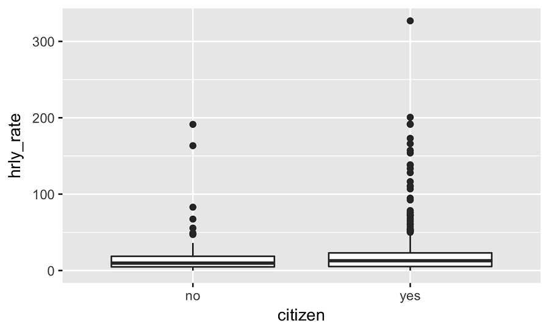

```{r setup, include=FALSE}
# load packages ----------------------------------------------------------------

library(learnr)
library(tidyverse)
library(infer)
library(openintro)
library(emo)

# knitr options ----------------------------------------------------------------

knitr::opts_chunk$set(fig.align = "center", 
                      fig.height = 3, 
                      fig.width = 5,
                      echo = FALSE, 
                      message = FALSE, 
                      warning = FALSE)

# data prep --------------------------------------------------------------------

set.seed(421398)

# add ver variables to acs
acs12 <- acs12 %>%
  mutate(
    hrly_pay = income / (52 * hrs_work),
    citizen = case_when(
      citizen == "no" ~ "Non-citizen", 
      citizen == "yes" ~ "Citizen"
      )  
  )

# Calculate difference between before and after
stem_cell <- stem_cell %>%
  mutate(change = after - before)
```

## Hypothesis testing for comparing two means

### Hypothesis testing for comparing two means via simulation

In this lesson we demonstrate setting up and conducting a hypothesis test to compare means from two independent distributions using simulation.


### Motivation

> Does a treatment using embryonic stem cells help improve heart function following a heart attack more so than traditional therapy? 

Let's try to answer using the `stem_cell` data from the **openintro** package.

|trmt | before| after|
|:----|:-----:|:----:|
|ctrl |  35.25| 29.50|
|ctrl |  36.50| 29.50|
|ctrl |  39.75| 36.25|
|...  |   ... |  ... |
|esc  |  53.75| 51.00|


The motivating question is whether use of embryonic stem cells help improve heart function following a heart attack. The data can be found in the openintro package.

These data were collected as part of a study in which sheep that have had a heart attack were randomly assigned to the embryonic stem cell therapy (labeled as "esc" in the data) or to a traditional therapy as a control. The researchers measured the heart pumping capacity of these sheep before and after the study. If a sheep's heart pumping capacity increased from before to after the study, this indicates a stronger recovery. In our analysis we want to evaluate the effect of the embryonic stem cell therapy on heart pumping capacity relative to the control group.


### Analysis outline


> Step 1. Calculate `change` for each sheep: difference between before and after heart pumping capacities for each sheep.

|trmt | before| after| change |
|:----|:-----:|:----:|:----:|
|ctrl |  35.25| 29.50|  ?   |
|ctrl |  36.50| 29.50|  ?   |
|ctrl |  39.75| 36.25|  ?   |
|...  |   ... |  ... | ...  |
|esc  |  53.75| 51.00|  ?   |

In order to do this we will first calculate the difference between before treatment and after treatment heart pumping capacities for each sheep. We call this variable "change". 
We want to evaluate whether the data suggest that average change is higher, on average, for the treatment group.

### 

> Step 2. Set the hypotheses:
> $H\_0: \mu\_{esc} = \mu\_{ctrl}$; There is no difference between average change in treatment and control groups.
> $H\_A: \mu\_{esc} > \mu\_{ctrl}$; There is a difference between average change in treatment and control groups. 

Then, we set our hypotheses.

Our null hypothesis should state the status quo, in other words, "there is nothing going on". In context, this means no difference between the average changes in the treatment and control groups.

The alternative hypothesis says that the average change is higher for those in the treatment group compared to the control.

### 

> Step 3. Conduct the hypothesis test.
> - Write the values of `change` on 18 index cards. 
> - (1) Shuffle the cards and randomly split them into two equal sized decks: treatment and control. 
> - (2) Calculate and record the test statistic: difference in average `change` between treatment and control. 
> - Repeat (1) and (2) many times to generate the sampling distribution. 
> - Calculate p-value as the percentage of simulations where the test statistic is at least as extreme as the observed difference in sample means. 


Finally, we conduct the hypothesis test.

Conceptually here is how we go about it.

First, we write the values of "change" on 18 index cards.

Then we shuffle these cards and randomly split them into two equal sized decks, one representing treatment and other representing control.

We then calculate and record the test statistic: difference in average change between treatment and control. At this point we have no control over which card ended up in which pile. Since the cards are randomly shuffled into the two decks, we would not expect to see a difference between the average change values in each deck. In other words, we would expect the simulated difference between the two sample means to be 0. But of course, this number will not be exactly 0. Just by random chance it can be just a bit different than 0, or quite different than 0.

We repeat the simulation many times in order to get a sense of how much the simulated difference in means varies.

Finally we calculate the p-value as the percentage of simulations where the test statistic is at least as extreme as the observed difference in sample means.

But, obviously, we don't actually do this by shuffling index cards...


### Hypothesis test: get started

> Use the **infer** package to conduct the test:

```{r eval=FALSE, echo=TRUE}
library(infer)
```

Instead, we use computation to conduct this simulation, specifically using the infer package in R.

### Hypothesis test: specify the model

> Start with the data frame and **specify** the model:

```{r eval=FALSE, echo=TRUE}
diff_ht_mean <- stem_cell %>%
  specify(__) %>%                    # y ~ x
  ...
```


We start with the data frame containing our variables of interest, and specify our model as response vs. explanatory. In our example the response variable is change and the explanatory variable is treatment group.

### Hypothesis test: hypothesize

> **Declare null hypothesis**, i.e. no difference between means:

```{r eval=FALSE, echo=TRUE}
diff_ht_mean <- stem_cell %>%
  specify(__) %>%                    # y ~ x
  hypothesize(null = __) %>%         # "independence" or "point"
  ...
```

We then declare the null hypothesis. The null argument in the hypothesize function can be set to a point value or to independence, indicating that the response and explanatory variables are independent of each other.

### Hypothesis test: generate resamples

> **Generate** resamples assuming $H_0$ is true:

```{r eval=FALSE, echo=TRUE}
diff_ht_mean <- stem_cell %>%
  specify(__) %>%                    # y ~ x
  hypothesize(null = __) %>%         # "independence" or "point"
  generate(reps = __, type = __) %>% # "bootstrap", "permute", or "simulate"
  ...
```

Then, using the data, the model we specified, and the null hypothesis we declared, we generate many resamples by permuting the labels of the two groups.

### Hypothesis test: calculate the test statistic

> **Calculate** test statistic:

```{r eval=FALSE, echo=TRUE}
diff_ht_mean <- stem_cell %>%
  specify(__) %>%                    # y ~ x
  hypothesize(null = __) %>%         # "independence" or "point"
  generate(reps = _N_, type = __) %>%# "bootstrap", "permute", or "simulate"
  calculate(stat = "diff in means")  # type of statistic to calculate
```


Finally, we calculate the test statistic for each of our resamples. The statistic we're interested in is the difference in means.


### Hypothesis test: calculate the p-value


> Calculate the p-value as the proportion of simulations where the simulated difference between the sample means is at least as extreme as the observed
> $$P ((\bar{x}\_{esc,sim} - \bar{x}\_{ctrl,sim}) \ge (\bar{x}\_{esc,obs} - \bar{x}\_{ctrl,obs}))$$


Using the simulated sample statistics, we calculate the p-value as the proportion of simulations where the simulated difference between the sample means is at least as extreme as the one observed.


Now it's your turn.

### Evaluating the effectiveness of stem cell treatment

Now that we set out hypotheses, we can calculate the observed difference in means between the treatment and control groups. The `stem_cell` data frame gives us the pumping capacity of the heart before and after the experiment. So first we need to find the difference between these for each experimental unit, and then use these `change` values to calculate the observed difference in mean change between treatment and control groups.

###

First, add a column to `stem_cell` named `change`, equal to `after` minus `before`.

```{r stem_cell, exercise=TRUE}
# Calculate difference between before and after
stem_cell <- stem_cell %>%
  ___(change = ___)
```

<div id="stem_cell-hint">
**Hint:** Call `mutate()`, setting `change` to `after` minus `before`.
</div>

```{r stem_cell-solution}
# Calculate difference between before and after
stem_cell <- stem_cell %>%
  mutate(change = after - before)
```

### 

Then, calculate observed difference in means between treatment groups.

- Group by the treatment group, `trmt`.
- Summarize to calculate the mean change.
- Pull out the calculated value.
- Calculate the `diff()`erence between the two numbers.


```{r steam_cell_2, exercise=TRUE}
# From previous step
stem_cell <- stem_cell %>%
  mutate(change = after - before)
  
# Calculate observed difference in means
diff_mean <- stem_cell %>%
  # Group by treatment group
  ___ %>%
  # Calculate mean change for each group
  ___(mean_change = ___) %>% 
  # Pull out the value
  ___ %>%
  # Calculate difference
  ___
  
# See the result
diff_mean
```

<div id="stem_cell_2-hint">
**Hint:**
- Call `group_by()`, passing `trmt`.
- Call `summarize()`, setting `mean_change` to the mean of `change`.
</div>

```{r steam_cell_2-solution}
# From previous step
stem_cell <- stem_cell %>%
  mutate(change = after - before)
  
# Calculate observed difference in means
diff_mean <- stem_cell %>%
  # Group by treatment group
  group_by(trmt) %>%
  # Calculate mean change for each group
  summarize(mean_change = mean(change)) %>% 
  # Pull out the value
  pull() %>%
  # Calculate difference
  diff()
  
# See the result
diff_mean
```

### 

Well done! We will use this observed difference in the following exercises.

### Evaluating the effectiveness of stem cell treatment (cont.)

Conduct the hypothesis test and compute the p-value for evaluating whether there is a difference between the mean heart pumping capacities of sheep's hearts in the control and treatment groups.

Since we're testing for a difference, the order in which we subtract matters. We can specify it using the `order` argument in the `calculate()` function. For example, to achieve `group1 - group2` use `order = c("group1", "group2")`.

```{r stem_cell_3-setup, include=FALSE}
# Calculate observed difference in means
diff_mean <- stem_cell %>%
  group_by(trmt) %>%                         
  summarize(mean_change = mean(change)) %>%  
  pull() %>%                                 
  diff()
```

### 

First, generate 1000 differences in means via randomization.

- Specify change versus treatment group.
- Use an independence hypothesis.
- Generate 1000 replicates via permutation.
- Calculate the difference in means (`esc` first, then `ctrl`).


```{r stem_cell_3, exercise=TRUE}
n_replicates <- 1000

# Generate 1000 differences in means via randomization
diff_mean_ht <- stem_cell %>%
  # y ~ x
  specify(___ ~ ___) %>% 
  # Null = no difference between means
  hypothesize(null = "___") %>% 
  # Shuffle labels 1000 times
  generate(reps = ___, type = "___") %>% 
  # Calculate test statistic
  calculate(stat = "___", order = c("esc", "___") 
```

<div id="stem_cell_3-hint">
**Hint:**
- Call `specify()`, setting `formula` to a formula with `change` as the response variable and `trmt` as the explanatory variable.
- Call `hypothesize()`, setting `null` to `"independence"`.
- Call `generate()`, setting `reps` to `n_replicates` and `type` to `"permute"`.
- Call `calculate()`, setting `stat` to `"diff in means"` and `order` to `c("esc", "ctrl")`.
</div>

```{r stem_cell_3-solution}
n_replicates <- 1000

# Generate 1000 differences in means via randomization
diff_mean_ht <- stem_cell %>%
  # y ~ x
  specify(change ~ trmt) %>% 
  # Null = no difference between means
  hypothesize(null = "independence") %>%  
  # Shuffle labels 1000 times
  generate(reps = 1000, type = "permute") %>% 
  # Calculate test statistic
  calculate(stat = "diff in means", order = c("esc", "ctrl")) 
```

### 

Then, calculate the one-sided p-value.

- Filter for replicates where the simulated test statistic is at least as extreme as the observed statistic.
- Summarize to calculate the p-value as the number of rows in the filtered dataset divided by the number of replicates.


```{r stem_cell_4, exercise=TRUE}
# From previous step
n_replicates <- 1000
diff_mean_ht <- stem_cell %>%
  specify(change ~ trmt) %>% 
  hypothesize(null = "independence") %>%  
  generate(reps = n_replicates, type = "permute") %>% 
  calculate(stat = "diff in means", order = c("esc", "ctrl"))
  
diff_mean_ht %>%
  # Filter for simulated test statistics at least as extreme as observed
  filter(___) %>%
  # Calculate p-value
  summarize(p_val = ___)
```

<div id="stem_cell_4-hint">
**Hint:**
- Call `filter()`, using the condition `stat` greater than or equal to the observed difference in means.
- Call `summarize()`, setting `p_val` to the number of rows, `n()`, divided by the total number of replicates, `n_replicates`.
</div>

```{r stem_cell_4-solution}
# From previous step
n_replicates <- 1000
diff_mean_ht <- stem_cell %>%
  specify(change ~ trmt) %>% 
  hypothesize(null = "independence") %>%  
  generate(reps = n_replicates, type = "permute") %>% 
  calculate(stat = "diff in means", order = c("esc", "ctrl"))
  
diff_mean_ht %>%
  # Filter for simulated test statistics greater than observed
  filter(stat >= diff_mean) %>%
  # Calculate p-value
  summarize(p_val = n() / n_replicates)
```

### Conclusion of the hypothesis test


The p-value of the previous test was found to be 0.001. Suppose the significance level of the test is 1%. Fill in the blanks: 

```{r quiz_1}
quiz(
  question("_____ between the heart pumping capacities of sheep's hearts in the control and treatment groups.", 
           correct = "Great job!", 
           allow_retry = TRUE,
           answer("There is a difference", message = "Sorry, try again. You can't make definitive statements; only explain what the data suggests."),
           answer("There is no difference", message = "Sorry, try again. You can't make definitive statements; only explain what the data suggests."),
           answer("The data provide convincing evidence of a difference", correct = TRUE),
           answer("The data provide convincing evidence that there is no difference", message = "Sorry, try again. The p-value, 0.001, is less than the significance level, 0.01.")
  ), caption = ""
)
```

### Evaluating the relationship between smoking during pregnancy and birth weight

The state of North Carolina released to the public a large data set containing information on births recorded in this state. This data set has been of interest to medical researchers who are studying the relation between habits and practices of expectant mothers and the birth of their children. `ncbirths` is a random sample of 1000 cases from this data set. We want to evaluate whether there is a difference between weights of babies born to smoker and non-smoker mothers.

### 

First, filter `ncbirths` for rows where `habit` is non-missing.

```{r smoking, exercise=TRUE}
# Filter for subjects with non-missing habit
ncbirths_complete_habit <- ncbirths %>%
  ___
```

<div id="smoking-hint">
**Hint:** Call `filter()`, using `!` and `is.na()` to create a condition where `habit` is not `NA`.
</div>

```{r smoking-solution}
# Filter for subjects with non-missing habit
ncbirths_complete_habit <- ncbirths %>%
  filter(!is.na(habit))
```

### 

Then, calculate observed difference in means between smoking habit groups.

- Group by the smoking habit group, `habit`.
- Summarize to calculate the mean weight.
- Pull out the calculated value.
- Calculate the difference between the two numbers.


```{r smoking_2, exercise=TRUE}
# From previous step
ncbirths_complete_habit <- ncbirths %>%
  filter(!is.na(habit))

# Calculate observed difference in means
diff_mean_obs <- ncbirths_complete_habit %>%
  # Group by habit group
  ___ %>%
  # Calculate mean weight for each group
  ___(mean_weight = ___) %>%
  # Pull out the value
  ___ %>%
  # Calculate the difference
  ___ 
```

<div id="smoking_2-hint">
**Hint:** 
- Call `group_by()`, passing `habit`.
- Call `summarize()`, setting `mean_weight` to the mean of `weight`.
</div>

```{r smoking_2-solution}
# From previous step
ncbirths_complete_habit <- ncbirths %>%
  filter(!is.na(habit))

# Calculate observed difference in means
diff_mean_obs <- ncbirths_complete_habit %>%
  # Group by habit group
  group_by(habit) %>%
  # Calculate mean weight for each group
  summarize(mean_weight = mean(weight)) %>%
  # Pull out the value
  pull() %>%
  # Calculate the difference
  diff() 
```

### 

Then, generate 1000 differences in means via randomization and store as `diff_mean_ht`

- Specify the model as birth weight versus smoking habit.
- Set the hypothesis that the variables are independent.
- Generate 1000 samples via permutation.
- Calculate the difference in means at each iteration. The order should have `"nonsmoker"`s first, then `"smoker"`s.


```{r smoking_3, exercise=TRUE}
# From previous steps
ncbirths_complete_habit <- ncbirths %>%
  filter(!is.na(habit))
diff_mean_obs <- ncbirths_complete_habit %>%
  group_by(habit) %>%
  summarize(mean_weight = mean(weight)) %>%
  pull() %>%
  diff()

n_replicates <- 1000

# Generate 1000 differences in means via randomization
diff_mean_ht <- ncbirths_complete_habit %>% 
  # Specify weight vs. habit
  ___ %>% 
  # Null = no difference between means
  ___ %>% 
  # Shuffle labels 1000 times
  ___ %>%
  # Calculate test statistic, nonsmoker then smoker
  ___
```

<div id="smoking_3-hint">
**Hint:** 
- Call `specify()`, passing a formula of `weight` versus `habit`.
- Call `hypothesize()`, setting `null` to `"independence"`.
- Call `generate()`, setting `reps` to `n_replicates` and `type` to `"permute"`.
- Call `calculate()`, setting `stat` to `"diff in means"` and `order` to `c("nonsmoker", "smoker")`.
</div>

```{r smoking_3-solution}
# From previous steps
ncbirths_complete_habit <- ncbirths %>%
  filter(!is.na(habit))
diff_mean_obs <- ncbirths_complete_habit %>%
  group_by(habit) %>%
  summarize(mean_weight = mean(weight)) %>%
  pull() %>%
  diff()

n_replicates <- 1000

# Generate 1000 differences in means via randomization
diff_mean_ht <- ncbirths_complete_habit %>% 
  # Specify weight vs. habit
  specify(weight ~ habit) %>% 
  # Null = no difference between means
  hypothesize(null = "independence") %>% 
  # Shuffle labels 1000 times
  generate(reps = n_replicates, type = "permute") %>%
  # Calculate test statistic, nonsmoker then smoker
  calculate(stat = "diff in means", order = c("nonsmoker", "smoker")) 
```

### 

And finally,

- Filter for rows where the bootstrap difference in means is less than or equal to the observed difference in means.
- Summarize to calculate `one_sided_p_val` as the number of rows in the filtered dataset divided by the number of replicates.
- Calculate `two_sided_p_val` from `one_sided_p_val`.


```{r smoking_4, exercise=TRUE}
# From previous steps
ncbirths_complete_habit <- ncbirths %>%
  filter(!is.na(habit))
diff_mean_obs <- ncbirths_complete_habit %>%
  group_by(habit) %>%
  summarize(mean_weight = mean(weight)) %>%
  pull() %>%
  diff()
n_replicates <- 1000
diff_mean_ht <- ncbirths_complete_habit %>% 
  specify(weight ~ habit) %>% 
  hypothesize(null = "independence") %>% 
  generate(reps = n_replicates, type = "permute") %>%
  calculate(stat = "diff in means", order = c("nonsmoker", "smoker")) 
  
# Calculate p-value
diff_mean_ht %>%
  # Identify simulated test statistics at least as extreme as observed
  ___ %>%
  # Calculate p-value
  ___(
    one_sided_p_val = ___,
    two_sided_p_val = ___
  )
```

<div id="smoking_4-hint">
**Hint:** 
- Call `filter()`, using the condition `stat` less than or equal to the observed median score difference.
- Call `summarize()`, setting `one_sided_p_val` to the number of rows, `n()`, divided by the total number of replicates, `n_replicates`.
- Inside `summarize()`, set `two_sided_p_val` to double `one_sided_p_val`.
</div>

```{r smoking_4-solution}
# From previous steps
ncbirths_complete_habit <- ncbirths %>%
  filter(!is.na(habit))
diff_mean_obs <- ncbirths_complete_habit %>%
  group_by(habit) %>%
  summarize(mean_weight = mean(weight)) %>%
  pull() %>%
  diff()
n_replicates <- 1000
diff_mean_ht <- ncbirths_complete_habit %>% 
  specify(weight ~ habit) %>% 
  hypothesize(null = "independence") %>% 
  generate(reps = n_replicates, type = "permute") %>%
  calculate(stat = "diff in means", order = c("nonsmoker", "smoker")) 
  
# Calculate p-value
diff_mean_ht %>%
  # Identify simulated test statistics at least as extreme as observed
  filter(stat <= diff_mean_obs) %>%
  # Calculate p-value
  summarize(
    one_sided_p_val = n() / n_replicates,
    two_sided_p_val = 2 * one_sided_p_val
  )
```

### 

Wonderful! What does your p-value suggest about the relationship between smoking during pregnancy and birth weight?

## Bootstrap CI for difference in two means

A natural next step in your analysis would be to quantify the difference between the two population means using a confidence interval. 
Next, we outline the bootstrap scheme for estimating the difference between the two numerical population parameters. 
The following exercises will reveal that implementing this scheme in R takes only a few tweaks to the pipelines using the infer package that we have been using for doing simulation based inference.

### Bootstrap CI for a difference

> 1. Take a bootstrap sample *of each sample* - a random sample taken with replacement from each of the original samples, of the same size as each of the original samples.
> 2. Calculate the bootstrap statistic - a statistic such as *difference* in means, medians, proportion, etc. computed based on the bootstrap samples.
> 3. Repeat steps (1) and (2) many times to create a bootstrap distribution - a distribution of bootstrap statistics.
> 4. Calculate the interval using the percentile or the standard error method.

Constructing a bootstrap interval for the difference in two means is quite similar to constructing a bootstrap interval for a single mean. The only difference is that now we have two samples to bootstrap from. 

So, we take bootstrap samples of each sample. That is, a random sample taken with replacement from each of the original samples, of the same size as each of the original samples.

Then, we calculate the bootstrap statistic. This is whatever we are interested in: a difference in means, medians, etc. of the bootstrap samples we generated. We record this value.

We then repeat steps 1 and 2 many times to create a bootstrap distribution.

Lastly, we calculate the interval using the percentile or the standard error method we learned earlier in the tutorial.

Now let's try some exercises.

### Smoking during pregnancy and birth weight

Let's construct a bootstrap interval for the difference in mean weights of babies born to smoker and non-smoker mothers. The `ncbirths_complete_habit` data frame you created earlier is available to use.


```{r smoking_bs-setup, include=FALSE}
# Remove subjects with missing habit
ncbirths_complete_habit <- ncbirths %>%
  filter(!is.na(habit))
```

### 

First, generate 1500 bootstrap difference in means for birth weight by smoking habit.

- Specify birth weight versus smoking habit.
- Generate 1500 bootstrap replicates.
- Calculate the difference in means, with order nonsmoker then smoker.


```{r smoking_bs, exercise=TRUE}
# Generate 1500 bootstrap difference in means
diff_mean_ci <- ncbirths_complete_habit %>%
  # Specify weight vs. habit
  ___ %>%
  # Generate 1500 bootstrap replicates
  ___ %>%
  # Calculate the difference in means, nonsmoker then smoker
  ___
```

<div id="smoking_bs-hint">
**Hint:** 
- Call `specify()`, passing a formula of `weight` versus `habit`.
- Call `generate()`, setting `reps` to `1500` and `type` to `"bootstrap"`.
- Call `calculate()`, setting `stat` to `"diff in means"` and `order` to `c("nonsmoker", "smoker")`.
</div>

```{r smoking_bs-solution}
# Generate 1500 bootstrap difference in means
diff_mean_ci <- ncbirths_complete_habit %>%
  # Specify weight vs. habit
  specify(weight ~ habit) %>%
  # Generate 1500 bootstrap replicates
  generate(reps = 1500, type = "bootstrap") %>%
  # Calculate the difference in means, nonsmoker then smoker
  calculate(stat = "diff in means", order = c("nonsmoker", "smoker"))
```

### 

Then, calculate a 95% confidence interval for the bootstrap difference in mean birth weights using the percentile method.

```{r smoking_bs_2, exercise=TRUE}
# From previous step
diff_mean_ci <- ncbirths_complete_habit %>%
  specify(weight ~ habit) %>%
  generate(reps = 1500, type = "bootstrap") %>%
  calculate(stat = "diff in means", order = c("nonsmoker", "smoker"))
  
# Calculate the 95% CI via percentile method
diff_mean_ci %>%
  ___(
    l = ___,
    u = ___
  )
```

<div id="smoking_bs_2-hint">
**Hint:** 
- Call `summarize()`, setting `l` to the `0.025` quantile of `stat`.
- The `probs` arguments for the `l` and `u` quantiles should add up to one.
</div>

```{r smoking_bs_2-solution}
# From previous step
diff_mean_ci <- ncbirths_complete_habit %>%
  specify(weight ~ habit) %>%
  generate(reps = 1500, type = "bootstrap") %>%
  calculate(stat = "diff in means", order = c("nonsmoker", "smoker"))
  
# Calculate the 95% CI via percentile method
diff_mean_ci %>%
  summarize(
    l = quantile(stat, 0.025),
    u = quantile(stat, 0.975)
  )
```

### 

Great! What is the interpretation of this interval?


### Smoking during pregnancy and length of gestation

Let's turn our attention to another variable, `weeks`, indicating the length of the pregnancy. Construct a bootstrap interval for the difference in median lengths of pregnancies of smoker and non-smoker mothers.

Filter `ncbirths` for rows where smoking `habit` and length of pregnancy in `weeks` are both non-missing.


```{r smoking_bs_3, exercise=TRUE}
# Filter for non-missing habit & non-missing weeks
ncbirths_complete_habit_weeks <- ncbirths %>%
  ___
```

<div id="smoking_bs_3-hint">
**Hint:** Call `filter()`, passing two conditions, using `!` and `is.na()` to keep only rows where `habit` and `weeks` are not `NA`.
</div>

```{r smoking_bs_3-solution}
# Filter for non-missing habit & non-missing weeks
ncbirths_complete_habit_weeks <- ncbirths %>%
  filter(!is.na(habit), !is.na(weeks))
```

### 

First, generate 1500 bootstrap difference in medians for pregnancy length in weeks by smoking habit.

- Specify pregnancy length in `weeks` versus smoking `habit`.
- Generate 1500 bootstrap replicates.
- Calculate the difference in medians, with order nonsmoker then smoker.


```{r smoking_bs_4, exercise=TRUE}
# From previous step
ncbirths_complete_habit_weeks <- ncbirths %>%
  filter(!is.na(habit), !is.na(weeks))

# Generate 1500 bootstrap difference in medians
diff_med_ci <- ncbirths_complete_habit_weeks %>%
  # Specify weeks versus habit
  ___ %>%
  # Generate 1500 bootstrap replicates
  ___ %>%
  # Calculate the difference in medians, nonsmoker then smoker
  ___
```

<div id="smoking_bs_4-hint">
**Hint:** 
- Call `specify()`, passing a formula of `weeks` versus `habit`.
- Call `generate()`, setting `reps` to `1500` and `type` to `"bootstrap"`.
- Call `calculate()`, setting `stat` to `"diff in medians"` and `order` to `c("nonsmoker", "smoker")`.
</div>

```{r smoking_bs_4-solution}
# From previous step
ncbirths_complete_habit_weeks <- ncbirths %>%
  filter(!is.na(habit), !is.na(weeks))

# Generate 1500 bootstrap difference in medians
diff_med_ci <- ncbirths_complete_habit_weeks %>%
  # Specify weeks versus habit
  specify(weeks ~ habit) %>%
  # Generate 1500 bootstrap replicates
  generate(reps = 1500, type = "bootstrap") %>%
  # Calculate the difference in medians, nonsmoker then smoker
  calculate(stat = "diff in medians", order = c("nonsmoker", "smoker"))
```

### 

Then, calculate a 92% confidence interval for the bootstrap difference in median pregnancy length in weeks using the percentile method.


```{r smoking_bs_5, exercise=TRUE}
# From previous step
ncbirths_complete_habit_weeks <- ncbirths %>%
  filter(!is.na(habit), !is.na(weeks))
diff_med_ci <- ncbirths_complete_habit_weeks %>%
  specify(weeks ~ habit) %>%
  generate(reps = 1500, type = "bootstrap") %>%
  calculate(stat = "diff in medians", order = c("nonsmoker", "smoker"))

# Calculate the 92% CI via percentile method
diff_med_ci %>%
  summarize(
    l = ___,
    u = ___
  )
```

<div id="smoking_bs_5-hint">
**Hint:** 
- Call `summarize()`, setting `l` to the `0.04` quantile of `stat`.
- The `probs` arguments for the `l` and `u` quantiles should add up to one.
</div>

```{r smoking_bs_5-solution}
# From previous step
ncbirths_complete_habit_weeks <- ncbirths %>%
  filter(!is.na(habit), !is.na(weeks))
diff_med_ci <- ncbirths_complete_habit_weeks %>%
  specify(weeks ~ habit) %>%
  generate(reps = 1500, type = "bootstrap") %>%
  calculate(stat = "diff in medians", order = c("nonsmoker", "smoker"))

# Calculate the 92% CI via percentile method
diff_med_ci %>%
  summarize(
    l = quantile(stat, 0.04),
    u = quantile(stat, 0.96)
  )
```

### 

Well done! Quick mental check before you move on: What does 92% confident mean?

## Comparing means with a t-test

In this lesson we return to the American Community Survey data and compare average pay for citizens and non-citizens.


### A (more) standard measure of pay


Instead of comparing average annual `income`, compare average `hrly_rate`:

> - assume 52 weeks in a year 
> - `hrly_rate = income / (hrs_work * 52)`

One obvious measure of pay is annual income. However instead of comparing annual incomes directly, we should adjust for the number of hours worked, and compare average hourly rates. So first, we create a new variable called hrly_rate. 

To do so we'll make the assumption that there are 52 weeks in a year, and calculate hourly rate as income divided by weekly hours times 52 weeks in the year.

```{r}
acs12 <- acs12 %>%
  mutate(hrly_rate = income / (hrs_work * 52))
```

### Research question and hypotheses

> Do the data provide convincing evidence of a difference between the average hourly rate of citizens and non-citizens in the US?
> 
> Let $\mu = $ average hourly pay
> 
> $H\_0: \mu\_{citizen} = \mu\_{non-citizen}$
> 
> $H\_A: \mu\_{citizen} \ne \mu\_{non-citizen}$


Our research question is "Do the data provide convincing evidence of a difference between the average hourly rate of citizens and non-citizens in the US?". We use a hypothesis test to answer this question.

If mu is defined as average hourly pay in the population,

The null hypothesis states there is no difference between the average hourly rates of citizens and non-citizens, and

the alternative hypothesis follows from the research question, stating that there is a difference between the average hourly rates of citizens and non-citizens.


### Summary statistics

```{r echo=TRUE}
acs12 %>%
  filter(!is.na(hrly_rate)) %>%
  group_by(citizen) %>%
  summarise(x_bar = round(mean(hrly_rate), 2),
            s = round(sd(hrly_rate), 2),
            n = length(hrly_rate)) 
```

Let's take a look at the relevant summary statistics. To do so, we group the data by citizenship status and then calculate mean, standard deviation, and sample size for each group. The observed average hourly rates for non-citizens and non-citizens are indeed different, but we want to know how they compare in the population, not just in this sample.


### Conducting the test


```{r echo=TRUE}
t.test(hrly_rate ~ citizen, data = acs12, null = 0, 
       alternative = "two.sided")
```

> - Null: 
>  - $H\_0: \mu\_{citizen} = \mu\_{non-citizen}$ 
>  - $H\_0: \mu\_{citizen} - \mu\_{non-citizen} = 0$ $\rightarrow$ `null = 0` 
> - $H\_A: \mu\_{citizen} \ne \mu\_{non-citizen}$ $\rightarrow$ `alternative = "two.sided"` 


We can use the `t.test` function to conduct this test. The first argument is a formula of the form of y vs. x, in this case hourly rate vs. citizenship status. 

Next we specify the data frame these variables live in, and then the null value and the alternative hypothesis.

The null hypothesis says the two group means are equal to each other.

Or alternatively that the difference between the two groups means is 0, hence the null equals 0 in the function call.

Since we're looking for a difference, the alternative is two.sided.


### 

```{r echo=TRUE}
t.test(hrly_rate ~ citizen, data = acs12, null = 0, 
       alternative = "two.sided")
```

The p-value of the test is 0.5637, which is higher than any reasonable significance level. Hence, we fail to reject the null hypothesis and conclude that the data do not provide convincing evidence of a difference between the average hourly rate of citizens and non-citizens in the US.

### Conditions

> - Independence: 
>  - Observations in each sample should be independent of each other. 
>  - The two samples should be independent of each other. 
> - Sample size / skew: The more skewed the original data, the higher the sample size required to have a symmetric sampling distribution. 



Before we wrap up our discussion of comparing means across two groups, let's also review conditions for this test.

First, we need independence. But independence of what?

Observations in each sample should be independent of each other. We discussed earlier that this is a difficult condition to check, but that if the study employs random sampling and/or random assignment, and for studies that employ random sampling without replacement -- which is almost all observational studies like polls and surveys -- the sample sizes are less than 10% of their respective populations, we can be fairly certain that the observations in each of the samples are independent of each other. The American Community Survey employs random sampling, and our sample sizes are definitely less than 10% of all citizens and non citizens in the US.

Also, observations across the two samples should be independent of each other, in other words, that the data should not be paired. 

Lastly, if the population distributions are skewed, we need larger sample sizes. A side-by-side box plot of the two distributions show a fair amount of skew in each sample, but the sample sizes are pretty large as well (58 and 901). Hence we should be able to assume that the sampling distribution of difference in sample means is fairly normal.

Time to put this into practice.

### Hourly pay vs. citizenship status

Using the `acs12` data, and specifically the variables `income`, `hrs_work`, and `citizen`, summarize, visualize, and compare the distributions of hourly pay rate for citizens and non-citizens.

### 

First, filter `acs12` for rows where hourly pay, `hrly_pay`, and U.S. citizenship status, `citizen`, are both non-missing.


```{r citizens, exercise=TRUE}
# Filter for non-missing hrly_pay and non-missing citizen
acs12_complete_hrlypay_citizen <- acs12 %>%
  ___
```

<div id="citizens-hint">
**Hint:** Call `filter()`, passing two conditions, using `!` and `is.na()` to keep only rows where `hrly_pay` and `citizen` are not `NA`.
</div>

```{r citizens-solution}
# Filter for non-missing hrly_pay and non-missing citizen
acs12_complete_hrlypay_citizen <- acs12 %>%
  filter(!is.na(hrly_pay), !is.na(citizen))
```

### 

Then, 

- Get the number of rows in the full dataset, `acs12`.
- Get the number of rows in the filtered dataset, `acs12_complete_hrlypay_citizen`.
- Calculate the number of rows where at least one of `hrly_pay` and `citizen` was missing.
- Calculate the proportion of missing rows where at least one of `hrly_pay` and `citizen` was missing.


```{r citizens_2, exercise=TRUE}
# From previous step
acs12_complete_hrlypay_citizen <- acs12 %>%
  filter(!is.na(hrly_pay), !is.na(citizen))

# Get nuber of rows in full dataset
n_all <- ___

# Get number of rows in filtered dataset
n_non_missing <- ___

# Calculate number missing
n_missing <- ___

# Calculate proportion missing
prop_missing <- ___

# See the result
prop_missing
```

<div id="citizens_2-hint">
**Hint:** 
- Use `nrow()` to get the number of rows from a data frame.
- The number of missing values is the total number of rows minus the number of non-missing rows.
- The proportion of missing rows is the number of missing rows divided by the total number of rows.
</div>

```{r citizens_2-solution}
# From previous step
acs12_complete_hrlypay_citizen <- acs12 %>%
  filter(!is.na(hrly_pay), !is.na(citizen))

# Get number of rows in full dataset
n_all <- nrow(acs12)

# Get number of rows in filtered dataset
n_non_missing <- nrow(acs12_complete_hrlypay_citizen)

# Calculate number missing
n_missing <- n_all - n_non_missing

# Calculate proportion missing
prop_missing <- n_missing / n_all

# See the result
prop_missing
```

### 

Then, 

- Group by U.S. citizenship status.
- Summarize to calculate the mean of hourly pay, the standard deviation of hourly pay, and the number of rows in that citizenship group.

```{r citizens_3, exercise=TRUE}
# From previous step
acs12_complete_hrlypay_citizen <- acs12 %>%
  filter(!is.na(hrly_pay), !is.na(citizen))

acs12_complete_hrlypay_citizen %>%
  # Group by citizen
  ___ %>%
  summarize(
    # Calculate mean hourly pay
    x_bar = ___,
    # Calculate std dev of hourly pay
    s = ___,
    # Count number of rows
    n = ___
  )
```

<div id="citizens_3-hint">
**Hint:** 
- Call `group_by()`, passing `citizen`.
- Call `summarize()`, setting `x_bar` to the mean of `hrly_pay`, `s` to the standard deviation of `hrly_pay`, and `n` to a call to `n()`.
</div>

```{r citizens_3-solution}
# From previous step
acs12_complete_hrlypay_citizen <- acs12 %>%
  filter(!is.na(hrly_pay), !is.na(citizen))

acs12_complete_hrlypay_citizen %>%
  # Group by citizen
  group_by(citizen) %>%
  summarize(
    # Calculate mean hourly pay
    x_bar = mean(hrly_pay),
    # Calculate std dev of hourly pay
    s = sd(hrly_pay),
    # Count number of rows
    n = n()
  )
```

### 

Finally, plot a histogram of the `hrly_pay`, faceted by citizenship status.

- Using `acs12_complete_hrlypay_citizen`, plot `hrly_pay` on the x axis.
- Add a histogram layer with a `binwidth` of 5.


```{r citizens_4, exercise=TRUE}
# From previous steps
acs12_complete_hrlypay_citizen <- acs12 %>%
  filter(!is.na(hrly_pay), !is.na(citizen))
  
# Using acs12_complete_hrlypay_citizen, plot hrly_pay
___ +
  # Add a histogram layer
  ___ +
  facet_grid(rows = vars(citizen))
```

<div id="citizens_4-hint">
**Hint:** 
- Call ggplot() with `acs12_complete_hrlypay_citizen` as the dataset.
- Inside aes(), map `x` to `hrly_pay`.
- Add `geom_histogram()`, setting `binwidth` to 5.
</div>

```{r citizens_4-solution}
# From previous steps
acs12_complete_hrlypay_citizen <- acs12 %>%
  filter(!is.na(hrly_pay), !is.na(citizen))
  
# Using acs12_complete_hrlypay_citizen, plot hrly_pay
ggplot(acs12_complete_hrlypay_citizen, aes(x = hrly_pay)) +
  # Add a histogram layer
  geom_histogram(binwidth = 5) +
  facet_grid(rows = vars(citizen))
```

### Estimating the difference of two means using a t-interval

Earlier we used summary statistics and a visualization to compare the hourly pay of citizens vs. non-citizens. In this exercise we estimate the difference between the average hourly pay between these two groups. 

The `acs12_complete_hrlypay_citizen` is already loaded for you.

- Run a t-test to find a confidence interval for the difference in average hourly pay, `hrly_pay` between citizen and non-citizens, `citizen` in the `acs12_complete_hrlypay_citizen` dataset. Assign to `test_results`.


```{r citizens_5-setup, include=FALSE}
# Create new variable: hrly_pay
acs12_complete_hrlypay_citizen <- acs12 %>%
  mutate(hrly_pay = income / (hrs_work * 52)) %>%
  filter(
    !is.na(hrly_pay),
    !is.na(citizen)
  )
```

```{r citizens_5, exercise=TRUE}
# Construct 95% CI using a t-test
test_results <- ___

# See the results
test_results
```

<div id="citizens_4-hint">
**Hint:** Call `t.test()`, passing a formula of `hrly_pay` versus `citizen` and setting `data` to `acs12_complete_hrlypay_citizen`.
</div>

```{r citizens_5-solution}
# Construct 95% CI using a t-test
test_results <- t.test(hrly_pay ~ citizen, data = acs12_complete_hrlypay_citizen)

# See the results
test_results
```

## Congratulations!

You have successfully completed Lesson 3 in Tutorial 7: Inference for Numerical Responses.  

What's next?

`r emo::ji("ledger")` [Full list of tutorials supporting OpenIntro::Introduction to Modern Statistics](https://openintrostat.github.io/ims-tutorials/)

`r emo::ji("spiral_notepad")` [Tutorial 7: Inference for Numerical Responses](https://openintrostat.github.io/ims-tutorials/07-inference-for-numerical-responses/)

`r emo::ji("one")` [Tutorial 7 - Lesson 1: Bootstrapping for estimating a parameter](https://openintro.shinyapps.io/ims-07-inference-for-numerical-responses-01/)

`r emo::ji("one")` [Tutorial 7 - Lesson 2: Introducing the t-distribution](https://openintro.shinyapps.io/ims-07-inference-for-numerical-responses-02/)

`r emo::ji("one")` [Tutorial 7 - Lesson 3: Inference for difference in two parameters](https://openintro.shinyapps.io/ims-07-inference-for-numerical-responses-03/)

`r emo::ji("one")` [Tutorial 7 - Lesson 4: Comparing many means](https://openintro.shinyapps.io/ims-07-inference-for-numerical-responses-04/)

`r emo::ji("open_book")` [Learn more at Introduction to Modern Statistics](http://openintro-ims.netlify.app/)
